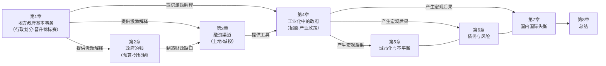
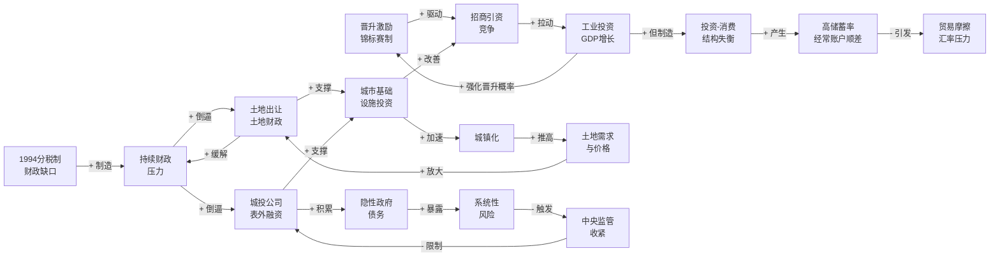
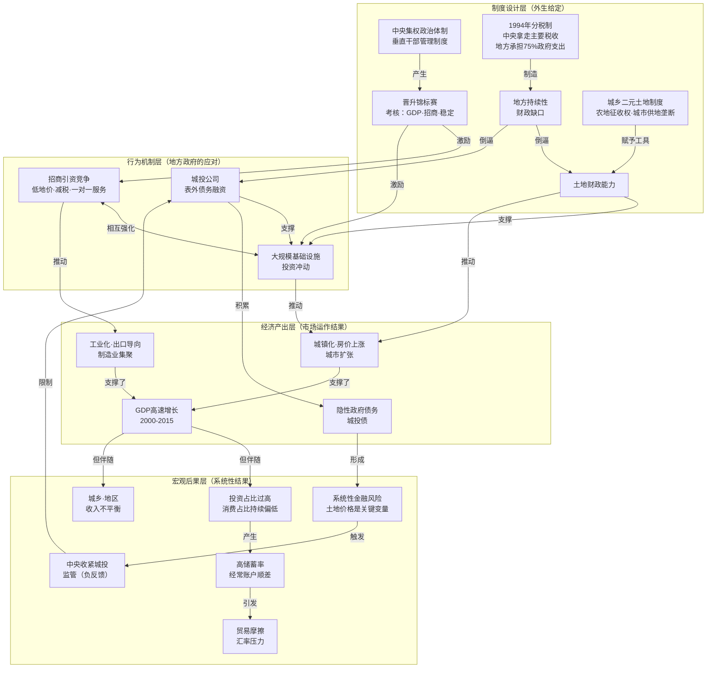
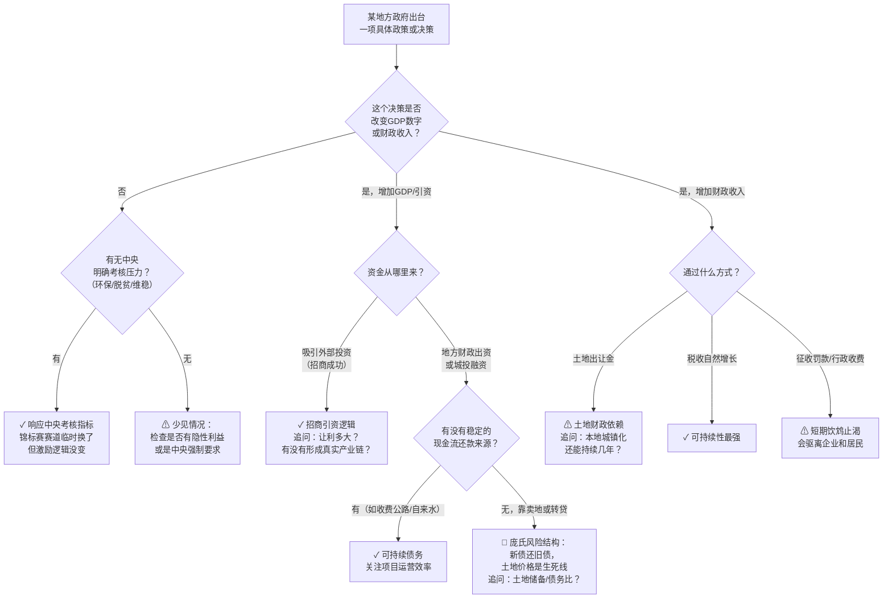
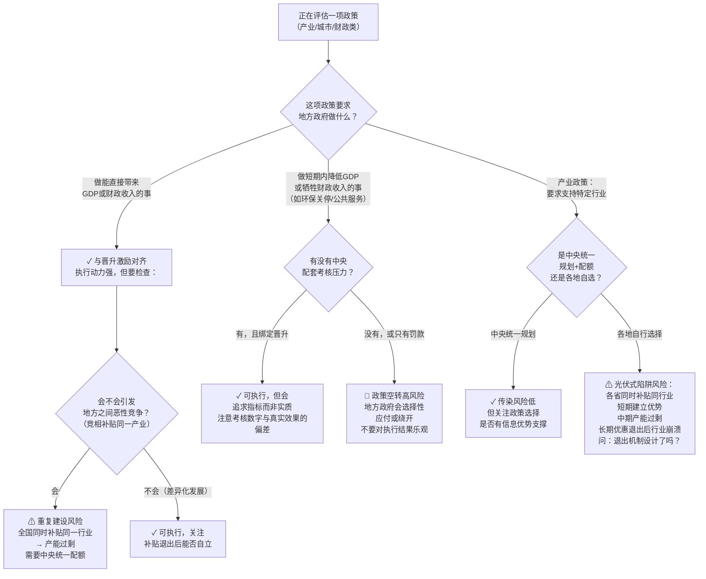

# 《置身事内：中国政府与经济发展》· 沈老师视角分析
> 兰小欢 著 · 使用 shen_reading_v3.3 · 模式A（全量生成）

---

## Pre-Step：章节分组扫描

```
章节依赖图：
```



```
推荐分组：

- 第一批：第1-4章（合并建模）
  合并原因：第1章建立的"晋升锦标赛+分税制财政压力"是整个机制包的底层激励，
  没有这个激励结构，第2-4章的所有行为（土地财政、城投融资、招商竞争）
  都只是现象描述而没有"为什么这样做"的解释——模型无法独立使用。

- 第二批：第5-7章（合并建模）
  合并原因：三章的宏观现象（城镇化不平衡、债务风险、国内外失衡）共享同一个
  根源——上篇的地方政府行为。分开看任何一章，都会缺"根因在哪里"的结构定位，
  成为孤立的现象描述。三章合并后，才能看出它们是同一个系统的三个输出端口。

- 第三批：第8章（独立阅读，补充第一批+第二批的总结视角）

实际建模策略：
由于上篇（微观机制）和下篇（宏观现象）之间存在强依赖，
全书作为一个完整的因果系统建模——上篇是"驱动机制"，下篇是"输出后果"。

每批的核心问题：
- 第一批（Ch1-4）回答：中国地方政府为什么会形成这种特殊的行为模式？
- 第二批（Ch5-7）回答：这种行为模式在宏观层面制造了哪些结构性问题？
- 全书合并回答：中国经济高速增长的制度逻辑是什么，代价是什么？
```

---

## 读前诊断

**① 书籍类型：论证书**

特征：全书围绕一个核心论点展开：中国地方政府的激励结构（晋升竞争＋财政压力）
是过去三十年经济高速增长的核心驱动机制，同时也是债务积累、宏观失衡等结构性
风险的制度根源。每一章都在为这个论点提供机制说明或实证佐证。

**② 我想从这段内容里提取什么：**

- 一个因果解释：地方政府为什么做这些事（激励结构 → 行为 → 后果）
- 一套判断标准：遇到具体的政府政策/经济现象时，能判断其背后的激励逻辑
  以及可能走向哪里

→ 提取目标包含"因果解释"＋"判断标准"，Step 4 需要**两个方向**
（诊断方向：现象→定位根因；预防方向：分析政策时→判断激励是否对齐）

---

## Step 0：骨架提取

**核心问题：为什么地方政府形成这种行为模式，系统如何自我维持？**

→ 用因果回路图（CLD）：有反馈机制，系统存在自我强化和自我调节的闭合环路



**三个闭合反馈环：**
- **R1（晋升-增长正循环）**：A→B→C→A（自我强化，官员持续有动力拼经济）
- **R2（土地-城镇化正循环）**：F→H→I→J→F（自我强化，城镇化越快，土地收入越多，基建越多）
- **B1（债务-风险负循环）**：G→K→L→M→G（调节性，系统在不崩溃的前提下抑制债务无限膨胀）

**完成标志：**
看这张图，对全书有约60%的直觉——知道这不是一个"政策失误"的故事，
而是一个"激励结构完全合理地产生了这些行为"的故事，问题在制度设计，不在官员个人。

---

## Step 1：概念速览

```
- 晋升锦标赛：地方官员的职务晋升由上级考核决定，GDP增长和招商引资是主要指标，
  各省市县官员因此像锦标赛参赛者一样竞争经济增长名次。
  举例：两个邻省的省委书记，谁的省GDP增速更高、引进外资更多，谁晋升到中央的
  概率更大；导致两省都在争夺同一家工厂落地，互相压低土地价格和税收优惠。
  → 进Step 2（边界：所有竞争都是锦标赛吗？市场竞争vs行政晋升竞争，差异在哪里）

- 分税制（1994年）：税制改革，增值税中央拿75%，地方留25%；但基础教育、基本
  医疗、社会保障等民生支出留给地方负责，地方承担约75%的政府总支出。
  举例：一个县城拿到的税收总量不到全县产值的2%，但要养整个县的学校、医院和
  公务员。税收和支出职责的剪刀差直接催生了对土地财政的依赖。
  → 不进Step 2（机制本身清晰，边界不模糊）

- 土地财政：地方政府依靠垄断土地供给——低价从农民手中征用土地（按农业价值
  补偿），高价出让给开发商（按城市土地市场价格）——截留城镇化带来的土地增值，
  作为地方财政的主要资金来源。
  举例：某市郊农地每亩补偿3万，出让给开发商后每亩卖500万，差价全部进入市政府
  的土地出让金账户，用于还债、基建、补贴企业。
  → 进Step 2（边界：政府出售土地≠土地财政；土地财政的核心是制度性垄断和增值截留）

- 城投公司（地方政府融资平台，LGFV）：地方政府设立的国有公司，没有真实商业
  现金流，靠政府划拨的土地作为资产抵押向银行借款，资金用于基础设施建设；
  法律形式是企业，实际上是政府的表外融资工具。
  举例：某市设立"XX城市建设投资有限公司"，政府向它注入100亿土地资产，
  公司用这些土地抵押贷款200亿，修建地铁和高架桥——市政府的资产负债表上
  看不到这笔债，但市场都知道政府会兜底。
  → 进Step 2（边界：城投债算不算政府债？法律形式和实质责任的矛盾）

- 招商引资：地方政府主动吸引企业落地的竞争行为，手段包括：减免税收、低价
  供地、补贴水电费、一对一政务服务。本质是地方政府用财政资源换取GDP和就业。
  举例：某省招商局以工业用地0.5折出让、三年免所有地方税吸引某外资工厂，
  换来5000个就业岗位和每年20亿产值（计入省GDP）。
  → 不进Step 2（概念清晰，边界不模糊）

- 产业政策：政府选定特定产业，通过补贴、保护、行政资源倾斜，扭曲市场竞争
  格局，扶持该产业发展。核心特征是"选择性干预"——不是补贴所有人，是选择
  某些行业/企业给政策优惠。
  举例：中国光伏产业政策：政府认定"光伏是未来战略产业"，多省大量补贴，
  结果培育了全球最大的光伏产业集群，但也产生了严重产能过剩，许多获补贴
  企业在补贴退出后破产。
  → 进Step 2（边界：产业政策vs一般政府补贴vs普惠性减税，选择性在哪里）

- 软预算约束：某主体相信自己亏损/负债后会被外部（政府）救助，因此不严格
  控制成本和债务规模，预算约束变"软"。
  举例：城投公司知道政府最终会兜底，所以以很高成本借钱、做低回报项目，
  换成真正会破产的私营企业则不会这样做。
  → 不进Step 2（经济学概念，边界在Step 2城投债概念里已覆盖）

- 户籍制度（与城镇化的关系）：户籍决定了享受公共服务（教育、医疗、社保）的
  资格，农村户籍持有者进城打工但无法获得城市公共服务，形成"半城镇化"——
  人在城市，根在农村。
  举例：某工厂工人在深圳打工20年，子女没有深圳户籍，无法在深圳读公立高中，
  中考前必须把孩子送回老家。这限制了消费倾向（需要给老家留钱）并制造了
  地区间人口流动的结构性障碍。
  → 不进Step 2（在城镇化不平衡分析中清楚，不需要单独裁判循环）

- 影子银行：游离于正规银行监管体系之外的金融中介活动，包括银行发行的
  理财产品（资金池化、期限错配）、信托产品、同业拆借等。本质是让资金
  绕开存贷款利率管制，流向更高收益（也更高风险）的资产。
  举例：某银行发售年化6%的"理财产品"，底层资产是某城投的贷款
  （正常银行贷款只给4.5%）；风险在于期限错配（理财6个月，城投贷款3年），
  一旦理财到期城投还不了钱，银行面临流动性危机。
  → 不进Step 2（在系统性风险框架内理解，概念本身边界清晰）

- 系统性风险：风险不停留在单个主体，而是通过信用链、流动性链、信心链传染
  到整个系统，造成大规模主体同时受损、市场功能瘫痪。
  举例：一个城投违约→投资者担心所有城投→抛售城投债→城投融资成本暴涨→
  城投无法滚动债务→更多城投违约→银行理财产品出现亏损→居民挤兑理财→
  银行流动性危机。这种传染链就是系统性风险。
  → 进Step 2（边界：单体大规模风险 vs 有传染性的系统性风险，容易混淆）

- 国内失衡（投资-消费失衡）：中国GDP中投资占比长期高达40-50%，消费占比
  低于发达国家正常水平（约35-40% vs 发达国家60-70%）。这不是偶然的，
  是地方政府激励结构（GDP=投资驱动）+企业低工资+居民高储蓄（缺乏社会
  保障所以自己存钱）共同产生的结构性后果。
  → 不进Step 2（因果机制清晰，不是概念边界问题）

- 国际失衡（经常账户顺差/贸易顺差）：中国储蓄率远高于国内投资需求，
  多余的储蓄以贸易顺差形式输出到国外，形成持续的经常账户顺差，导致
  外汇储备积累和人民币升值压力，并引发贸易摩擦。
  根源：高储蓄（居民保障不足、预防性储蓄）+ 政府投资主导（而非消费）
  → 不进Step 2（宏观结果，不是边界模糊的概念）
```

---

## Step 2：实例裁判循环

```
Step 2 待执行清单（开始时全部未勾）：
☐ 晋升锦标赛
☐ 土地财政
☐ 城投债务是否属于政府债务
☐ 产业政策
☐ 系统性风险
```

---

### 【晋升锦标赛】

**正例：**
> 2010年代某中部省份，省委书记在任五年，省GDP年均增速11%，显著高于全国均值，
> 大量外资制造业工厂落地，税收大幅增长；任期结束后，该书记调任国务院相关部委
> 担任部长级职务。

判断：属于晋升锦标赛 ✓
理由：上级用可量化的经济增长指标评估地方官员，增速排名靠前者获得晋升机会，
官员行为被这个激励机制塑造。这是教科书级正例。

---

**边界例：**
> 某县环保局局长，在辖区内严格执行污染排放标准，关停了三家高污染工厂，
> GDP当年下降了0.5个百分点。县委书记因环保问题被中央约谈，给了环保局长
> 特别嘉奖；但同期，邻县因为不关停工厂，GDP增速高出本县3个点，邻县书记
> 年底被评为"优秀县委书记"。问：这件事里，环保局长的行为受晋升锦标赛驱动吗？

判断：边界情况，具体判断取决于激励来源。
理由：环保局长的行为受到了"上级环保约谈"这个单独激励驱动，这是中央对地方
的环保问责压力，确实属于行政晋升激励的范畴（只是指标从GDP换成了环保合规）。
但如果县委书记自己的晋升概率依然主要由GDP决定（邻县书记的例子说明确实如此），
则整体系统仍然在晋升锦标赛框架内——只是锦标赛偶尔加入了环保子指标，没有改变
主要激励结构。
**边界精确位置**：晋升锦标赛不是"只有GDP"，而是"以可量化的上级指定指标
作为晋升依据的竞争"；当指标从GDP切换到环保/脱贫时，锦标赛依然成立，
只是赛道变了。

---

**反例伪装：**
> 华为和中兴在5G设备市场上激烈竞争，互相压低价格、加快研发节奏，
> 争夺全球运营商客户，谁先获得更多合同谁就在市场上占据领先位置。

判断：不是晋升锦标赛 ✗
理由：激励机制是利润和市场份额（市场性），竞争对象是客户（非上级），
评判主体是市场（非行政上级），胜负结果是商业收益（非行政晋升）。
虽然都是竞争，结构完全不同。

**陷阱说明：**
> 很多人把"竞争"直接等同于"晋升锦标赛"，因为两者都有"谁做得好谁赢"的表面结构。
> 但晋升锦标赛的四个关键特征缺一不可：
> ①**主评方是单一的行政上级**（不是分散的市场）；
> ②**考核指标由上级设定**（可以根据政治需要调整，不是市场自然产生的）；
> ③**奖励是行政晋升**（而非市场性收益）；
> ④**参与者是官员**（有服从义务的代理人，而非自愿参与市场竞争的主体）。
> 市场竞争缺少①②③，工厂内部的绩效考核缺少③④（没有行政晋升作为奖励）。

边界定义（一句话）：
**晋升锦标赛 = 上级用可量化的行政绩效指标排名、以行政晋升为奖励的代理人激励机制，
与市场竞争的本质区别在于：评判权在唯一的行政上级而非分散的市场。**

☑ 晋升锦标赛 完成

---

### 【土地财政】

**正例：**
> 某市政府依法征收城郊村庄土地，按"农业用途"标准补偿农民每亩4万元；
> 将同一块土地以"城市建设用地出让"方式卖给房地产开发商，成交价每亩
> 600万元。596万/亩的差价进入市土地出让收入账户，当年土地出让收入
> 占该市财政总收入的62%。

判断：典型土地财政 ✓
理由：核心机制齐备：政府垄断土地供给→城乡二元价格剪刀差→截留土地增值→
成为主要财政来源。

---

**边界例：**
> 某市城投公司持有政府划拨的500亩土地，向银行申请抵押贷款，以这批土地
> 评估价值10亿作为抵押物，贷款8亿用于修建污水处理厂。贷款由城投公司负责
> 偿还，政府账面上没有这笔债，也没有直接出售土地。
> 这是土地财政吗？

判断：属于广义土地财政 ✓
理由：土地财政不局限于"卖地收入"。只要是：**以政府对土地的垄断控制权为基础，
通过土地（直接出售或抵押融资）来弥补财政缺口**，都属于土地财政体系。
这里政府用土地"以地融资"而非"以地生财"，属于土地财政的间接形态——土地不
作为商品出售，而是作为信用基础撬动银行融资，最终服务于财政目的。
**边界精确位置**：核心是"是否利用土地垄断权来解决财政问题"，而不是"是否直接
出售土地"。

---

**反例伪装：**
> 德国柏林市政府将一块闲置的工业遗址出售给开发商，所得收入用于补贴低收入
> 住房项目。政府出售了土地，用土地收入解决了财政需求。

判断：不是土地财政 ✗
理由：土地财政的核心不是"政府出售土地"，而是"通过制度性垄断（城乡二元
土地制度）低价征收、高价出让，系统性截留城镇化带来的地租"。德国政府没有
对土地市场的征收垄断权，没有城乡二元价格机制，这次出售是市场行为中的正常
资产处置，不构成以土地垄断为基础的系统性财政依赖。

**陷阱说明：**
> 容易误判的原因是"政府出售土地→收入用于财政"这个表面相似性。
> 但土地财政的核心机制是"制度性剪刀差"：必须同时具备：
> ①政府对农村土地的强制征收权（无需市场价补偿）；
> ②政府对城市建设用地的供应垄断（私人不能绕开政府直接出售土地）；
> ③城乡土地价格的巨大落差（制度性地租）。
> 这三条缺任何一条，都不构成中国式土地财政。很多国家政府出售国有土地，
> 但没有这三条，不产生同样的政治经济效应。

边界定义（一句话）：
**土地财政 = 政府利用城乡二元土地制度下的强制征收权和供地垄断权，
系统性截留城镇化地租，使土地收入成为地方财政运转的结构性支柱。**

☑ 土地财政 完成

---

### 【城投债务是否属于政府债务】

**正例：**
> 某省城投公司发行10亿元债券，债券募集说明书中明确写明：
> "本次债券由[XX省]人民政府出具担保函，承诺在发行人无法足额偿付时，
> 由省财政优先安排资金偿付"。市场以接近国债的利率购买了这批债券。

判断：属于政府债务 ✓
理由：明确的书面政府担保承诺，市场定价也反映了政府信用，实质是以城投
为载体的政府债务，无论法律形式如何。

---

**边界例：**
> 某市城投公司发行债券，募集说明书中**没有任何政府担保条款**，但该城投
> 所有资产都是市政府划拨的（土地、道路、公园），过去10年没有发生过
> 任何真实违约，投资机构普遍认为政府会兜底，给予的利率只比同期国债
> 高出0.8个百分点。该城投债务是政府债务吗？

判断：实质上是政府债务 ✓（尽管法律形式上不是）
理由：判断标准不是法律文本，而是"市场是否相信政府会兜底"和"政府历史
行为是否验证了这个信念"。此例中：
- 资产全部来自政府划拨，城投本身没有独立商业价值
- 历史上从未真实违约（隐含政府兜底行为）
- 市场定价已将政府信用计入（利差极小）

若政府任由其违约，会触发：投资者重新定价所有同类城投债→全市融资成本暴涨→
多个城投无法滚动债务→系统性风险。政府面临"要么兜底要么引爆危机"的二元
选择，实质上只能兜底。
**边界精确位置**：区分"法律上的政府债务"（需要明确担保）和
"实质上的政府债务"（政府事实上无法不救援）。在中国城投体系里，
绝大多数城投债属于后者。

---

**反例伪装：**
> 工商银行（国有商业银行，政府持股60%）向某民营房地产企业发放了50亿
> 贷款，该企业后来资金链断裂，贷款变成不良。问：这50亿是政府债务吗？

判断：不是政府债务 ✗
理由：工行虽是国有银行，但它是按商业逻辑运作的独立主体，自负盈亏；
贷款决策基于风险收益判断，不是代政府执行政策性任务；不良贷款由银行
自身损失吸收（核销、计提拨备），不自动转变为财政支出。
政府股东地位不等于贷款是政府债务，否则整个国有银行体系的全部贷款
都要变成政府债——这显然错误。

**陷阱说明：**
> 常见误判：用"法律形式"判断——城投是独立法人，所以它的债务不是政府债务。
> 这个判断在中国城投实践中是错误的。
>
> 正确逻辑：**在软预算约束环境下，"名义上独立 + 实质上有担保预期"
> = 事实政府债务**。判断标准是：
> 1. 政府是否能在不触发系统性后果的情况下任由其违约？（通常不能）
> 2. 历史上政府是否展现出兜底行为？（通常是）
> 3. 市场定价是否已将政府信用计入？（通常是）
> 三条满足，就是实质政府债务。
>
> 国有银行贷款之所以不是政府债务，是因为银行有真实的商业约束（资本充足率、
> 拨备率、监管要求），政府并非自动兜底，银行可以自主消化损失。

边界定义（一句话）：
**城投债是否属于政府债务，取决于"政府是否存在无法拒绝的隐性担保义务"，
即：任由城投违约是否会触发比救援成本更高的系统性后果——能就是，不能就不是。**

☑ 城投债务是否属于政府债务 完成

---

### 【产业政策】

**正例：**
> 国家发改委发布文件，将"新能源汽车"列为战略性新兴产业，提供：
> 购车补贴（消费端）、生产补贴（供给端）、免费建设充电桩、优先路权（不限号）、
> 对外资品牌设置准入门槛、向地方政府分配新能源汽车产业发展目标。

判断：典型产业政策 ✓
理由：完整的四要素：①行业选择（选定"新能源汽车"）；②资源倾斜（补贴、
优先权）；③改变竞争格局（限制外资、扶持国内品牌）；④行政执行压力（地方目标）。

---

**边界例：**
> 某省财政厅出台规定：对辖区内**所有制造业企业**，2024年起三年内
> 增值税地方留成部分全额退还。不区分行业，私营、国有、外资一律享有。

判断：边界情况，广义算产业政策，狭义不算 ✓/✗
理由：
- **广义**：政府用财政工具干预企业经营，改变了市场中性（制造业得益，
  服务业不得益），属于产业政策范畴中的"结构性政策"。
- **狭义**：产业政策的核心特征是"选择性"——从众多行业中挑出特定行业给予
  优惠，主动改变产业结构。此例对所有制造业普惠退税，没有在制造业内部
  做出行业选择，更接近"提升制造业整体竞争力的中性政策"，而非扶持某
  具体产业的"产业政策"。
**边界精确位置**：产业政策的"选择性"必须细化到行业或技术方向，对整个制造业
的普惠政策属于"结构性产业政策"，边界模糊；但对光伏/新能源车/集成电路的
定向补贴，无疑是产业政策。

---

**反例伪装：**
> 中央政府提高全国最低工资标准，向所有员工超过100人的企业征收社会保险费，
> 为所有农村居民提供基本医疗保险补贴。

判断：不是产业政策 ✗
理由：这是社会政策/再分配政策，目的是改善居民福利和收入分配，不是
改变产业结构或竞争格局。政策对所有行业一视同仁（甚至是对企业的成本约束
而非补贴），没有"选择特定产业"的意图。

**陷阱说明：**
> 容易误判为产业政策的原因："政府用政策工具干预经济"这个表面特征太宽泛。
> 区分关键在于**目的和机制**：
> - 产业政策：目的是改变产业结构，手段是**选择性**资源倾斜，结果是
>   被选行业获得相对其他行业的竞争优势（不中性）
> - 社会政策：目的是改善分配和福利，手段通常是**普惠性**转移支付或
>   规制，不改变产业间竞争格局
>
> 第二个常见误判：把"政府提供的所有优惠/补贴"都叫产业政策。
> 给所有企业退税是税制政策，给所有农村医疗补贴是社会政策，只有
> "选定特定行业→给它相对优势"才是产业政策。

边界定义（一句话）：
**产业政策 = 政府有意选定特定行业，用不中性的资源倾斜（补贴/保护/
行政优先）改变该行业相对其他行业的竞争位置，以实现结构转型目标。**

☑ 产业政策 完成

---

### 【系统性风险】

**正例：**
> 2008年雷曼兄弟破产：雷曼持有大量抵押贷款证券（MBS），资产价格暴跌→
> 雷曼资不抵债→对手方（银行、基金）持有大量雷曼信用衍生品→对手方同时
> 遭受损失→市场流动性冻结（无人愿意拆借隔夜资金，因为不知道对手方是否
> 还活着）→即便健康的银行也无法获得短期融资→整个金融系统功能接近瘫痪。

判断：系统性风险 ✓
理由：一个主体的倒闭，通过信用链和流动性链引发整个系统的功能崩溃，
这是系统性风险的完整案例。

---

**边界例：**
> 某省A市的城投公司出现债务违约，无法按期支付债券利息；该城投的主要
> 债权人包括：同省B市的一家农村商业银行（持有20亿债券）和同省C市的
> 一家城市商业银行（持有15亿债券），两家银行因此出现坏账，但均未出现
> 存款挤兑或流动性危机，最终通过国有银行注资稳定了局面。这是系统性风险吗？

判断：没有演变成系统性风险（停留在信用风险层面）✗（此案例未达到系统性）
理由：
- 有传染性：从城投→地方小银行，有跨主体扩散；
- 但传染链被中断：国有银行注资之后，流动性传染停止了，没有进一步蔓延
  到居民存款、理财产品、全国货币市场；
- 系统整体功能保持正常。

**系统性风险的门槛：** 传染必须足够广泛，导致市场整体功能受损（比如
银行间市场利率异常飙升、全国性信用收缩、金融中介功能大规模停摆）。
局部机构受损≠系统性风险。
**边界精确位置**：看传染是否超越了单个或少量主体，是否导致整个金融体系
功能层面（而非个别机构层面）的障碍。

---

**反例伪装：**
> 某大型房地产开发商资金链断裂，旗下300个项目停工烂尾，涉及购房者
> 50万人，开发商总负债达3000亿，是历史上最大规模的房企违约之一。
> 这是系统性风险吗？

判断：不必然是系统性风险（规模大≠系统性）✗/需具体分析
理由：
- 房企违约本身是信用风险事件，规模大不代表系统性；
- 关键判断点：银行体系对该开发商的敞口是否集中到触发系统性传染的程度？
  是否引发了大量理财产品违约→居民挤兑→银行流动性危机？
- 如果银行体系通过计提拨备充分消化了损失，购房者损失虽然惨重，但
  金融系统整体功能不受影响，就不是系统性风险，只是大规模信用违约。

**陷阱说明：**
> 最常见的误判：把"规模大"等同于"系统性"。3000亿违约听起来极大，
> 但如果敞口分散在无数投资者手中（每人损失几万块），或银行拨备足够，
> 不会触发传染链，就不是系统性风险。
>
> 系统性风险的核心是**传染机制**，不是**损失规模**：
> - 信用传染：A违约→B（A的对手方）资产价值下跌→B违约→C…
> - 流动性传染：A无法还钱→B急需资金但无法卖出持有的A资产→B借不到钱→B违约
> - 信心传染（最危险）：市场不确定谁还活着→所有人同时撤资→健康机构也
>   遭挤兑→自我实现的系统崩溃
>
> 一个简单测试：如果让违约主体直接破产清算，金融市场功能还能正常运转吗？
> 能→个体风险；不能→系统性风险。

边界定义（一句话）：
**系统性风险 = 单一主体的损失通过传染机制（信用链/流动性链/信心链）
扩散到整个金融体系，导致市场整体功能受损——与损失规模无关，与传染能力有关。**

☑ 系统性风险 完成

---

```
Step 2 完成确认：
☑ 晋升锦标赛  ☑ 土地财政  ☑ 城投债务是否属于政府债务  ☑ 产业政策  ☑ 系统性风险
全部打勾，Step 2 结束。
```

---

## Step 3：结构可视化



```
差异列表：

【原文有、图里没有体现的内容】
- 国有企业与私营企业的不同政治地位：国企承担更多政策性任务，
  私企承担更多市场风险；两者的融资成本差异（国企享有隐性政府信用背书）
  没有在图中体现为独立节点
- 户籍制度对城镇化质量的限制：农民工"半城镇化"状态（身在城市、
  没有城市公共服务权利）制约了消费能力，图中城镇化节点没有表达这个质量维度
- 地方政府之间招商引资的"逐底竞争"（race to the bottom）：
  各地互相压低土地价格和税收，导致企业获取的让利超出必要，
  地方财政反而受损——这个博弈结构没有在图中体现
- 中央转移支付对地区不平衡的部分弥补：欠发达地区通过转移支付
  获得资金，这个再平衡机制图中未体现
- 影子银行作为土地财政和城投融资的放大器：理财产品将居民储蓄
  导入城投融资体系，扩大了债务规模，这条链路图中只是隐含而未画出

【图里有、原文没有明说的推论】
- "招商引资和基础设施投资相互强化"（G↔H）：书中分别描述两者，
  但"相互强化"这个箭头是我补出来的——招商成功后需要配套基建，
  基建改善后反过来吸引更多招商，形成正循环
- "中央监管收紧是负反馈"（S→I是负反馈而非单向因果）：书中描述
  了中央收紧监管这件事，但作为B1负反馈环的结构性角色是我提炼出来的
- "土地价格是系统性风险的关键变量"：原文描述了土地价格下跌对城投
  融资的影响，但"关键变量"这个判断是从分析中提炼出来的，原文没有
  用这个表述
```

**完成标志：** 不看原文，只看图，能复原核心逻辑：
制度设计（晋升+分税制+土地制度）→ 地方政府行为（招商+土地财政+城投）→
经济产出（工业化+城镇化+高增长）→ 宏观问题（失衡+债务+风险）。

---

## Step 4：可执行模型

**核心机制（一句话）：**
地方官员的政治激励（晋升竞争）和财政激励（分税制缺口）的叠加，
使得地方政府系统性地偏向"有助于GDP和财政收入的投资行为"，
而不是"有助于居民福利的公共服务"——高增长和结构性问题是同一个机制的两个输出。

**触发条件 → 结果：**
- 当晋升激励强于监管约束时 → 招商引资竞争激烈，企业获得超额优惠，财政被侵蚀
- 当土地价格上涨时 → 土地财政收入增加，城投融资能力扩张，基础设施投资加速
- 当土地价格下跌时 → 土地财政收入下降，城投抵押价值缩水，债务风险暴露
- 当中央加强考核时 → 地方政府调整行为指向新的考核指标（脱贫/环保/民生），
  但激励结构未变，指标替代行为仍会出现
- 当城镇化速度放缓时 → 土地需求减少，整个土地财政-城投-基建的正循环失去动力

---

**① 诊断方向：遇到某个地方政府的具体决策，理解其背后激励逻辑**



---

**② 预防方向：正在评估/分析一项政策，判断它是否会被真正执行**



```
失效边界（这个模型在什么情况下不适用）：

1. 中央直辖机构执行的政策（没有地方晋升锦标赛激励）：
   如中央银行货币政策、国家发改委直接审批的项目，激励结构不同，
   不能用地方政府行为框架分析。

2. 政治优先级极高、经济逻辑暂时失效的场景：
   如重大政治事件前的稳定优先、战略性基础设施（不追求回报率）、
   全国性公共卫生危机的行政动员——这些场景下锦标赛激励被压制，
   行为逻辑切换为政治服从。

3. 城镇化率超过70%后的新阶段：
   土地需求趋于饱和，土地财政正循环失去驱动力，地方政府不得不
   转向服务业和消费驱动，原有框架预测能力下降。

4. 民营经济主导的市场化程度很高的地区：
   如深圳，政府行为被更多市场约束，土地财政依赖度低，土地以外
   的市场性税收更重要，晋升激励仍然存在但作用方式更加市场化。
```

---

## Step 5：接入已有体系

```
【同构】与委托代理理论（Principal-Agent Theory）同构，结构是：

  委托方（中央政府） → 设计激励契约（晋升锦标赛）→ 代理方（地方官员）
  代理方拥有私有信息（地方实情） + 私有行动空间（如何完成指标）
  代理方会选择"最大化自己可见指标"而非"最大化委托方真正目标"

  正向迁移：委托代理理论的标准预测"可量化指标替代真实目标"
  （agent substitutes measurable proxy for principal's actual goal）
  在这里完全应验：GDP增长替代了居民福利，招商引资指标替代了产业
  可持续发展——任何时候一个激励系统把"可测量的代理指标"奖励得
  比"真实目标"更多，都会产生同样的扭曲。

  反向迁移（用这本书的逻辑反推企业管理）：
  这本书揭示了一个比委托代理理论更深的洞察——当代理方能控制自己
  的考核资源（地方政府控制土地和统计数据），委托方的激励设计会
  被代理方从内部瓦解。
  在企业管理中：如果一个部门主管能影响对自己部门绩效考核的指标
  定义（如自己设计KPI、自己报告关键数字），绩效考核就会失效，
  产生和土地财政类似的"形式合规、实质扭曲"现象。
  → 管理含义：绩效考核的数据来源必须与被考核方分离。

【同构】与Kornai的软预算约束理论同构，结构是：

  主体预期外部会兜底 → 不硬化预算约束 → 过度举债/投资 → 系统累积风险

  正向迁移：软预算约束理论预测，任何相信自己"大到不能倒"或有
  外部救援预期的主体，都会系统性地低估风险、高估承债能力。
  城投公司是教科书级案例，但这个逻辑同样适用于：政策性银行、
  被政府隐性背书的国有企业、乃至大型系统重要性银行。

  反向迁移（用城投逻辑反推哪些主体会成为下一个城投）：
  任何满足以下三条的主体，都在演化出城投式债务结构：
  ①资产主要来自政府拨给或政策性授权（无真实市场定价）；
  ②历史上从未经历真实破产清算（软预算约束预期已建立）；
  ③承担了超出自身偿债能力的政策性任务（超额负债有政治正当性）。
  当前检视：哪些政策性机构同时满足这三条？——这就是潜在的风险积累点。

【同构】与信息经济学中"逆向选择 + 道德风险"同构（局部）：

  城镇化过程中，流入城市的农村劳动力没有户籍，无法获得城市公共服务，
  实际上是城市的"二等居民"；这个制度制造了人力资本的逆向选择——
  最有能力留下来的人最终还是会离开，因为子女教育问题无解。
  反向迁移：任何分层的"成员资格"制度（分级员工待遇、临时工vs
  正式工、外包vs全职），只要持续时间足够长，都会产生类似户籍制度的
  逆向选择——真正有流动选择权的人会离开，留下来的是没有选择的人。

【互补】填补了"为什么中国式增长的很多宏观异象无法用标准经济学解释"的空缺：

  现有框架（西方主流经济学）：市场出清 + 效率优先 + 去政府干预
  → 无法解释中国的：高投资率不下降、高增长与高负债并存、
    地方政府主动做亏本的基础设施等

  这本书填补的空缺：把"地方政府是有激励结构的主动行为者"
  而非"被动执行政策的工具"这个角度接入分析框架。
  一旦把地方政府视为在政治激励约束下最大化自身利益的代理人，
  所有"异象"都变得可以预测。

【矛盾】与新古典经济学"政府干预降低效率、市场竞争最优"存在张力：

  标准结论：政府选择产业方向 < 市场竞争筛选 → 政府干预损害效率

  这本书的结论：在发展初期，政府干预（招商引资、产业政策）比放任
  市场更有效率，帮助中国建立了制造业集群和出口能力。

  条件差异：
  - 新古典结论成立的条件：完善的市场制度、产权保护、信息透明、
    资本充分流动——这些在中国1990-2010年代均不完善
  - 这本书结论成立的条件：市场制度不健全的发展初期，政府有
    信息优势（知道哪个地方能做什么）和执行优势（能协调要素集中）

  解决（各自适用条件）：
  政府干预的比较优势在"市场失灵 + 政府有相对信息优势"阶段
  随着市场成熟、产权法制健全、政府信息优势消失，政府干预成本上升
  → 这本书本身也暗示：中国当前（城镇化放缓、制度趋完善）的政策
    重心应该转向市场竞争和服务业，继续用投资-土地-城投模式
    已经得不偿失。

【更新图】
Step 0 的图不需要更新（Step 3 的完整图已经覆盖了Step 0的骨架图内容）。
```

---

## 建模完成自检

- ☑ 不看原文，只看图，能复原核心逻辑
  （Step 3 图：制度设计→行为机制→经济产出→宏观后果，链路完整）
- ☑ 给一个新情境，能用 flowchart 得出结论
  （Step 4：新情境入口是"某地方政府的具体决策"或"正在评估某政策"）
- ☑ Step 2 执行清单已全部打勾，无跳过
  （晋升锦标赛✓ 土地财政✓ 城投债✓ 产业政策✓ 系统性风险✓）
- ☑ Step 3 的差异列表已输出
  （原文有图里没有5条，图里有原文未说3条）
- ☑ Step 4 的 flowchart 入口是具体工作场景，不是抽象现象
  （"某地方政府出台一项具体政策" / "正在评估一项产业/财政类政策"）
- ☑ Step 5 的同构分析包含了反向迁移
  （委托代理→管理KPI含义；软预算约束→识别潜在风险积累主体）
- ☑ 输出章节结构符合固定列表，没有自行添加章节
- ☑ 一句话总结能作为触发信号：3个月后遇到这个情境，能想起"去翻这个模型"

---

## 一句话总结

> 当你在分析一个地方政府的"奇怪决策"（砸钱修没人用的高铁、拼命招商给超大
> 优惠、背一堆债建广场）却找不到逻辑时——不是官员脑子有问题，是晋升靠GDP
> 而钱又不够花的人，必然做出这些决策；理解了这个激励结构，中国宏观经济的
> 债务、失衡、不平衡都变得可以预测，而不是"奇迹"或"谜题"。
