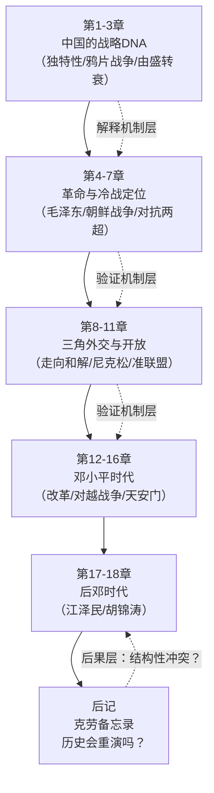
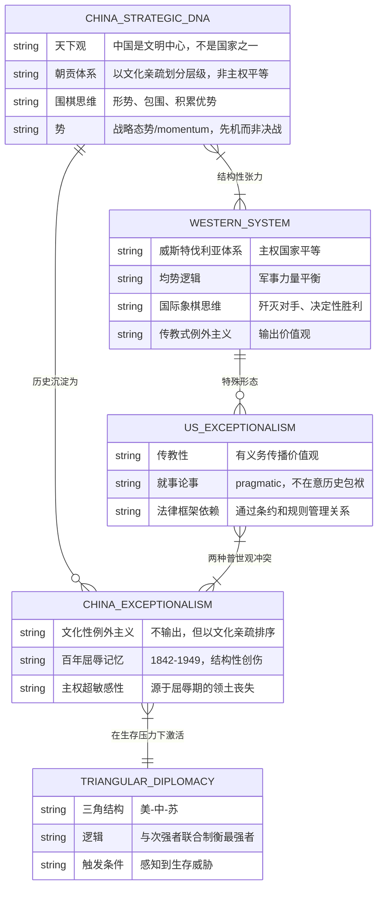
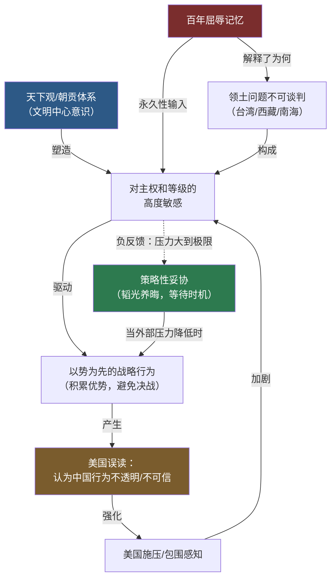

# 《论中国》建模分析 · 沈老师引擎 v3.4
## 文件一：Pre-Step + 读前诊断 + Step 0 + Step 1

> 书是原料，你是工厂。这本书是基辛格的，底层结构是你的。

---

## Pre-Step：章节分组扫描

**目录扫描结果（18章 + 后记）：**



**分组判断：**

> 这本书各章共同构成同一个因果系统的不同层级：
> - **机制层**（第1-3章）：中国战略文化的底层逻辑是什么？
> - **行为层**（第4-18章）：这个逻辑在不同外部压力下如何表现？
> - **后果层**（后记）：这套逻辑与美国体系是否结构性冲突？

→ **适用"因果系统层级"关系，全书统一建模，不分批。**

拆开任何一层，模型就失去预测力：读第8章（走向和解）而不理解第1章（天下观），你会以为那只是一次务实的外交决策，而不是战略逻辑的必然产物。

---

## 读前诊断（Pre-read）

**① 书的类型：**

这是一本**叙事书 + 论证书的混合体**。
- 叙事骨架：1793年马戛尔尼使团 → 2011年中美关系
- 论证内核：中国有一套不同于西方国际关系体系的战略逻辑，这套逻辑是可理解的、有结构的

**② 我想提取什么：**

→ **一套判断标准 + 一个结构模式**

具体说：
- **结构模式**：中国外交行为背后的决策逻辑是什么结构？（不是"中国说了什么"，是"中国为什么这么做"）
- **判断标准**：给一个中美关系场景，我能判断中国会采取什么姿态、美国会犯什么判断错误

→ 读前诊断②混合类型，Step 4需输出两个方向（诊断 + 预防）

---

## Step 0：骨架提取

### 问题定位

这本书要回答的核心问题是：

> **中国的战略逻辑是什么？它与西方国际关系逻辑哪里不同？差异从哪来？会导致什么后果？**

这是一个**因果系统问题**，涉及反馈环（文化 → 行为 → 国际反应 → 强化文化），选**因果回路图（CLD）**为主，辅以**ER图**建立实体关系。

---

### 骨架图一：核心实体关系（ER图）



---

### 骨架图二：因果回路图（CLD）——中国战略行为的自强化系统



**反馈环标注：**
- **正反馈环（+ 越来越强）**：天下观 → 敏感性 → 以势为先 → 美国误读 → 施压感知 → 敏感性（强化）
- **负反馈环（- 趋向平衡）**：施压感知 → 策略性妥协 → 外部压力降低 → 恢复以势为先

**完成标志：** ✓ 看着图，对这本书有60%的直觉——中国的行为不是随机的，是一套受天下观驱动、以"势"为核心工具、对外部压力有规律性响应的系统。

---

## Step 1：概念速览

以下是《论中国》的核心概念清单，含通俗解释和边界标注。

---

**1. 天下（Tianxia）**
中国的传统世界观：中国不是"国家中的一个国家"，而是"文明的中心"，其他国家按与中国文化的亲疏程度被分级排列。具体例子：马戛尔尼使团来华，英王乔治三世的信件以平等君主身份写就，但乾隆视之为"进贡"——这不是傲慢，是制度框架不同。
→ **进Step 2**（边界：天下观 vs 主权平等观，什么时候中国"切换"了框架？切换是真实的还是表演性的？）

---

**2. 势（Shi）**
围棋术语，指战略态势/形势/momentum。重点不是"打赢某一局"，而是"把全局形势向有利于我的方向积累"。例子：1969年珍宝岛事件后，毛泽东不继续军事对抗，而是立刻开始向美国发信号——他判断"势"已到了可以转化的时刻。
→ **进Step 2**（边界："以势为先"与机会主义行为如何区分？"势"的判断是主观的还是可观察的？）

---

**3. 朝贡体系（Tributary System）**
不是简单的"纳贡换保护"，而是一套以中华文明为中心的外交秩序：周边国家通过仪式性臣服（行礼、上表）获得贸易权和正当性，中国通过这套体系维持"天下秩序"而非领土扩张。例子：越南、朝鲜、琉球历史上都是朝贡国，但有高度内政自治权。
→ **进Step 2**（边界：朝贡体系的"控制"程度如何判断？它和现代意义的宗主-藩属关系什么时候是同一件事，什么时候不是？）

---

**4. 两种例外主义**
美国式：传教型——认为美国价值观普世有效，有义务向外传播，以人权/民主为外交工具。
中国式：文化型——不输出价值观，但以文化亲疏对他国排序，认为中华文明天然居于中心。
例子：1989年天安门后，美国立刻把人权议题推向外交前台（传教型）；中国的反应不是"我们不在意人权"，而是"这不是你该管的"（文化型例外主义的主权界限）。
→ **进Step 2**（边界：两种例外主义都声称"普世"，但方向相反——冲突是结构性的还是可协调的？）

---

**5. 三角外交逻辑**
当存在三个大国，实力最弱的可以通过联合次弱者制衡最强者获得战略空间。触发条件：感知到来自最强者的生存威胁，且次弱者也有类似威胁感知。1969年毛泽东向美国开放的逻辑：苏联是直接军事威胁（百万大军压境），美国虽是意识形态敌人，但在苏联问题上有共同利益。
→ **进Step 2**（边界：三角逻辑在什么条件下失效？当三者实力接近时？当意识形态冲突盖过战略利益时？）

---

**6. 韬光养晦**
邓小平的战略指令：实力不足时，隐藏能力、不挑头、积累实力，等待时机。字面是"收敛光芒、在黑暗中养精蓄锐"。例子：1989年后，中国在国际上保持极低调，专注经济建设，不在任何国际议题上挑头。
→ **进Step 2**（边界：韬光养晦与懦弱/屈服的区别在哪里？它是一种永久战略还是阶段性战术？什么信号意味着这个策略在被放弃？）

---

**7. 百年屈辱（1842-1949）**
从第一次鸦片战争到中华人民共和国成立，中国被迫签署一系列不平等条约，丧失领土、关税主权、司法主权。结构性影响：这一时期被编码进中国的集体记忆，解释了为什么"主权"对中国是不可谈判的核心词，而对美国只是外交词汇之一。
→ **进Step 2**（边界：百年屈辱记忆是真实的战略驱动器，还是一种被工具化的叙事？两者的可辨别信号是什么？）

---

**8. 以围棋思维 vs 以国际象棋思维**
围棋：注重包围、积累形势优势、没有"王"（没有单一致命目标）、胜负往往在终局前就已经被有经验者看出。
国际象棋：清晰的目标（捉王）、决定性的正面冲突、规则完全透明。
例子：美国处理古巴导弹危机的思路是国际象棋式的（找到苏联的致命弱点逼其撤退）；毛泽东的朝鲜战争决策是围棋式的（在美国推进到鸭绿江之前先打出缓冲地带，不是要赢朝鲜战争，是要稳定边界形势）。
→ **进Step 2**（边界：什么情况下中国会使用"国际象棋"式正面决战？有没有反例？）

---

**9. 克劳备忘录逻辑（Crowe Memorandum）**
1907年英国外交官克劳的分析：德国的崛起，无论其意图如何，由于其结构性位置，都必然与英国霸权产生冲突——因为任何足够强大的海权都会威胁英国的海洋控制。基辛格用这个框架提问：中国的崛起是否也面临同样的结构性逻辑？
→ **进Step 2**（边界：克劳逻辑什么时候成立（结构决定论），什么时候不成立（意图和选择有空间）？）

---

**Step 1执行清单（全部进Step 2）：**

```
☐ 天下（Tianxia）
☐ 势（Shi）
☐ 朝贡体系
☐ 两种例外主义
☐ 三角外交逻辑
☐ 韬光养晦
☐ 百年屈辱
☐ 围棋思维 vs 国际象棋思维
☐ 克劳备忘录逻辑
```

---

*→ 继续文件二：Step 2 实例裁判循环*
