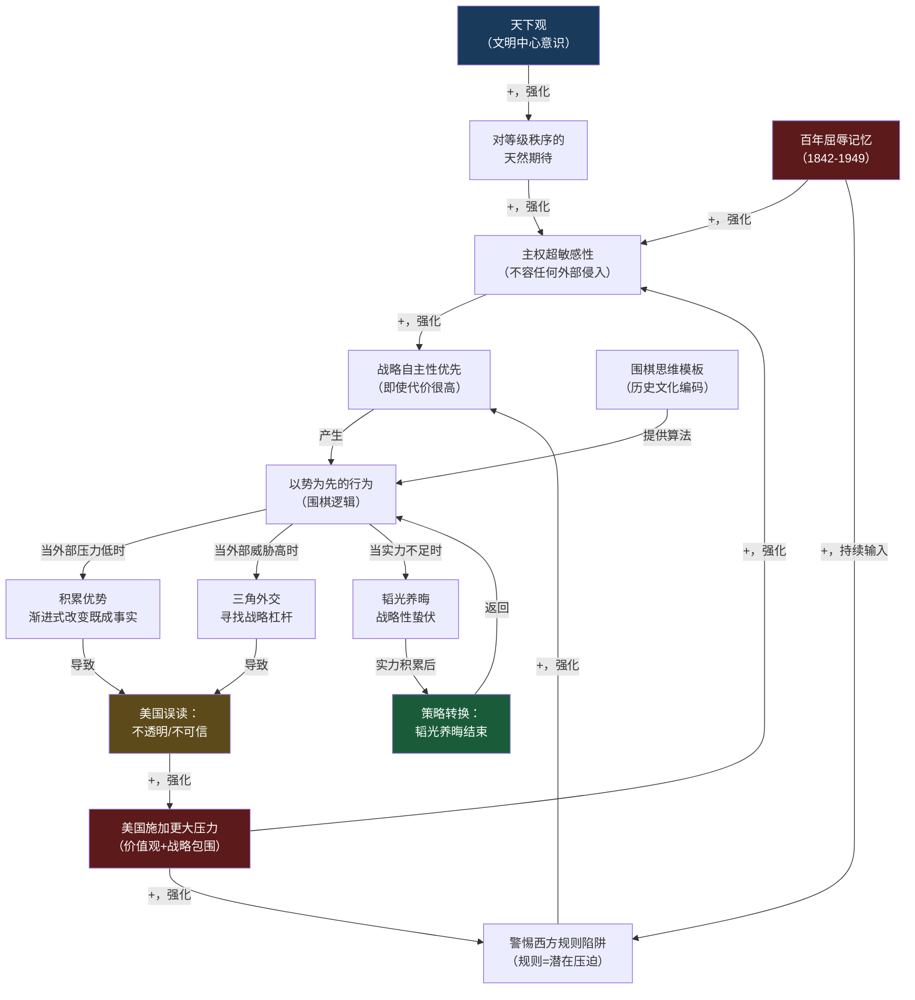
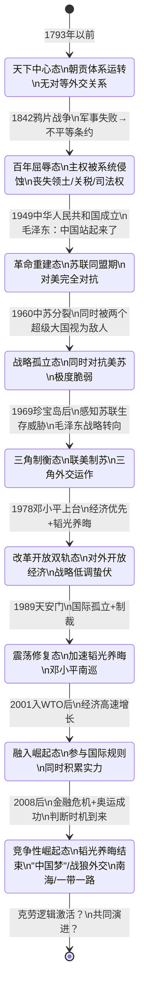
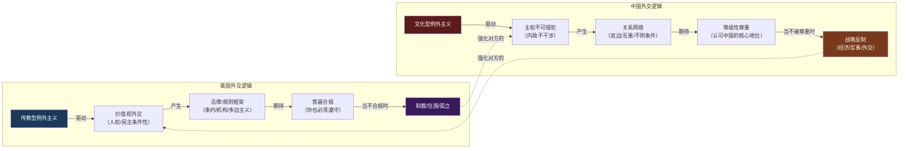
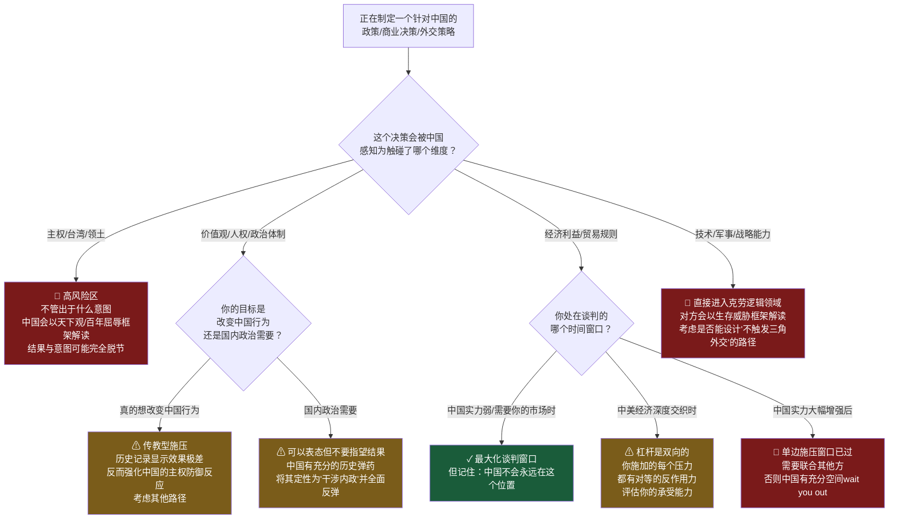

# 《论中国》建模分析 · 沈老师引擎 v3.4
## 文件三：Step 3 结构可视化 + Step 4 可执行模型

---

## Step 3：结构可视化

**原则：画不出来的地方 = 真正没理解的地方。**

---

### 图一：中国战略DNA的完整因果回路图（CLD）



**反馈环标注：**
- **正反馈环1（自强化的战略自主性）**：主权超敏感性→战略自主性优先→以势为先→美国误读→压力增大→主权超敏感性增强（循环）
- **正反馈环2（百年屈辱的持久性）**：百年屈辱记忆→警惕西方规则→战略自主性优先→…→美国用价值观施压→强化屈辱类比→记忆激活（循环）
- **负反馈环（韬光养晦的自我校正）**：实力不足→韬光养晦→实力积累→策略转换→不再韬光养晦（趋向平衡后结束）

---

### 图二：中国战略姿态的状态机（历史演化）



---

### 图三：两种外交逻辑的系统对比（影响力图）



---

### 差异列表

**【原文有、图里没有体现的内容】**

1. **具体领导人的个性差异**：毛泽东的意识形态刚性 vs 邓小平的实用主义 vs 江泽民的绩效合法性追求 vs 胡锦涛的"和谐世界"——图里把"中国"作为统一行为体，但实际上每代领导人的风险偏好有显著差异，影响了战略时机的判断。

2. **台湾问题的特殊地位**：台湾不只是领土争端，是天下观的直接体现（不能有"两个中国"），但图里没有专门节点显示这个特殊性。

3. **经济依存与战略博弈的张力**：书中花大量篇幅描述中美经济深度交织同时战略竞争的矛盾——这个"相互依赖中的对抗"结构在图里表达不足。

4. **基辛格自己的偏见来源**：他是这段历史的参与者，书中对某些事件（尤其是他自己参与的）描述明显有自辩成分——这个可靠性边界在图里无法呈现。

**【图里有、原文没有明说的推论】**

1. **韬光养晦有明确的"终止条件"**：原文记录了邓小平的指令，但没有明确说"当GDP超过X或军力达到Y时结束"。图里把"实力积累→策略转换"设计为自动触发，这是我的推论，不是书里的明确表述。

2. **两种外交逻辑的相互强化是系统性的**：原书逐章叙述，但没有把"美国价值观施压→中国主权防御加强→美国更不信任→更多施压"描述成一个显式的正反馈环。这个结构是我从叙事中提取出来的。

3. **"竞争性崛起态"作为当前状态**：书写于2011年，当时这个状态刚开始显现。把它标注为明确的状态转换，是基于书的分析框架对后续10年的延伸推论。

---

## Step 4：可执行模型

**读前诊断②**：提取"判断标准 + 结构模式" → **两个方向：诊断 + 预防**

---

### 核心机制（一句话）：

**当中美两国在某个议题上产生摩擦，首先要判断这个议题触碰的是"天下观/百年屈辱的核心节点"还是"纯利益可谈判的外围区域"——触碰核心节点，中国会以超出利益计算的强度反应；在外围区域，中国完全可以谈判和妥协。**

---

### 触发条件 → 结果：

```
当[议题涉及主权/领土/台湾/西藏/南海]时 → 中国反应强度超出利益计算，不可谈判
当[议题涉及经济利益/贸易规则]时 → 中国会谈判，有妥协空间，但会坚持"对等"
当[外部军事压力让中国感到生存威胁]时 → 三角外交被激活，寻找战略杠杆
当[外部压力在阈值以下]时 → 韬光养晦或积累形势（围棋逻辑）
当[克劳逻辑被双方同时采用]时 → 自我实现的冲突螺旋
```

---

### 诊断方向：遇到中美摩擦事件时

```mermaid
flowchart TD
    A["中美关系出现一个摩擦事件\n或中国采取了一个出乎意料的强硬/妥协行动"] --> B{这个议题触碰了\n主权/台湾/西藏/南海\n或"百年屈辱"类比？}

    B -->|"是"| C["这是核心节点\n中国的反应是结构性的\n不是利益计算出来的"]
    C --> D{美国是否理解\n这不是可谈判区域？}
    D -->|"不理解，继续施压"| E["⚠ 双方进入克劳逻辑螺旋\n误判风险极高\n摩擦会升级到非预期程度"]
    D -->|"理解，寻找框架"| F["✓ 有可能找到\n战略模糊空间\n（如台湾问题的历史处理方式）"]

    B -->|"否"| G["这是外围区域\n中国的行为是利益计算的\n可以谈判"]
    G --> H{中国当前的\n战略姿态是什么？}
    H -->|"韬光养晦期\n（实力不足，避免对抗）"| I["✓ 中国有妥协意愿\n让步是暂时的，等实力增长后会重谈"]
    H -->|"竞争性崛起期\n（实力已积累，主动布局）"| J["⚠ 中国谈判筹码更多\n让步代价更高\n需要对等性reciprocity"]
    H -->|"感知到生存威胁"| K["🔴 三角外交激活\n中国在找第三方\n直接施压只会加速这个过程"]

    style E fill:#7a1a1a,color:#fff
    style F fill:#1a5c3a,color:#fff
    style I fill:#1a5c3a,color:#fff
    style J fill:#7a5c1a,color:#fff
    style K fill:#7a1a1a,color:#fff
```

---

### 预防方向：正在制定对华政策/策略时



---

### 失效边界

**这个模型在以下情况下不适用或预测力下降：**

1. **当中国内部发生重大政治变动时**：领导人更替、政治危机、经济硬着陆——这些会改变决策者的风险偏好和时间贴现率，模型无法捕捉。

2. **当外部事件是"黑天鹅"时**：比如某个真正的军事意外，可能把"围棋逻辑"短路为"急所决断"，变成类国际象棋的快速反应。

3. **当"韬光养晦"的判断本身变成了内部政治符号时**：如果习近平放弃韬光养晦变成了政治身份认同（而不只是战略选择），那么即使战略上应该收缩，政治约束也会阻止。

4. **当基辛格的参与者视角本身产生系统性偏差时**：他对自己主导的那段历史（1971-1977）的叙述有明显的"我是对的"倾向，对这段的诊断模型需要用其他史料校正。

---

*→ 继续文件四：Step 5 接入已有体系 + 建模完成自检 + 一句话总结*
