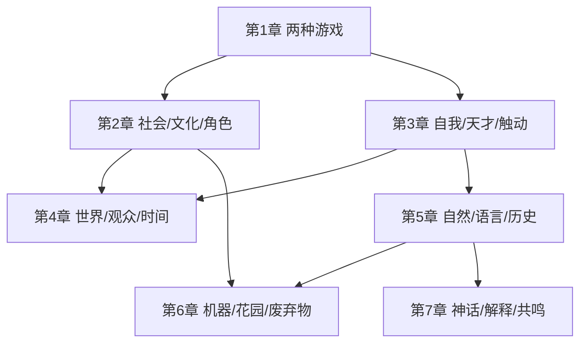
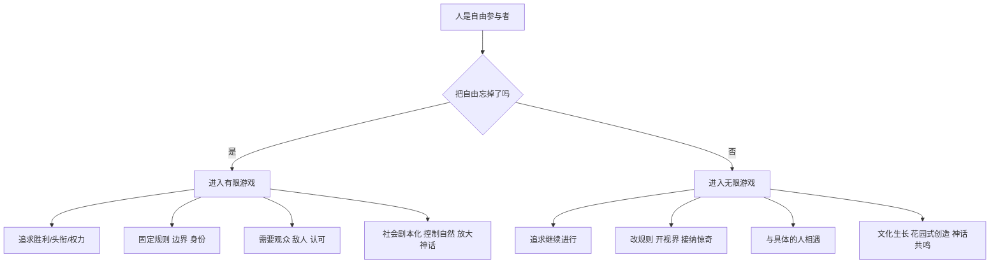

# 《有限与无限的游戏》阅读地图

## 这份笔记怎么用

这本书不是按“先定义，再证明，再结论”的方式写的。
它更像一组不断回环的观点：先区分两种游戏，再把这个区分带到社会、人格、世界、自然、机器、神话里。

如果你想快速抓住骨架，可以按下面顺序读：

1. 先看第 1 章，建立“有限游戏 / 无限游戏”总框架。
2. 再看第 2 章，理解社会、文化、角色、敌人是怎么被造出来的。
3. 再看第 3 章，理解“自我不是剧本角色，而是能重新开始的原创中心”。
4. 第 4 章说明：有限游戏为什么总要借“世界”和“观众”来确认自己。
5. 第 5-7 章把同一套结构推进到自然、技术、语言、历史、神话。

## 一句话总览

这本书反复在说一件事：一旦你把生活理解成“必须赢、必须定型、必须证明自己”，你就进入有限游戏；一旦你把重点放回“让关系、创造、对话、生命继续展开”，你就转向无限游戏。

## Pre-Step：章节依赖图

## 推荐分组

| 分组 | 章节 | 为什么适合放一起 |
|---|---|---|
| 第一批 | 第 1-2 章 | 第 1 章给总模型，第 2 章把模型落到社会、文化、角色、政治；分开看会太抽象。 |
| 第二批 | 第 3-4 章 | 第 3 章谈“我如何不是角色”，第 4 章谈“有限游戏如何借观众和世界固定自己”，两章一起看，人的内部动力更完整。 |
| 第三批 | 第 5-7 章 | 这三章构成一个连续系统：自然的不可言说 -> 机器式控制 -> 神话与讲述的开放性。 |

## 每批回答的问题

| 分组 | 核心问题 |
|---|---|
| 第 1-2 章 | 人为什么会把自由的生活活成必须赢的比赛？ |
| 第 3-4 章 | 人为什么会被观众、头衔、过去和时间绑住？又怎样重新拿回原创性？ |
| 第 5-7 章 | 我们为什么总想解释、控制、占有世界？有没有另一种与自然、技术、语言、历史相处的方式？ |

## 全书骨架

## Step 1：核心概念速览

| 概念 | 通俗解释 | 容易误判处 |
|---|---|---|
| 有限游戏 | 目标是分出输赢，比赛结束后能说“谁赢了”。 | 它不只指体育，也包括升职、名望、战争、身份竞争。 |
| 无限游戏 | 目标不是赢，而是让游戏继续，让更多可能性继续出现。 | 不是“随便玩”或“没规则”，而是规则为了继续而可改。 |
| 角色 | 人在某种社会游戏里戴上的面具。 | 角色不是假的，但如果把角色当成全部自我，就会僵住。 |
| 头衔 | 过去某次胜利留下来的可见标记。 | 它需要别人承认，不能自己宣布。 |
| 权力 | 有限游戏里的产物，来自已结束的胜利。 | 它不是“本来就有”，而是被观众和制度承认出来的。 |
| 力量 | 无限游戏里的能力，让他人也能继续行动。 | 不是压制别人，而是让关系继续开放。 |
| 社会 | 被边界、规则、身份、奖励固定下来的关系总和。 | 不是坏东西，但它总倾向于忘记自己是被人造出来的。 |
| 文化 | 开放的创造过程，让传统继续生长。 | 不是古典作品收藏，而是持续的原创回应。 |
| 天才 | 不是天赋排名，而是“我能从自己这里发出行动和话语”。 | 不是名人专属，也不是 IQ。 |
| 触动 | 双方都被改变的相遇。 | 与“推动”不同；推动是按预设把人推到某处。 |
| 机器 | 用来把世界变得可控、可预测、可重复的方式。 | 不只是设备，也是一种处理人和自然的心态。 |
| 花园 | 顺着自发生长来合作、照料、等待变化的方式。 | 不是字面上的种花，而是一种文化模型。 |
| 神话 | 能一再被讲述、并持续激发新理解的故事。 | 不是“迷信故事”；它是意义发生器。 |

## Step 2：几个最关键的边界例

| 概念 | 正例 | 边界例 | 反例伪装 |
|---|---|---|---|
| 无限游戏 | 一段合作关系中不断调整规则，让合作继续。 | 创业公司常说“长期主义”，但实际只看融资排名。 | “我们不 KPI，只佛系做事。”这不是无限游戏，可能只是松散。 |
| 文化 | 学一门传统，同时把它带出新表达。 | 公司年会也有“文化”，但可能只是服务组织服从。 | 收藏名画不是文化本身，最多是文化制成品的占有。 |
| 触动 | 一次深谈后，双方对自己和对方的理解都变了。 | 演讲听哭了，但讲者和听者关系没变。 | 被广告打动消费，不等于被触动，更像被推动。 |
| 花园 | 老师按学生实际生长调整教法。 | “培养人才”口号很多，但本质是在做标准化筛选。 | 用大量技术压榨土地产出，不是花园，而是机器化农业。 |

## 连接到已有结构

| 书中模型 | 可类比到什么 |
|---|---|
| 有限游戏 vs 无限游戏 | KPI 驱动系统 vs 演化式系统；短期优化 vs 长期生命力。 |
| 头衔 / 权力 | 简历标签、组织级别、行业奖项。 |
| 社会 / 文化 | 制度流程 vs 创新生态。 |
| 机器 / 花园 | 标准化流水线 vs 人才培养 / 社群经营。 |
| 解释 / 神话 | SOP / 结论文档 vs 激发团队想象力的故事母题。 |

## 建议阅读顺序

| 你的目的 | 先读 |
|---|---|
| 想理解书的主张 | `01-core-model.md` |
| 想按章节复盘 | `02-chapters-1-2.md` -> `03-chapters-3-4.md` -> `04-chapters-5-7.md` |
| 想把书用于工作判断 | `05-action-models.md` |
| 只要一页回顾 | `06-one-page-review.md` |

## 阅读时最容易踩的坑

| 坑 | 为什么是坑 | 更好的读法 |
|---|---|---|
| 把“无限游戏”读成鸡汤 | 会以为作者只是在劝人佛系一点 | 重点看“规则如何为继续而改变” |
| 把“有限游戏”只理解成比赛 | 会漏掉职位、婚姻、战争、学术、政治等场景 | 看到一切“争取可承认结果”的结构 |
| 把“文化”理解成艺术收藏 | 会错过作者说的“文化是持续生成” | 重点看传统如何被继续而不是被保存 |
| 把“神话”理解成错误知识 | 会误判第 7 章只是在谈宗教 | 重点看“故事如何激发新讲述” |
| 把“机器”只理解成设备 | 会低估第 6 章的现实解释力 | 把它当成一种控制型关系方式 |

## 复读时的最短路径

如果以后只剩 15 分钟复习，建议这样走：

1. 先看 `06-one-page-review.md`，把总对照表重新唤醒。
2. 再看 `01-core-model.md` 的两个 flowchart，恢复主骨架。
3. 如果你最近在处理组织、关系或决策，直接跳到 `05-action-models.md`。
4. 如果你最近卡在“我为什么越来越不像自己”，回看 `03-chapters-3-4.md`。

## 一句话触发总结

当你开始觉得“这件事我必须赢、必须证明、必须控制、必须定型”时，就该翻这本书，因为你大概率已经从生活滑进了一个有限游戏。
