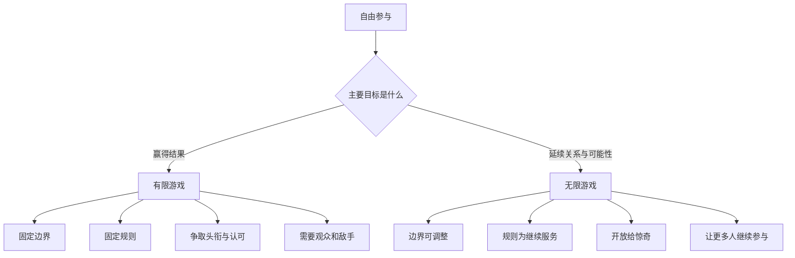
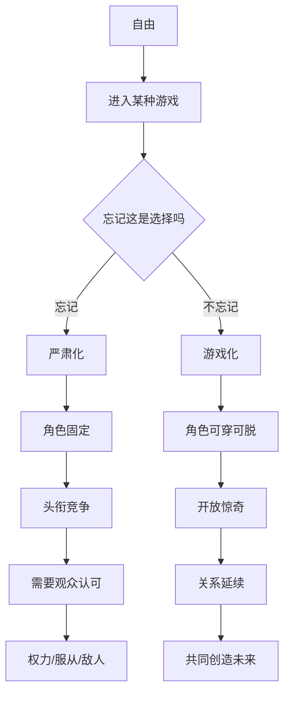
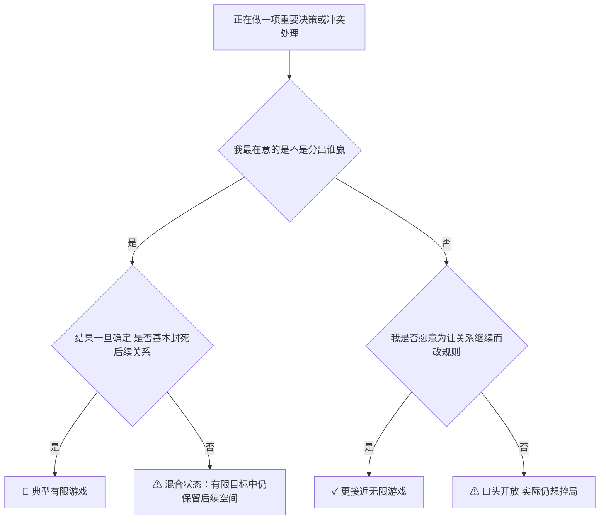
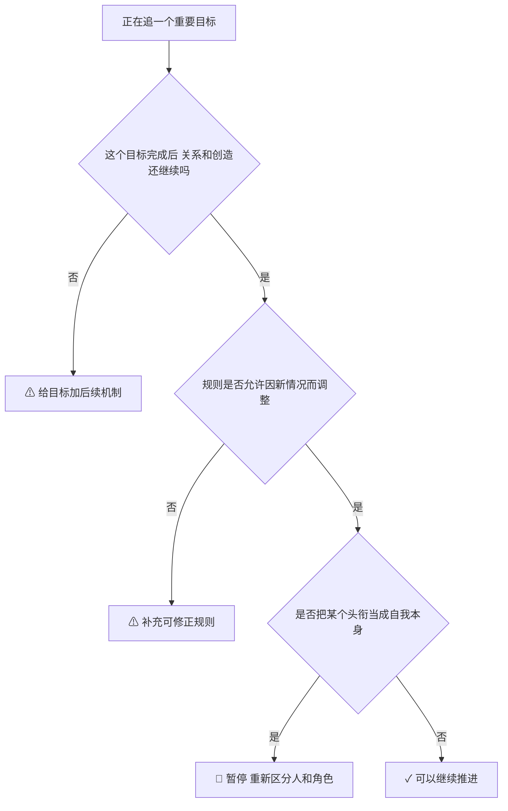

# 核心模型：有限游戏 vs 无限游戏

## 这本书到底在区分什么

作者不是在区分“认真玩”和“随便玩”。
他区分的是两种完全不同的行动逻辑。

1. 有限游戏：目标是赢，赢了就能结束，并得到可被承认的结果。
2. 无限游戏：目标是继续，让更多人还能参与，让关系和可能性不被封死。

## 最短定义

| 项目 | 有限游戏 | 无限游戏 |
|---|---|---|
| 目的 | 分出胜负 | 继续进行 |
| 边界 | 时间、空间、人数都要明确 | 边界可变，重要的是不让游戏终止 |
| 规则 | 开始前确定，过程中尽量不变 | 为了继续，必要时要改 |
| 身份 | 靠角色、资格、头衔进入 | 任何愿意的人都可加入 |
| 结果 | 产生赢家、排名、头衔 | 产生新的关系、视界、可能性 |
| 时间感 | 时间在被消耗 | 时间在被生成 |
| 惊奇 | 是风险，要尽量防住 | 是礼物，没有惊奇反而停了 |
| 他人 | 对手、评委、观众、服从者 | 合作者、回应者、共同开启者 |

## Step 0：骨架图

## Step 1：用最直白的话说核心概念

| 概念 | 通俗解释 |
|---|---|
| 胜利 | 一次竞争被封口了，大家同意谁赢谁输。 |
| 头衔 | 赢过之后别人给你的“标签证明”。比如冠军、总监、名校校友。 |
| 角色 | 为了把某个游戏玩下去，你先把自己缩成某种身份。 |
| 自我遮蔽 | 明明是自己选择进入角色，却慢慢假装“我本来就是这个角色”。 |
| 严肃性 | 把游戏结果当成生死攸关，以至于忘了自己本可不这么玩。 |
| 视界 | 永远到不了，但一直把你带向更多可能性的方向。 |
| 惊奇 | 不是“意外事故”，而是未来真的改写了你对过去的理解。 |

## 为什么有限游戏会让人越玩越紧

作者的意思不是“有限游戏不好”。
有限游戏必要，也常常有价值。
问题在于：人容易把有限游戏当成唯一现实。

一旦这样，几个连锁反应会出现：

1. 你需要固定规则，否则胜负说不清。
2. 你需要固定角色，否则资格说不清。
3. 你需要固定观众，否则荣誉站不住。
4. 你需要固定过去，否则头衔失效。
5. 你需要固定敌人，否则权力无处施展。

最后，一个本来靠自愿参加的游戏，会被体验成“我不得不这样活”。

## 为什么无限游戏不是“摆烂”

很多人会误会：
“不追求输赢，是不是就是不负责？”

这本书的答案不是。

无限游戏不是没标准，而是标准换了：

| 错误理解 | 书里的意思 |
|---|---|
| 不在乎结果 | 在乎结果，但不让结果封死未来 |
| 没有规则 | 有规则，但规则服务于继续 |
| 不认真 | 一样投入，甚至更投入，只是不把头衔当终点 |
| 不做判断 | 一样判断，只是不急着把人永远定型 |

## Step 2：边界例

### 概念A：有限游戏

| 例子类型 | 例子 | 判断 |
|---|---|---|
| 正例 | 年度销售排名，年底决出第一名 | 典型有限游戏，目标明确是赢 |
| 边界例 | 创业公司说“我们做长期价值”，但融资、估值、头部媒体曝光仍是核心驱动 | 可能是披着长期语言的有限游戏 |
| 反例伪装 | 团队不争第一，只想一起做点有意思的事 | 这不自动等于无限游戏，也可能只是目标模糊 |

边界定义：只要行动主要围绕“分出谁赢并固定结果”，它就是有限游戏。

### 概念B：无限游戏

| 例子类型 | 例子 | 判断 |
|---|---|---|
| 正例 | 一个长期合作团队不断调整协作方式，目标是能力和关系都可持续 | 典型无限游戏 |
| 边界例 | 婚姻里口头说“长久相伴”，实际一直在争输赢和控制权 | 名义无限，实际有限 |
| 反例伪装 | 没目标、没承诺、大家随缘 | 这不是无限，可能只是失去结构 |

边界定义：无限游戏不是没有边界，而是不把边界当终点。

## 有限游戏最核心的心理机制

作者反复强调：有限游戏参与者常常忘了自己本是自愿进入的。

于是会出现三层遮蔽：

1. 我不是在扮演角色，我“就是”这个角色。
2. 我不是在参加一种可退出的竞争，我“必须”继续。
3. 我不是在追求某个有限结果，我是在“保卫人生意义”。

这就是为什么头衔、地位、胜利会被越抬越高。

## 无限游戏最核心的动作

作者给出的不是技巧，而是一个姿态：

1. 承认自己在戴面具，但不把面具当全部自我。
2. 在有限游戏里投入，但不把结果当封顶。
3. 遇到“有人赢有人输、游戏可能封死”的时刻，愿意改规则。
4. 把惊奇当资源，而不是只当威胁。

## Step 3：结构可视化

差异列表：

【原文有、图里没有】
- 死亡、头衔、永生这些更强烈的哲学推进。
- 训练与教育的区分。

【图里有、原文没明说的推论】
- 很多现代组织问题，本质是把必要的有限游戏绝对化。

## Step 4：可执行模型

核心机制一句话：
当一个系统开始把“赢一次”看得比“还能继续一起玩”更重要时，它就会越来越依赖边界、头衔、权力和敌人。

### 诊断图：我现在是在玩哪种游戏？

### 预防图：如何不被有限游戏吞掉

失效边界：
这个模型不适合拿来否认有限游戏的必要性。考试、合同、体育、某些审计流程，本来就需要清晰边界。

## Step 5：接入已有体系

【同构】与产品 / 组织设计里的“局部优化 vs 系统生命力”同构。

正向迁移：
如果一个团队只围绕季度排名运转，它会越来越像有限游戏：规则僵化、跨团队敌意上升、头衔变重。

反向迁移：
用本书模型回看职业规划，不应只问“下一次怎么赢”，还该问“什么选择能让我保持长期创造和关系能力”。

【互补】它补上了“为什么人会主动把自己塞进僵化角色”的心理解释。

【矛盾】它与“先赢了再说”文化有张力。

条件差异：
短周期冲刺可以有限化；整个人生、婚姻、文化、教育、组织生态不能只有限化。

## 一句话触发总结

当你发现自己开始把头衔、胜负、排名、面子当成人生本身，而不是某次局部比赛的结果时，你已经把有限游戏误当成了整个世界。
