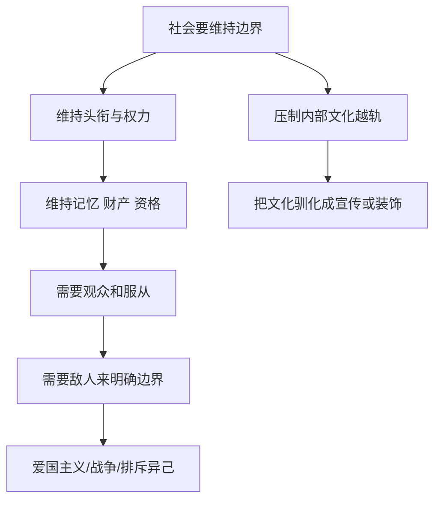
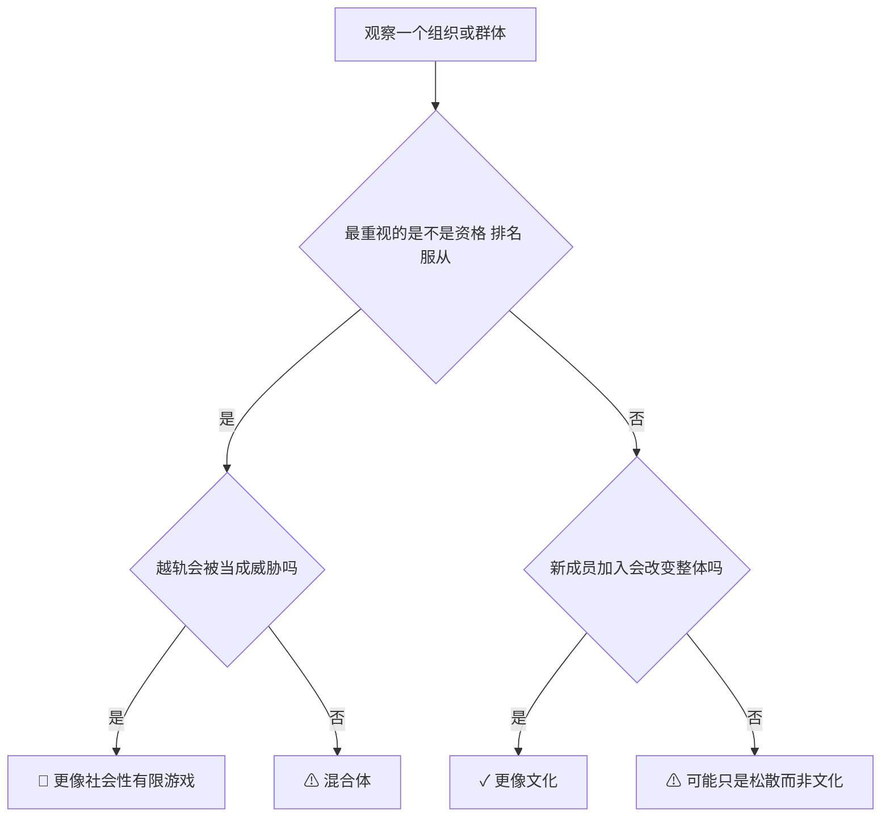
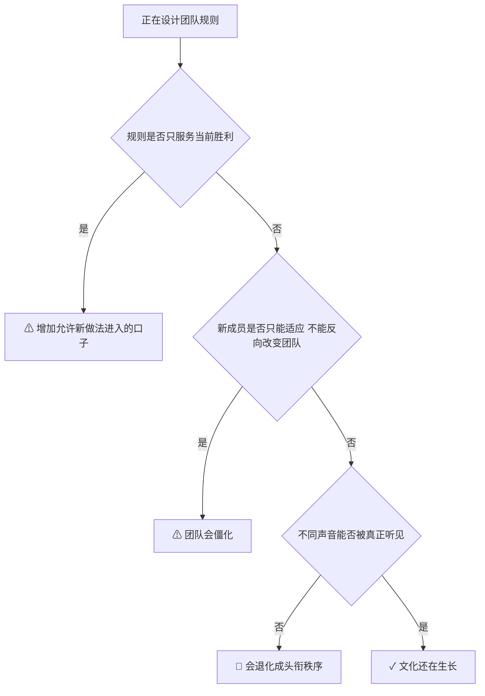

# 第 1-2 章笔记：两种游戏、社会与文化

## 这两章回答什么

第 1 章给出母模型：有限游戏为了赢，无限游戏为了继续。
第 2 章把这个母模型落到社会生活里：为什么社会爱边界、爱头衔、爱敌人；为什么文化反而靠开放、越轨和继续生成活着。

## 第 1 章要点

### 1. 有限游戏的四个硬条件

作者说，一个有限游戏要成立，至少要有这些条件：

| 条件 | 说明 |
|---|---|
| 明确终点 | 不然无法判定谁赢了 |
| 明确边界 | 时间、空间、参与者都要相对清楚 |
| 明确规则 | 参与者先同意规则，再能认同结果 |
| 自愿参与 | 被迫就失去“游戏”意义 |

这也解释了为什么有限游戏总爱做资格审核、角色授予、规则说明、流程封闭。

### 2. 无限游戏的关键不是“无限长”

作者不是说某个活动能永远持续下去，而是说：

1. 它不以一次结果封死自己。
2. 它会在游戏受终局威胁时改规则。
3. 它优先保留参与和继续，而不是优先保留胜者。

### 3. 最重要的一句话

作者在第 1 章里最值得反复看的一句，可以压缩成：

> 有限游戏在边界内玩；无限游戏与边界本身玩。

这句几乎是全书钥匙。

## 第 1 章高价值概念

| 概念 | 简化理解 | 书中指向 |
|---|---|---|
| 头衔 | 胜利留下的公开标记 | 冠军、官职、名望、身份 |
| 权力 | 已结束胜利被承认后的力量 | 来自过去，而不是来自未来 |
| 力量 | 让别人也能继续行动的能力 | 面向未来、无法封顶 |
| 严肃性 | 忘了自己原本可以不这样玩 | 角色越重，严肃性越强 |
| 自我遮蔽 | 自愿戴上面具后，忘了面具是自己选的 | 律师、母亲、士兵、演员等 |

## 第 1 章边界例

### 概念：规则

| 例子类型 | 例子 | 判断 |
|---|---|---|
| 正例 | 篮球比赛中途不能突然把三分线取消 | 有限游戏规则要稳定 |
| 边界例 | 公司绩效制度年中修改指标 | 如果还是同一轮比赛，参与者会质疑“是不是换了游戏” |
| 反例伪装 | “我们都很灵活，所以规则随时改” | 这不一定高级，可能只是结果导向地操控赛局 |

### 概念：惊奇

| 例子类型 | 例子 | 判断 |
|---|---|---|
| 正例 | 棋手用奇招让对手失误 | 有限游戏中惊奇是取胜手段 |
| 边界例 | 研发团队因用户新需求而重构方向 | 如果目的是继续产品生命，这更像无限游戏中的惊奇 |
| 反例伪装 | 完全没准备导致事故 | 这不叫惊奇，只叫失控 |

## 第 2 章要点

### 1. 社会与文化不是一回事

作者在第 2 章最关键的区分是：

| 项目 | 社会 | 文化 |
|---|---|---|
| 性质 | 有限游戏 | 无限游戏 |
| 基础 | 边界、身份、制度、历史记忆 | 视界、创造、传承中的变化 |
| 关注点 | 维持秩序与既有权力 | 让传统继续生成 |
| 对越轨的态度 | 倾向压制 | 越轨本身常是生命力 |
| 与敌人的关系 | 需要敌人来确认边界 | 本质上没有敌人，只有邀请 |

作者不是说社会没用。
而是说，社会总会忘记自己其实是文化的一种缩窄版本。

### 2. 为什么社会喜欢爱国、纪念碑、资格认证

因为社会要维持头衔系统。
头衔如果没人记得，就会失效。

所以社会天然会重视：

1. 记功和纪念。
2. 身份资格和证书。
3. 财产确认。
4. 对边界和敌人的强调。

这些都不是偶然现象，而是同一个结构的不同表现。

### 3. 为什么文化总是有点“越界”

作者说，文化不是简单地重复过去。
文化是把过去继续下去，但继续的方式是新的。

也就是说：

1. 真正的传统不是照抄。
2. 真正的艺术不是占有作品，而是激发新的创造。
3. 真正的人民不是靠共同敌人团结，而是靠共同开放的生活方式形成。

## 财产这段讲了什么

第 2 章里关于财产的一大段不太好读，但意思可以压缩成：

1. 财产常常不是单纯的使用物，而是胜利可见化的标志。
2. 所以财产会和头衔绑在一起。
3. 社会需要法律、警察、制度去维护这套可见性。
4. 但这套秩序最终仍靠大家认可，不是单靠强制力就能成立。

这段和今天的很多现象很像：

| 场景 | 书里的解释 |
|---|---|
| 豪车、豪宅、名表 | 不只是消费，也是在表演过去胜利 |
| 名校学历 | 既是能力信号，也是参赛资格 |
| 企业家捐楼冠名 | 把头衔延长进公共时间 |

## 结构图：从社会到战争

## 这一组里最强的边界判断

### 什么叫“文化”而不是“被社会利用的文化产品”？

| 判断问题 | 如果答案是“是” | 倾向 |
|---|---|---|
| 它是否主要服务既有权力与秩序？ | 是 | 更像社会工具 |
| 它是否允许观众被激发为新的创造者？ | 是 | 更像文化 |
| 它是否只能被拥有、收藏、认证？ | 是 | 更像制成品 |
| 它是否让传统继续变化？ | 是 | 更像文化 |

## 工作 / 生活里的对应例子

| 现实场景 | 更像社会 | 更像文化 |
|---|---|---|
| 公司培训 | 只教标准动作和合规口径 | 让人长出新判断和新方法 |
| 家庭教育 | 把孩子做成“家族角色” | 和孩子一起长，允许新家庭样式出现 |
| 品牌建设 | 堆奖项、堆头衔、堆权威背书 | 形成用户愿意参与和再创造的生活方式 |
| 国家叙事 | 主要靠敌我对立凝聚 | 主要靠邀请他者进入更大视界 |

## Step 4：可执行模型

核心机制一句话：
社会总倾向于把人固定成角色，把传统固定成制度，把开放固定成边界；文化则不断把这些固定物重新打开。

### 诊断图：一个组织更像社会机器，还是文化生态？

### 预防图：如何让团队不只剩“社会壳”

## 接入已有体系

【同构】这两章与组织行为中的“制度维护 vs 创新生成”高度同构。

【反向迁移】如果一个团队总靠“共同敌人”维持士气，它的文化大概率已经很弱，只剩社会性动员。

【互补】这两章补上了“为什么成功组织也会压制创造者”的结构解释。

【矛盾】它和“强组织一定靠统一口径”有张力。

条件差异：
执行层面可以统一；文化层面不能只剩统一。

## 一句话触发总结

当一个群体越来越依赖头衔、资格、边界、敌人和服从来维持自己时，它就在从文化退回社会剧场。
