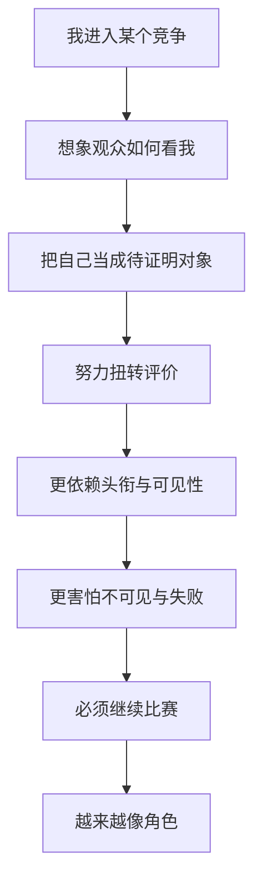
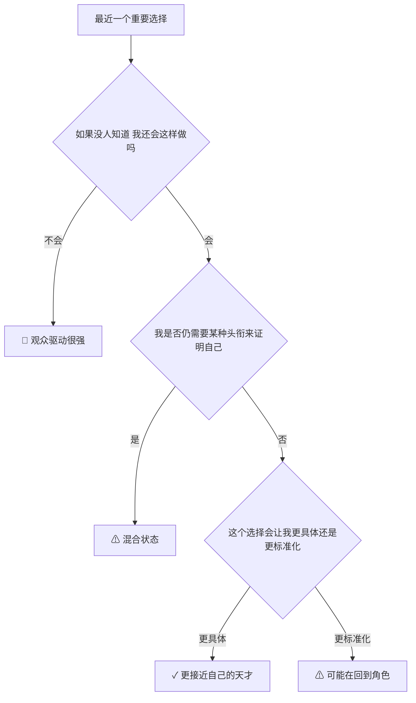
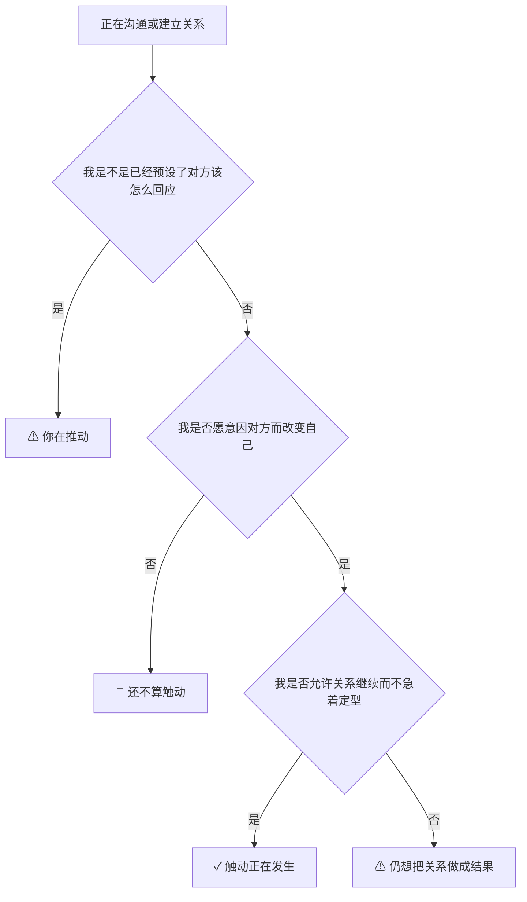

# 第 3-4 章笔记：自我、观众、世界与时间

## 这两章回答什么

第 3 章回答：人怎样不只是角色，怎样成为“自己的天才”。
第 4 章回答：有限游戏为什么离不开观众、世界、时间和过去。

合起来看，就是一句话：

> 人一旦把自己交给观众与过去，就活成剧本；人一旦重新从自己这里发声，就把过去重新打开。

## 第 3 章的主轴：我是自己的天才

### 1. “天才”不是天赋排名

这章最容易误解的词就是“天才”。
作者不是说少数精英有超凡才能。
他的意思更接近：

1. 我说的话，是我真的在说，而不是机械复述。
2. 我做的事，是我真的在做，而不是在执行一个已经写好的角色脚本。
3. 我能被别人触动，也能触动别人，因此关系会真的改变我。

### 2. 触动 vs 推动

这是第 3 章特别有用的一组区分。

| 概念 | 通俗解释 | 结果 |
|---|---|---|
| 推动 | 把人按预设路线往前推 | 对方成了被操作对象 |
| 触动 | 双方都被真正改变 | 关系进入新的可能性 |

例子：

| 场景 | 更像推动 | 更像触动 |
|---|---|---|
| 管理 | 用 KPI 和恐惧逼动作 | 对方因理解而主动改变 |
| 教育 | 为考试灌输标准答案 | 让学生开始自己看见问题 |
| 亲密关系 | 用技巧操纵回应 | 双方都愿意暴露真实脆弱 |

### 3. 痊愈 vs 治疗

这组区分也很重要。

| 概念 | 重点 |
|---|---|
| 治疗 | 修复机能，让人重新回到比赛里 |
| 痊愈 | 让人重新作为整体活着，哪怕仍带着限制 |

作者不是反医学，而是在说：
如果一个人只把自己当机能组合，他很容易只想“恢复功能”，而忘了“重新活着”。

### 4. 性在这章里代表什么

这章谈“性”不是在讲道德规范。
它是在讲：生命起源、亲密关系、诱惑、占有、身份、家庭这些东西，怎样暴露出有限与无限两种逻辑。

压缩成表：

| 项目 | 有限的性 | 无限的性 |
|---|---|---|
| 目标 | 赢得对方、占有对方、证明吸引力 | 在亲密中继续开放、继续生成 |
| 方法 | 诱惑、策略、遮蔽、攻防 | 选择、暴露、触动、共同成长 |
| 结果 | 留下回忆、战果、关系财产化 | 关系继续深化，彼此更具体 |

## 第 3 章边界例

### 概念：天才

| 例子类型 | 例子 | 判断 |
|---|---|---|
| 正例 | 你把一个旧问题第一次真正说成自己的话 | 这是作者意义上的天才 |
| 边界例 | 复述一本书，但加了自己的例子与判断 | 若真的重组了意义，接近天才；若只是包装，仍是复述 |
| 反例伪装 | 风格很强、人格标签很鲜明 | 不等于原创，只可能是角色更稳定 |

### 概念：触动

| 例子类型 | 例子 | 判断 |
|---|---|---|
| 正例 | 一次对话后，双方都改变了对自己的看法 | 触动 |
| 边界例 | 演讲很热血，观众泪流满面 | 可能只是推动，不一定有双向改变 |
| 反例伪装 | 精准操控情绪、制造高潮 | 这更像技术化推动 |

## 第 4 章的主轴：有限游戏发生在世界中

### 1. 为什么有限游戏需要“世界”

作者说，有限游戏不只要参赛者，还要观众世界。
因为胜利要有一个外部参照，才能显得“绝对成立”。

换句话说：

1. 比赛内部知道谁赢还不够。
2. 还需要有人记得、传播、承认、见证。
3. 所以有限游戏总会生产观众、媒体、纪念、历史叙述。

### 2. 观众为什么很危险

因为观众不只是旁观。
作者认为，参与者会把观众内化进自己心里。

结果是：

1. 我一边行动，一边想象别人怎么看我。
2. 我越来越不是为了做事，而是为了扭转评价。
3. 我越想证明自己不是失败者，就越承认“评价者有权定义我”。

这几乎就是现代人很多焦虑的结构。

### 3. 时间为什么在有限游戏里总是不够用

第 4 章有个很实用的判断：

| 项目 | 有限游戏中的时间 | 无限游戏中的时间 |
|---|---|---|
| 感受 | 被消耗、在倒数 | 被生成、是展开的容器 |
| 焦点 | 赶在结束前赢 | 在进行中产出新的可能性 |
| 结果 | 想赢一个被固定的过去 | 让现在成为持续的开始 |

所以同样是工作：

1. 为季度数字冲刺，时间像在漏。
2. 为一个长期作品打磨，时间像在长。

## 结构图：自我怎样被观众绑住

## 这两章合在一起的关键洞见

### 洞见 1

有限游戏不只是外部竞争，它会内化成一种人格结构。

### 洞见 2

很多所谓“自我实现”，其实只是更高级的可见性竞争。

### 洞见 3

真正的原创性，不是摆脱他人，而是在与他人的真实触动中形成。

### 洞见 4

如果时间只剩截止日和年龄焦虑，你大概率活在观众时间里，而不是你自己的生成时间里。

## Step 4：可执行模型

核心机制一句话：
当人把自己交给观众和头衔时，就会用过去定义现在；当人从自己的天才出发时，过去会重新变成可被改写的过去。

### 诊断图：我是在活自己的生活，还是在向观众表演？

### 预防图：如何从“被推动”转向“被触动”

## 现实例子

| 场景 | 有限玩法 | 无限玩法 |
|---|---|---|
| 求职 | 只为证明“我不是失败者” | 借机会进入能继续成长与创造的环境 |
| 亲密关系 | 证明自己值得被爱、赢得对方 | 一起变得更真实、更具体 |
| 教育 | 先修复分数和排名 | 先恢复好奇、判断和整体感 |
| 创作 | 模仿市场认可模板 | 用作品打开新的表达空间 |

## 接入已有体系

【同构】这两章和心理学里的“外部评价驱动 vs 内在生成”同构，但作者更强调关系和游戏结构。

【反向迁移】如果一个管理者只会设目标、激励、奖惩，他很可能只能推动团队，无法真正触动团队。

【互补】它补上了“为什么很多成功者越成功越不自由”的结构说明。

【矛盾】它与“只要更自律就能更自由”的观点有张力。

条件差异：
如果自律只是为了更稳地赢，仍可能更不自由；如果自律是为了更好地继续创造，才更接近无限游戏。

## 一句话触发总结

当你做事的第一反应不再是“这是不是我真的想说、想做、想成为的”，而变成“别人会怎么看我”时，你就已经从天才滑回了角色。
