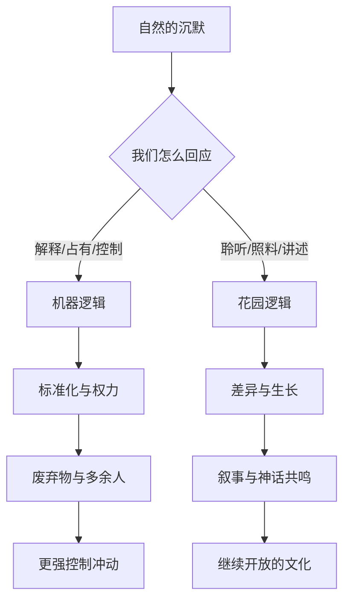
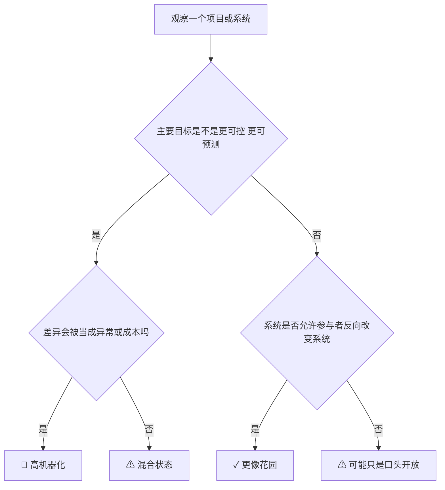
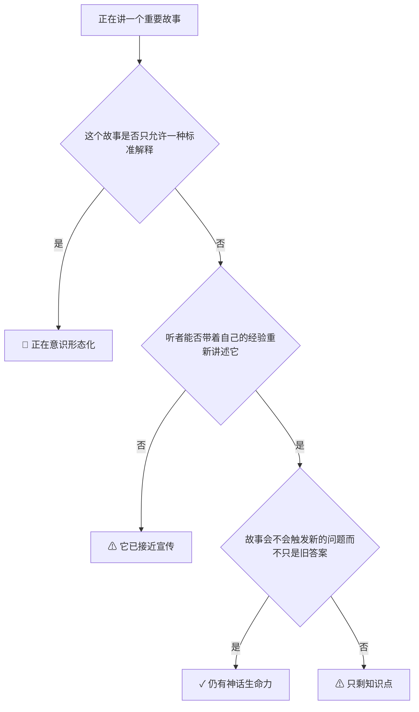

# 第 5-7 章笔记：自然、机器、语言、历史与神话

## 这三章在讲什么

第 5-7 章把前面的两种游戏模型推进到更大的范围：

1. 第 5 章：自然不是等着我们完全解释的对象。
2. 第 6 章：我们控制自然，很多时候其实是在控制人；机器与花园是两种文化方向。
3. 第 7 章：神话不是落后的解释，而是能不断激发新解释和新讲述的源头。

这三章一起看，主线很清楚：

> 一旦我们只想解释、占有、控制，世界会越来越像一个可被管理的对象；一旦我们重新学会聆听、讲述、照料、共鸣，世界又会重新变成开放的历史与创造。

## 第 5 章：自然是不能言说者的王国

### 1. 不能言说，不等于没意义

作者说自然“不能言说”，意思不是自然什么都没有。
而是说：

1. 自然不会用我们的语言替自己说明。
2. 我们不能真地站到自然外面去，完整客观地替它发言。
3. 一旦我们以为自己已经替自然说完了，我们其实是在把自己的解释强加给自然。

### 2. 为什么这会引出语言和隐喻

因为自然不是语言本身，所以语言永远和对象有距离。
正是这个距离，才让隐喻和创造成为可能。

作者这里的关键不是语言学，而是提醒：

1. 说“自然就是这样”，通常带有过度自信。
2. 真正开放的语言，不是假装掌握全部真相。
3. 讲述如果还能继续，就说明它还给他人留了空间。

### 3. 解释 vs 叙事

| 项目 | 解释 | 叙事 |
|---|---|---|
| 目标 | 说明为什么只能这样 | 呈现事情如何这样发生且仍可继续理解 |
| 对未来 | 趋向预测和封闭 | 趋向开放和继续讲述 |
| 对自由 | 容易把自由消解为必然 | 给自由留下位置 |
| 对听者 | 说服、战胜、让对方承认自己错了 | 邀请、触动、让对方重新看见 |

## 第 6 章：机器与花园

### 1. 机器不是单纯的工具，而是一种关系方式

作者不是反技术。
他要说的是：当我们用机器心态处理世界时，会发生几件事。

1. 自然被当资源。
2. 人被当操作件。
3. 差异被视为噪音。
4. 目标变成控制和效率。
5. 结果常常是废弃物和“多余的人”。

### 2. 花园是什么

花园不是一种田园审美，而是一种文化模型。

| 项目 | 机器 | 花园 |
|---|---|---|
| 动力来源 | 外力驱动 | 自发生长 |
| 管理逻辑 | 控制、预测、标准化 | 照料、等待、回应变化 |
| 对人 | 把人变成装置延伸 | 让人也一起成长 |
| 对差异 | 倾向消除 | 倾向珍惜 |
| 对结果 | 为确定产出服务 | 让生命力继续展开 |

### 3. 废弃物这段为什么重要

作者说，废弃物不是系统运行后的偶然副产物，而常常就是系统真正生产出来的东西。

这句话可以迁移到很多现实：

| 场景 | 书里的看法 |
|---|---|
| 环境污染 | 不是意外，是某种生产方式的直接表达 |
| 组织中的低价值感员工 | 往往不是个人问题，而是系统定义出来的“多余人” |
| 城市边缘群体 | 不是自然形成，而是社会结构排出来的 |

## 第 7 章：神话激发解释，但不接受任何解释

### 1. 神话不是“错误知识”

这章最值得记住的一点：

作者不把神话理解成科学之前的幼稚说明。
他把神话理解成能一再激发讲述、共鸣和重新理解的故事母体。

所以：

1. 解释可能赢一时。
2. 神话提供的是更深层的讲述动力。
3. 一个文化的活力，往往不取决于它有多少结论，而取决于它还有多少故事能继续被讲。

### 2. 共鸣 vs 放大

这组区分非常实用。

| 项目 | 共鸣 | 放大 |
|---|---|---|
| 声音关系 | 多个声音彼此激活 | 一个声音压过别的声音 |
| 结果 | 继续对话 | 形成服从 |
| 文化形态 | 合唱、故事、共同讲述 | 扩音器、命令、意识形态 |

作者甚至说：意识形态可以理解为“被放大的神话”。

也就是：

1. 故事本来是开放的。
2. 后来被固定成唯一意义。
3. 然后拿去要求大家服从。

## 三章合起来的总图

## 边界例

### 概念：解释

| 例子类型 | 例子 | 判断 |
|---|---|---|
| 正例 | 用物理定律解释冰为什么浮在水面 | 典型解释 |
| 边界例 | 用宏大理论解释一个文明必然走向某个终局 | 容易滑向意识形态放大 |
| 反例伪装 | 给一件事编一个听起来顺的因果故事 | 不等于解释，可能只是叙事包装 |

### 概念：花园

| 例子类型 | 例子 | 判断 |
|---|---|---|
| 正例 | 老师根据学生差异调整节奏，让不同人都能长出来 | 花园式 |
| 边界例 | 公司说“培养人才”，实际只是为了更高产出 | 可能仍是机器逻辑 |
| 反例伪装 | 什么都不管，完全放养 | 不是花园，可能是弃养 |

### 概念：神话

| 例子类型 | 例子 | 判断 |
|---|---|---|
| 正例 | 一个故事不断被重讲，并持续改变讲述者和听者 | 神话性强 |
| 边界例 | 企业创始故事被反复讲，但只允许一种官方意义 | 可能已被意识形态化 |
| 反例伪装 | 网红金句传播很广 | 不一定是神话，可能只是放大的口号 |

## 现实里的几个强迁移

| 原书主题 | 工作中的对应 |
|---|---|
| 解释压倒叙事 | 团队只剩结论，不再讲真正发生了什么 |
| 机器压倒花园 | 人才、客户、产品都被做成标准件 |
| 废弃物 | 被 KPI 体系淘汰的人和经验被当垃圾处理 |
| 神话被意识形态化 | 公司价值观只剩口号，不再激发真实回应 |

## Step 4：可执行模型

核心机制一句话：
凡是只追求可预测、可控制、可复制的系统，都会越来越机器化；凡是还能容纳差异、聆听、叙事和未完成性的系统，才更像花园和文化。

### 诊断图：你的项目是在造机器，还是在养花园？

### 预防图：如何防止神话退化成意识形态

## 接入已有体系

【同构】这三章和复杂系统里的“控制论思维 vs 生态思维”高度同构。

【反向迁移】做管理时，如果一个流程越优化越需要把人变成机器，那说明流程正在吞噬系统生命力。

【互补】它补上了“为什么故事、传统、神话不是落后残余，而是文化持续生成的核心装置”。

【矛盾】它与“所有问题都可以被更好模型彻底解释和治理”有张力。

条件差异：
局部问题可以解释和治理；整体生命不能只靠解释和治理维持。

## 一句话触发总结

当一个系统越来越想把世界、人和故事都变成可预测对象时，它在长出机器；当它还能容纳沉默、差异、叙事和继续生长时，它才还像花园。
