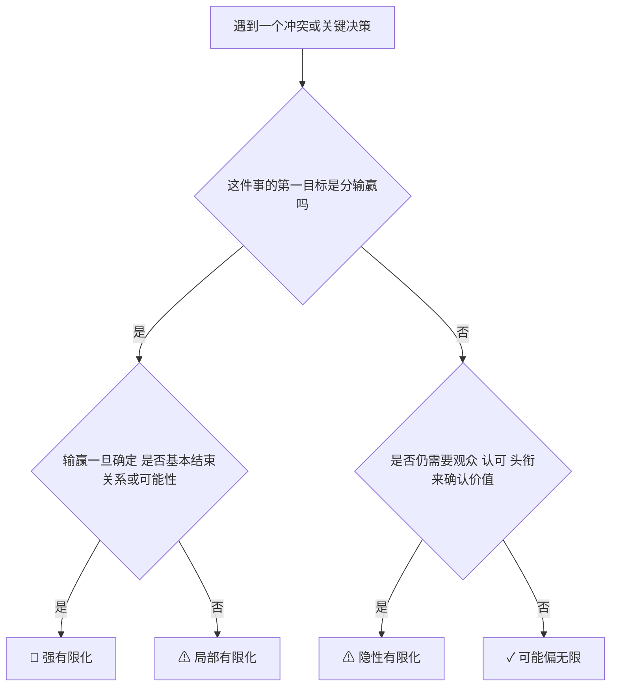
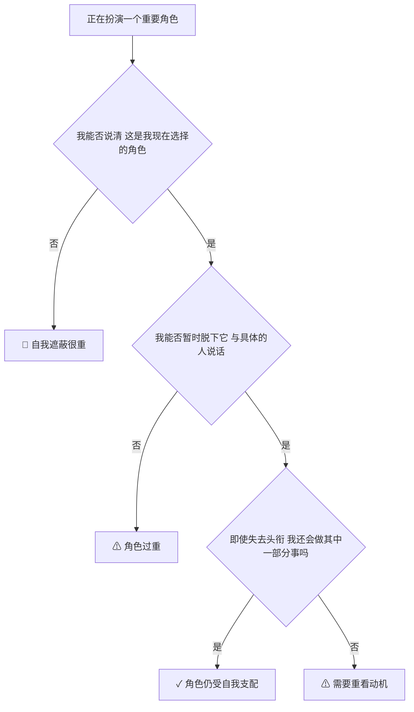
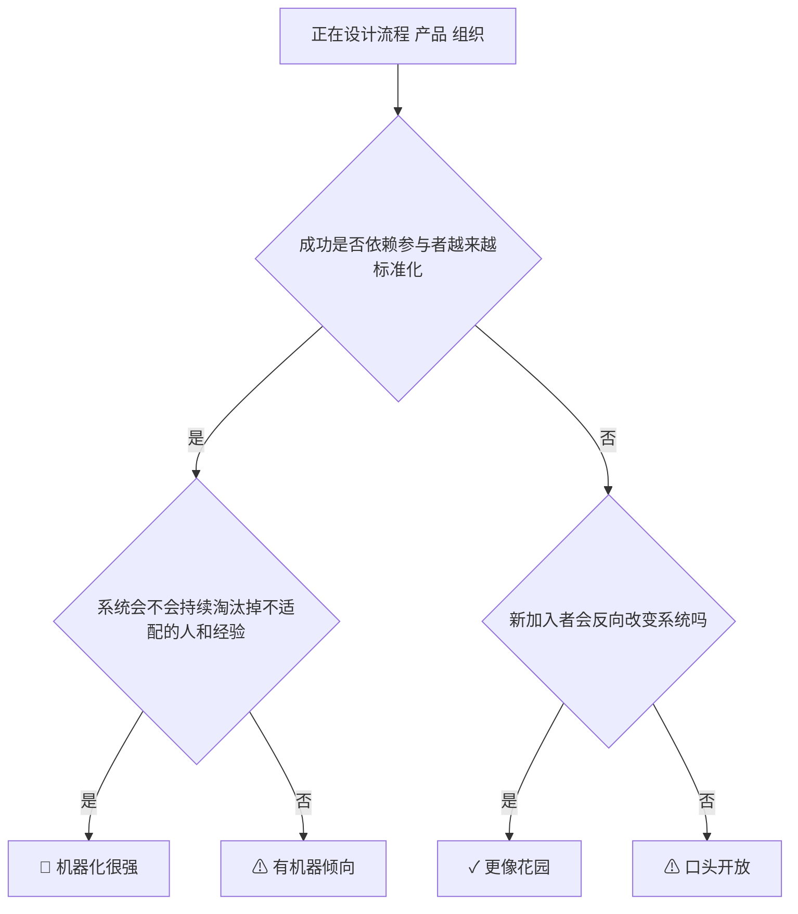
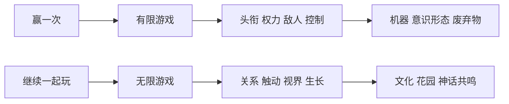

# 可执行模型：把《有限与无限的游戏》用到现实里

## 先说结论

这本书最实用的地方，不是给你一个“价值观姿态”。
而是给你一套识别器：

1. 我现在到底在玩什么游戏？
2. 这个系统为什么越做越僵？
3. 我是想解决问题，还是想赢一次？
4. 我是在培养生命力，还是只是在扩大控制力？

## 模型 1：有限化诊断器

### 适用场景

适合判断：

1. 团队冲突。
2. 亲密关系拉扯。
3. 职业焦虑。
4. 公司文化僵化。

### 核心机制

当系统开始围绕“胜负、头衔、边界、可见性、敌我”运转时，它正在有限化。

### 诊断图

### 商业例子

| 场景 | 有限化信号 |
|---|---|
| 跨部门合作 | 开始以“谁背锅、谁拍板、谁赢”定义问题 |
| 招聘 | 只按名校、头衔、履历标签筛人 |
| 战略讨论 | 先找敌人和口号，而不是找继续演化的空间 |

## 模型 2：角色 / 自我分离器

### 适用场景

适合判断：

1. 自己是否被职位绑住。
2. 家庭角色是否压扁了关系。
3. 管理者是否把人当固定标签。

### 核心机制

角色是必要的；把角色误当成完整自我，就会开始僵化。

### 诊断问题

| 问题 | 如果回答是“是” | 风险 |
|---|---|---|
| 没了这个身份，我就不知道自己是谁 | 是 | 角色吞掉自我 |
| 我主要在向想象中的观众证明自己 | 是 | 观众驱动 |
| 我很难承认“这是我选择的” | 是 | 自我遮蔽 |
| 我不能容忍别人不按我这个角色期待来回应 | 是 | 关系剧本化 |

### 预防图

## 模型 3：触动 / 推动区分器

### 核心判断

如果你已经预设对方该怎么回应，你大概率是在推动，不是在触动。

### 快速判断表

| 现象 | 更像推动 | 更像触动 |
|---|---|---|
| 结果可预设 | 是 | 否 |
| 一方可不被改变 | 是 | 否 |
| 强依赖技巧、设计、操控 | 是 | 否 |
| 会出现真正惊奇 | 否 | 是 |

### 工作例子

| 场景 | 推动式做法 | 触动式做法 |
|---|---|---|
| 汇报 | 拼命包装、施压、压服 | 让对方真的看到问题结构 |
| 管理 | 强 KPI、话术激励、排名驱动 | 让成员对工作本身长出判断与所有感 |
| 教学 | 灌答案 | 让学生看见自己原来看不到的限制 |

## 模型 4：机器 / 花园选择器

### 核心判断

要问的不是“有没有工具”，而是“工具在服务什么”。

### 判断表

| 问题 | 机器倾向 | 花园倾向 |
|---|---|---|
| 差异是资源还是噪音 | 噪音 | 资源 |
| 参与者是否必须标准化 | 是 | 否 |
| 目标是控制还是生长 | 控制 | 生长 |
| 结果导向是否压倒过程生命力 | 是 | 否 |
| 是否会持续制造废弃物或多余人 | 常见 | 较少 |

### 诊断图

## 模型 5：故事 / 意识形态分辨器

### 核心判断

一个故事如果只能有一种官方解释，它就开始从神话退化成意识形态。

### 判断表

| 问题 | 如果答案是“是” | 结论 |
|---|---|---|
| 这个故事只允许一种意义吗 | 是 | 更像意识形态 |
| 听者能不能带自己的经验重新讲它 | 能 | 更像神话 / 活故事 |
| 它是激发提问，还是终结提问 | 终结提问 | 更像放大话语 |
| 它让更多人发声，还是让其他人安静 | 后者 | 更像权威性言说 |

### 例子

| 场景 | 活故事 | 死故事 |
|---|---|---|
| 企业创业史 | 能激发新人提出新做法 | 只能用来要求服从创始人神话 |
| 家庭故事 | 让后代理解来路并形成新路 | 只能要求“我们家一直如此” |
| 国家叙事 | 容纳多声部记忆 | 只允许胜利者口径 |

## 模型 6：关系是否还能继续

这是整本书最通用的判断器。

### 只问四个问题

1. 这件事完成后，关系还能继续吗？
2. 新的人还能加入吗？
3. 规则还能因新情况而改吗？
4. 惊奇出现时，我是只想压住，还是愿意重开？

如果四个答案都偏封闭，你就在有限游戏里越陷越深。

## 反面信号清单

出现越多，越要警惕：

| 信号 | 说明 |
|---|---|
| 总在证明自己 | 观众驱动强 |
| 总在找敌人 | 靠边界维持身份 |
| 总在强调唯一正确解释 | 意识形态化 |
| 总在追求“更可控” | 机器逻辑上升 |
| 总在制造“多余的人” | 系统开始用废弃物维持效率 |
| 总在把头衔当人本身 | 角色固化 |

## 正面信号清单

出现越多，越接近无限游戏：

| 信号 | 说明 |
|---|---|
| 愿意改规则保继续 | 继续性优先 |
| 愿意承认角色是选择 | 自我不被角色吞掉 |
| 关系里允许双向改变 | 有触动 |
| 系统容纳差异和新加入者 | 有花园性 |
| 故事能被重新讲述 | 文化仍活着 |
| 对惊奇不是只想压制 | 未来还开放 |

## 最后的压缩版模型

## 一句话触发总结

每当你不知道该怎么判断一件事，就先问一句：我现在是在争取一次胜利，还是在保护一段还能继续的关系与创造？
