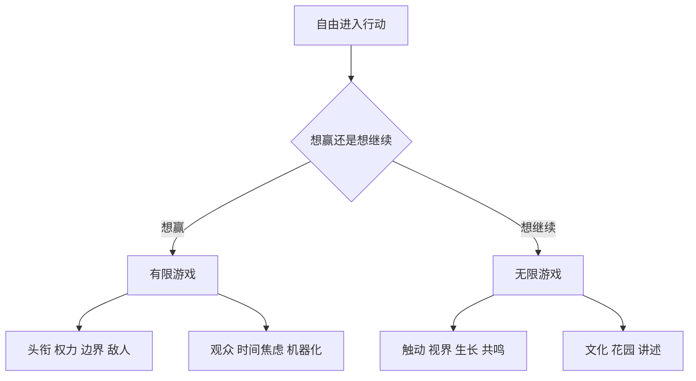

# 一页复盘：有限与无限的游戏

## 一句话总纲

有限游戏追求赢并结束，无限游戏追求继续并打开未来。

## 全书最值得记住的 7 组对照

| 有限游戏 | 无限游戏 |
|---|---|
| 赢一次 | 继续一起玩 |
| 固定边界 | 与边界本身周旋 |
| 规则不变 | 为了继续而改规则 |
| 头衔、权力、可见性 | 名字、力量、具体关系 |
| 防惊奇 | 迎惊奇 |
| 角色吞掉自我 | 自我借角色行动 |
| 控制、机器、意识形态 | 花园、讲述、神话共鸣 |

## 7 个最好用的判断句

1. 一件事如果主要目标是分出谁赢，它大概率是有限游戏。
2. 一套规则如果不能因“继续”而调整，它会越来越像封闭赛局。
3. 当人离不开头衔才能确认自己时，角色已经开始吞掉自我。
4. 观众越重要，焦虑往往越重，因为人开始向评价而不是向现实行动。
5. 一个系统越只追求控制和效率，越容易把人和自然都做成机器附件。
6. 活着的文化会让传统继续变化；死掉的文化只要求重复。
7. 真正重要的故事不会只给你答案，它会逼你重新讲述自己。

## 三个高频误解

| 误解 | 更接近原书的意思 |
|---|---|
| 无限游戏就是随便玩 | 不是，它很投入，只是不把赢当终点 |
| 有限游戏不好 | 不是，有限游戏必要；问题是把它绝对化 |
| 无限游戏没有规则 | 不是，它有规则，只是规则服务于继续 |

## 直接可用的诊断问题

1. 如果没人知道，我还会这样做吗？
2. 这件事完成后，关系还能继续吗？
3. 我是在解决问题，还是在向观众证明自己？
4. 这个系统是在养花园，还是在造机器？
5. 这个故事是在激发新声音，还是在要求所有人闭嘴？

## 一个总图

## 最后一句话

当你觉得人生越来越像一场必须证明自己的比赛时，最该做的不是更拼命，而是先问：我能不能把它重新变回一个还能继续的游戏？
