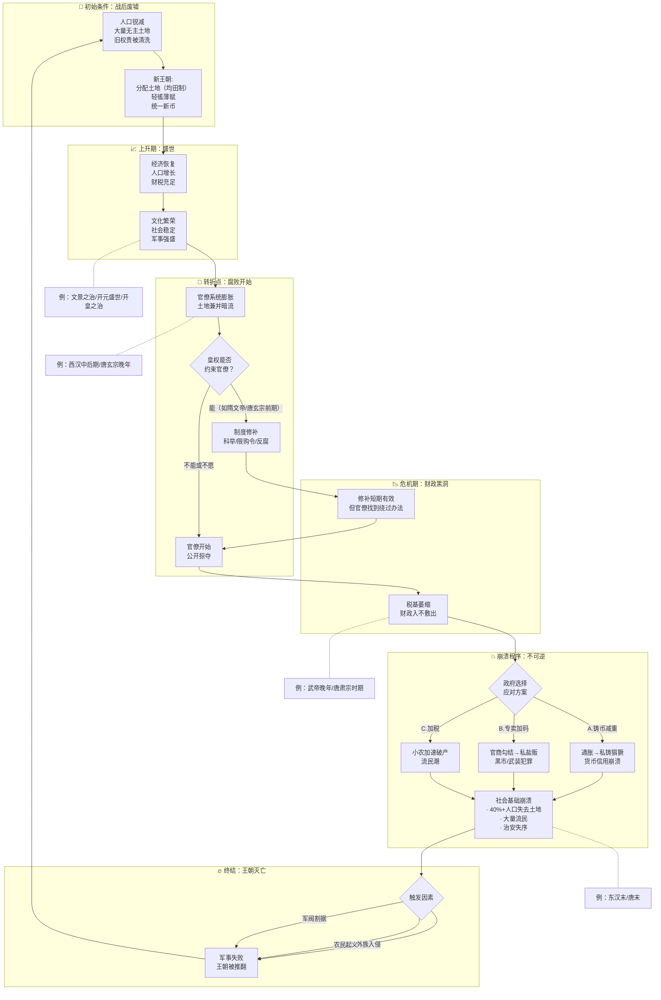
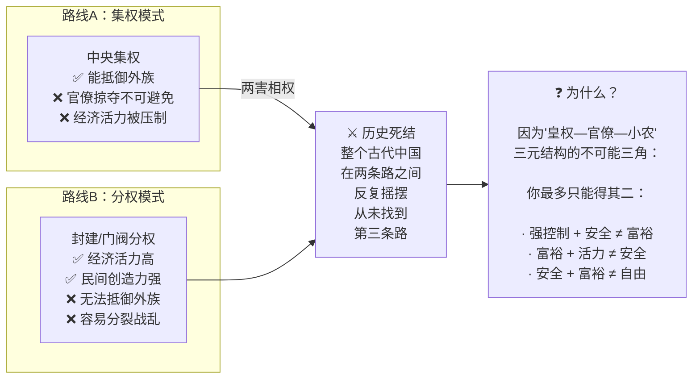

# 三千年的循环：一张图说完全书

> 下方是全书论证核心的终极抽象。看完这张图，你可以在三分钟内向下一个人解释中国王朝更替的金融逻辑。

---

## 全景因果回路图

## 两条路线的死结

## 全书的终极问题

看完中国三千年的金融史，作者留下了一个没有回答的问题（也是留给宋代的书接下文）：

> **有没有一种制度，能同时实现"强而不掠夺、活而不失控、富而不不均"？**

宋代给出的答案是：**放弃均田制，拥抱市场经济**。这是另一个故事了，也是本书没有讲完的部分。

---

*"中国是部金融史"的全部分析，归根结底只有一句话：*

**权力不受约束的地方，金融就是掠夺的工具；权力受约束的地方，金融才是经济发展的血液。**
