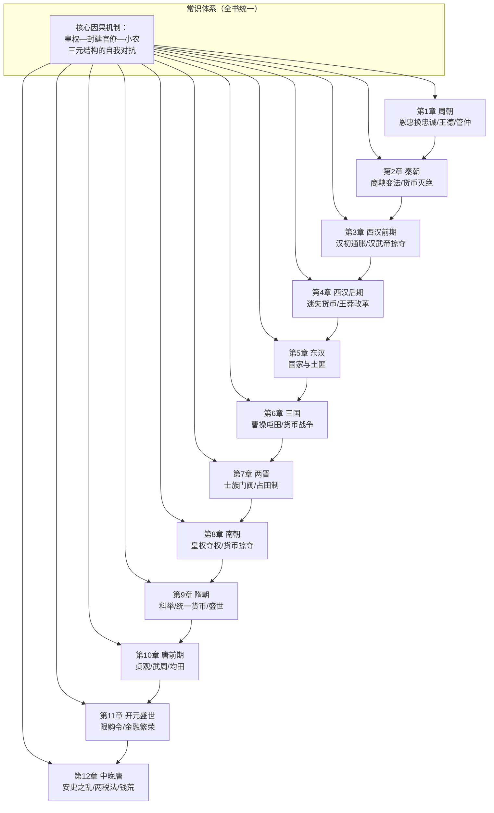
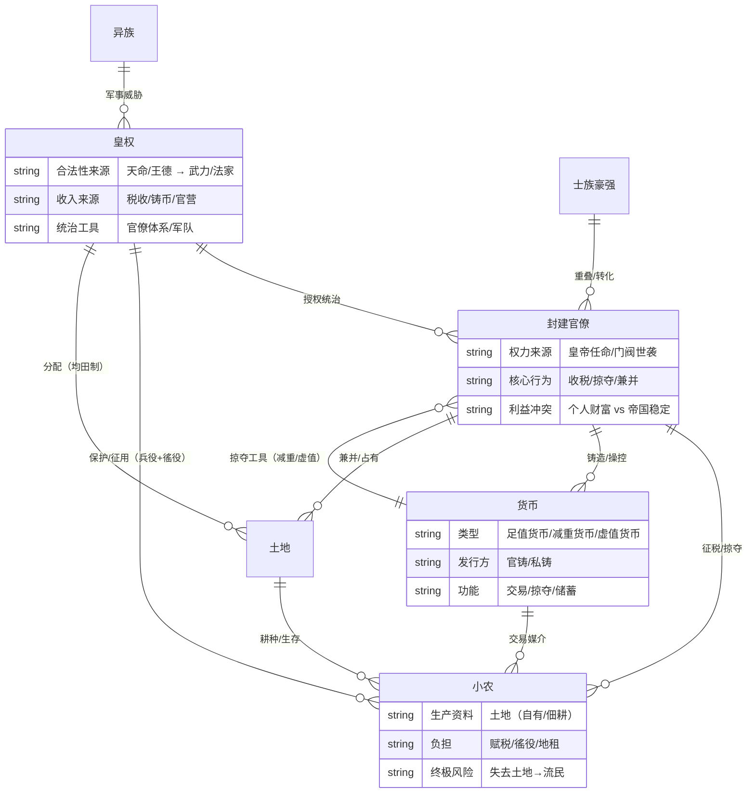
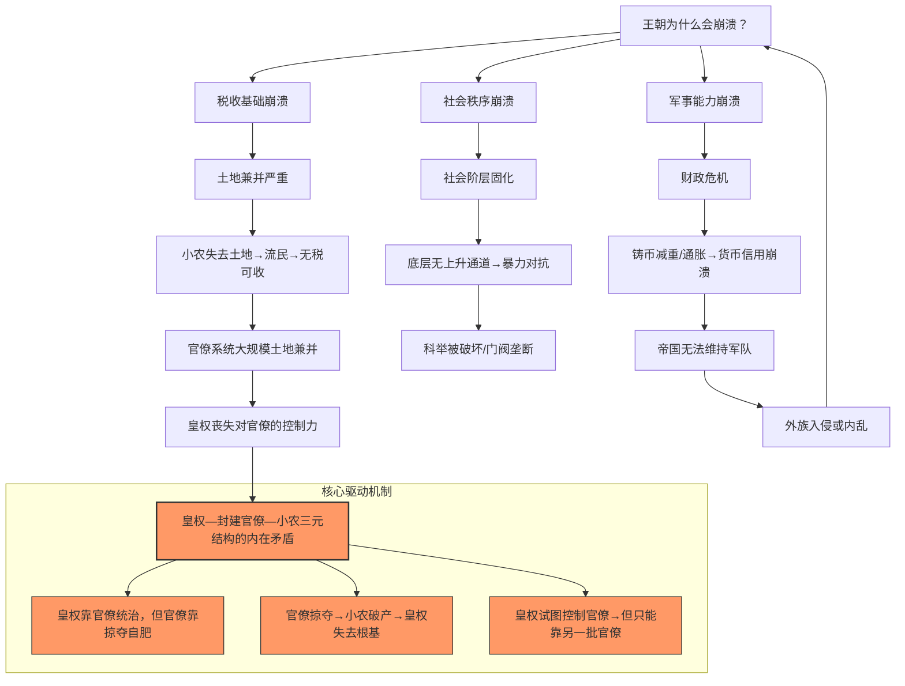
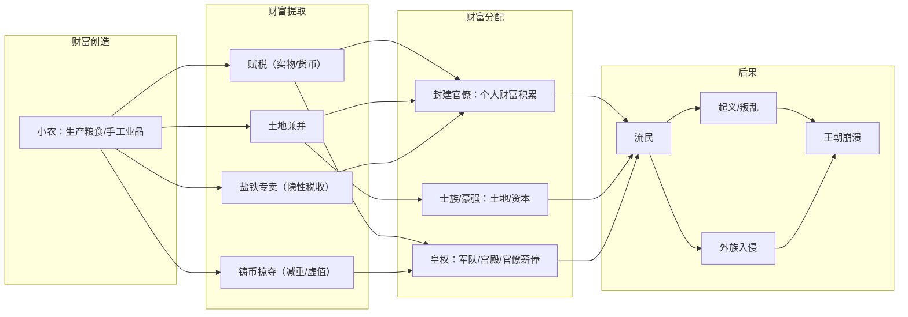
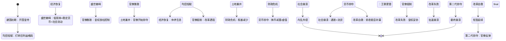
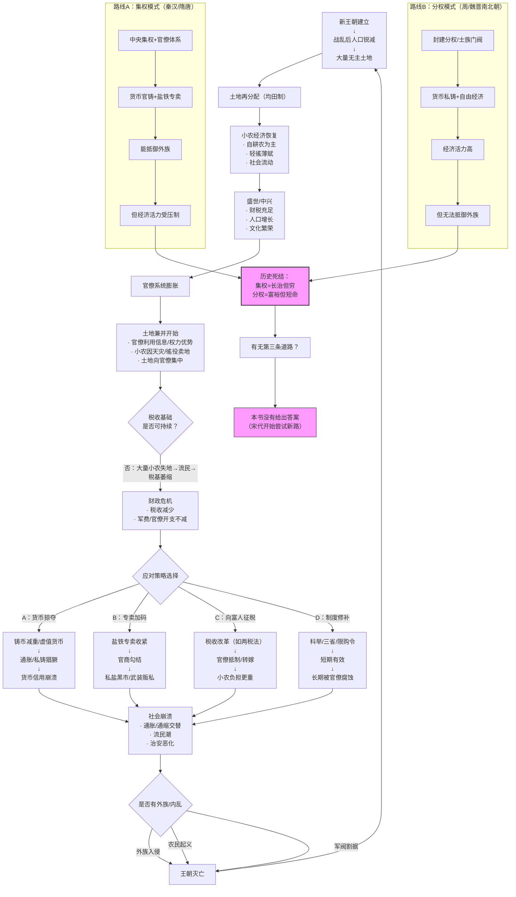
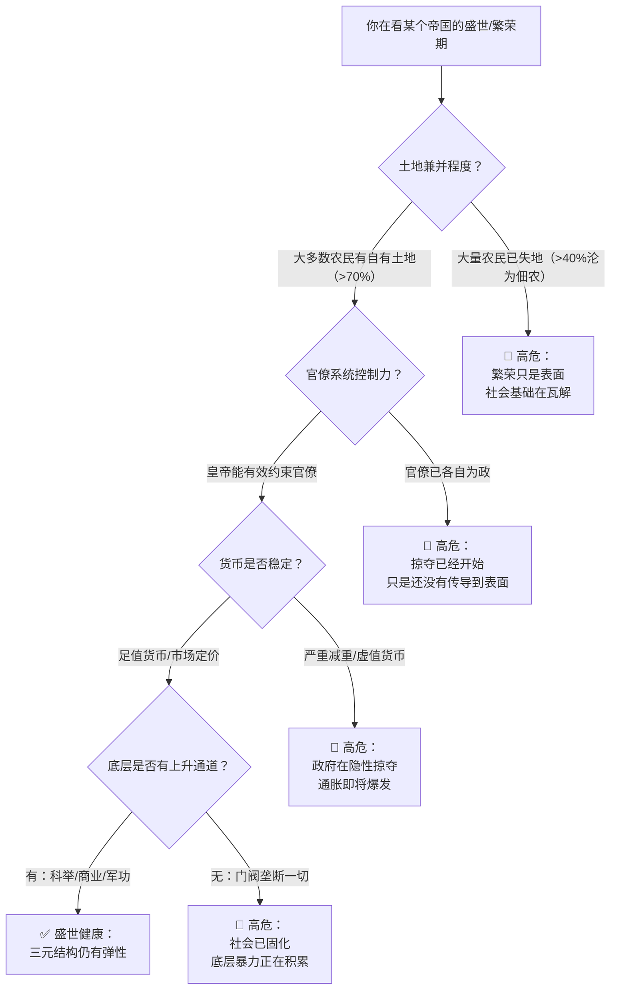
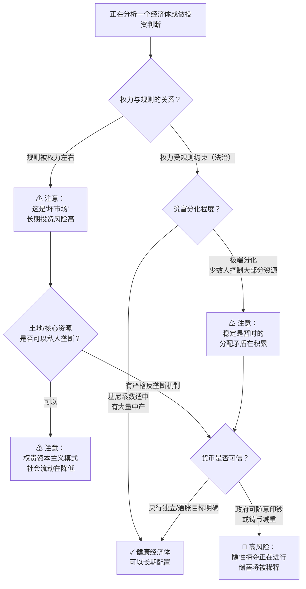

# 《中国是部金融史——透过金融读懂中国三千年》完整分析

> 书是原料，你是工厂。产出不是总结，是下次遇到这个情境时能自动触发的判断。

---

## Pre-Step：章节分组扫描

### 章节依赖图

### 推荐分组

**全书统一建模，不分批。**

原因：每一章都是一个**因果系统层级**中的同一种子结构的不同实例。每章描述的朝代虽然不同，但都受同一套底层机制驱动——"皇权—封建官僚—小农"三元结构的自我对抗。拆开任何一章，这个因果系统的根因链都不完整：

- 第1章（周）建立了底层范式：**王德/诚信 vs 利权**
- 第2-5章（秦-西汉-东汉）展示三元结构初次形成到崩坏的完整流程
- 第6-8章（三国-两晋-南朝）展示分权替代方案及其代价
- 第9章（隋）展示"科举+制度制衡"的修补尝试
- 第10-12章（唐）展示三元结构再次完整演绎

**全书回答的核心问题**：为什么中国三千年的王朝循环中，"盛世—乱世"交替不可避免？货币/金融系统在其中扮演了什么角色？

### 三种典型关系覆盖

| 关系 | 覆盖章节 | 处理 |
|------|---------|------|
| 前提→工具 | 第1章建立分析范式（王德/诚信），后续各章是具体工具（铸币、盐铁、均田）的演绎 | 合并 |
| 论点→证据 | 核心论点："皇权只能依靠官僚统治，官僚必然掠夺，掠夺导致崩溃"——每一章都是证据 | 合并 |
| **因果系统层级** | 各章共同构成同一因果系统的不同机制层（结构层/行为层/后果层） | **全书统一建模** |

---

## 读前诊断

### ① 这是什么类型的书？

**叙事书**（历史叙事），但带有强烈的论证书特征。

- 叙事骨架：按朝代顺序讲述中国三千年的金融/货币史
- 论证内核：每个朝代案例都在验证同一个核心因果假说
- 修辞策略：大量解构传统史书的"官方叙事"（如烽火戏诸侯、商鞅重农抑商），代之以金融视角的因果解释

### ② 我想从这段内容里提取什么？

**一个因果解释**——为什么中国王朝逃不出"盛世→官僚膨胀→掠夺加剧→崩溃"的循环？

**附带的判断标准**——在什么条件下一个帝国的金融系统会走向良性 vs 恶性？

---

## Step 0：骨架提取

### 核心实体关系图（ER图）

### 核心因果图（Why-Why树）

### 价值流图（钱/权力的流动）

### 帝王周期状态机

### 完成标志

看着上述四张图，对全书核心逻辑有60%以上的直觉理解。

---

## Step 1：概念速览

- **皇权—封建官僚—小农三元结构**：本书的核心分析框架。皇权通过封建官僚统治小农，但封建官僚自身的利益最大化行为会侵蚀小农的生存基础→导致帝国崩溃。这个结构自身存在无法解决的矛盾。
  → **进Step 2**（边界：三元结构并非中国独有，但本书认为中国的版本因"官僚与土地兼并的直接挂钩"而特别致命）

- **王德**：西周时期统治者对天命的敬畏和道德自律，是当时最重要的统治工具。"王德"之下，统治者相信天命会抛弃失德之君，这种信仰构成了对权力的软约束。
  → **进Step 2**（边界：王德在什么条件下会失效？与后世"皇帝轮流做"逻辑的根本区别）

- **恩惠换忠诚**：西周封建制的核心交易——王室给诸侯土地和封号，换取军事支持和政治忠诚。经济学家称之为"不完全合同"问题：恩惠的边际效用递减。

- **管仲之谋**：管仲的三大策略——①妥协贵族换取改革空间；②盐铁专卖（"官山海"）隐蔽征税；③货币战争（"衡山之谋"）瓦解敌国经济。核心智慧："王者藏于民"（强国的钱在老百姓手里，弱国的钱在国王箱子里）。

- **商鞅变法（邪派武功）**：以"弱民强国"为核心理念，通过户籍制、重罚、禁绝文化、军功授田将全体国民绑上战车。禁绝货币流通以集中所有财富到国君手中。代价：价值观真空、经济畸变、秦亡根源。
  → **进Step 2**（边界："重农抑商"的真实含义——不是重视农业，是重视管理农民）

- **铸币减重**：官方降低货币的金属含量，但保持面值不变，相当于隐性征税。从西汉的荚钱到唐代的乾元重宝，这是历代王朝财政危机时的标准操作。
  → **进Step 2**（边界：减重到什么程度会彻底摧毁货币信用？私铸如何与之互动？）

- **盐铁专卖（官山海）**：国家垄断盐铁等必需品的流通，以高于市场价的价格出售，相当于隐形税收。管仲首创，桑弘羊/第五琦完善。优势：隐蔽、高效。劣势：催生官商勾结和私盐黑市。
  → **进Step 2**（边界：盐铁专卖在什么条件下能从"必要税收"蜕变为"官僚掠夺工具"？关键变量）

- **均田制**：国家将土地平均分配给农户（通常百亩），以确保税收基础和军事兵源。从吕后到隋文帝到唐玄宗，历代盛世的制度基础。崩溃原因：官僚系统不断兼并土地。
  → **进Step 2**（边界：均田制需要什么前提条件？崩溃的临界点在哪里？）

- **豪强/官家豪强**：西汉出现的"商人+地主+官吏"三位一体的掠夺性集团。剪断了小农生存的最后一根游丝，是社会崩溃的直接推手。

- **货币减重 vs 虚值货币**：减重是降低重量但保持面值；虚值是面值远高于金属含量（如当十钱、当五十钱）。后者更接近于"抢劫"。

- **钱荒**：唐代中晚期的通货紧缩，由两税法只收货币、大量货币被官僚和富户窖藏引起。收缩时期，物价暴跌，小农因需贱卖粮食换钱交税而破产。
  → **进Step 2**（边界：钱荒的原因是货币总量不足还是分配极端不均？）

- **两税法**：杨炎的税收改革，以货币税替代实物税和徭役。初衷是向土地多的富人征税实现"均贫富"，但执行中沦为官僚掠夺的工具。触发了几十年的通缩。

- **好市场 vs 坏市场**：全书最后的理论升华。好市场：统一规则→稳定预期→低隐性成本→陌生人间可交易。坏市场：强势群体可无视规则→交易中被剥夺→市场缺乏效率。中国封建社会的市场在很大程度上是"坏市场"。

- **开元限购令**：唐玄宗颁布的史上最严厉土地买卖禁令。禁绝所有土地交易以斩断官僚兼并由头。有效期内创造了盛世，但皇权一放松就立刻失效。

- **流动即盛世**：书中隐含的判断标准——一个社会是否处于盛世，关键看底层是否有向上流动的通道。只有阶层能自由流动的社会，才配叫盛世。《李娃传》的意义就在于此。

---

## Step 2：实例裁判循环

### Step 2 待执行清单

☐ 皇权—封建官僚—小农三元结构
☐ 王德
☐ 商鞅变法（重农抑商的真实含义）
☐ 铸币减重/虚值货币
☐ 盐铁专卖
☐ 均田制
☐ 钱荒
☐ 好市场 vs 坏市场

---

### 概念A：皇权—封建官僚—小农三元结构

**正例**：西汉初期（吕后/文帝/景帝）
- 吕后裁撤官僚、允许民间铸币、推行均田、轻徭薄赋
- 皇权主动压制官僚，让小农有喘息空间
- 结果："文景之治"，财富大增
- 判断：✅ 属于——三元结构处于平衡态，皇权强有力地压制官僚掠夺，小农得以生存

**边界例**：唐玄宗"开元限购令"时期
- 玄宗推行史上最严厉土地禁令，试图斩断官僚兼并之路
- 表面上三元结构被皇权强行稳定，但官僚不会停止寻租——他们会等到皇权衰弱时再出手
- 判断：✅ 属于——三元结构被暂时压制但未解决；这恰好是结构的边界状态：皇权最强时也只能推迟崩溃，不能消除内在矛盾
- 边界精确位置：**皇权对官僚的控制力存在"衰减曲线"——随着时间推移，官僚总能找到绕过禁令的方法。这是三元结构不可解的根源。**

**反例伪装**：西周"封君—封臣"体系（非"皇权—官僚—小农"）
- 表现：周王分封诸侯，诸侯有独立土地和军队，君臣关系基于"王德"信仰和宗法
- 看起来像是"皇权+中间层+底层"的三层结构
- 判断：❌ 不属于——西周的结构是"封君—封臣"而非"皇权—官僚—小农"
- 关键差异：西周中问层（封臣）拥有独立于王室的权力基础（自己的土地和军队），不是皇权任命的"官僚"
- 封建官僚的核心特征是**权力来源于皇帝、可以随时被罢免**，而非世袭的封臣
- **陷阱**：很多人会把"两层统治结构"都当作相同类型，但"官僚"和"封臣"有本质区别：封臣有独立权力来源，官僚完全依赖皇帝

**陷阱说明**：很多人会把一切"皇帝+官员+百姓"的社会都当作同一结构，但关键变量是**中间层的权力来源**：如果中间层的权力和财产独立于皇帝（如西周的封臣、两晋的士族），那就不是本书所说的"皇权—封建官僚—小农"。这个结构特指**秦朝以后、科举制下、官僚由皇帝任命的帝国体制**。识别这个结构的关键是问：官员能对抗皇帝吗？能，就是封建/士族体制；不能（或很难），就是官僚体制。

**边界定义（一句话）**：
> 皇权借助其可任意罢免的官僚统治小农，但官僚的自利掠夺行为必然侵蚀帝国的税基——这是一个无法通过内部调整解决的"结构性死循环"。

---

### 概念B：王德

**正例**：西周成康之治
- 四十年没有案件审理，"刑错四十余年不用"
- 周王敬畏天命，亲自耕作、亲征战场
- 诸侯信服周王不是因为恐惧，而是因为相信"周王有德"
- 判断：✅ 属于——王德在起作用，社会靠共同的信仰和道德自律维持秩序

**边界例**：周厉王的"专利"政策
- 面对外族压力和财政危机，周厉王试图收回诸侯占用的山林川泽
- 从经济角度看这是合理的财政措施，但被史书记载为"贪婪暴政"
- 判断：✅ 属于边界——这恰好是"王德"失效的临界点
- 边界精确位置：**王德在财政危机面前的不对称性——王室要维持王德就不能向诸侯强征，但不强征就无法应对危机。这个两难就是王德走向崩坏的起点。**

**反例伪装**：汉武帝的"罪己诏"
- 晚年颁布《轮台罪己诏》，承认自己穷兵黩武、过度盘剥
- 看起来很像"天子畏天命，失德则改"
- 判断：❌ 不属于——这本质上是政治止损，不是王德
- 关键差异：王德是**事前信仰**（统治者发自内心相信天命的约束力），罪己诏是**事后补救**（统治者为延续统治而做的策略性让步）
- **陷阱**：很多中国政治分析把"皇帝认错"等同于"道德约束在起作用"，但西周的"王德"和后世帝王的"罪己诏"有本质区别：前者是信仰，后者是策略

**陷阱说明**：王德很容易被浪漫化。注意：王德的有效性依赖于一个特殊条件——全社会（包括统治者自己）都真心相信"天命"的存在。一旦有人不信，这个系统就开始瓦解。周幽王"烽火戏诸侯"的传说不一定真实，但揭示了真理：**当信仰崩塌时，权力只剩赤裸裸的暴力**。

**边界定义（一句话）**：
> 王德是一种基于共同信仰的软约束——统治者因畏惧天命而自律，臣民因信仰天命而服从——一旦有人"不信了"，这个系统就不可逆地崩坏。

---

### 概念C：商鞅变法（重农抑商的真实含义）

**正例**：秦国的军功授田制
- 砍一颗人头换五十亩土地
- 全体国民被绑定在"耕战"单一目标上
- 禁绝一切文化、商业、思想自由
- 判断：✅ 属于——这就是商鞅变法的本质：以极端的激励+惩罚将社会简化为战争机器

**边界例**：当代某些极端的"唯GDP论"政绩考核
- 官员晋升完全看经济增长数字，其他指标（环境、公平、生活质量）都被无视
- 判断：✅ 属于边界——同样是用单一指标绑架整个社会，同样会产生"数据注水+手段异化"的后果
- 边界精确位置：**当一种考核机制让所有人"除了追求这个指标别无选择"时，它就是商鞅模式的现代版本。区别在于暴力程度。**

**反例伪装**：后世史书记载的"商鞅重农"
- 《汉书》等史书把商鞅描绘成"授田百亩、重视农业"的贤臣
- 判断：❌ 不属于——这是后世史家的理想化建构，并非史实
- 真实情况：商鞅的"重农"本质是**管理农民**，不是**重视农业**；他的"授田"是以军功为前提，绝大部分农民拿不到土地
- **陷阱**：后世很多人引用商鞅的"重农抑商"来论证农业的重要性，但商鞅的"重农"和现代意义的"重视农业"根本不是一回事。商鞅要的不是农业发展，是**把人固定在土地上便于控制**。

**陷阱说明**：商鞅模式有一个致命的认知陷阱——它短期有效（秦国因此强大），但长期代价深埋。它制造了一个"价值观真空"：当所有人只认利益不认道德时，这个社会除了暴力没有其他协调机制。秦朝速亡的根因不在二世，而在商鞅种下的这颗种子。

**边界定义（一句话）**：
> 商鞅变法=以人性中最原始的贪欲（军功授田）和恐惧（连坐重罚）为驱动，将社会简化为单一目标的战争机器，代价是摧毁一切道德、文化和自由——它在短期可以极端有效，但长期必然自我毁灭。

---

### 概念D：铸币减重/虚值货币

**正例**：唐肃宗乾元重宝（当十钱）/重轮乾元重宝（当五十钱）
- 重量与开元通宝相似，但分别当十枚、五十枚使用
- 政府用虚值货币支付军饷，短期内获得购买力
- 结果：物价飞涨，私铸猖獗，"一绢直万钱"
- 判断：✅ 属于——典型的铸币减重/虚值货币掠夺

**边界例**：隋五铢（2.42克）
- 隋文帝让各县自行议定铸币标准，结果全部选择了2.42克
- 这个重量既不是官方规定的五铢（约3.5克），也不是私铸的鹅眼钱（约1克以下）
- 判断：✅ 属于边界——这是货币政策的一个"神奇点"：不是足值也不是虚值，而是市场博弈出来的最优值
- 边界精确位置：**当铸币权分散且各利益方存在竞争时，市场会自发找到均衡点。隋五铢的2.42克就是这个均衡——它既足够轻以节省铜材，又足够重以维持信用。这是"看不见的手"在货币政策上的体现。**

**反例伪装**：王莽的货币改革
- 王莽铸造了一系列精美但面值奇葩的货币（如"一刀平五千"）
- 形状上看起来是"货币改革"
- 判断：❌ 不属于标准的"铸币减重/虚值"
- 关键差异：王莽的目的不是掠夺财富，而是**试图通过货币改革打击豪强、实现理想**。虽然效果也是掠夺（而且更狠），但动机结构不同
- **陷阱**：凡是政府发行大面值货币都叫"敛财"，但王莽是个罕见的例外——他真的相信自己那一套复古的理想主义货币理论，他的改革动机是"天下大同"而非个人敛财。动机不影响结果（民众同样被掠夺），但影响政策退出的可能性。

**陷阱说明**："铸币减重"和"虚值货币"容易被混为一谈，但两者有微妙区别：
- 减重：在面值不变的情况下降低重量（如从3.5克降到2克）——更隐蔽
- 虚值：面值远超金属含量（如当五十钱）——更赤裸裸
- 历史上往往先减重，减重不够用了就搞虚值

**边界定义（一句话）**：
> 铸币减重/虚值货币=政府利用铸币垄断权隐性征税——当财政危机时，最方便的操作就是让钱"变轻"或"变大"，代价是摧毁货币信用、引发恶性通胀。

---

### 概念E：盐铁专卖

**正例**：管仲的"官山海"
- 齐国垄断盐铁销售，生产仍交给私商
- 每斤盐加价一钱等于全国人头税翻倍
- 民众感受不到直接征税的痛苦，政府获得巨额收入
- 齐国以此称霸
- 判断：✅ 属于——教科书式的盐铁专卖，隐蔽高效

**边界例**：刘晏的盐政改革
- 保留了盐铁专卖的批发环节（官府定价），但放开了运输和零售
- 裁撤盐政衙门，把就业机会让给商人
- 结果：税收从40万缗暴涨到1200万缗
- 判断：✅ 属于边界——是盐铁专卖的"优化版本"
- 边界精确位置：**盐铁专卖可以有不同的"深度"——从管仲的"只控销售"到第五琦的"全链条控制"到刘晏的"只控批发"。刘晏版本是效率最高的，因为它保留了市场激励的同时顾及了政府收入。**

**反例伪装**：桑弘羊的盐铁专卖（汉武帝时期）
- 看起来和管仲的做法相似
- 判断：❌ 不属于同一类——虽然都是盐铁专卖，但制度环境完全不同
- 关键差异：
  - 管仲专卖的背景是齐国在竞争性市场中需要公平税收
  - 桑弘羊的背景是汉武帝穷兵黩武后国库空虚，专卖不是为了"好的税收"，而是为了"弥补战争亏空"
  - 制度环境决定制度性质。同样一把刀，外科医生用是手术刀，杀人犯用就是凶器。
- **陷阱**：很多经济史把"盐铁专卖"当作一个中性概念讨论，但它在不同环境下性质完全不同。关键变量是：**专卖的收入被用在哪里？用于公共品还是用于战争/挥霍？**

**陷阱说明**：盐铁专卖最有欺骗性的一点是它的"隐蔽性"——因为不是直接征税，民众感觉不到被掠夺。但正因为隐蔽，它缺少约束机制。一旦官僚系统发现这是一条"无限提取"的路径，盐铁价格会不断攀升，最终压迫到民众的基本生存。

**边界定义（一句话）**：
> 盐铁专卖=政府通过垄断必需品流通来隐蔽征税；它在经济上高效但在政治上危险——因为"隐蔽"意味着"缺少监督"，必然导致官僚无限加码。

---

### 概念F：均田制

**正例**：隋文帝的"输籍法"
- 每丁授田百亩，全国纳税户从410万增至890万
- 配合科举制+三省制衡+官员严惩，实现了"耕者有其田"
- 隋朝富庶到"天下储积得供五六十年"
- 判断：✅ 属于——均田制的理想状态

**边界例**：曹操的屯田制
- 将流民组织起来在国有土地上耕种，政府提供种子和耕牛
- 收成五五分成或四六分成
- 判断：✅ 属于边界——是均田制的"变形版本"
- 边界精确位置：**屯田是"军屯+民屯"的混合体，农民没有土地所有权但有使用权，政府拿大头。这在战争年代极为有效（曹操以此打败所有对手），但和平年代就成了剥削工具。**

**反例伪装**：王安石的"方田均税法"（此书未涉及，以读者知识补充）
- 看起来也是"均田"
- 判断：❌ 不属于——这是**清丈土地以公平收税**，不是**分配土地给农民**
- 关键差异：均田制的核心是"授田"（把土地分给农民），方田均税的核心是"丈量"（查清谁有多少地以便收税）
- **陷阱**：同样有"均"字，但一个是分蛋糕、一个是查蛋糕。分蛋糕需要国家有大量国有土地储备，查蛋糕只需要国家有官僚执行力。两者是一个先后的关系——先均分，后清丈。

**陷阱说明**：均田制有个关键前提经常被忽略——**国有土地储备**。只有在经历大战乱后（人口锐减、大量土地无主），国家才有足够的土地可以分配。这就是为什么每个朝代初期都能"均田"，中后期都"无法均田"——不是皇帝不想，是土地已经被官僚占完了。

**边界定义（一句话）**：
> 均田制=国家利用战乱后的大量无主土地进行再分配，以重建小农经济和税收基础；它只能在王朝初期有效执行，一旦土地被官僚系统蚕食完毕，制度就名存实亡。

---

### 概念G：钱荒

**正例**：中晚唐贞元年间的通缩
- 两税法只收货币，导致流通中货币大幅减少
- 物价暴跌：绢从4000文跌到800文，粮从200文跌到20文
- 小农需要卖更多的粮食才能凑够税款
- 判断：✅ 属于——经典的钱荒/通缩

**边界例**：南朝萧齐年间的通缩
- 萧齐年间也出现了类似的通货紧缩
- 判断：✅ 属于边界——同样的现象，但起因不同
- 边界精确位置：**钱荒有两种成因——①币制原因（政府回收货币/两税法只收货币）；②窖藏原因（富人大量囤积货币）。唐代两税法触发的钱荒主要是前者，萧齐的通缩主要是后者。识别类型决定了应对方案不同。**

**反例伪装**：物价下跌+经济繁荣并存（如宋代的"钱荒"）
- 宋代也长期存在"钱荒"问题，但经济持续增长
- 判断：❌ 不属于真正意义上的"钱荒危机"
- 关键差异：唐代钱荒伴随的是社会崩溃和流民暴增；宋代钱荒伴随的是经济扩张和金融创新（交子）。同样"缺钱"，一个是因为经济衰退，一个是因为经济扩张（货币需求增长超过了供给）。
- **陷阱**："钱荒"这个词本身带有价值判断，但货币紧缩既可以由灾难性原因引起（如两税法），也可以由良性原因引起（如经济增长带来的货币需求增加）。看到物价下跌不能直接判定"通货紧缩危机"。

**陷阱说明**：钱荒中最反直觉的一个现象是——**货币总量可能并不少，但分配极度不均**。唐代钱荒的真相不是国家没有铸币，而是少数富户和官僚窖藏了天量铜钱，市场上流通的货币严重不足。所以"钱荒"往往是"贫富分化"的货币表现。

**边界定义（一句话）**：
> 钱荒=流通中货币不足引发的物价持续下跌和交易萎缩；它可能由政策失误（货币税）、分配不均（窖藏）或经济扩张（需求增长）引起——识别成因后才能判断它是病理性的还是生理性的。

---

### 概念H：好市场 vs 坏市场

**正例**：英国光荣革命后的金融市场
- 王室退出商业领域，信用建立
- 投资者愿意购买国债
- 英法战争中英国能比法国筹集更多军费
- 判断：✅ 属于——好市场的典型案例：统一规则、可信承诺、低隐性成本

**边界例**：开元盛世时期的金融市场（柜坊/便换/飞钱）
- 唐朝有了当铺、存款机构（柜坊）、汇兑（飞钱）
- 商人可以在全国各地进行贸易
- 判断：✅ 属于边界——接近好市场但不是
- 边界精确位置：**唐朝金融市场在技术层面已经相当发达（汇兑、存贷款），但制度层面缺少"可信承诺"——皇帝和官僚随时可以反悔（如宫市、五坊小儿）。制度是好的，但执行者可以随时破坏规则。**

**反例伪装**：当代某些"关系型市场"
- 表面上有完善的交易规则和法律体系
- 实际运作全靠"关系"——认识人就能拿到订单，不认识人再好的产品也没用
- 判断：❌ 不属于好市场
- 关键差异：好市场的标志是" impersonal transaction"——**交易双方不需要认识对方**，因为规则保障了执行。坏市场里每一次交易都需要关系、信任背书、熟人介绍，隐性成本极高。
- **陷阱**：很多国家有"看上去很好"的法律和监管体系，但实际运作中没人真的遵守。判断好市场/坏市场不是看纸面上的制度，而是看**不靠关系能不能做成交易**。

**陷阱说明**："好市场"和"坏市场"的区分是本书全书论证的理论升华。作者想说的是：中国封建社会在市场技术层面（交易工具、金融创新）并不落后，但在制度层面始终缺少"可信承诺"——因为最大的规则破坏者（皇帝/官僚）同时也掌握着对规则的最终解释权。只要权力可以凌驾于规则之上，市场就永远是好不了的。

**边界定义（一句话）**：
> 好市场=规则统一、承诺可信、陌生人可交易；坏市场=强势群体可无视规则、交易靠关系、隐性成本高——区分的关键不是技术而是**权力是否受规则约束**。

---

### Step 2 完成确认

☑ 皇权—封建官僚—小农三元结构
☑ 王德
☑ 商鞅变法（重农抑商的真实含义）
☑ 铸币减重/虚值货币
☑ 盐铁专卖
☑ 均田制
☑ 钱荒
☑ 好市场 vs 坏市场

---

## Step 3：结构可视化

### 核心逻辑图：三千年金融史的因果模型

### 全周期变量关系表

| 阶段 | 皇权强度 | 官僚掠夺度 | 小农土地 | 货币信用 | 经济活力 |
|------|---------|-----------|---------|---------|---------|
| 建国初期 | 强 | 低 | 有（均田） | 高（新币） | 恢复中 |
| 盛世 | 强→中 | 中 | 有但减少 | 高→中 | 繁荣 |
| 中后期 | 中→弱 | 高 | 严重流失 | 低（减重） | 停滞 |
| 崩溃前 | 弱 | 极高 | 几乎无 | 崩溃 | 瓦解 |
| **分权模式** | **弱** | **低** | **有** | **市场决定** | **高** |

### 差异列表

**【原文有、图里没有】**
1. **具体人物的细节**：管仲与齐桓公的对话细节、商鞅三见秦孝公、安禄山的个人特征等大量叙事细节——对因果模型不是必需的
2. **特定货币形制**：蚁鼻钱、刀币、布币、五铢等具体货币的考古描述——专项知识，不进入核心模型
3. **部分帝王个人品德描写**：隋文帝的简朴生活、唐玄宗的晚年昏聩等——个体因素不是结构因素
4. **鲁迅/韦伯等引用**：作为论据点缀，不影响核心论证

**【图里有、原文没明说的推论】**
1. **"好市场/坏市场"框架是全书论证的理论总结**——原文在最后两页才明确提出，但这是全书案例的隐含结论
2. **"集权=安全但穷，分权=富但短命"的死结**——原文散布在不同章节，但未明确提炼为一条概括性陈述
3. **三元结构的不可能三角**：皇权想要同时实现"强控制"+"经济繁荣"+"长治久安"，但三者最多得其二——这个推论是我从书中各章案例中归纳的
4. **"货币是权力斗争的隐秘战场"**——原文更多聚焦制度，但我认为"货币"的角色在全书中是"权力意志通过经济手段的表达"，不仅是交易媒介，更是掠夺工具、战争武器和信仰载体

---

## Step 4：可执行模型

### 核心机制（一句话）

> **中国三千年的王朝循环，根因不在"昏君"或"奸臣"，而在"皇权—封建官僚—小农"三元结构的结构性矛盾：皇权只能通过官僚统治，但官僚的自利行为必然侵蚀小农的生存基础，小农的破产又必然摧毁皇权的税收根基——这是一个所有王朝都无法逃脱的自我毁灭程序。**

### 诊断方向：遇到一个"盛世"，如何判断它会不会崩溃？

### 预防方向：正在做经济政策/投资判断时，如何避免踩坑

### 失效边界

1. **当核心变量不是"三元结构"时**——如外族征服王朝（元/清），统治结构不同，模型不适用
2. **当经济形态发生根本变化**（如工业化/全球化）——土地不再是核心生产要素，货币形态从金属变为法币，部分机制失效
3. **当制度约束强到可以改变"官僚行为函数"时**——如现代法治社会的公务员制度，权力受多方制衡，三元结构的逻辑不完全适用
4. **本书只分析到唐代**——宋代以后纸币出现、海外贸易兴起，需要新的分析工具

---

## Step 5：接入已有体系

### 【同构】与"科斯定理的产权经济学"同构

**结构对应**：
- 科斯定理：当交易成本为零时，初始产权分配不影响最终效率；当交易成本为正时，产权安排决定效率
- 本书结构：当权力完全不受约束时，任何制度设计（均田、铸币、专卖）都会被扭曲；当权力受到有效制衡时，同样的制度可以产生完全不同的结果

**正向迁移**（用科斯的逻辑推出新结论）：
> 用"交易成本"视角看中国王朝史：在皇权—官僚—小农三元结构中，小农与市场的交易成本极高（被各种关卡、税费、强制交易切断），这是经济无法持续繁荣的制度根因。降低交易成本的关键不是修路造桥（唐代基础设施已经很好），而是**约束权力、保护产权**——但在皇权体制下，这不可能。

**反向迁移**（用本书的逻辑看科斯）：
> 科斯定理隐含了一个前提：产权界定者和保护者（国家）本身不会侵犯产权。如果"界定产权的国家"同时也是"最大的侵权者"（三元结构下的皇权），那么科斯定理的"产权安排→效率结果"这条链条就断裂了。在"坏市场"环境下，产权保护从来不是制度保障，而是"皇帝今天心情好"。

### 【互补】填补了"宏观权力分析"和"微观经济史"之间的空缺

我已有的认知体系里有一些关于王朝循环、权力制衡的框架，但缺少一个连接"金融/货币机制"和"政治结构"的中层理论。

本书填补的空缺是：**它不仅说"皇帝和官僚有矛盾"，而且说清楚了这个矛盾通过什么具体机制（铸币、土地兼并、专卖、钱荒）转化为王朝周期的驱动力。**

### 【矛盾】与"技术决定论"（生产力决定生产关系）存在张力

**矛盾点**：传统马克思主义史学认为"生产力决定生产关系"，社会形态的演进由技术进步驱动。但本书展示的逻辑是——**权力结构决定经济绩效**，而非反过来。

例如：唐代的金融技术（飞钱、柜坊）在技术层面已经相当先进，但因为权力可以随时破坏规则，这些先进技术无法改变"坏市场"的本质。隋朝的农业技术并不比前代先进太多，但因为隋文帝约束了官僚，经济就爆发性增长。

**条件差异**：
- 技术决定论在"长时段/大尺度"上可能是对的（青铜→铁器→蒸汽机确实改变了社会形态）
- 但在"中时段/王朝周期"的尺度上，权力结构和制度安排对经济表现的影响远大于技术水平

**解决**：两个框架适用于不同时间尺度，不矛盾，互补。

### 【矛盾】与"英雄史观"的直接冲突

几乎所有关于中国历史的流行读物都在讲帝王将相的"个人功过"——汉武帝伟大、王莽愚蠢、唐玄宗早年英明晚年昏聩。但本书的逻辑是：**换一个人，只要三元结构不变，结果不会有本质差异。**

王莽的例子最有说服力：他是一个真心想"天下大同"的理想主义者，每天工作到深夜。但他的改革结果比最贪婪的皇帝还要灾难性——因为他想对抗结构性力量，却缺少对抗的工具。

**这个矛盾的启示**：看一个系统的问题时，先问"结构允许什么"，不要问"这个人好不好"。

---

## 建模完成自检

- [x] 不看原文，只看图（Step 0的ER图 + Step 3的因果模型图），能复原核心逻辑
- [x] 给一个新情境（一个"盛世"或一个经济体），能用Step 4的flowchart得出结论
- [x] Step 2执行清单已全部打勾，无跳过（8/8全部完成）
- [x] Step 3的差异列表已输出
- [x] Step 4的flowchart入口是具体工作场景（"你在看某个帝国的盛世" / "正在做经济政策或投资判断"）
- [x] Step 5的同构分析包含了反向迁移
- [x] 输出章节结构符合固定列表，没有自行添加章节

---

## 一句话总结

> **看到一个"盛世"或"繁荣期"，不要只看GDP增速和基建水平——先去查它的"分配率"：土地在谁手里？税收谁在承担？底层还有没有上升通道？中国三千年的经验是：分配结构恶化的繁荣都是纸老虎，一旦外部条件变化（外敌/天灾/市场波动），底层积压的张力会让繁荣比纸还脆弱。**

**触发信号**：当你看到某个经济体"数据很好看但普通人感觉日子越来越难"时——不管它是汉唐还是现代——这句话应该让你想起："我读过中国三千年的金融史，这个模式我没见过"。

---

*分析完成。核心哲学：书是原料，你是工厂。理解=行为能力，不是语言能力。*
