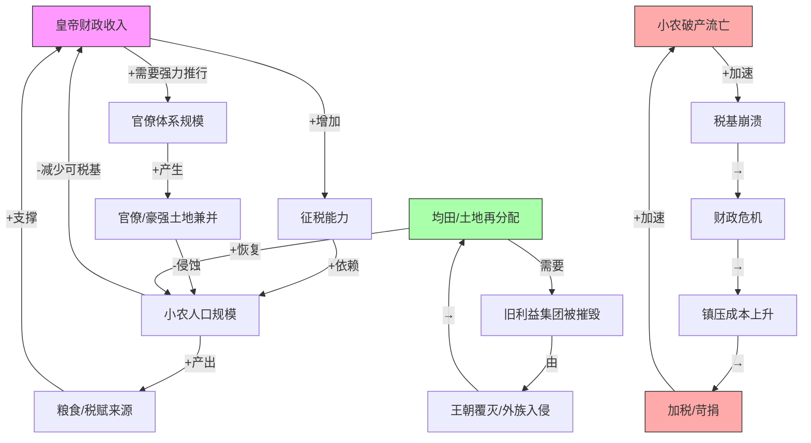
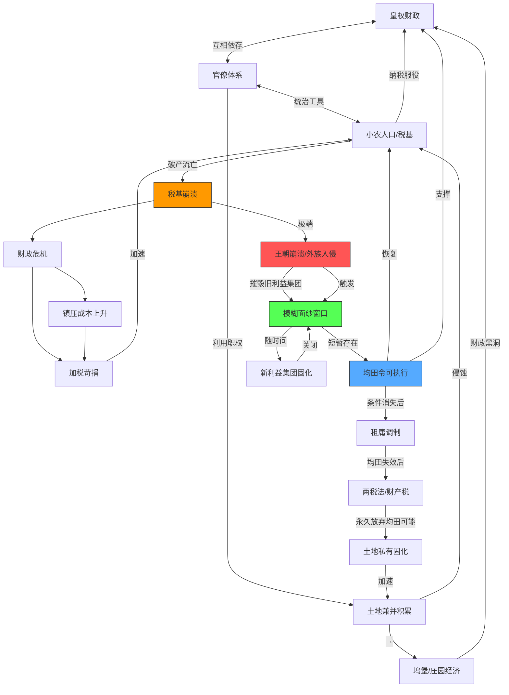
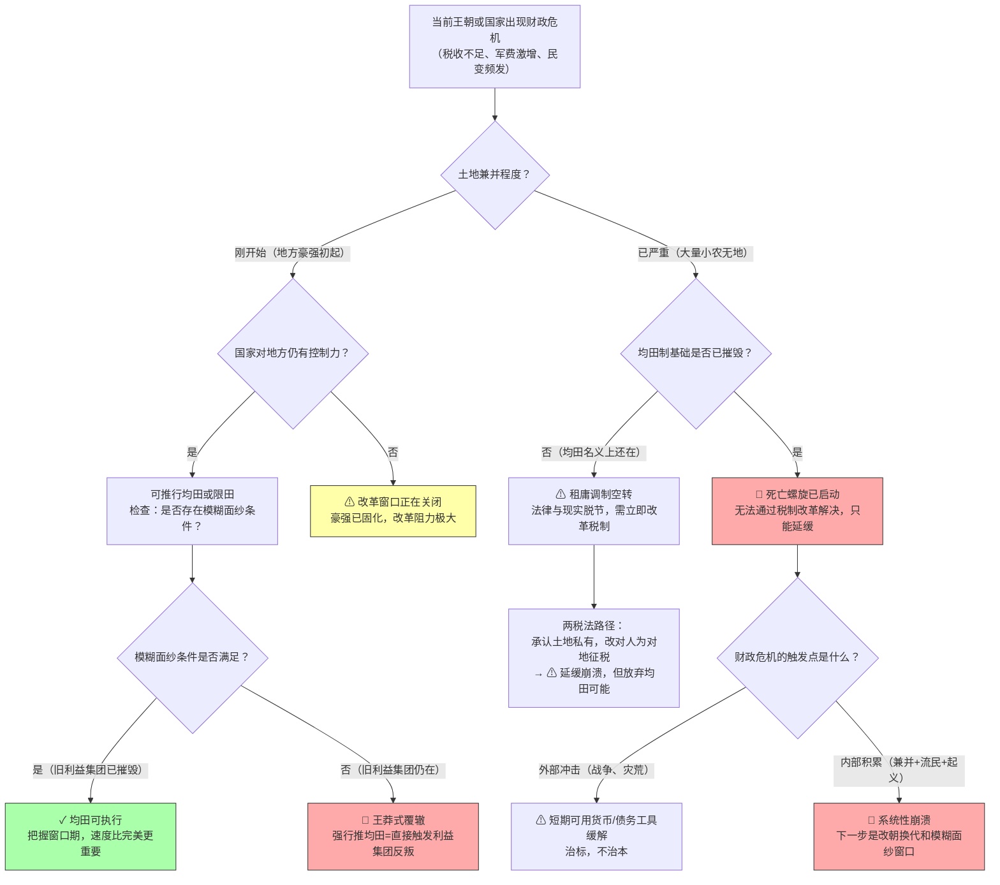

# 《中国是部金融史》建模分析
> 基于 shen_reading_v3.4 引擎 · 沈老师视角
> 书是原料，你是工厂。产出不是总结，是下次遇到这个情境时能自动触发的判断。

---

## Pre-Step：章节分组扫描

**书目**：《中国是部金融史——透过金融读懂中国三千年》陈雨露、杨忠恕著

**章节结构**：
- 第一章：贝壳上的周朝（周代货币与封建体制）
- 第二章：春秋战国的货币战争（各国货币竞争）
- 第三章：秦始皇的统一货币（法家改革）
- 第四章：汉代的三层结构（皇权—官僚—小农体系建立）
- 第五章：东汉的坞堡经济（豪强土地兼并）
- 第六至八章：三国两晋南北朝（分裂期经济）
- 第九章：隋唐的均田制
- 第十至十二章：唐代兴衰与两税法

**关系类型判断**：

所有章节共同构成同一个因果系统的不同层级——
- 机制层：皇权—官僚—小农三角结构的运行规律
- 行为层：历朝历代的土地、货币、税制政策
- 后果层：王朝兴衰、经济崩溃、改朝换代

→ **判定：因果系统层级。全书统一建模，不分批。**

拆开任何一章，根因或后果就缺失，模型无法完整运转。

---

## 读前诊断

**① 书籍类型**：叙事书 + 论证书混合

- 用历史叙事承载论点（叙事书特征）
- 全书为一个核心论点提供三千年证明（论证书特征）

**核心论点**：中国历史上所有重大政治经济事件，本质上都是围绕土地、货币、税收分配的博弈——博弈的结构决定了王朝的命运，而这个结构在秦汉时期定型后几乎未变。

**② 我想从这本书里提取什么**：

- **一个因果解释**：为什么中国历朝历代会周期性崩溃？根因在哪里？
- **一个结构模式**：皇权—官僚—小农三角结构如何运作、如何失效

→ **flowchart方向：一个方向（诊断）**

---

## Step 0：骨架提取

**图的选择理由**：全书核心问题是"为什么会自我维持？有什么反馈环导致周期性崩溃？"→ 选**因果回路图（CLD）**



**两个核心反馈环标注**：

**正反馈环 R1（死亡螺旋）**：小农破产 → 税基减少 → 财政危机 → 加税 → 更多小农破产 ↺（越来越强，不可逆）

**负反馈环 B1（均田重置）**：土地兼并积累 → 王朝崩溃 → 均田重新分配 → 小农人口恢复 → 新王朝财政稳定 ↻（趋向平衡，但代价是改朝换代）

**骨架直觉**：这不是一个能被"改良"的系统，它内建了崩溃-重置的周期机制。均田是重启键，但重启键只能在特定条件下按下。

---

## Step 1：概念速览

- **均田制**：政府把无主荒地（通常是战乱后）重新分配给农民，每户得到国家规定数量的土地，死后归还。核心是"国家持有土地主权，农民得使用权"。→ **进Step 2**（边界：均田和私有制之间的边界；什么情况下均田能成功实施）

- **租庸调制**：唐代税制，租=交粮，庸=服劳役可折绢，调=交布帛。对人征税，不对土地征税。→ **进Step 2**（边界：为什么对人征税在土地兼并后会崩溃）

- **两税法**：唐德宗时杨炎改革，改"对人征税"为"对土地和财产征税"，并入夏秋两次征收。本质是承认土地兼并现实，放弃均田幻想。→ **进Step 2**（边界：两税法是进步还是妥协？边界在哪里）

- **坞堡经济**：东汉豪强地主把土地、人口、武装圈在庄园内自给自足，既不缴皇粮也不服徭役，实质是国家财政的黑洞。→ 进Step 2（边界：坞堡和正常地主庄园的区别）

- **模糊面纱条件**：旧利益集团被消灭（战乱/改朝换代后）、新利益集团尚未形成的短暂窗口期，是唯一能推行均田的时间节点。→ **进Step 2**（这是全书最核心的原创概念，边界极其重要）

- **皇权—官僚—小农三位一体**：中国帝制经济的基本结构单元。皇权需要官僚执行、需要小农纳税；官僚倾向于兼并土地侵蚀小农；小农是整个体系的基础但也是最脆弱的节点。→ **进Step 2**（边界：这个结构在哪些情况下不成立？商人、寺院经济怎么嵌入？）

- **管仲改革**：齐国通过盐铁专卖+轻重论（国家调控物价）积累国家财富，不直接对农民加税而是通过垄断商品间接征税。→ 通俗理解清晰，无明显边界模糊。

- **商鞅变法**：废井田、开阡陌（允许土地私有买卖）+军功爵制（用战争红利激励小农）。建立了秦的强国逻辑，但同时埋下土地兼并的制度根源。→ 通俗理解清晰。

- **轻重论**：管仲的价格调控理论：国家通过大量购入或抛售某种商品来调控价格，实质是用国家信用规模影响市场。→ 进Step 2（边界：轻重论何时有效？有什么内生失效条件？）

- **货币铸造权争夺**：从周代到汉代，铸币权在皇室、诸侯、豪强之间反复争夺。谁控制铸币权就能稀释对方的财富。→ 通俗理解清晰，无需Step 2。

---

## Step 2：实例裁判循环

**Step 2待执行清单：**
```
☐ 均田制
☐ 租庸调制（崩溃机制）
☐ 两税法（进步 vs 妥协）
☐ 坞堡经济
☐ 模糊面纱条件
☐ 皇权—官僚—小农三位一体的边界
☐ 轻重论的失效条件
```

---

### 【均田制】

**正例**：北魏孝文帝485年均田令。鲜卑南下后大量汉族豪强土地被没收或荒废，人口大规模死亡，旧秩序已被摧毁。孝文帝在这片废墟上重新丈量土地、按口分配，形成了相对稳定的租调基础，支撑了北魏此后近百年的财政。→ **属于均田制**：国家主导、按口分配、有归还机制。

**边界例**：王安石变法中的"方田均税法"（1072年）——重新丈量土地，按土地质量和面积征税。→ 这**不属于均田制**。方田均税不分配土地，只是重新测量已有土地以精确征税。它改变的是税收依据，不改变土地所有权结构。陷阱：很多人把"重新丈量"当成"重新分配"，这是两件完全不同的事。

**反例伪装**：汉武帝推行"限田令"，限制每个家族持有土地的上限。→ **不属于均田制**。限田只设上限，不主动分配下限，没有国家持有土地主权这一核心机制。限制豪强≠把土地给小农。

**陷阱说明**：很多人误判方田均税和均田制是同一回事，因为两者都涉及土地和税收，但核心差异是**所有权结构**——均田制改变土地归属（国家→农民使用权），方田均税只改变税收计算方式。

**边界定义（一句话）**：均田制 = 国家持有土地主权，按口强制分配使用权，死后收回——缺少任何一条都不是均田。

☑ 均田制 完成

---

### 【租庸调制崩溃机制】

**正例（租庸调正常运作）**：唐初贞观年间，均田制覆盖率高，农民有地可耕，户籍登记完整。租庸调以丁口为基础征收，财政稳定，支撑了贞观之治。→ **属于正常运作**。

**边界例**：唐玄宗天宝年间，表面上租庸调制度还在，实际上土地兼并已经严重到大量农民"有丁无地"——名义上是纳税户，实际已是佃农或流民，户籍与现实严重脱节。→ 这是**制度空转**阶段：法律上租庸调还存在，实质上已经无法执行，税基消失但制度未改。

**反例伪装**：两税法实施后，名义上废除了租庸调，但实际执行中许多州县仍在按老方式征收，只是换了名字。→ **不是租庸调制**，也不是完整的两税法，是改革不彻底导致的混合状态。

**陷阱说明**：租庸调崩溃的关键不是制度设计有问题，而是它的**前置条件（均田制）已经失效**。没有"每个丁口都有地"这个前提，对丁口征税就变成了对贫困课税。

**边界定义**：租庸调崩溃的本质 = 前置条件（均田）失效后，对人征税变成了无中生有的剥削，而非对劳动成果的分配。

☑ 租庸调制（崩溃机制）完成

---

### 【两税法：进步 vs 妥协】

**正例（两税法是进步）**：两税法把征税依据从"人头"改为"土地和财产"，第一次在制度上承认土地私有，并要求豪强按实际土地纳税。从征税技术角度看，这是现实主义的进步——不再假装均田制还在运作。

**边界例**：两税法实施后地方官员大量在两税之外加征杂税，最终实际税负远超两税本身。→ 这**不是两税法的失败**，而是两税法在没有配套官僚监督机制时的必然变形——制度设计是进步的，执行环境摧毁了进步。

**反例伪装**：有人说两税法"解放了人身依附关系"，因为不再按人头而是按土地征税。→ **过度解读**。两税法减弱了对丁口的直接束缚，但地主—佃农的经济依附关系依然存在，只是从法律层面移到了经济层面。"解放"这个词用错了边界。

**陷阱说明**：两税法到底是"承认失败"还是"制度进步"，取决于参照系——相对于均田制的理想，它是妥协；相对于已经失效的租庸调制的实际，它是更诚实、更可执行的方案。两个判断都对，只是适用条件不同。

**边界定义**：两税法 = 在均田制已死的现实下，把征税基础从虚构的人头转向真实的财产，代价是永久放弃了重建小农土地体系的可能性。

☑ 两税法（进步 vs 妥协）完成

---

### 【坞堡经济】

**正例**：东汉末年、三国时期的河北袁氏庄园、荆州刘表控制区内的豪强庄园。数百到数千人的人口封闭在庄园内，自有田地、工匠、武装，既不向汉廷缴税，也不提供兵役，实质上构成国中之国。→ **属于坞堡经济**。

**边界例**：唐代的大型寺院经济（如法门寺）。同样有大量土地、人口、免税特权，但寺院人口是自愿皈依的僧侣，不是武装据守，也没有明确的军事割据意图。→ **边界模糊**：从财政黑洞功能看与坞堡类似（土地免税、人口隐匿），但从政治性质看不是武装割据。本书将其归为广义的"隐性财政侵蚀"，而非严格意义的坞堡。

**反例伪装**：宋代的"形势户"——拥有大量土地的地方强势家族，通过科举和官职影响地方行政，实际缴税远少于应缴。→ **不是坞堡经济**。形势户没有武装自守，没有封闭人口，只是通过政治影响力减免税赋，是腐败而非割据。

**陷阱说明**：坞堡的核心特征是**武装+封闭+拒绝国家权力进入**，而不仅仅是"偷税漏税"。很多大地主都在偷税漏税，但只有武装封闭才构成坞堡意义上的财政真空。

**边界定义**：坞堡经济 = 武装封闭的自给自足体，对国家财政完全不透明，本质是国家权力在局部地区的完全失效，而非普通的税收流失。

☑ 坞堡经济完成

---

### 【模糊面纱条件】

（本书最核心的原创概念，边界精度决定整个模型的可用性）

**正例（条件满足）**：北魏孝文帝均田令前夜。鲜卑贵族入侵后，中原原有的汉族豪强大量被杀或逃散，土地大量荒废无主，新的鲜卑利益集团尚未完全形成（鲜卑贵族还在游牧/军事化状态，尚未转型为土地地主）。这个短暂窗口期让孝文帝能够在没有强大既得利益阻力的情况下推行均田。→ **完全满足模糊面纱条件**：旧集团已摧毁，新集团未成型。

**边界例**：唐初武德年间，李渊父子刚刚平定隋末战乱。大量隋代贵族被摧毁，但李氏集团内部的功勋贵族（如关陇集团）迅速填补空位，他们在新王朝建立后很快拥有大量封地。→ **边界情况**：模糊面纱窗口存在，但极短——也就是武德初年李渊推行均田令的那几年。此后随着新利益集团固化，窗口即关闭。均田令能在初唐实施，正是抓住了这个极短的窗口。

**反例伪装（误以为满足条件）**：王莽改制（公元9年）。王莽以"恢复井田"为名强行国有化土地。当时东汉豪强还在，王莽并未真正摧毁旧利益集团，只是政治上取代了西汉皇室。→ **完全不满足模糊面纱条件**：旧利益集团（豪强地主）完整存在，王莽的改制相当于强行拉开一层已经不存在的"面纱"，立即遭到全面抵制并导致政权崩溃。

**陷阱说明**：很多人误以为"新王朝建立"= 模糊面纱条件满足，因为新朝初立，一切重新开始。但关键是**利益集团的摧毁程度**，而不是政治权力的更迭。改朝换代可以不消灭旧利益集团（如宋代的士大夫连续性），也可以彻底消灭（如蒙古入侵南宋）。

**边界定义**：模糊面纱条件 = 旧利益集团已被物理/政治摧毁，新利益集团尚未来得及固化土地权益的短暂时间窗口——缺少前者（旧集团还在），改革立即失败；缺少后者（新集团已固化），改革无空间推行。

☑ 模糊面纱条件完成

---

### 【皇权—官僚—小农三位一体的边界】

**正例（三位一体完整运作）**：汉武帝时期。皇权强势（武帝亲政），官僚体系完整（察举制选拔），小农均田（文景之治积累的基础）。三者各就其位：皇权征税靠官僚，官僚发俸靠税收，税收来源靠小农。→ **典型三位一体**。

**边界例**：北宋中期。士大夫阶层高度发展，官僚体系相对独立（科举制度化），皇权名义至高但实际决策高度分权（宰相制度），小农通过租佃制而非均田与土地连接。→ **变体三位一体**：结构依然是三元，但官僚获得了相对独立性（通过科举而非血缘），小农与土地的关系从国家分配变成了市场租佃。骨架不变，但内容变了。

**反例伪装（三位一体之外的元素被误算入）**：商人阶层。春秋时期的大商人（如范蠡、吕不韦）积累了巨额财富，似乎构成独立的第四极。→ **不在三位一体内**。中国帝制体系始终将商人压制为三位一体的附庸——商人财富可以被没收（盐铁专卖），商人子弟不能入仕（部分朝代），商人不能拥有土地（理论上）。商业积累是系统的润滑剂，不是独立节点。

**陷阱说明**：三位一体的边界在于：商人、寺院、游牧民族等"外部元素"都能找到它们与三元结构的接口，但它们本身不构成独立的结构节点——它们要么被吸收（商人入官），要么被消灭（均田令清查寺院），要么成为系统崩溃的触发器（游牧入侵→重置）。

**边界定义**：三位一体 = 中国帝制经济的最小稳定单元，所有其他经济力量（商人、寺院、游牧）都是这个三元结构的扰动项，而非独立构成要素。

☑ 皇权—官僚—小农三位一体完成

---

### 【轻重论的失效条件】

**正例（轻重论有效）**：管仲在齐国推行盐铁官营+价格干预。通过垄断盐铁这两种全民必需品，国家能够在不直接对农民加税的情况下积累财政。同时通过大量购入或抛售粮食调控价格，稳定市场预期。→ **有效条件**：国家对关键商品有垄断能力，且市场规模相对于国家干预力量不过大。

**边界例**：汉武帝推行均输法（国家统一调配货物，平抑各地价差）。在汉初经济活跃、商业网络发达后，均输法的干预效果显著下降——商人通过绕道、预判官方操作等方式持续套利。→ **轻重论部分失效**：国家信息劣势和商人的适应性削弱了干预效果，但并未完全失败。

**反例伪装**：王安石的"市易法"（国家设市易务直接参与商业交易，平抑物价）。→ **轻重论失效的典型案例**：北宋商业高度发展，市场规模和复杂度远超国家干预能力，市易务很快演变为官营垄断压制竞争，反而推高了实际价格，与轻重论目标完全相反。

**陷阱说明**：轻重论的失效不是理论错误，而是**前置条件变化**——当市场规模超过国家信息处理和执行能力时，国家的"大单"从价格信号变成了套利靶子。管仲在齐国有效，不代表在体量大10倍的汉朝同样有效。

**边界定义**：轻重论有效条件 = 国家掌握垄断商品 + 市场规模在国家可干预范围内 + 信息不对称有利于国家。三者缺一，轻重论从调控工具变成套利机器。

☑ 轻重论的失效条件完成

---

**Step 2完成确认：☑ 均田制  ☑ 租庸调制  ☑ 两税法  ☑ 坞堡经济  ☑ 模糊面纱条件  ☑ 三位一体  ☑ 轻重论（全部打勾）**

---

## Step 3：结构可视化

**精化后的因果回路图**（含Step 2新增的概念节点）：



**差异列表：**

**【原文有、图里没有】**
- 货币铸造权争夺（周→秦的货币统一过程）——这是结构建立前的前史，图里只呈现了结构建立后的运作
- 管仲轻重论的具体操作机制（国家如何用大单干预价格）
- 各朝代货币政策的具体内容（铸钱、铜铁之争等）
- 寺院经济的详细运作（佛教免税的制度性影响）
- 商鞅变法的具体内容（军功爵、废井田的机制细节）

**【图里有、原文没明说的推论】**
- "两税法→土地私有固化→加速土地兼并" 这条路径是我补出来的推论（原文说两税法承认了土地兼并现实，但没有明确说它反过来加速了兼并）
- "模糊面纱窗口随时间→新利益集团固化" 这个机制原文有暗示，但没有明确建模成反馈环

---

## Step 4：可执行模型

**核心机制（一句话）**：
中国帝制三千年的经济史，是皇权—官僚—小农三角结构的内在矛盾周期性激化、通过王朝崩溃重置的过程——官僚侵蚀小农不可避免，改革只在旧利益集团被摧毁的短暂窗口里可行，窗口关闭后周期重新开始。

**触发条件 → 结果：**

| 条件 | 结果 |
|------|------|
| 小农有地可耕 + 均田制完整 | 财政稳定，王朝上升期 |
| 土地兼并扩大 + 税基侵蚀开始 | 财政压力上升，进入中期 |
| 均田制名存实亡 + 流民增加 | 进入死亡螺旋，不可逆 |
| 王朝崩溃 + 旧利益集团被摧毁 | 模糊面纱窗口开启 |
| 新王朝成功把握窗口期 | 均田重置，新周期开始 |
| 新王朝错过窗口（或旧集团未被摧毁） | 短暂稳定后快速滑入中期 |
| 两税法等财产税改革 | 延缓崩溃，但永久关闭均田可能 |



**失效边界：**
- 本模型适用于农业文明为基础的帝制国家，不适用于商业文明主导（如荷兰）或工业化后（如英国圈地运动后）的经济体
- 中国境内的游牧政权（匈奴、契丹、蒙古）不完全适用，因为它们没有"小农税基"这个核心节点
- 明清之际由于海外白银大量流入，货币经济对实物税制的替代效应改变了部分机制，本模型的精度在明代后期开始下降
- "模糊面纱条件"是本模型的核心杠杆点，但其持续时间的判断高度依赖历史情境，不可机械套用

---

## Step 5：接入已有体系

### 【同构】

**本书模型与委托代理问题（Principal-Agent Problem）同构。**

结构对应：
- 委托人（Principal）= 皇权
- 代理人（Agent）= 官僚
- 被代理方利益 = 小农（第三方，委托代理合约里通常被忽视的利益相关者）
- 代理成本 = 土地兼并+税收流失
- 合约不完整性根源 = 皇权无法监控每个官僚的实际行为

**正向迁移（用委托代理逻辑在中国历史里推论）**：
- 官僚体系规模越大，监控成本越高，代理问题越严重——这解释了为什么大一统帝国后期往往比小国更快腐化
- 任何不依赖官僚执行的税制（如直接面向市场的商税、盐铁专卖）都能绕过代理成本——这解释了管仲改革为什么比直接加税有效

**反向迁移（用本书模型在委托代理场景里推新结论）**：
- 当代企业中，"代理人固化"（核心高管拥有独立资源基础）类似于官僚土地兼并——代理人一旦拥有独立于委托人的资源，利益分歧就不可逆
- 模糊面纱条件对应组织重组场景：只有在原有权力结构被打破（重组、并购整合早期）的短暂窗口里，才能推行触及核心利益分配的变革

---

### 【互补】

**填补了已有体系中"历史周期性"的结构解释空缺。**

过去对历史周期律的理解停留在"人心向背""气数已尽"等叙事层，本书提供了：
- 具体的正反馈机制（死亡螺旋：加税→破产→更少税基→更多加税）
- 具体的重置条件（模糊面纱）
- 具体的制度演化路径（均田→租庸调→两税法的不可逆序列）

将"历史周期律"从玄学变成可操作的系统动力学模型。

---

### 【矛盾】

**与"改革可以渐进成功"的一般信念存在张力。**

本书隐含的逻辑是：在三位一体结构内，渐进改革无法成功——因为每一步改革都需要官僚体系执行，而官僚体系本身就是被改革的对象（委托代理的根本矛盾）。

看似矛盾：历史上也有成功的渐进改革（如唐太宗的局部均田、杨炎两税法）。

**条件差异**：
- 成功的渐进改革：通常发生在**危机边缘**（压力足够大，改革成本对阻力集团来说反而可接受）或**新王朝初期**（接近模糊面纱条件）
- 失败的渐进改革：发生在**体系稳定期**（利益集团有余裕抵制，改革者没有足够的政治资本）

**解决**：渐进改革能否成功，取决于改革发生时距"模糊面纱窗口"的距离——越接近窗口期，渐进改革越容易成功；越远离（即体系越稳定、利益集团越固化），渐进改革越容易失败。

---

### 【更新图】

Step 0图已在Step 3精化，无需额外更新。主要新增：
- 两税法路径（制度演化不可逆）
- 轻重论在特定条件下的失效节点

---

## 建模完成自检

- ☑ 不看原文，只看图，能复原核心逻辑（CLD包含死亡螺旋和均田重置两个闭合反馈环）
- ☑ 给一个新情境，能用flowchart得出结论（入口是"财政危机"，终点有✓/⚠/🔴标注）
- ☑ Step 2执行清单已全部打勾，无跳过（7个概念全部完成）
- ☑ Step 3的差异列表已输出（分"原文有图里没有"和"图里有原文没明说"两部分）
- ☑ Step 4的flowchart入口是具体工作场景（"当前王朝出现财政危机"），不是抽象现象
- ☑ Step 5的同构分析包含了反向迁移（委托代理→组织重组场景）
- ☑ 输出章节结构符合固定列表，没有自行添加章节
- ☑ 一句话总结能作为触发信号：3个月后遇到这个情境，能想起"去翻这个模型"

---

## 一句话总结

**当你面对一个系统性改革反复失败、明明正确却推不动的情境时——90%是因为"你没有等到旧利益集团被摧毁的窗口"：中国三千年证明，在既有结构内推均田必死，只有在改朝换代后的模糊面纱期，重新分配才有可能——结构不崩溃，利益不重置，改革只是敲门砖。**

---

*基于 shen_reading_v3.4 引擎 · 全书统一建模（因果系统层级） · 模式A全量生成*
*书籍：《中国是部金融史——透过金融读懂中国三千年》陈雨露、杨忠恕*
