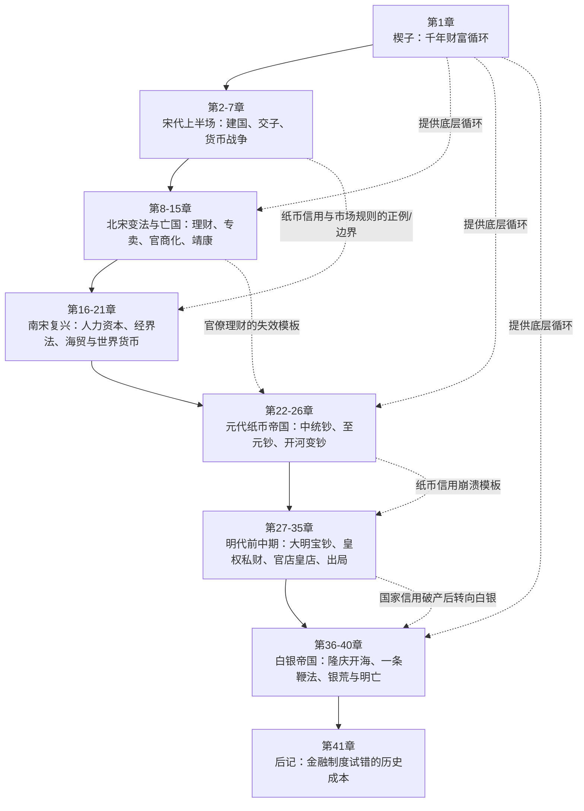
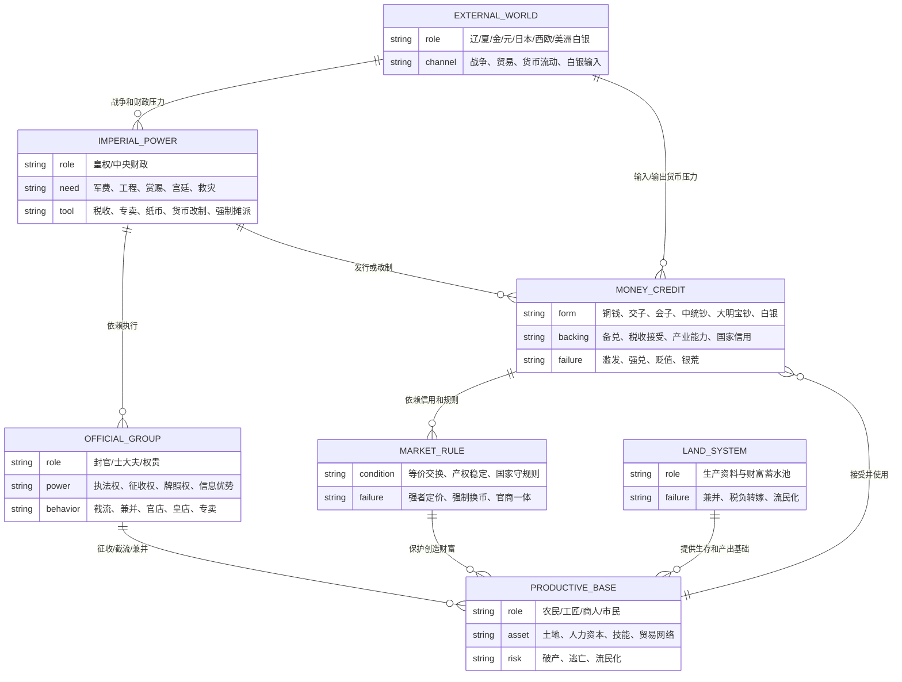
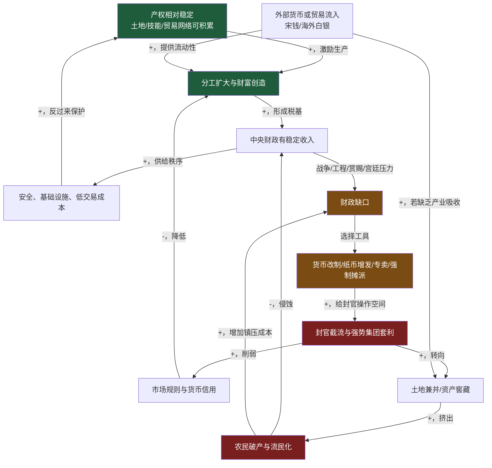
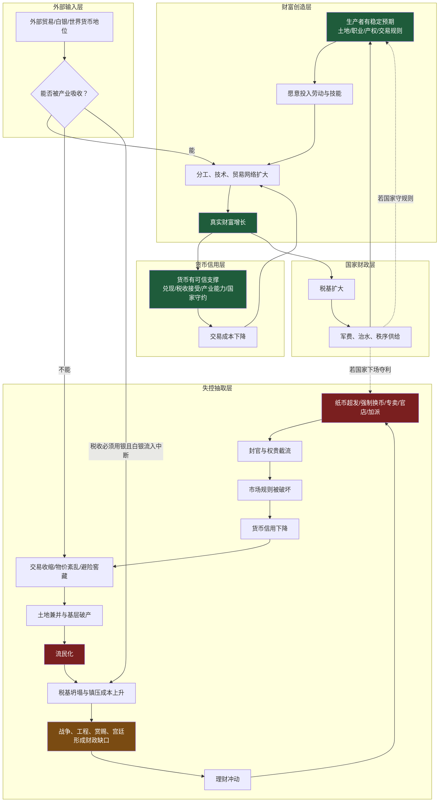
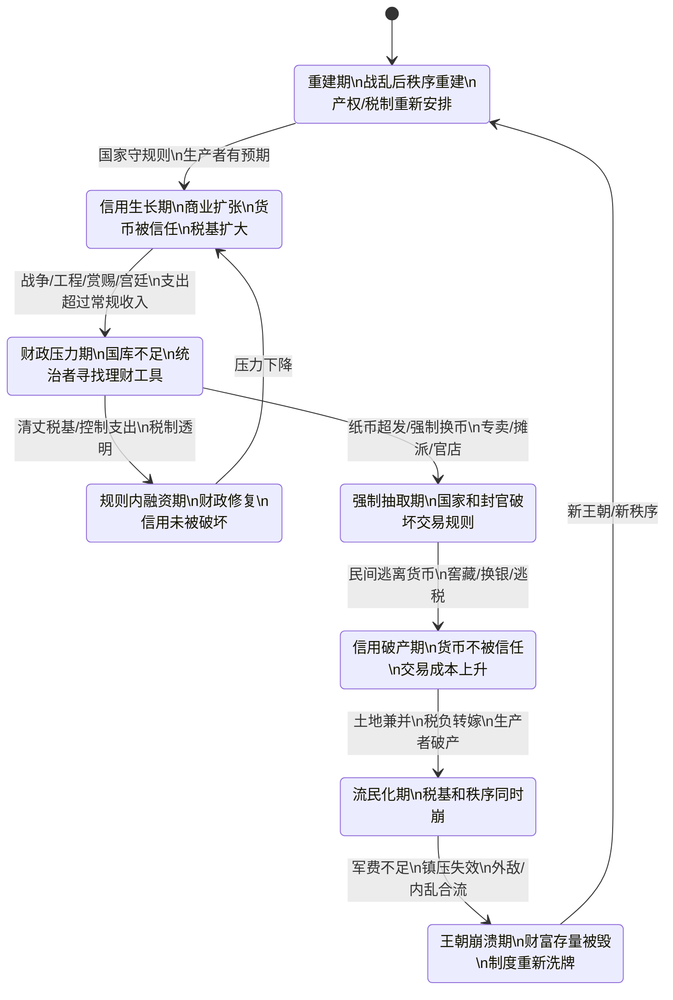
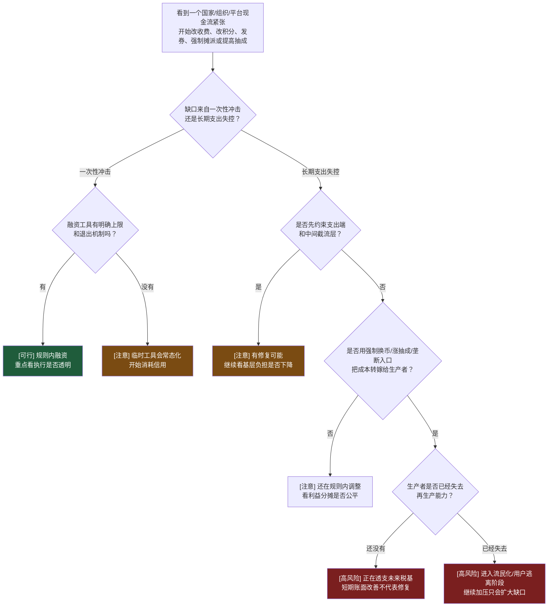
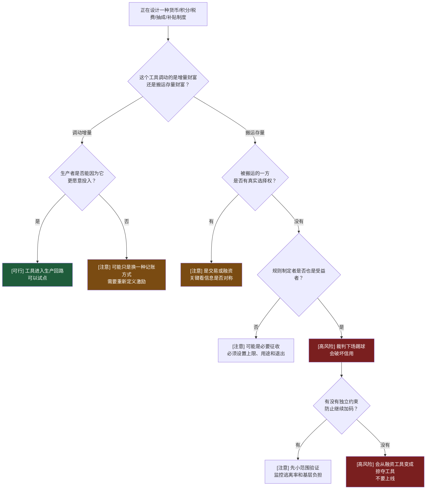

# Pre-Step：章节分组扫描

**书目**：《中国是部金融史2：天下之财》

**目录扫描结果：**



**关系类型判断：**

这本书不是按朝代讲故事，而是把宋、元、明三代放进同一个因果系统里：

- **机制层**：财富从哪里产生？货币为什么能调动财富？国家信用如何支撑纸币？
- **行为层**：皇权、封官、商人、农民、军队、外部政权分别如何争夺财富？
- **后果层**：当货币制度、市场规则和土地结构被强势集团扭曲后，王朝如何进入流民化和财政崩溃？

判定：**因果系统层级，全书统一建模，不分批。**

拆开读会丢失关键链条：宋代交子不是孤立的金融发明，元代钞法不是孤立的财政失败，明代白银也不是单纯的外贸繁荣。三者共同回答一个问题：**国家如何用货币和金融工具调动财富，又如何在信用破产后把整个社会拖入崩溃。**

**每批的核心问题：**

- 第1章回答：中原王朝的财富循环底层结构是什么？
- 第2-7章回答：宋代为什么能在没有大规模授田的情况下创造商业和货币繁荣？
- 第8-15章回答：为什么“理财”一旦变成封官合法进入市场，就会摧毁市场？
- 第16-21章回答：为什么南宋在财富存量被毁后还能复兴？
- 第22-26章回答：元代为什么会毁于纸币和财政工程？
- 第27-35章回答：明代皇权为什么亲手毁掉国家信用和市场生长空间？
- 第36-40章回答：为什么拥有全球巨量白银的大明，仍然没有走向资本主义，反而走向流民化和灭亡？

# 读前诊断

**① 书的类型：**

这是一本**叙事书 + 论证书 + 概念书**的混合体。

- 叙事书：按宋、元、明三代展开历史故事。
- 论证书：全书为一个核心论点提供证明，即金融制度决定财富如何被创造、截留、毁灭。
- 概念书：书里反复出现一组可复用概念：货币信用、铸币税、官营专卖、世界货币、白银货币化、土地兼并、流民化。

**② 我想从这本书里提取什么：**

提取目标是**一个因果解释 + 一套判断标准 + 一个结构模式**。

- 因果解释：为什么强大王朝会在财政和货币操作中走向自毁？
- 判断标准：看到一个国家、组织或平台用“货币/积分/规则/税费”解决财政压力时，如何判断这是正常融资，还是在透支信用？
- 结构模式：财富创造、国家抽取、官僚截流、基层破产之间的反馈系统。

因为包含判断标准，Step 4 输出两个方向：**诊断 + 预防**。

# Step 0：骨架提取

这本书的核心问题是：

> 货币和金融制度本来是调动社会财富的工具，为什么在封建王朝里经常变成毁灭社会财富的工具？

适合先画两个图：一个 ER 图明确实体，另一个 CLD 图抓反馈环。





**反馈环标注：**

- **正反馈环 R1（财富创造环）**：产权稳定 → 分工扩大 → 稳定税基 → 秩序供给 → 产权更稳定。
- **正反馈环 R2（财政透支死亡螺旋）**：财政缺口 → 货币/专卖/摊派 → 封官截流 → 信用破坏与兼并 → 流民化 → 税基下降 → 财政缺口更大。
- **正反馈环 R3（货币流入反噬环）**：外部白银/铜钱流入 → 流动性增加 → 若产业无法吸收 → 转入土地和窖藏 → 兼并加速 → 流民化。

完成标志：看着图能得到 60% 直觉：**问题不在“钱多钱少”，而在钱进入哪个回路。进入生产回路就是繁荣，进入截流和兼并回路就是崩溃。**

# Step 1：概念速览

- **天下之财**：不是国库里的钱，而是整个社会可以持续创造和交换的财富总量。例子：崇祯末年北京库里和官宦家里仍有巨量白银，但农民活不下去，说明国库/权贵有钱不等于天下有财。→ 进 Step 2

- **货币信用**：纸币值钱不是因为纸值钱，而是因为背后有兑现、税收接受、产业能力和国家守约。交子早期能流通，是因为有兑换和商业场景；大明宝钞失败，是因为国家只要求别人接受，却不提供可信支撑。→ 进 Step 2

- **铸币税/货币改制**：国家通过发行新货币、强制兑换旧货币，把民间财富转移到国家手里。例子：汉武帝、元代钞法、明代宝钞都用过这一招。→ 进 Step 2

- **货币战争**：强势经济体用自己的产业和货币优势影响弱势对手，目标不是打一场战役，而是改变对方的财政和物价条件。例子：北宋用交子/贸易限制对付西夏，用铜钱和贸易优势压制辽。→ 进 Step 2

- **官营专卖/官店皇店**：国家或权贵进入赚钱行业，用权力拿走生产、运输、销售的关键节点。盐铁专卖可以是财政工具，但一旦封官合法进入行业，就会把市场变成权力分赃场。→ 进 Step 2

- **市场规则**：市场不是“有人买卖”就成立，核心是强者也遵守等价交换。国家作为最强者如果率先破坏规则，市场会变成财富掠夺工具。→ 进 Step 2

- **人力资本**：战争能毁掉财富存量，却不一定毁掉技能、组织经验、商业网络和生产能力。南宋能在靖康后复兴，关键不是有金银，而是有北宋积累下来的人力资本。→ 进 Step 2

- **世界货币/特里芬困境**：当一种货币被外部世界广泛使用，发行者既要让货币流出去支撑贸易，又怕本国货币不足。南宋铜钱成为周边世界货币后，就遇到类似困境。→ 进 Step 2

- **白银货币化**：白银从贵金属变成法定或事实交易媒介，尤其当税收必须用白银缴纳时，所有人都被迫进入白银体系。张居正一条鞭法把这件事制度化。→ 进 Step 2

- **一条鞭法**：把田赋、徭役、杂项折成白银统一征收，减少胥吏在实物税和徭役中的盘剥，同时强制白银成为税收货币。它提高财政可计算性，但也让农民暴露在白银短缺和银价波动下。→ 进 Step 2

- **流民化**：不是简单贫穷，而是一个人失去土地、职业、家庭再生产能力和对秩序的信任后，被迫脱离原社会位置。流民一旦规模化，税基和秩序会同时坍塌。→ 进 Step 2

- **官僚理财**：不是现代意义的财政管理，而是官僚集团以“为国聚财”为名，获得进入产业、金融和土地分配的合法性。范仲淹、王安石、蔡京、阿合马、刘瑾、矿税太监都落在这个谱系上。→ 进 Step 2

# Step 2：实例裁判循环

**Step 2 待执行清单：**

```text
☐ 天下之财
☐ 货币信用
☐ 铸币税/货币改制
☐ 货币战争
☐ 官营专卖/官店皇店
☐ 市场规则
☐ 人力资本
☐ 世界货币/特里芬困境
☐ 白银货币化
☐ 一条鞭法
☐ 流民化
☐ 官僚理财
```

---

**【天下之财】**

正例：南宋海贸、瓷器、图书、纺织、造船共同运转，民间能持续生产、交换、纳税，国家财政因此有来源。→ 属于天下之财，因为它是可持续的生产和交换能力。

边界例：明末北京皇宫和官宦家中有上亿两白银。→ 不等于天下之财。它是被窖藏和截留的财富存量，不能自动转化为食物、军饷、秩序和生产。

反例伪装：元代或明代一次货币改制后，国库短期进账很多。→ 不是天下之财增加，只是存量财富被强制搬家。

陷阱说明：很多人会把“国库有钱”误判为“国家富强”，因为钱看起来是财富本身；但如果钱来自透支信用和掠夺生产者，它减少的是未来财富。

边界定义：**天下之财 = 社会持续创造、交换、再生产的能力；国库和权贵窖藏只是财富存量，不自动代表天下有财。**

☑ 天下之财 完成

---

**【货币信用】**

正例：早期交子有商人信用、兑换安排和真实交易场景，拿到交子的人相信它能换回铁钱或买到货物。→ 属于货币信用。

边界例：官方交子有税收和国家背书，但只在局部区域流通，且战争中被增发。→ 部分有信用。只要国家还愿意承认、兑换或用强大经济吸收，就能维持；一旦只印不兑，信用开始折损。

反例伪装：大明宝钞被法律规定必须接受。→ 不等于有信用。强制接受只是暴力，不是信任；一旦人们有替代货币，纸币会被抛弃。

陷阱说明：很多人会把“法定货币”误判为“可信货币”，因为国家能立法；但信用的核心是国家是否受自己承诺约束。

边界定义：**货币信用 = 持币人相信这张货币未来仍能稳定换到商品、服务或税收抵扣；强制流通不能替代信用。**

☑ 货币信用 完成

---

**【铸币税/货币改制】**

正例：元代用中统钞强制兑换南宋会子，同时上收金银备兑，再超发纸币。→ 属于货币改制掠夺，国家用换币规则搬走民间财富。

边界例：战后政府发行新币替换旧币，同时给出清晰兑换比例、储备和财政约束。→ 未必是掠夺。关键看是否强制低估旧财富、是否破坏兑现承诺。

反例伪装：张居正一条鞭法要求缴税用白银。→ 不是铸币税。它改变税收计价单位，但没有通过发行劣币直接稀释民间财富。

陷阱说明：货币改制表面是技术操作，实质可能是财富分配。判断点不是“有没有新币”，而是旧财富是否被不对等重估。

边界定义：**铸币税/货币改制掠夺 = 国家利用货币发行和强制兑换权，以非市场比例重估民间财富。**

☑ 铸币税/货币改制 完成

---

**【货币战争】**

正例：北宋对西夏输出不能兑换、局部使用的交子，试图用纸币换取西夏物资，造成西夏物价扰动。→ 属于货币战争，因为目标是用货币制度改变对方资源条件。

边界例：宋辽岁币。→ 不直接属于货币战争，更像用稳定支付换取和平和贸易秩序；后续宋钱回流、贸易结构形成长期优势，才体现货币与产业能力的战略效果。

反例伪装：两国普通贸易中一方使用自己的货币结算。→ 不必然是货币战争，除非结算货币被设计为转嫁成本、扰乱对方物价或控制对方资源。

陷阱说明：货币战争不是“金融听起来高级”的战争比喻，而是把货币当作武器，改变对手的价格、库存和财政约束。

边界定义：**货币战争 = 用货币发行、结算、兑换和贸易限制，把自己的财政成本转嫁给外部对手。**

☑ 货币战争 完成

---

**【官营专卖/官店皇店】**

正例：蔡京、嘉靖时期皇店官店用权力垄断盐、茶、当铺等赚钱行业，限制民间竞争。→ 属于权力进入市场后的财富截流。

边界例：国家对盐征税并发许可证，但民间负责生产、运输、销售，国家不随意改变规则。→ 可以是财政制度，不必然是官营掠夺。

反例伪装：政府采购粮食或修水利工程。→ 不等于官营专卖。只要政府是规则内买方，不垄断行业入口，不强迫交易，就不是同一类问题。

陷阱说明：很多人会把“国家参与经济”一概判为坏，边界不准。关键不是国家有没有参与，而是国家是否利用裁判身份下场踢球。

边界定义：**官营专卖的危险边界 = 掌握规则的人同时成为市场竞争者，并能强迫别人按自己的价格交易。**

☑ 官营专卖/官店皇店 完成

---

**【市场规则】**

正例：宋代民间贸易、海贸、质库、图书和瓷器行业在相对稳定规则下自发扩张。→ 属于有效市场，价格和信用能引导分工。

边界例：隆庆开海后允许出海，但船引由权力系统控制，普通人难以获得。→ 有市场外形，但入口被权力控制，市场规则不完整。

反例伪装：明代皇店也“买卖”，官店也“放贷”。→ 不是有效市场。交易对象无法自由拒绝，价格背后是权力。

陷阱说明：市场不是“有商品、有价格、有店铺”。如果强者可以随意改变规则，所谓价格只是命令的包装。

边界定义：**有效市场 = 包括国家和权贵在内的强者也被同一套规则约束；否则只是权力定价。**

☑ 市场规则 完成

---

**【人力资本】**

正例：靖康后北宋财富存量被金人洗劫，但工匠、商人、技术、书院、贸易经验随南迁进入江南，南宋迅速复兴。→ 属于人力资本发挥作用。

边界例：富商家族携带白银南迁。→ 这是金融资本和商业网络的混合；只有当他们还能组织生产、贸易、信用时，才体现人力资本。

反例伪装：金人抢走金银、工匠和器物后国力立刻现代化。→ 不属于。没有制度吸收和分工网络，抢来的技能和财富很难转成持续生产能力。

陷阱说明：战争毁掉财富存量不一定毁掉财富生成器。判断复兴潜力，要看人、技能、组织网络是否还在。

边界定义：**人力资本 = 能重新组织生产和交换的技能、经验、信用网络；它不是钱，但能重新生出钱。**

☑ 人力资本 完成

---

**【世界货币/特里芬困境】**

正例：南宋铜钱被日本、南洋、印度洋贸易圈广泛接受，海外交易主动需要宋钱。→ 属于世界货币雏形。

边界例：明代白银流入中国。→ 白银是世界性贵金属，但不是“大明发行的世界货币”。中国是吸收者，不是发行者。

反例伪装：某国货币在边境小范围流通。→ 不足以称世界货币。必须在多个外部市场中承担结算、储藏或计价功能。

陷阱说明：世界货币是优势，也是约束。货币流出去支撑贸易，国内就可能钱荒；不让流出去，国际贸易就受损。

边界定义：**世界货币 = 外部市场主动接受并储藏的交易媒介；发行者同时承担“让它流出”和“防止国内短缺”的双重压力。**

☑ 世界货币/特里芬困境 完成

---

**【白银货币化】**

正例：一条鞭法后，赋役折银征收，农民必须获得白银才能完成税收义务。→ 属于白银货币化，国家税收强迫所有人进入银本位。

边界例：民间大额交易使用银锭。→ 只是白银作为交易媒介，不一定完成货币化；只有税收、债务、工资等普遍转向白银，货币化才成系统。

反例伪装：皇帝或富人窖藏白银。→ 不是货币化。窖藏是退出流通，反而减少货币功能。

陷阱说明：白银多不等于经济好。白银进入生产和交易是流动性，进入窖藏和土地兼并就是压力源。

边界定义：**白银货币化 = 白银成为税收和普遍交易的结算标准，而不是单纯贵金属储藏。**

☑ 白银货币化 完成

---

**【一条鞭法】**

正例：张居正把田赋、徭役、杂税折成白银统一征收，减少实物折算和徭役派发中的灰色空间。→ 属于一条鞭法核心。

边界例：地方把原有杂派也折银，但没有丈量土地、没有减少额外摊派。→ 只是借一条鞭名义加税，不是有效改革。

反例伪装：崇祯加征辽饷、剿饷、练饷。→ 不是一条鞭法，而是在白银税制上叠加财政压力，直接压垮基层。

陷阱说明：一条鞭法的效果依赖两个前置条件：土地清丈相对准确，国家能控制额外摊派。缺一条，就会从简化税制变成加税工具。

边界定义：**一条鞭法 = 在清丈基础上把赋役折银统一征收；没有清丈和控摊派，就只剩“要银子”。**

☑ 一条鞭法 完成

---

**【流民化】**

正例：明末灾荒、银荒和三饷叠加，农民失去土地、食物和纳税能力，只能逃亡或起事。→ 属于流民化。

边界例：城市短期失业者。→ 未必是流民化。如果还能回到家庭、土地、职业网络，就只是收入中断。

反例伪装：商人迁徙到新口岸做生意。→ 不是流民化。这是主动流动，背后有资本、技能和预期收益。

陷阱说明：流民化不是穷，而是从原有秩序中脱嵌。大规模流民会让国家同时失去税基、兵源纪律和地方治理。

边界定义：**流民化 = 人失去生产资料、社会位置和对秩序的最低信任，被迫以逃亡、乞讨、抢劫或起义重新求生。**

☑ 流民化 完成

---

**【官僚理财】**

正例：王安石以青苗、市易、免役等制度把国家和官僚推入信贷、商业、劳役替代市场，目标是“不加赋而国用足”。→ 属于官僚理财。

边界例：张居正考成法和清丈土地。→ 部分属于财政整顿，但不等同于官僚理财，因为核心是约束官僚、核实税基，而不是给官僚进入市场的合法性。

反例伪装：现代预算管理或审计。→ 不是官僚理财。它限制财政行为，而不是让执行者用权力去市场里赚钱。

陷阱说明：“为国理财”听起来是公共目标，但在封建官僚系统里，执行者掌握征收权、司法权和信息权，很容易把公共财政变成私人截流。

边界定义：**官僚理财 = 以国家财政为名，把产业、金融和交易入口交给官僚执行，从而让权力合法进入财富分配。**

☑ 官僚理财 完成

---

**Step 2 完成确认：**

```text
☑ 天下之财
☑ 货币信用
☑ 铸币税/货币改制
☑ 货币战争
☑ 官营专卖/官店皇店
☑ 市场规则
☑ 人力资本
☑ 世界货币/特里芬困境
☑ 白银货币化
☑ 一条鞭法
☑ 流民化
☑ 官僚理财
```

# Step 3：结构可视化



**反馈环标注：**

- **财富创造正反馈（+）**：稳定预期 → 投入劳动技能 → 分工贸易扩大 → 财富增长 → 税基扩大 → 秩序供给 → 稳定预期。
- **信用增强正反馈（+）**：可信货币 → 交易成本下降 → 贸易扩大 → 产业能力增强 → 货币更可信。
- **抽取死亡螺旋（+）**：财政缺口 → 理财冲动 → 货币/专卖/加派 → 权贵截流 → 信用破坏 → 交易收缩和兼并 → 流民化 → 税基坍塌 → 财政缺口更大。
- **外部白银反噬环（+）**：白银流入 → 若不能转成产业投资 → 土地和窖藏 → 兼并 → 流民化；白银流入中断后，税收银本位又放大基层压力。



**差异列表：**

**【原文有、图里没有】**

- 具体人物性格没有展开：赵匡胤、王安石、蔡京、宋高宗、忽必烈、朱元璋、朱棣、张居正、崇祯的个人风格会影响政策时机。
- 军事细节没有展开：宋辽、宋夏、宋金、宋蒙、明末辽东战争的战术过程不是模型重点。
- 史料考证和作者对传统叙事的反驳没有完全进入图里，例如“杯酒释兵权”“岳飞叙事”“剥皮实草”等。
- 海外贸易路线细节没有展开：吕宋、日本、澳门、马六甲等白银通道在图里被压缩成“外部输入层”。

**【图里有、原文没明说的推论】**

- “钱进入哪个回路”是我抽象出来的判断器。原文分朝代叙事，没有用“生产回路/截流回路”这个术语。
- 把交子、大明宝钞、中统钞、白银税制放进同一状态机，是跨朝代提炼，不是原文按图给出。
- 把“人力资本”作为南宋复兴的可迁移变量，是从原文论述中抽取出来的模型化表达。

# Step 4：可执行模型

**核心机制（一句话）：**

一个国家或组织不是因为“缺钱”而必然崩，而是因为它用破坏信用和规则的方式补财政缺口，把钱从生产回路抽进截流回路，最后基层失去再生产能力，财政缺口反而更大。

**触发条件 → 结果：**

- 当财政缺口来自战争、工程、赏赐、扩张，但支出端不受约束时 → 理财工具会不断升级。
- 当货币发行没有可信约束，只靠强制接受时 → 货币信用会被消耗。
- 当规则制定者自己下场经商、放贷、定价时 → 市场变成权力分配系统。
- 当外部货币流入不能被产业吸收，只能进入土地和窖藏时 → 兼并加速。
- 当税收计价货币短缺，但税额不降反升时 → 基层会被迫流民化。
- 当国家从生产者身上抽走最后生存资料时 → 镇压成本会高于征收收益。

**诊断方向：遇到一个国家/组织/平台财政紧张时**



**预防方向：正在设计货币、积分、税费、抽成或财政制度时**



**失效边界：**

- 这个模型适合分析有强制征收权、规则制定权或平台入口权的系统；纯自由竞争的小市场不完全适用。
- 它不能单独解释军事胜负、技术路线和个人性格，但能解释为什么看似强大的财政系统会突然失去承压能力。
- 它不反对国家财政、货币发行或产业政策；它反对的是没有可信约束的强制抽取。
- 对现代信用货币体系不能机械套用“纸币必亡”。现代货币有央行、税收体系、债务市场和统计透明度等不同约束，关键仍是信用和规则，而不是纸币形态本身。

# Step 5：接入已有体系

**【同构 1】与“系统架构里的接口契约”同构**

结构是：**货币信用 = 系统契约；任意破坏契约 = 全系统绕路。**

- 货币系统里，纸币承诺能兑换、能纳税、能买货。国家一旦随意超发、强制低价换币，持币人就逃向白银、铜钱、实物和窖藏。
- 软件系统里，接口承诺输入输出、幂等性、状态转换。提供方一旦随意改语义，调用方就会绕过接口、缓存私有状态、写补丁，系统复杂度暴增。

正向迁移：看一个货币制度，先问它的“接口契约”是什么：兑现？纳税？购买力？谁能改？改动是否向后兼容？

反向迁移：设计系统接口时，不能只问“我能不能强制下游改”，而要问“下游会不会因此不再信任这个接口”。信用损耗比一次改动成本更大。

**【同构 2】与“平台既当裁判又当玩家”的治理问题同构**

结构是：**规则制定者下场参与交易，市场就会从发现价格变成服从权力。**

- 官店皇店、盐铁专卖、皇权强制换币，本质是国家既制定规则又拿收益。
- 平台经济里，如果平台既定搜索排序、抽成规则，又自营同类商品，就会天然压制第三方商家。

正向迁移：分析任何“官方/平台下场做业务”的场景，先判断它是否掌握入口、定价、处罚和信息优势。如果四者齐全，市场规则已经变形。

反向迁移：设计平台治理时，要把“规则权”和“经营权”隔离，至少要公开约束，否则短期收入会换来长期生态逃离。

**【同构 3】与“皇权—官僚—小农”旧模型互补同构**

上一册的主模型是土地：皇权依赖官僚治理小农，官僚又倾向兼并土地，最终小农流民化。

这一册加上金融层：

- 土地是财富的蓄水池。
- 货币是财富流动的管道。
- 官僚和权贵既能占蓄水池，也能改管道阀门。

正向迁移：以后看王朝危机，不只看土地兼并，还要看货币和税制是否把压力放大。

反向迁移：看现代组织也一样，不只看资源被谁占有，还要看结算规则、积分规则、预算规则是否被强势部门改写。

**【同构 4】与“人力资本比财富存量更关键”的复原模型同构**

南宋的例子说明：金银、宫殿、都城可以被抢走，但技能、商业网络、组织经验如果还在，社会有复原能力。

正向迁移：判断一个组织受重创后能否恢复，不看账上现金第一，看核心人才、流程知识、客户网络是否还在。

反向迁移：做风险管理时，不能只备份数据和资金，也要备份关键能力：人、流程、训练体系、客户信任。

**【互补】**

这本书补上了一个关键层：**货币不是财富本身，而是调动财富的协议层。**

以前的土地模型解释“生产资料被兼并为什么导致流民化”；这本书解释“为什么明明还有金银、纸币、国库收入，系统仍会崩”。答案是：协议层信用破产后，钱不能再协调生产，只能协调掠夺。

**【矛盾】**

与“财政越强，国家越强”这个直觉存在张力。

- 条件 A：财政来自稳定税基和真实增长，国家变强。
- 条件 B：财政来自强制换币、纸币超发、专卖截流、额外加派，国家账面变强，社会底座变弱。

解决：不要看财政收入绝对值，先看它来自哪个回路。来自生产回路，是强；来自截流回路，是虚强。

**【更新图】**

```text
[生产资料/土地] --> [真实财富生成]
[货币/税制/信用] --> [财富流动协议]
[官僚/权贵] --> [协议阀门控制者]
[协议阀门被滥用] --> [生产者破产] --> [流民化] --> [税基坍塌]
```

以后分析历史、组织或平台财政问题时，Step 0 增加三个节点：

- 这个系统的“货币/积分/预算协议”是什么？
- 谁有权改协议？
- 改协议的收益归谁、成本由谁承担？

# 建模完成自检

- ☑ 不看原文，只看图，能复原核心逻辑。
- ☑ 给一个新情境，能用 flowchart 得出结论。
- ☑ Step 2 执行清单已全部打勾，无跳过。
- ☑ Step 3 的差异列表已输出。
- ☑ Step 4 的 flowchart 入口是具体工作场景，不是抽象现象。
- ☑ Step 5 的同构分析包含了反向迁移。
- ☑ 输出章节结构符合固定列表，没有自行添加“读后感”“作者背景”等章节。
- ☑ 一句话总结能作为触发信号。

# 一句话总结

当你看到一个国家、组织或平台说“缺钱，所以要发券、改币、涨抽成、搞专卖、强制摊派”时，第一反应不是问能收多少钱，而是问这笔钱进入生产回路还是截流回路；如果规则制定者自己受益、生产者失去再生产能力，那不是理财，是在把未来税基烧成今天的现金流。
