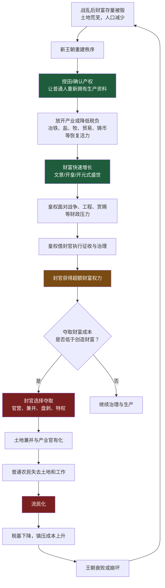
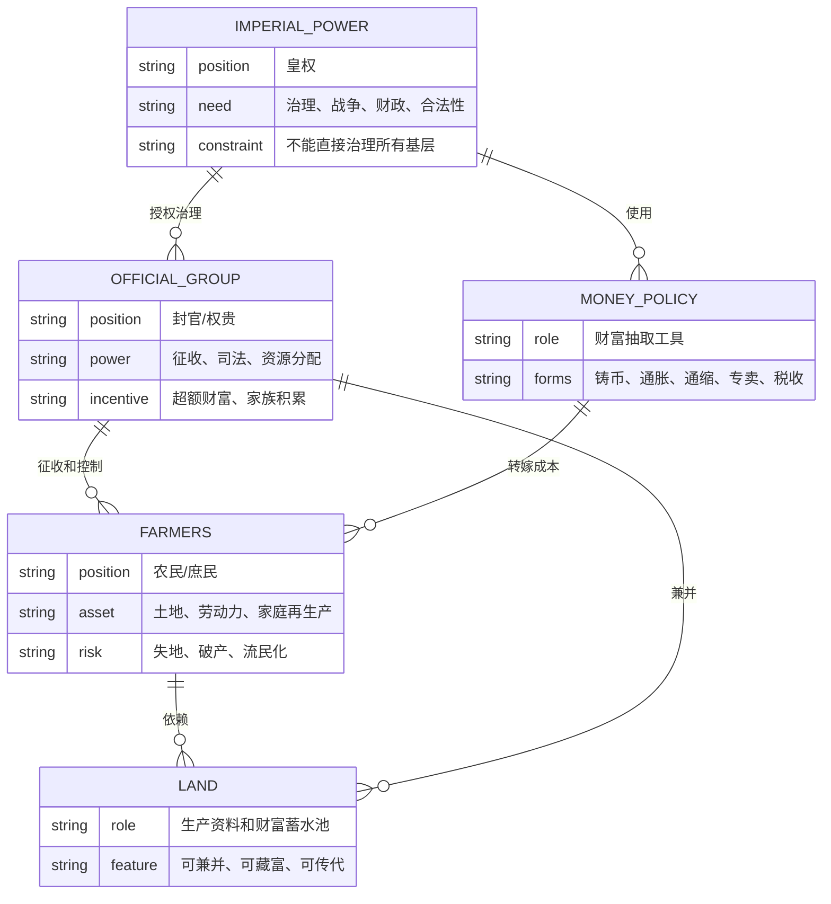
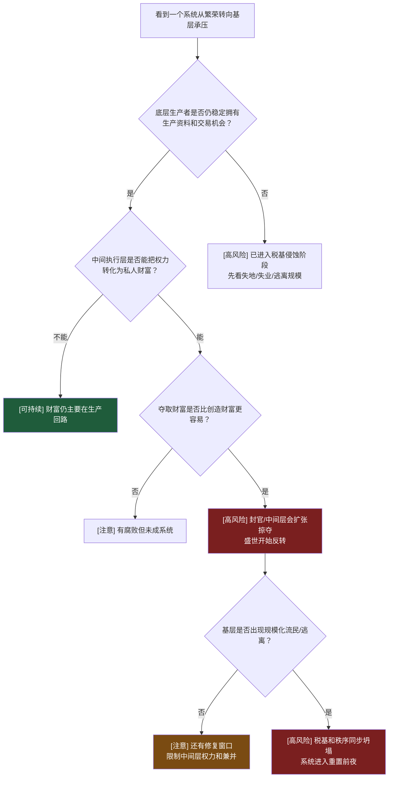
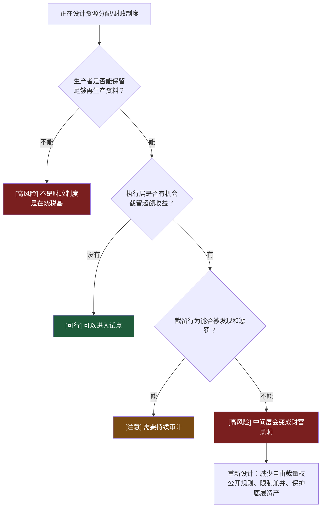

# 第1章：中原王朝的财富循环底层结构是什么？

**原文范围**：第1章「楔子」

**核心问题**：中原王朝为什么会反复出现“开国恢复、财富增长、权贵兼并、底层流民、王朝崩坏”的循环？

## 一句话答案

中原王朝的财富循环底层结构是：**皇权为了治理帝国必须依赖封官，封官为了效忠皇权必须获得超额财富机会；当夺取财富的成本低于创造财富，封官会把国家赋予的治理权转化为掠夺权，最终把农民从生产者压成流民，税基和秩序一起崩塌。**

## Step 0：骨架提取

第1章不是在讲汉、晋、隋、唐的零散历史，而是在建立全书底层循环。

**核心反馈环：**

- 恢复环：产权确认 → 普通人有生产资料 → 生产和交易恢复 → 社会财富增长。
- 掠夺环：财富增长 → 封官觊觎 → 权力进入财富分配 → 土地兼并 → 流民化 → 税基下降 → 更强征收。
- 重置环：流民化和财政崩溃 → 王朝毁灭 → 旧利益集团被打碎 → 新王朝重新授田或确认产权。

## 核心实体关系

## 机制拆解

**1. 盛世不是靠皇帝道德，而是靠普通人有生产资料。**

文景之治的关键不是“皇帝节俭”这一个因素，而是《二年律令》确认了庶民可以获得土地，汉文帝又放开产业管制。普通人有土地、有交易机会、有追求财富的空间，社会财富才会快速恢复。

可执行判断：一个恢复期是否真实，先看底层是否重新获得生产资料和交易机会，不先看国库数字。

**2. “皇权、封官、农民”是压力单向传导结构。**

皇权在顶层，封官在中间，农民在底层。皇权的财政压力不会在封官处停止，封官会把压力继续向下传导，而且还会叠加自己的超额收益需求。

这就是为什么同一个政策，从皇帝视角看是“为国聚财”，到基层就变成“民无立锥之地”。

**3. 货币政策不能单独拯救土地结构。**

汉武帝用通胀、改币、算缗告缗、盐铁官营聚敛财富，结果中产被扫空，官僚和权贵更强。汉宣帝停止铸币、形成货币收缩，也没能阻止强势集团兼并土地。

边界判断：通胀和通缩都只是改变谁更容易拿到交易媒介，不能自动改变谁控制土地和权力。

**4. 授田制的目标是让底层回到生产者位置，但它只能阶段性有效。**

汉、晋、隋、唐都试图用授田或限购维持“有其田”。但只要封官仍然掌握征收、司法、交易规则，财富一增长，他们仍会寻找兼并入口。

授田是重启键，不是永久免疫系统。

**5. 失败的终点不是“国家没钱”，而是“国弱、民贫、官富”。**

第1章反复强调：财富没有凭空消失，而是从社会生产回路转移到封官和权贵控制的资产里。最终国家税基被挖空，农民失去生存，权贵反而富。

## 关键概念边界

**“有其田”不是现代完整私有产权。**

它的作用是让普通家庭拥有稳定生产资料。边界不在法律术语，而在农民能不能靠这块地持续养家、纳税、繁衍。

**“无为而治”不是政府什么都不做。**

它的边界是政府不把产业入口、交易规则和利润空间全部抓到自己手里。该提供秩序时提供秩序，该退出产业时退出产业。

**“封官”不是普通公务员。**

这里的封官是带有资源配置权、征收权和司法影响力的强势集团。他们不是单个贪官，而是结构性中间层。

**“流民”不是失业者。**

流民是失去土地、职业、家庭再生产和秩序信任的人。流民化一旦规模化，王朝面对的就不是贫困问题，而是系统性税基和秩序崩坏。

## 正例、边界例、反例伪装

**正例：文景之治。**

底层有土地，产业放开，税负低，交易活跃，国家不以官营垄断压制民间。财富进入生产回路，所以出现盛世。

**边界例：汉宣帝停止铸币。**

看似保护民间，避免汉武帝式通胀掠夺；但货币收缩让拥有存量货币和权力的强势集团更容易兼并土地，无法解决农民失地。

**反例伪装：西晋废弃官方铸币。**

表面看是避免货币掠夺，实际士族门阀仍控制政治和土地。没有货币不等于没有掠夺，权力可以直接夺取土地和劳动力。

## 可执行模型

**诊断入口：看到一个王朝、组织或平台从恢复走向衰败时**

**预防入口：正在设计一个财政、税收或资源分配制度时**

## 接入已有体系

**与“系统中间层膨胀”同构。**

在软件系统里，如果业务请求必须经过一个拥有过多自由裁量权的中间层，中间层会逐渐变成瓶颈和利益中心。这里的封官就是王朝系统里的中间层：既承接上层命令，又控制下层资源。

正向迁移：看王朝危机时，不只看皇帝和农民，要看中间层如何把压力和收益重新分配。

反向迁移：设计组织或系统时，要限制中间层的自由裁量权，尤其不能让它既负责执行又负责收益分配。

**与“生产资料优先于货币”互补。**

这一章修正一个直觉：钱不是第一变量，生产资料和再生产能力才是第一变量。钱能加速财富流动，但不能替代土地、技能、组织和秩序。

## 一句话总结

当一个系统的繁荣来自底层重新获得生产资料，而衰败来自中间层把治理权变成掠夺权时，不要把问题归因于某个昏君或某次货币政策；真正的触发信号是：夺取财富开始比创造财富更容易。
