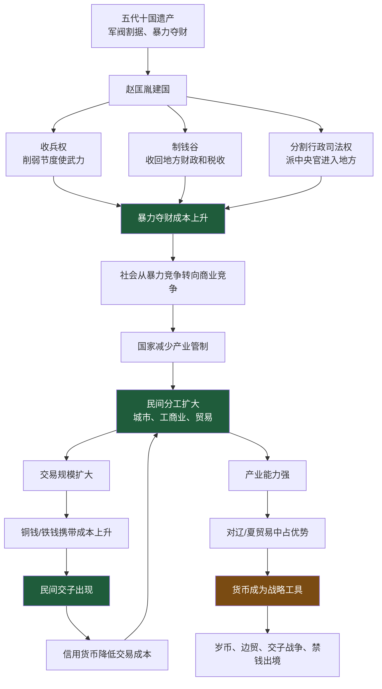
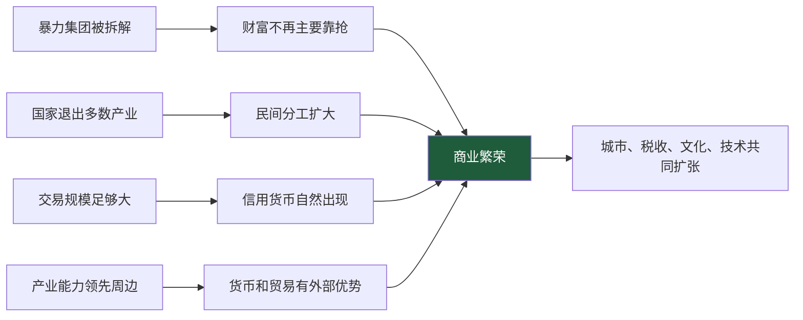
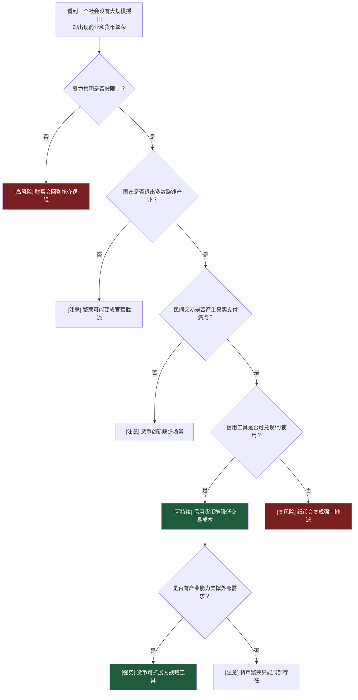
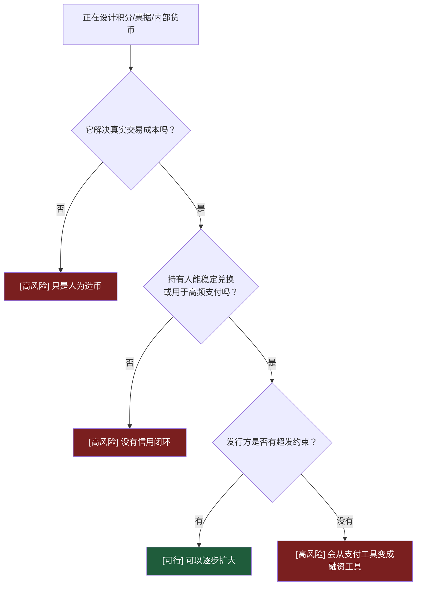

# 第2-7章：宋代为什么能在没有大规模授田的情况下创造商业和货币繁荣？

**原文范围**：第2章「东京梦华」到第7章「宣战，以货币之名」

**核心问题**：宋代没有像汉、隋、唐那样大规模授田，为什么反而创造了更高水平的商业、城市和货币繁荣？

## 一句话答案

宋代的繁荣不是靠重新分土地，而是靠**压制暴力集团、收回军阀财政权、保护民间交易、让国家退出大部分产业，并在商业需求中自然生长出交子等信用货币**；它的底层逻辑是让财富进入市场分工回路，而不是进入封官兼并回路。

## Step 0：骨架提取

宋代的关键不是“给每个人分地”，而是把五代以来最危险的财富分配方式处理掉：**谁有兵，谁抢钱。**

## 核心机制拆解

**1. “杯酒释兵权”不是核心，制度性拆军阀才是核心。**

赵匡胤真正做的是“稍夺其权，制其钱谷，收其兵”。对符彦卿这类节度使，不是靠一顿酒，而是先用工程调走强壮厢军，再派中央官控制司法和税收，最后让地方军阀失去钱、权、兵。

可执行判断：一个系统从暴力竞争转向市场竞争，先看暴力集团是否失去财政独立性。

**2. 宋代没有大规模授田，但保护了交易和分工。**

前代靠“有其田”恢复农业底座，宋代则更进一步：在较少土地重分配的情况下，让城市、工商业、运输、金融自然生长。民间能通过劳动、技能、贸易赚钱，财富不只锁在土地里。

这解释了为什么宋代能超越“农业王朝盛世”的上限。

**3. 交子是商业需求生出来的，不是皇帝设计出来的。**

四川铁钱笨重，贸易需要更轻便的支付工具，民间交子铺先出现。后来十六富商以声誉承接，再被官方吸收。

这条链路很重要：真实交易需求 → 私人信用工具 → 商业声誉筛选 → 官方接管。

如果倒过来，先由国家凭空印纸，再要求市场接受，就会走向大明宝钞式失败。

**4. 货币信用来自可兑现和可使用场景。**

交子能流通，是因为持有人相信它能换铁钱，或者能买到需要的货物。官交子一开始还能运转，是因为国家信用叠加了已有市场场景。

但一旦宋夏战争中出现只能在特定区域使用、不能兑换的特殊交子，货币就从交易工具变成战争武器，信用开始受损。

**5. 北宋对辽、夏的货币优势来自产业优势。**

宋朝能用货币和贸易制衡辽、夏，不是因为纸币魔法，而是因为宋拥有更强产业能力：瓷器、织锦、造纸、茶、造船、城市市场。辽、夏需要宋货，宋未必同等需要对方货。

可执行判断：强货币的底层不是币本身，而是别人是否必须用它购买你的产品。

**6. 岁币不是简单的“花钱买屈辱”。**

澶渊之盟后，宋辽长期和平，贸易恢复，岁币成本远低于战争成本。对一个以商业税和城市经济为重要收入来源的王朝来说，稳定边境和交易秩序本身就是财政收益。

边界：金钱换和平不是天然正确，前提是它买到的是可持续秩序，而不是继续勒索。

## 关键概念边界

**收兵权 vs 杀功臣。**

宋代的高明处不是不杀人，而是把军阀的兵、财、政拆开，让反叛能力结构性下降。杀人只能解决个人，拆结构才能解决类型问题。

**民间交子 vs 官交子。**

民间交子依赖商人声誉和兑换能力；官交子依赖国家信用和税收接受。两者可以衔接，但不是同一种信用来源。

**货币战争 vs 普通贸易。**

普通贸易是双方用货币交换商品；货币战争是有意让对方接受不能稳定回流或兑换的货币，把自己的成本转嫁给对方。

**岁币 vs 赔款。**

如果支付换来长期和平、低成本贸易和战略缓冲，它更像购买秩序；如果支付只换来下一轮勒索，它才是赔款逻辑。

## 结构图：宋代繁荣的四个条件

## 正例、边界例、反例伪装

**正例：四川交子。**

铁钱沉重，交易规模扩大，商人用信用凭证降低交易成本。交子是市场痛点产生的工具。

**边界例：官交子。**

官方接管后，信用来源从商人声誉转向国家信用。只要发行有备、使用场景明确，它仍能有效；一旦战争中超发或限制兑换，就会伤害信用。

**反例伪装：朝廷强制发行战区交子。**

表面也是纸币，实际是定向转嫁战争成本的工具。不能把它和早期交子混为一谈。

**正例：澶渊之盟后的宋辽贸易。**

支付岁币换稳定边境，贸易恢复，宋货输出，货币回流，长期收益可能大于短期支出。

**反例伪装：任何金钱换和平都合理。**

如果对方没有秩序约束，支付只会证明你有钱可抢。靖康前后的宋金关系就是反例。

## 可执行模型

**诊断入口：一个社会没有重新分配土地，却出现商业繁荣**

**预防入口：正在设计一种平台积分/票据/内部货币**

## 接入已有体系

**与“平台生态治理”同构。**

宋代的繁荣类似一个平台先解决暴力外挂和入口垄断，然后允许生态内商家自由交易。交子是生态交易量上来后自然出现的支付层。

正向迁移：判断一个平台能否繁荣，先看它是否限制强势玩家欺负弱势玩家，再看支付和信用工具是否来自真实交易需求。

反向迁移：设计平台货币时，不要先问“能不能发行”，要先问“它降低了什么交易成本、由什么信用支撑”。

**与“接口抽象来自使用痛点”同构。**

交子不是顶层规划出来的，而是铁钱难用这个痛点逼出来的抽象层。好的系统抽象也一样，应该从高频痛点中长出来，而不是为了架构美感凭空造出来。

## 一句话总结

宋代没有靠大规模授田创造繁荣，而是先让暴力夺财失效，再让民间交易和分工自己长出来；交子这样的货币创新只有在真实交易需求、可兑现信用和产业能力同时存在时，才是繁荣的放大器，不是国家随手印出来的财富。
