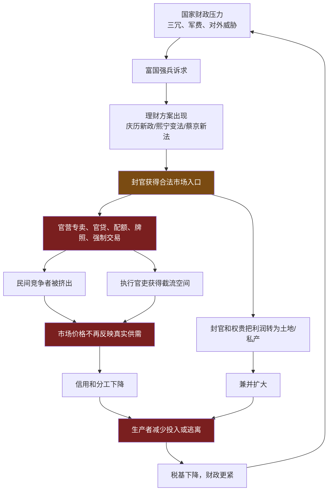
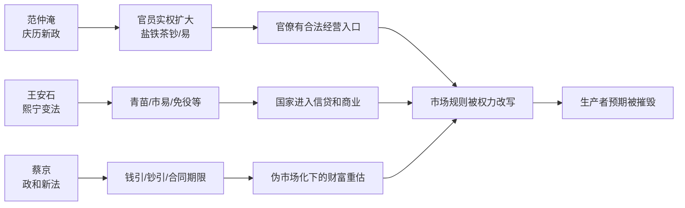
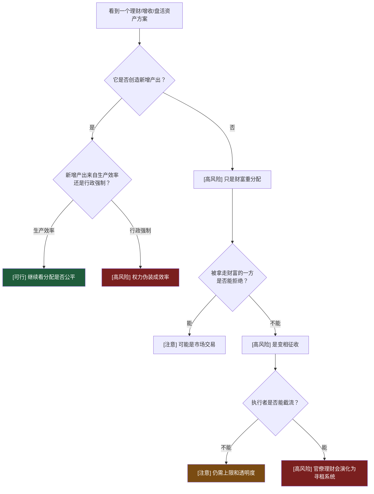
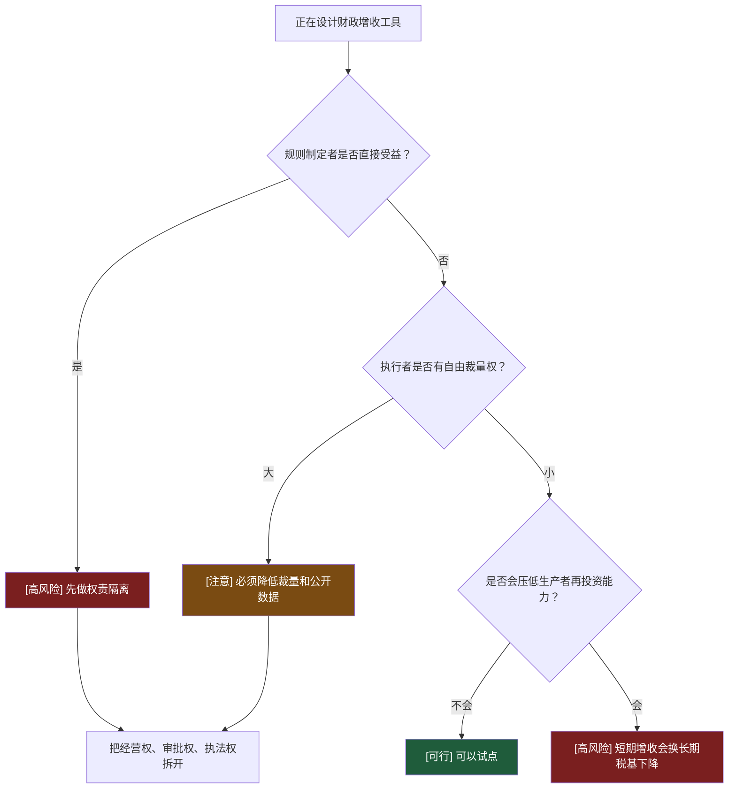

# 第8-15章：为什么“理财”一旦变成封官合法进入市场，就会摧毁市场？

**原文范围**：第8章「变法风云」到第15章「书画君臣」

**核心问题**：为什么范仲淹、王安石、蔡京等人的“理财”初衷常常是富国强兵，结果却会摧毁市场、信用和国家防御能力？

## 一句话答案

“理财”一旦给封官合法进入市场的权力，就会让国家从规则维护者变成市场竞争者；封官拥有征收、司法、牌照和信息优势，进入产业后不会创造效率，只会把交易规则改造成权力分赃规则，最终市场失去信用，生产者失去预期，国家也失去真实税基。

## Step 0：骨架提取

**关键环：**

- 财政压力 → 理财 → 官入市 → 市场规则破坏 → 税基下降 → 更大财政压力。
- 官入市 → 利润私有化 → 土地兼并 → 基层破产 → 税基下降。

## 核心机制拆解

**1. “不加税而国用足”是危险信号。**

王安石说不增加赋税也能让国库充足，司马光反驳的核心是：天下财货总量在一个时点上是有限的，不在民则在官。所谓理财，如果没有真实增产，只是换一种方式拿民间财富。

可执行判断：任何“不增加成本但收入大增”的财政方案，都要追问收入从谁那里来、以什么权力拿来。

**2. 庆历新政的问题不是所有政策都错，而是打开了官僚入市的门。**

范仲淹提出十事，里面有整顿吏治、厚农、修武备等合理内容。但一旦“给官员实权、给官员田产、让官员办易、盐铁茶配额”结合起来，官僚就有了以公权力经营市场的合法性。

边界：财政整顿和官僚经营是两件事。前者约束权力，后者扩张权力。

**3. 盐钞是一个边界例。**

盐钞以食盐为备，能在全国流通，信用好于官交子。这说明不是所有国家介入都会失败。盐钞有效的前提是：背后有可兑换的真实商品，且发行被盐的生产和专卖规模约束。

但同样的配额制度也会给官员寻租空间。有效货币工具和官僚寻租工具之间，边界很薄。

**4. 官贷和市易法会把国家变成带刀放贷人。**

青苗法、市易法、易钱帛等政策，本来想平抑市场和提供贷款。但官府既能决定谁借、借多少、何时还，又能用行政和司法强制执行，借贷就不再是金融服务，而是权力债务。

可执行判断：信贷是否健康，先看借款人能否拒绝，贷款人能否被约束。

**5. 蔡京的“市场化”是反例伪装。**

蔡京废除一些官营生产环节，让民间用钱引、钞引经营盐茶酒等，看起来是市场化。但他又通过合同和票据期限设计，让旧钞作废、财富重估，国家随时改变游戏规则。

这不是市场化，而是把市场外壳套在强制财富转移上。

**6. 北宋亡国不只是军事问题，也是契约崩坏问题。**

第15章把北宋对金失败解释为社会契约被金钱侵蚀：当所有人都只以钱为目标，忠诚、责任和公共秩序就会失效。金人围城时，宋廷甚至替金人向民间搜刮财富，皇权本身成了外敌的征收工具。

这就是理财逻辑的终点：国家不再保护社会财富，而是帮助更强暴力抽走社会财富。

## 关键概念边界

**理财 vs 财政治理。**

财政治理是核实税基、限制浪费、公开预算、约束征收。理财在本书语境下是让官僚用权力进入市场赚钱。前者修复规则，后者破坏规则。

**专卖 vs 税收。**

税收是在承认民间生产交易的前提下抽取一部分。专卖是国家控制生产、运输、销售或牌照入口。专卖越靠近经营端，越容易变成权力寻租。

**市场化 vs 伪市场化。**

真正市场化是国家退出经营并守规则；伪市场化是国家让私人承担经营风险，但保留随时改规则、重估票据、收走利润的权力。

**官僚能力 vs 官僚激励。**

范仲淹、王安石、蔡京都不缺能力。问题不在“能不能干”，而在他们给了官僚什么激励。能力越强，掠夺工具可能越精密。

## 关键人物作为机制节点

## 正例、边界例、反例伪装

**正例：青苗法的失控。**

官府贷款给农民，理论上防止高利贷；执行中地方官为了完成指标强制放贷、强制收息，变成行政债务。

**边界例：盐钞。**

盐钞以真实食盐为备，能降低交易成本，所以比官交子更稳定。但一旦配额和发放权被官僚操纵，也会产生寻租。

**反例伪装：蔡京废除官营生产。**

看起来是放开市场，实际保留牌照、合同、作废和重估权。国家退出了生产辛苦活，保留了财富分配权。

**正例：司马光的反驳。**

“不在民，则在官”是本段最关键的判断规则。没有新增真实财富，就没有无痛财政收入。

## 可执行模型

**诊断入口：看到一个改革打着“理财、增收、盘活资产”的名义**

**预防入口：正在设计财政增收工具**

## 接入已有体系

**与“裁判下场踢球”同构。**

市场要能发现价格，前提是裁判不参与比赛。封官进入市场后，拥有罚人、查账、定配额、发牌照的权力，还要和民间争利，民间不可能赢。

正向迁移：看任何产业政策，先问政府是做规则、做基础设施，还是亲自下场拿利润。

反向迁移：做平台治理时，如果平台同时控制流量分发、处罚规则和自营业务，就会复制官营专卖逻辑。

**与“接口污染”同构。**

税制、货币、牌照本来是基础接口。理财型官僚把这些接口改成收益入口，等于底层 API 被业务部门私自改语义。调用方会开始绕路、缓存、逃离，系统复杂度和不信任急剧上升。

## 一句话总结

判断“理财”会不会毁掉市场，不看口号是不是富国强兵，而看它有没有让掌握审批、征收和司法的人合法进入交易；一旦裁判下场赚钱，价格就不再是价格，而是权力分赃的界面。
