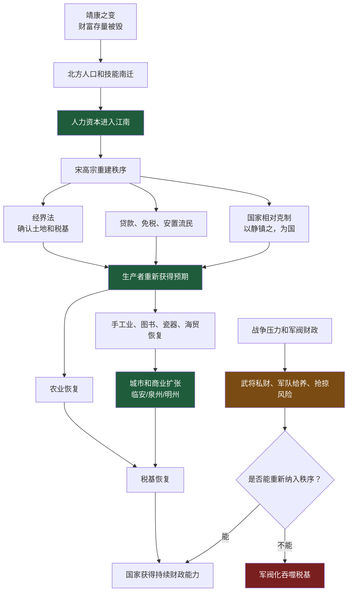
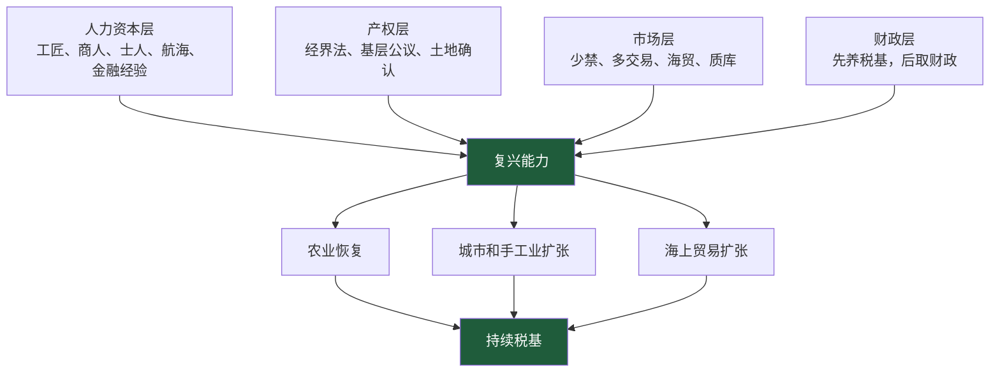
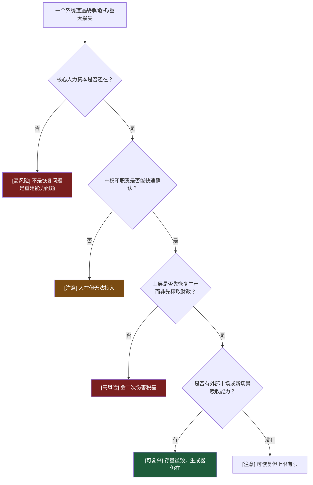
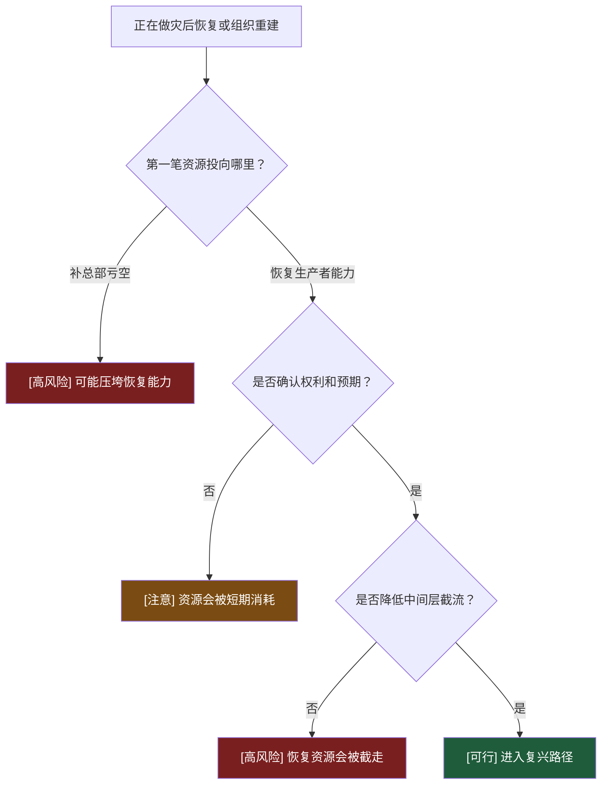

# 第16-21章：为什么南宋在财富存量被毁后还能复兴？

**原文范围**：第16章「错位的忠诚」到第21章「金钱恨，何时灭」

**核心问题**：靖康之变后，北宋财富存量、都城、国库、人口秩序遭受重创，为什么南宋仍能快速恢复并创造新的经济高峰？

## 一句话答案

南宋复兴的关键不是财富存量，而是**人力资本、产权重建、市场规则恢复和国家克制**。金人能抢走金银和宫殿，却抢不走北宋数百年积累的工匠、商人、技术、海贸能力和组织经验；宋高宗通过经界、轻税、恢复生产、约束官僚和允许民间分工，把这些能力重新接入江南，财富就能再生。

## Step 0：骨架提取

## 核心机制拆解

**1. 战争毁掉财富存量，不一定毁掉财富生成器。**

靖康之变中，金人抢走大量金银、器物、工匠，汴京人口和财富遭毁灭性打击。但财富生成器不只是金银，还包括技术、商业网络、航海能力、金融经验、城市消费结构和教育体系。

南宋的复兴证明：只要人力资本和组织能力还在，财富存量可以再生。

**2. 南宋复兴先做“再生产能力修复”，不是先做“财政榨取”。**

宋高宗对归正人、流民给土地、贷款、种子、牛具，并长期免租赋。经界法让人自报土地、甲内公议，再由官府确认。这个方法的高明处是绕开低效官僚，让基层自己完成初始产权确认。

可执行判断：灾后恢复能不能成，先看政策是让人恢复生产，还是先让人补财政窟窿。

**3. “以静镇之，为国”是南宋复兴的政治底层。**

南宋初年外有金人，内有军阀和民军，社会信用被战争摧毁。此时最怕官员继续折腾基层。宋高宗的策略是让社会先安定、让民间恢复交易，不让官僚再随意伸手。

这不是软弱，而是保护税基和人力资本。

**4. 南宋市场繁荣来自低干预和高技能的结合。**

南宋瓷器、图书、造船、纺织、海贸、质库等行业发达，是因为江南承接了北方人力资本，又拥有海上贸易空间。临安成为不夜城，不是皇帝规划出来的，而是生产、消费、金融、物流共同生长出来的。

**5. 战和问题不是道德二选一，而是财政和能力约束。**

岳飞等武将的叙事常被道德化处理，但本书强调军队背后的钱。南宋军队给养来自土地、专卖、中央补贴乃至抢掠。能不能打，不只取决于忠诚，还取决于财政能否持续供给并约束军队。

“和”如果换来恢复生产的时间，就是财政修复工具；“战”如果没有供给能力，会把社会重新拖回抢掠。

**6. 南宋铜钱世界货币化是优势，也是约束。**

南宋产业强，周边国家愿意接受宋钱，铜钱外流成为区域交易媒介。这说明南宋经济强大。但世界货币会带来两难：要维持外贸，钱要流出去；要维持国内交易，又不能让钱流失过多。

## 关键概念边界

**财富存量 vs 财富生成器。**

金银、粮仓、宫殿是存量；技能、信用、组织、市场网络是生成器。复兴看生成器，不先看存量。

**流民安置 vs 普通救济。**

救济只是让人活过今天；安置是让人重新成为生产者。南宋的贷款、免税、经界，目标是后者。

**战 vs 和。**

战不是天然高尚，和也不是天然屈辱。判断标准是它是否保护或恢复国家的长期再生产能力。

**世界货币优势 vs 钱荒。**

外部愿意用你的货币，证明产业强；但如果货币大量外流，国内会出现流动性压力。优势和风险同时存在。

## 南宋复兴的四层结构

## 正例、边界例、反例伪装

**正例：经界法。**

让基层自报和甲内公议，官府确认产权与税基。它不是完美现代产权，但足以让农民重新投入生产。

**边界例：岳家军秋毫无犯。**

不是单纯道德高，而是背后有襄阳六郡收入、禁榷收入和中央补贴。军纪依赖财政供给。

**反例伪装：金人抢走巨额财富，所以金国应更强。**

抢来的财富存量不能替代制度和人力资本。没有复杂分工吸收，财富只是消费品或赏赐品。

**正例：南宋海贸。**

海上贸易把南宋产业能力接入外部需求，扩大了财富生成空间。

## 可执行模型

**诊断入口：一个组织或国家遭受重大破坏后，判断能否复兴**

**预防入口：正在做灾后恢复/组织重建**

## 接入已有体系

**与“备份的不只是数据，而是能力”同构。**

系统灾备里，备份数据库不够，还要备份部署流程、人员经验、密钥、监控、客户支持。南宋也是这样：金银丢了，但生产流程、技术人才和贸易网络还在。

正向迁移：看国家复兴，看人力资本和组织能力。

反向迁移：做企业风控，看关键能力是否可迁移，而不是只看现金储备。

**与“先恢复税基，再征税”互补。**

第1章讲财富循环，这里补充恢复顺序：危机后不能先问能收多少钱，而要先问谁还能生产、如何让他愿意生产。

## 一句话总结

南宋复兴说明，财富存量被毁不是终局，只要人力资本、产权预期和市场规则还能重建，财富可以再生；灾后最危险的不是没钱，而是上层急着收钱，把最后的财富生成器也拆掉。
