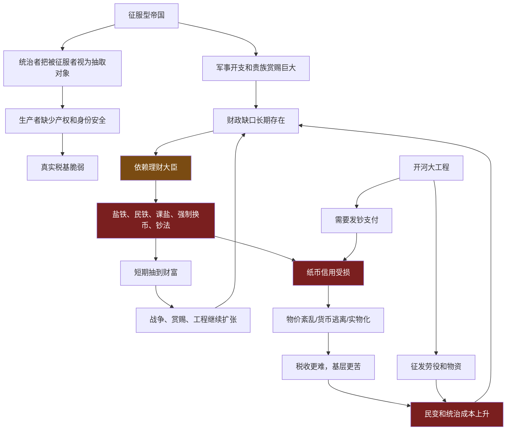
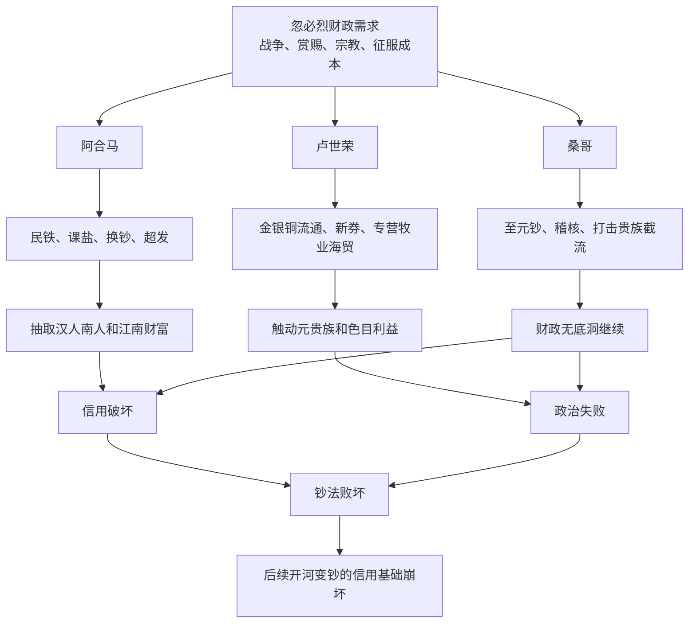
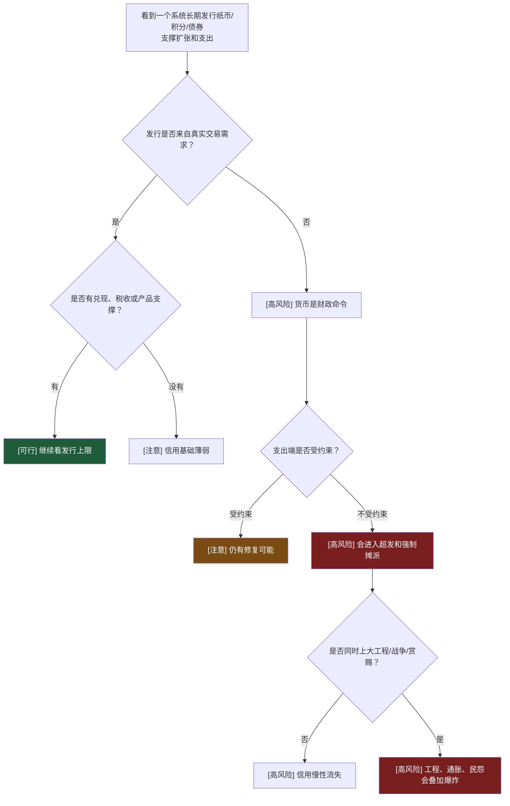
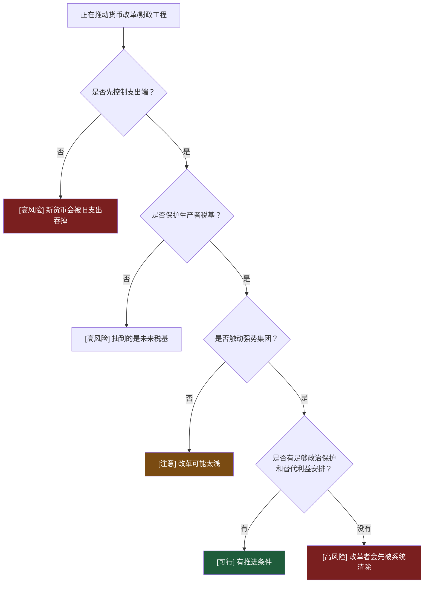

# 第22-26章：元代为什么会毁于纸币和财政工程？

**原文范围**：第22章「忽必烈和他的理财师们」到第26章「开河变钞祸根源」

**核心问题**：元帝国拥有横跨欧亚的军事力量，为什么会在纸币、财政工程和理财大臣循环中快速败坏？

## 一句话答案

元代毁于纸币和财政工程，是因为它把货币当成征服者抽取财富的命令，而不是建立在生产、税基和信用之上的交易协议；忽必烈及后继者不断用中统钞、至元钞、至大银钞和财政工程填补战争、赏赐、宗教、贵族分赃的无底洞，纸币信用被反复透支，最终“开河”和“变钞”把劳役、通胀、腐败和民变压到同一个爆点上。

## Step 0：骨架提取

## 核心机制拆解

**1. 元代纸币的根本问题不是“纸”，而是信用来源错误。**

纸币可以成功，宋代交子已经证明过。元代的问题是：纸币不是从交易需求中长出来，而是从财政抽取需求中压下去。持币人不是因为方便而接受，而是因为权力强迫。

可执行判断：纸币是否危险，不看材质，看它是交易协议还是征收命令。

**2. 征服型财政没有“养税基”的耐心。**

元帝国早期对北方和南方人口的处理，带有强烈征服者视角：汉人、南人是可抽取对象，不是需要长期保护的税基。驱口、牧地化、身份等级、强制征收，会直接削弱生产者投入意愿。

这使纸币缺少最重要支撑：稳定增长的真实经济。

**3. 阿合马模式：财政天才也是信用破坏者。**

阿合马能给忽必烈弄来钱，靠的是：

- 民铁：没收铁场和驱口，强制生产农具，再强迫农民用粮食购买。
- 课盐：把盐税按人口和区域硬摊给地方，不管能不能卖掉。
- 江南换币：以中统钞替换南宋会子，收走备兑金银，然后超发中统钞。

这些操作短期提高国库收入，长期摧毁市场信用和族群信任。

**4. 卢世荣模式：技术上有想法，政治上无生路。**

卢世荣试图恢复金银铜流通、发行有备新券、扩大真实财政收入，同时把财政压力转向元贵族和色目商人。这在技术上比单纯超发更合理。

但他触动强势集团：元贵族、色目人、既得利益官僚。没有政治保护，财政技术再高也活不下来。

边界：好方案如果没有权力结构支持，会比坏方案死得更快。

**5. 桑哥模式：试图修复钞信，最后仍被财政无底洞吞掉。**

桑哥发行至元宝钞，试图以金银为本位、让旧中统钞自然消亡。但战争、赏赐和工程继续要钱，至元钞很快超发。随后他用严厉稽核打击官僚和贵族，又把自己推到所有强势集团对立面。

这说明：货币改革不能单独修复支出失控。

**6. 开河变钞是多重风险叠加。**

治理黄河本来是公共工程，但在元代结构里，大工程会同时触发：

- 征发劳役和物资。
- 官吏上下其手。
- 财政不足导致发钞。
- 纸币贬值导致基层实际负担加重。
- 灾民、役夫、破产农民聚集。

所以“开河”和“变钞”不是两个独立事件，而是同一个财政危机的工程端和货币端。

## 关键概念边界

**纸币信用 vs 强制流通。**

信用是人们相信未来还能用；强制流通是今天不收会受罚。强制可以制造短期接受，不能制造长期信任。

**理财大臣 vs 财政制度。**

阿合马、卢世荣、桑哥都是个人理财能力强，但制度没有约束支出和保护税基，个人能力越强，越会成为抽取工具。

**通缩 vs 通胀。**

元代既出现过钞少导致的通缩，也出现过超发导致的通胀。两者都不是核心，核心是货币供应与真实交易、税收、信用之间断裂。

**公共工程 vs 财政工程。**

治理黄河可以是公共工程；如果工程同时服务于权力动员、强制征发和发钞融资，就会变成财政工程。

## 元代理财大臣谱系

## 正例、边界例、反例伪装

**正例：江南换币。**

以中统钞换南宋会子，如果有足额备兑和稳定发行，可能是统一货币；实际操作中先收备兑、再超发，是典型货币掠夺。

**边界例：卢世荣恢复金银铜。**

方向上是试图重建货币锚，但如果没有真实储备、没有贵族支持、没有支出约束，会被政治结构吞掉。

**反例伪装：治理黄河。**

表面是利国利民公共工程，实际落入征发、贪腐、发钞和民变联动。好目标不保证好机制。

**正例：强制税赋用钞。**

让税收必须用纸币缴纳，可以制造纸币需求；但如果纸币同时被超发，它会变成国家向民间转嫁贬值成本的工具。

## 可执行模型

**诊断入口：一个系统用内部货币或债券支撑长期扩张**

**预防入口：正在推动货币改革或财政工程**

## 接入已有体系

**与“没有预算约束的服务会吞掉所有扩容”同构。**

系统里如果某个服务没有调用上限，任何新增资源都会被它吃掉。元帝国的战争、赏赐和宗教开支就是无上限服务。钞法改革只是扩容，不能解决吞吐失控。

正向迁移：看货币改革，先看支出端有没有限流。

反向迁移：做系统优化，别只加机器，先找无限调用源。

**与“征服者心态破坏长期税基”互补。**

上一组南宋说明人力资本能复兴；元代说明如果统治者不把生产者当长期资产，而当可抽取对象，人力资本会被压制或逃离，货币没有真实支撑。

## 一句话总结

元代不是毁于“纸币”这个形式，而是毁于把纸币当作征服者抽财富的命令；当支出无上限、税基被压坏、强势集团不受约束时，任何新钞和大工程都会变成同一个结果：今天多印一张纸，明天多一个流民。
