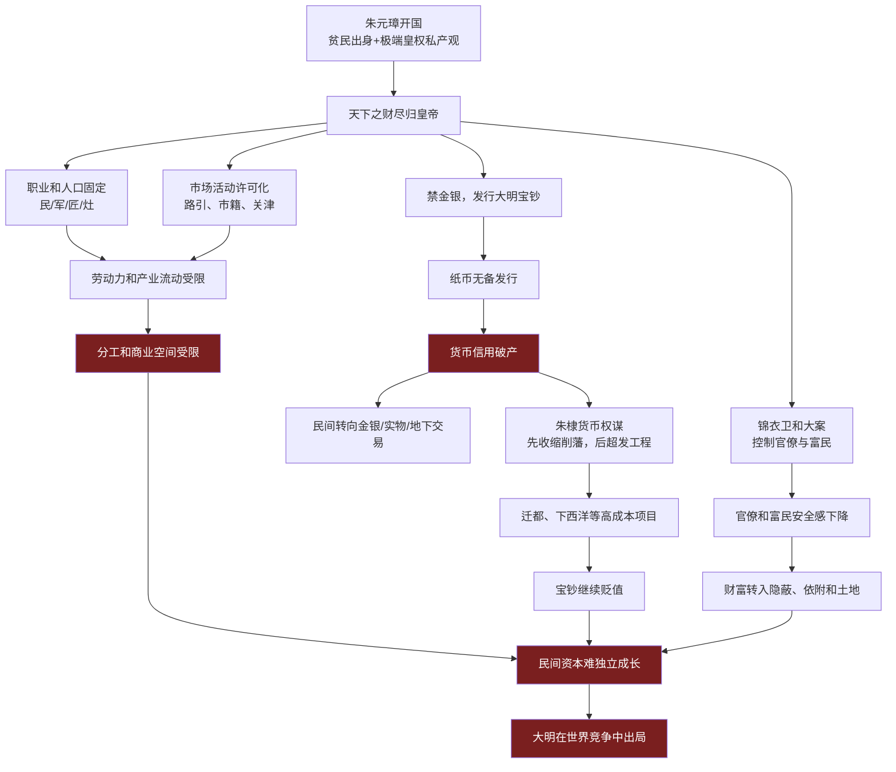
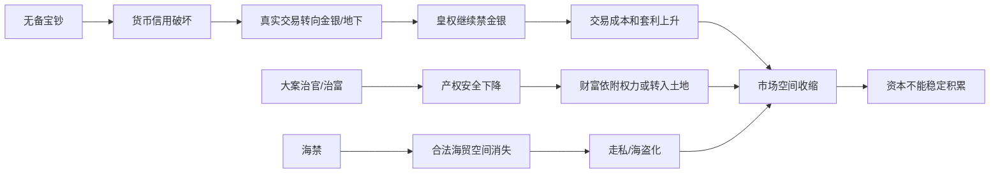
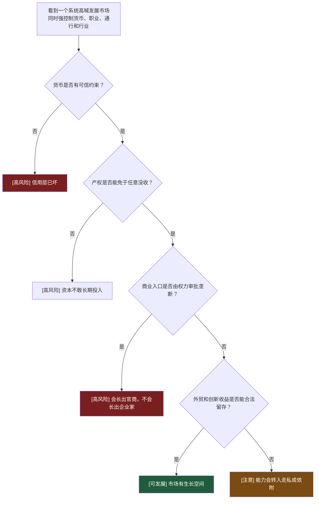
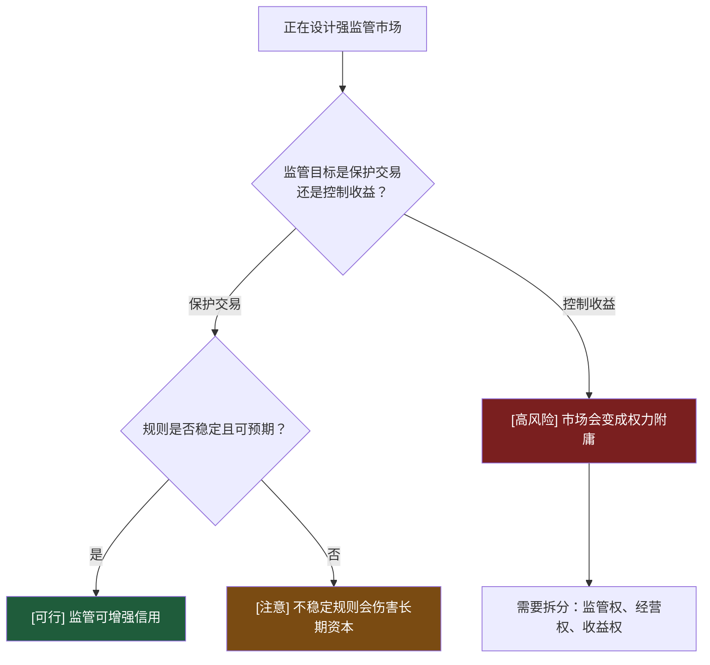

# 第27-35章：明代皇权为什么亲手毁掉国家信用和市场生长空间？

**原文范围**：第27章「朱重八的家庭经济学」到第35章「出局的大国」

**核心问题**：明代为什么在开国后没有沿着宋元以来的商业、纸币和海贸经验继续发展，反而亲手毁掉国家信用和市场空间？

## 一句话答案

明代皇权把天下视为皇帝私产，试图用户籍、职业、货币、通行、海禁、特务和官营体系把所有人固定在皇权设计的格子里；朱元璋无备发行大明宝钞并禁金银，朱棣又把货币当削藩和工程融资工具，后续皇店官店、海禁和官商合流继续压缩民间市场，最终国家信用破产，市场无法长出独立资本和创新能力。

## Step 0：骨架提取

## 核心机制拆解

**1. 朱元璋不是保护小民，而是把天下变成家产。**

朱元璋出身贫寒，对贪官豪强极端痛恨，但他的解决方式不是建立稳定产权和市场规则，而是让整个帝国服从皇帝个人意志。民、军、匠、灶等身份固定，出行要路引，经商要市籍，行业要管制。

这不是民本，而是家产式控制。

**2. 大明宝钞失败的根因是国家信用自毁。**

朱元璋发行大明宝钞，却没有足额备兑，还禁止金银交易，试图让纸币靠皇权命令流通。结果纸币迅速贬值，官员俸禄、税收、交易都被拖入新钞和昏钞套利。

可执行判断：货币信用不能靠“必须接受”建立，只能靠“接受后不会吃亏”建立。

**3. 反腐大案也可能是财富重分配工具。**

郭桓案等大案表面是惩贪，实际牵连大量官员和富民，田产官没，财富回到皇权手中。反腐如果没有法治边界，会变成皇权重新洗劫社会财富的工具。

边界：惩治腐败是约束权力；借腐败名义没收全社会财富，是另一种权力扩张。

**4. 朱棣用货币完成权力斗争。**

靖难中，朱棣盘踞北平，那里金银铜钱流通更自由，真实货币帮助他获得物资、情报和支持。登基后，他反而恢复禁金银并收缩宝钞流通，用货币收缩削弱诸王财富，完成削藩。

随后迁都北京、下西洋等高成本项目又靠宝钞超发支撑。货币从交易协议变成皇权工具。

**5. 郑和下西洋不是资本主义海贸，而是皇权工程。**

它规模宏大，技术惊人，但没有形成稳定商业公司、民间资本、税收回流和海外产权保护。它更像皇权展示、朝贡秩序和政治工程，而不是可持续贸易制度。

边界：远航不等于海洋资本主义。关键看是否形成民间投资、利润留存、制度保护和国家财政正反馈。

**6. 皇店官店把商业最后也拉进权力逻辑。**

嘉靖以后皇店、官店、当铺、盐茶等行业不断被皇帝和官僚控制。官商合流后，财富分配取决于官场位置，不取决于技术、管理和长期经营。

资本无法稳定积累，创新也就缺少承载者。

**7. 海禁把合法贸易推给黑社会。**

海外贸易利润巨大，但“片板不得下海”让正常商人无法合法经营。结果真正有航海能力的人变成走私者和海盗，国家既收不到税，也失去海上秩序。

## 关键概念边界

**皇权私产观 vs 国家财政。**

国家财政至少承认公共支出和制度约束；皇权私产观把天下财富视为皇帝家产，税收、货币、劳役、产业都可按个人意志调用。

**反腐 vs 掠夺式清洗。**

反腐针对明确违法和程序证据；掠夺式清洗通过大案扩大牵连、没收财富、制造恐惧。

**远航能力 vs 海洋制度。**

郑和舰队证明明朝有航海和造船能力，但没有证明有海洋商业制度。能力没有制度承接，会变成一次性工程。

**官商 vs 商人。**

商人靠交易、管理、风险承担赚钱；官商靠牌照、关系、强制和信息优势赚钱。两者同名“商业”，机制完全不同。

## 明代前中期的信用破坏链

## 正例、边界例、反例伪装

**正例：大明宝钞。**

无备发行、禁金银、强制接受，最终信用崩坏。它是国家信用自毁的典型案例。

**边界例：永乐宝通钱。**

朱棣铸铜钱主要用于海外贸易，国内不作为稳定货币体系。说明明朝知道外部贸易需要硬通货，却不愿在国内恢复真实货币秩序。

**反例伪装：郑和下西洋。**

看似全球化和海洋雄心，实际缺少商业制度和财政正反馈。不能把大船队等同于资本主义。

**正例：皇店官店。**

皇帝和官僚直接进入商业，用权力排挤民间，商业不再是创新系统，而是权力变现系统。

## 可执行模型

**诊断入口：一个国家或组织强控制所有资源，却说要发展市场**

**预防入口：正在设计强监管市场**

## 接入已有体系

**与“系统把所有对象锁死后失去演化能力”同构。**

明初把人分成民、军、匠、灶，限制迁徙和职业，类似把系统所有模块写死配置。短期可控，长期无法适应新场景。

正向迁移：看制度活力，要看人和资本能否移动到更高效率位置。

反向迁移：做系统设计时，不要为了控制把所有扩展点封死。

**与“信用是协议层”互补。**

大明宝钞说明：协议层一旦被最高权力随意破坏，后面再多行政命令也只能制造绕行，而不能恢复信任。

## 一句话总结

明代皇权毁掉市场空间，不是因为它没有能力，而是因为它想把货币、人口、职业、贸易和财富都变成皇帝家产；当国家信用只剩命令、商业入口只剩审批、财富安全只剩依附，资本就不会长成企业，只会长成官商、土地和地下交易。
