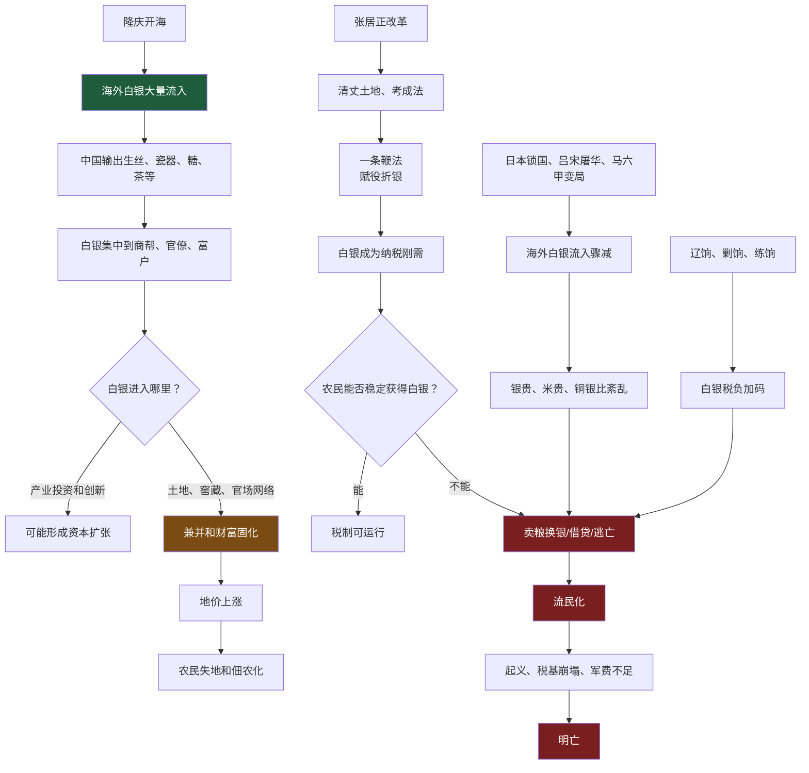
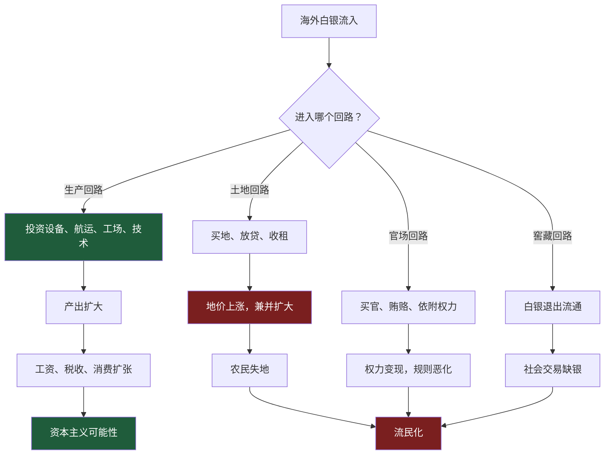
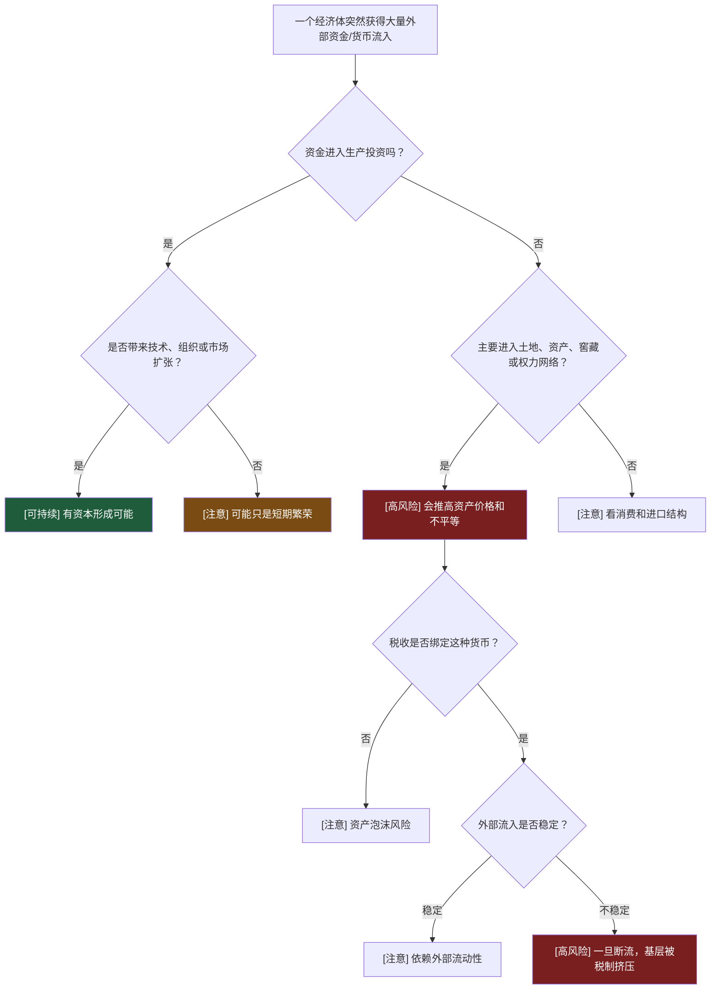
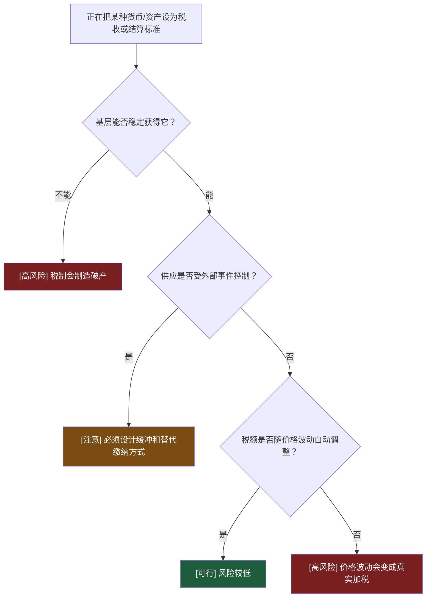

# 第36-40章：为什么拥有全球巨量白银的大明，仍然没有走向资本主义，反而走向流民化和灭亡？

**原文范围**：第36章「白银帝国」到第40章「白银帝国」

**核心问题**：隆庆开海后，大量海外白银流入中国。为什么这些白银没有像西欧那样推动资本主义和工业化，反而加剧土地兼并、财政危机和明末流民化？

## 一句话答案

大明拥有巨量白银，但白银没有进入生产创新回路，而是进入官僚、商帮、土地和窖藏回路；一条鞭法又把白银变成税收刚需，使农民被迫用市场获得银子。海外银流一断，银价、米价、税负同时压向基层，崇祯再加辽饷、剿饷、练饷，最终白银从流动性工具变成压垮生产者的硬约束。

## Step 0：骨架提取

## 核心机制拆解

**1. 白银流入不是资本主义，白银进入生产回路才可能是资本。**

西欧得到美洲白银后，大量新商品、新航路、新公司、新产业被激活，白银成为市场扩张和生产分工的催化剂。

明代则主要输出成熟商品，换回白银。输入的不是新产业和新技术，而是支付媒介。白银集中到官僚、商帮和富户后，大量进入土地、窖藏和官场网络，没有形成稳定的产业再投资机制。

可执行判断：货币流入能否推动资本主义，看它是否进入“扩大再生产”，不是看总量。

**2. 隆庆开海打开的是白银通道，不是自由海贸制度。**

出海需要船引、担保、审批。普通人很难合法进入。高利润贸易仍然容易被权力、商帮和关系网络控制。

这和西欧王室支持特许公司不同。西欧国家能从海外贸易中形成财政激励，明朝国家财政并没有稳定分享海贸收益，更多收益落入私人和灰色网络。

**3. 张居正改革是一次高水平财政修复，但留下银本位风险。**

张居正通过考成法约束官僚，清丈土地恢复税基，一条鞭法把赋役折银，减少实物税和徭役中的胥吏盘剥。

它的正面效果很明显：财政收入改善，太仓有银，国家能力短期恢复。

但它也把所有纳税人推入白银体系。农民可以种粮，但税要银。只要白银供应稳定，这能运行；一旦白银流入中断，农民就会被银价和粮价双重挤压。

**4. 万历矿税、榷税和后续党争把白银政治化。**

白银成为财政核心后，皇帝、官僚、矿监、税使、商帮、地方缙绅都围绕银子展开争夺。财富不再只是生产结果，也变成政治斗争的对象。

东林、阉党等冲突背后，不只是道德和门户，也有税负落在土地、商业、矿业和地方利益上的分配问题。

**5. 崇祯面对的是银荒、灾荒、兵荒三荒叠加。**

祯十年前后，日本锁国切断对日白银，吕宋屠华和西班牙衰落冲击马尼拉通道，荷兰攻占马六甲影响澳门和东南亚通道。海外白银流入骤减。

与此同时，陕西、河南连续灾荒，后金压力和流寇压力增加。朝廷却继续加征辽饷、剿饷、练饷，且都要白银。

这使普通农民面对一个无解问题：粮食少、银子贵、税不减。

**6. 明亡时不是没有银，而是银不在生产和财政可用位置。**

李自成进入北京后，在皇宫、官员、宦官处发现巨量白银。说明明朝不是绝对贫穷，而是财富高度集中和窖藏，国家向基层征不到可持续财政，基层也拿不到维持生命的资源。

这就是“白银帝国”的悖论：银子越集中，社会越缺钱。

## 关键概念边界

**白银流入 vs 资本形成。**

白银流入只是货币增加；资本形成要求白银进入生产设备、技术、组织、航运、工场和长期投资。

**开海 vs 海洋资本主义。**

开海只是允许部分贸易；海洋资本主义需要合法公司、产权保护、利润留存、国家海军保护和税收正反馈。

**一条鞭法 vs 加派。**

一条鞭法是简化税制、赋役折银；崇祯三饷是在银本位税制上追加财政负担。不能把改革本身和后续加派混为一谈。

**银荒 vs 没有财富。**

银荒是纳税和交易媒介短缺，不等于社会没有任何财富。问题是财富不能以制度要求的形式到达纳税人手里。

## 白银进入不同回路的结果

## 正例、边界例、反例伪装

**正例：张居正一条鞭法。**

在清丈和考成基础上，把赋役折银，减少实物税和徭役灰色空间，短期显著增强财政能力。

**边界例：隆庆开海。**

它打开白银流入和合法海贸空间，但审批、船引和权力网络仍限制普通资本进入。它是开放，但不是充分市场化。

**反例伪装：大明拥有世界大量白银，所以应该富强。**

白银总量不能说明富强。白银如果集中在官宦窖藏和土地兼并中，反而会挤压生产者。

**正例：崇祯三饷。**

辽饷、剿饷、练饷都针对真实财政压力，但在灾荒和银荒中加征，相当于从已破产基层继续抽银，直接扩大流民化。

**反例伪装：崇祯节俭勤政，所以亡国不是他的问题。**

勤政不能替代正确机制。每天批奏章但持续加派、错配财政、不能恢复基层再生产，仍会加速崩溃。

## 可执行模型

**诊断入口：一个经济体获得大量外部资金或流动性**

**预防入口：正在把某种外部货币或资产设为税收/结算标准**

## 接入已有体系

**与“流动性不等于资本”同构。**

企业融资到账后，如果投入研发、供应链、销售网络，就是资本；如果进入创始人套现、办公室装修、关联交易，就是流动性消耗。明代白银大量进入土地和窖藏，就是后者。

正向迁移：看一个社会是否资本化，不看钱多，看钱的去向。

反向迁移：看企业融资后是否健康，看资金进入增长飞轮还是资产泡沫。

**与“外部依赖型基础设施风险”同构。**

一条鞭法把白银设为税收基础，相当于系统关键依赖放在外部供应链上。日本锁国、吕宋断流、马六甲变化，就是外部依赖中断。

正向迁移：设计税制或结算系统，必须问关键结算物是否由自己控制。

反向迁移：做系统架构，不能让核心链路依赖一个不可控外部服务且无降级方案。

## 一句话总结

白银没有把大明带向资本主义，是因为它没有稳定进入生产和创新回路，而是进入土地、官场和窖藏；当税制又强迫所有人用白银交税时，海外银流一断，银本位就从商业润滑剂变成基层绞索。
