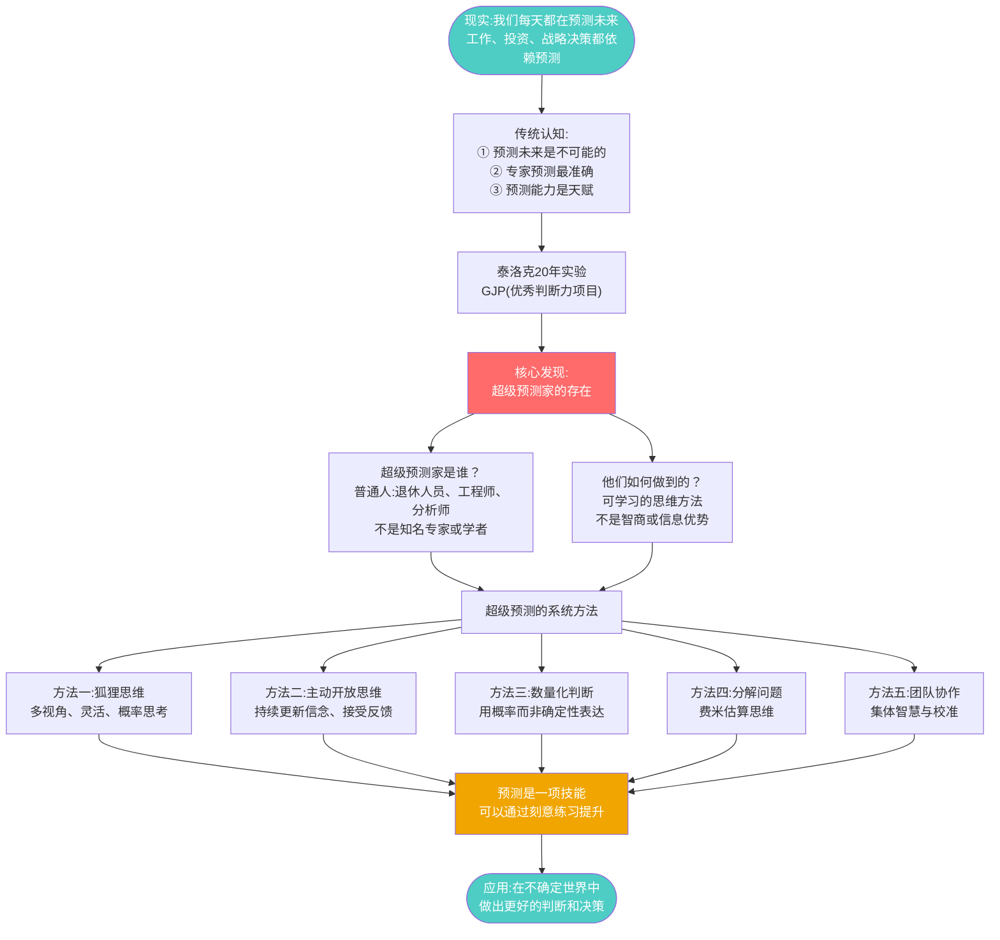
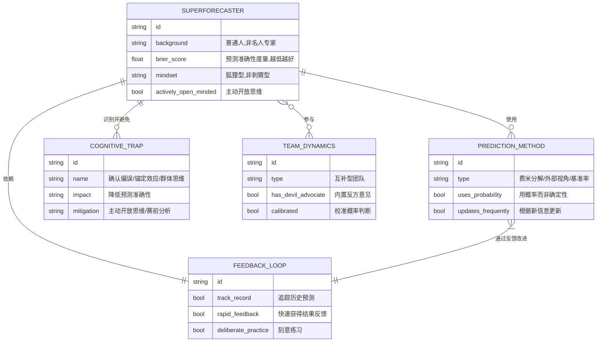
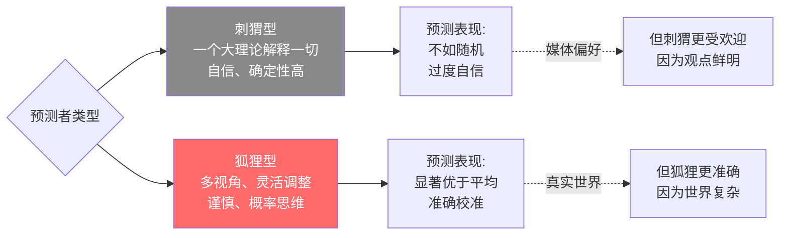
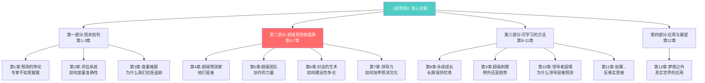

# 第零章:全书流图骨架——《超预测:预见未来的艺术和科学》
> 沈老师视角 · 2026-03-25

这本书在说一件事:预测能力不是天赋,是方法论的产物。超级预测家通过可学习、可训练的思维习惯,在预测准确性上系统性地超越专家和大众。

---

## 一、全书最高层抽象



**第一个要分清楚的边界**:预测 ≠ 占卜。预测是用概率表达不确定性,可以被量化评估(布里尔分数)。占卜是确定性断言,永远无法被证伪。

---

## 二、全书ER骨架



---

## 三、核心概念地图

### 3.1 刺猬 vs 狐狸(伯林分类法)



### 3.2 主动开放思维(Actively Open-Minded Thinking)

不是"开放思维"的鸡汤版,而是可操作的认知习惯:
- **主动寻找反驳自己观点的证据**
- **将信念视为假说,而非身份认同**
- **根据新证据更新概率判断**
- **区分"想要真相"和"想要证明自己对"**

### 3.3 布里尔分数(Brier Score)

预测准确性的数学度量:
- 范围:[0, 2],0为完美预测
- 计算:预测概率与实际结果之间的均方误差
- 可分解:校准度 + 分辨度 + 不确定性
- **关键**:让预测可被评估,不再是"事后都能解释"

---

## 四、全书章节结构树



---

## 五、全书可执行模型(5行版)

**超预测的运作机制**:

```
输入:需要预测的不确定事件
↓
处理:①外部视角定基准率 → ②内部视角调整 → ③量化为概率 → ④追踪反馈 → ⑤快速更新
↓
输出:校准良好的概率判断(而非确定性断言)
↓
长期结果:布里尔分数显著优于对照组
```

**触发条件 → 结果**:
- 当面对复杂、不确定问题 → 使用费米分解,拆成可估算的子问题
- 当团队产生群体思维 → 引入"建设性异议者"角色
- 当新信息出现 → 用贝叶斯更新概率,不坚持初始判断
- 当预测准确性被追踪 → 人们自然变得更谨慎和校准

**使用边界**:
- 黑天鹅事件(定义上的不可预测)不适用
- 需要快速直觉反应的场景(如战场)不适用
- 价值判断(应该怎样)无法用此方法,只能用于事实判断(会怎样)

---

## 六、与已有认知体系的接入点

### 同构关系:
- **与卡尼曼《思考,快与慢》同构**:系统1(直觉)vs 系统2(深思),对应刺猬 vs 狐狸
- **与德鲁克"有效性可学习"同构**:都认为优秀表现不是天赋,是方法

### 互补关系:
- 填补了"如何在不确定性下做判断"的操作空缺
- 提供了"认知偏误"(卡尼曼)的对抗工具(主动开放思维)

### 矛盾关系:
- 与格拉德威尔《眨眼之间》存在张力:
  - 格拉德威尔强调直觉专家的价值
  - 泰洛克强调专家直觉常常失效
  - **条件差异**:直觉在重复性、快反馈领域有效(消防员);在复杂、慢反馈领域失效(地缘政治)

---

## 七、全书关键数据锚点

- **泰洛克第一轮研究**:20年,284位专家,28000个预测 → 专家不如简单算法
- **GJP项目**:4年,20000+参与者,数百万预测 → 超级预测家存在且可复制
- **超级预测家占比**:约2%,但准确性比普通参与者高30%
- **团队效应**:超级预测家团队比单独个体再提升23%准确性
- **布里尔分数改善**:经过训练,普通人可提升10-15%

---

## 八、沈老师的元评论

这本书的真正价值不在于"预测很重要"(这是常识),而在于:

1. **建立了可评估的体系**:布里尔分数让预测不再是"事后诸葛亮可以随意解释"的领域
2. **证明了可学习性**:通过对照实验证明,不是智商,不是信息,是方法
3. **给出了操作工具**:费米分解、外部视角、概率校准,都是可以立刻上手的

这是一个"把软技能硬化"的案例。以往"判断力"被视为不可量化的艺术,泰洛克把它变成了可度量、可训练、可迭代的技能。

从方法论角度看,这本书和我的认知建模思路完全一致:
- **能画出来才算懂** → 能用概率表达才算真正理解不确定性
- **裁判=理解** → 做预测并接受反馈,是建立判断力的唯一路径
- **孤岛知识会消失** → 预测必须可追踪,否则永远学不会

---

*全书骨架完成。后续章节将逐一展开每个维度的建模过程。*
