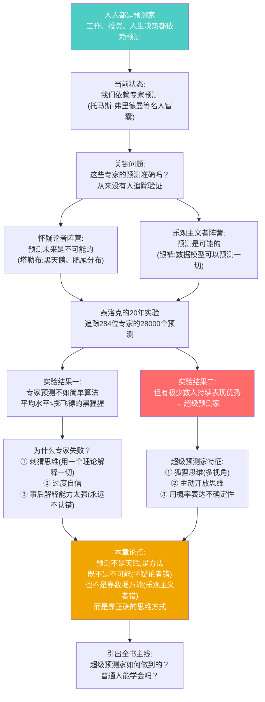
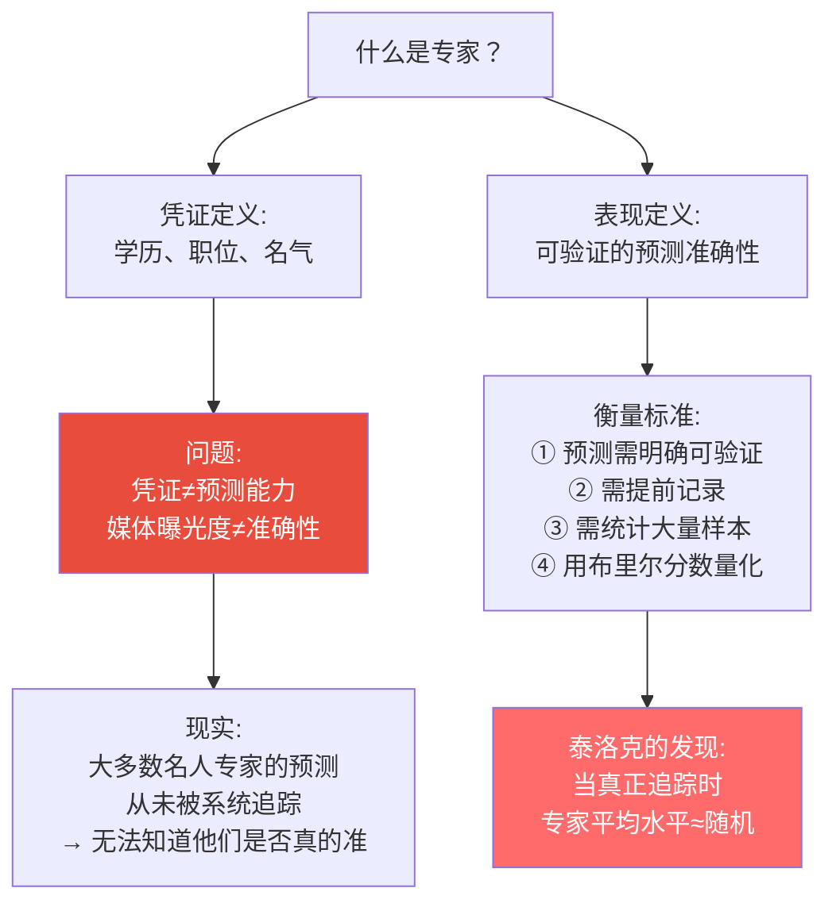
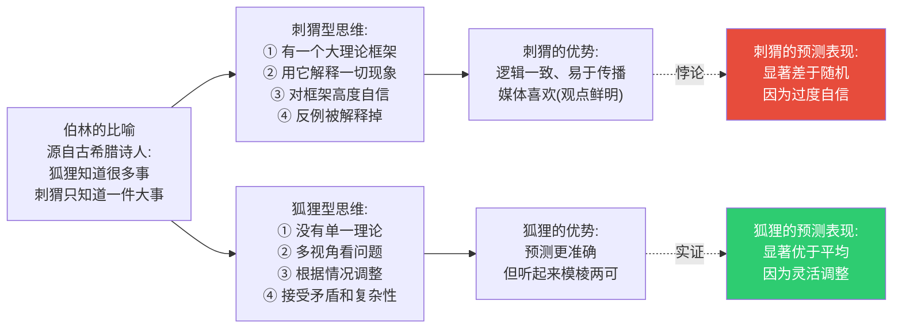
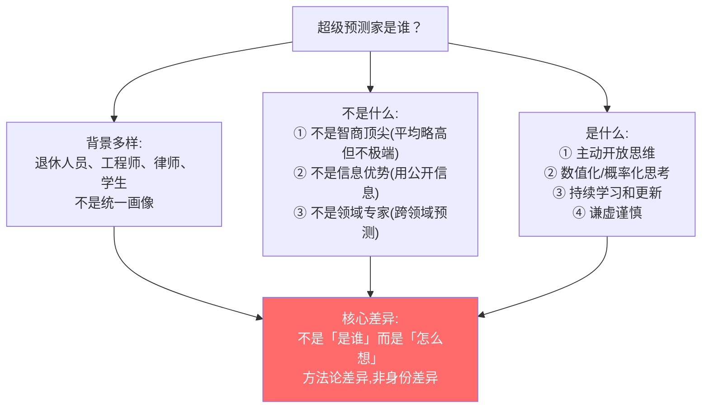
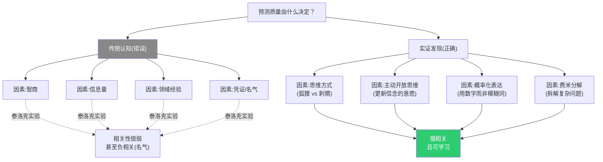

# 第1章:乐观的怀疑论者
> 沈老师视角 · 2026-03-25

这章的核心命题:预测不是不可能,但传统的专家预测系统已经失效。超级预测家的存在证明了预测能力可以被系统性地培养。

---

## 一、本章核心流图

---

## 二、关键概念裁判

### 概念1:专家预测的失效

**常见误解**:
一个在《纽约时报》发表专栏、被白宫咨询、拥有几百万粉丝的国际关系专家,他的预测应该比普通人准确得多。

**边界在哪里**:

**精确边界**:
- 专家在**说明现状**时有价值(深度知识)
- 专家在**预测未来**时常常失败(过度自信+刺猬思维)
- 专家的**媒体影响力**与**预测准确性**负相关(越出名越不准,因为观点鲜明)

**判断例子**:
- 例1:一位经济学家解释"2008年金融危机的成因" → **专家有价值**(说明现状)
- 例2:同一位经济学家预测"2025年会发生类似危机" → **专家不比普通人准**(预测未来)
- 例3:一位从不出镜的分析师,预测准确性被追踪了5年,布里尔分数0.18 → **真正的专家**(用表现定义)

---

### 概念2:刺猬 vs 狐狸(伯林分类法)

**第一直觉(常见的错法)**:
刺猬是指思维简单、固执的人;狐狸是指思维灵活、聪明的人。

**哪里错了**:

**精确区分**:
- 刺猬 ≠ 愚蠢,他们往往很聪明,理论很深刻
- 狐狸 ≠ 没有立场,他们只是不让理论凌驾于证据之上
- **核心差异**:当现实与理论冲突时,刺猬调整现实的解释,狐狸调整理论

**判断例子**:
- 刺猬例子:马克思主义者用阶级斗争解释一切;奥地利学派用市场失灵解释一切 → 理论一致,但预测常错
- 狐狸例子:超级预测家比尔·弗莱克,面对乌克兰问题,综合历史、地缘、经济、心理等多个视角 → 不够简洁,但更准确
- 边界例:物理学家用万有引力理论预测行星轨迹 → 这是刺猬思维,但**在简单系统中有效**;在复杂社会系统中失效

---

### 概念3:超级预测家(Superforecaster)

**定义**:
在大规模预测竞赛中,准确性持续位于前2%的普通人。

**关键特征**:
1. **不是名人专家**:退休人员、工程师、分析师,没有媒体影响力
2. **可验证的表现**:每个预测都被记录,用布里尔分数量化
3. **可持续**:不是一次幸运,而是连续多年保持优秀
4. **可学习**:他们的方法可以被传授给他人

**边界例**:
- 一位诺贝尔经济学奖得主预测经济,但从不追踪验证 → **不是超级预测家**(无验证)
- 一位工程师在GJP项目中连续3年进入前2% → **是超级预测家**(有验证记录)
- 一位超级预测家在自己的专业领域(如IT)做预测 → **不能确定**(需看是否用超预测方法,还是依赖专业直觉)

---

## 三、结构可视化:预测质量的决定因素

---

## 四、本章可执行模型

### 核心洞察:
预测能力的来源不是"知道更多",而是"思考方式不同"。

### 可操作的区分:

| 维度 | 刺猬/专家模式 | 狐狸/超级预测家模式 |
|------|---------------|---------------------|
| **面对问题** | 调用理论框架 | 分解为子问题 |
| **表达判断** | 确定性断言 | 概率化表达 |
| **新信息** | 解释为符合理论 | 更新先验概率 |
| **反例** | 特殊情况/噪音 | 修正模型的信号 |
| **自我定位** | 理论的传播者 | 假说的测试者 |

### 使用边界:
- **适用**:需要对不确定事件做判断的场景(商业决策、战略规划、投资)
- **不适用**:
  - 简单确定性系统(物理定律)
  - 需要快速直觉的场景(急诊室、战场)
  - 价值判断("应该怎样"而非"会怎样")

---

## 五、接入已有认知体系

### 同构关系:
- **与德鲁克"有效性可学习"同构**:
  - 德鲁克:管理能力不是天赋,是实践
  - 泰洛克:预测能力不是天赋,是方法
  - **可互借的案例**:都强调追踪记录的重要性(德鲁克的时间日志 ↔ 泰洛克的预测追踪)

- **与卡尼曼"系统1 vs 系统2"同构**:
  - 刺猬思维 ≈ 系统1(快速、直觉、自信)
  - 狐狸思维 ≈ 系统2(缓慢、分析、谨慎)
  - **差异**:卡尼曼侧重个体认知,泰洛克侧重可追踪的表现

### 互补关系:
- 填补了"如何应对不确定性"的操作空缺
- 卡尼曼告诉我们**认知偏误是什么**
- 泰洛克告诉我们**如何对抗认知偏误并产生更好的判断**

### 矛盾关系:
- **与格拉德威尔《眨眼之间》(直觉专家)的张力**:
  - 格拉德威尔:经验丰富的专家直觉很准(消防队长、艺术鉴定师)
  - 泰洛克:专家在复杂预测中常失败
  - **条件差异**:
    - 直觉在**重复性、快反馈**领域有效(象棋、消防)
    - 直觉在**复杂、慢反馈**领域失效(地缘政治、股市)
  - **解决方案**:识别问题属于哪个类型,选择对应工具

---

## 六、本章留下的悬念(引向后续章节)

1. **如何度量预测准确性？** → 第2章:布里尔分数
2. **超级预测家具体用什么方法？** → 第4-7章:方法论展开
3. **普通人能学会吗？需要多久？** → 第8章:训练与成长
4. **组织如何应用这套方法？** → 第12章:真实世界应用

---

## 七、沈老师的元评论

这一章最重要的不是"预测很难"(这是常识),而是建立了一个可被证伪的命题:

**传统命题(无法证伪)**:
- "预测未来是不可能的" → 任何成功预测都被解释为运气
- "专家最权威" → 失败的预测被事后解释掉

**泰洛克的命题(可被证伪)**:
- "超级预测家在统计上显著优于随机" → 用布里尔分数量化,可验证
- "预测能力可学习" → 通过训练实验,可验证

这个转变是从"哲学争论"到"科学研究"的关键。一旦可以度量,就可以改进;一旦可以改进,就可以传授。

从我的认知建模角度看:
- **能画出来才算懂** → 泰洛克强迫预测者用数字表达,不能含糊
- **裁判=理解** → 做预测并接受评估,是唯一的学习路径
- **孤岛知识会消失** → 不追踪的预测,永远不会形成真正的认知

这一章是全书的地基。后续所有方法论都建立在"预测可以被度量"这个基础上。

---

*第1章建模完成。核心:预测不是天赋,是方法;不是不可能,是需要正确的思维方式。*
