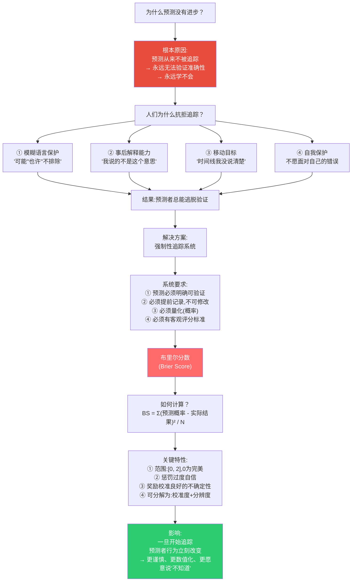
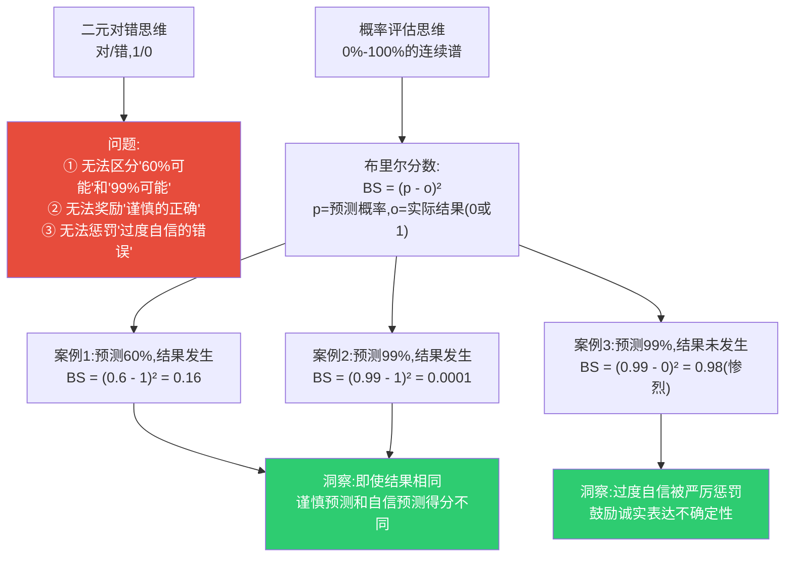
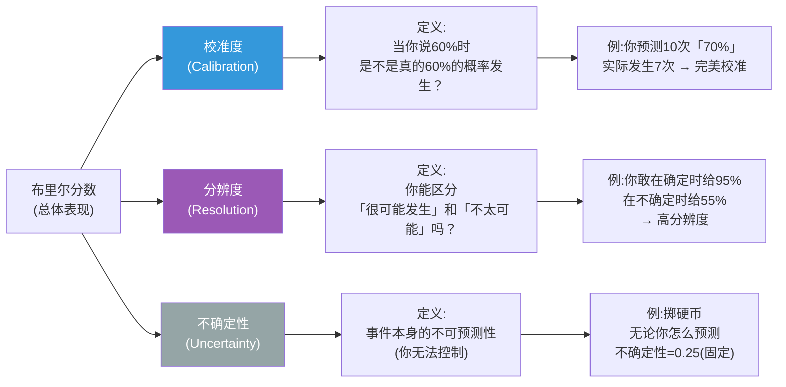
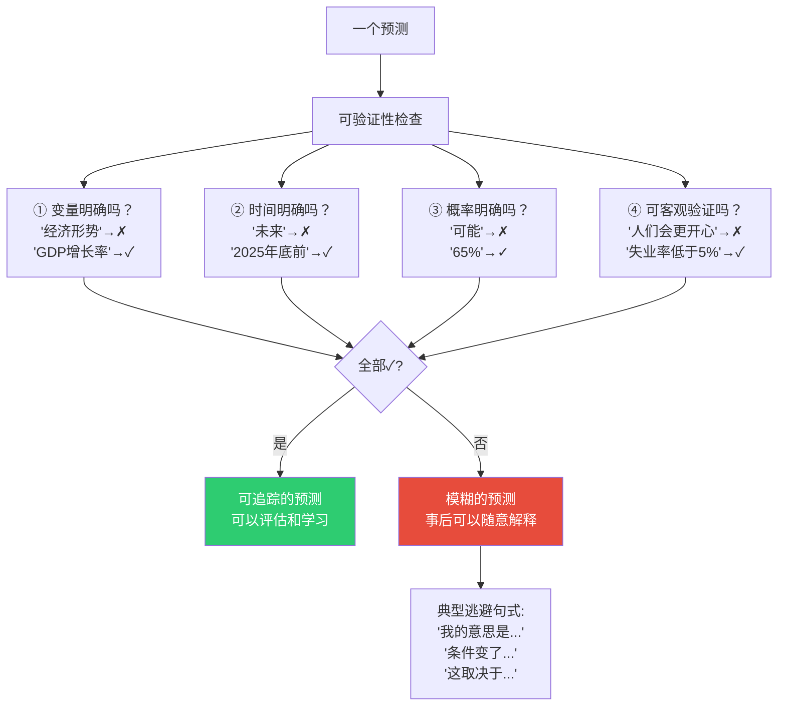
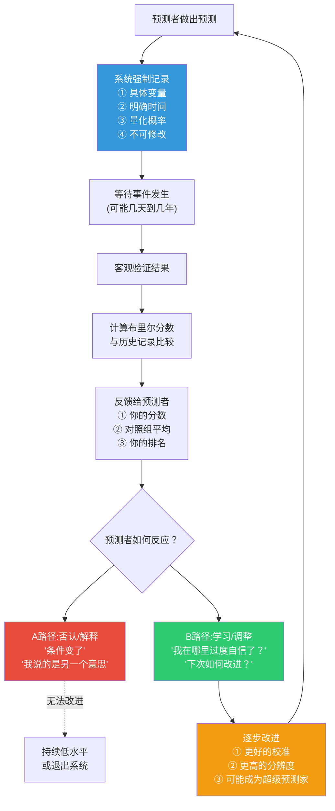

# 第2章:度量的关键——布里尔分数与追踪系统
> 沈老师视角 · 2026-03-25

这章的核心命题:你不能改进你不能度量的东西。布里尔分数让预测从"事后诸葛亮可以随意解释"变成"可被客观评估的技能"。

---

## 一、本章核心流图



---

## 二、关键概念裁判

### 概念1:布里尔分数(Brier Score)

**第一直觉(常见误解)**:
布里尔分数就是"对错率"——预测对了得0分,错了得1分,平均一下。

**哪里错了**:



**精确边界**:
- 布里尔分数 ≠ 准确率(accuracy),准确率只看对错
- 布里尔分数度量的是**概率判断的质量**,不只是结果对错
- **核心**:奖励"正确程度的不确定性",惩罚"错误的自信"

**判断例子**:

| 预测场景 | 预测概率 | 实际结果 | 布里尔分数 | 评价 |
|----------|----------|----------|------------|------|
| A: 明天下雨 | 70% | 下雨 | 0.09 | 良好 |
| B: 明天下雨 | 99% | 下雨 | 0.0001 | 优秀(但冒险) |
| C: 明天下雨 | 99% | 不下雨 | 0.98 | 糟糕(过度自信) |
| D: 明天下雨 | 51% | 下雨 | 0.24 | 诚实的不确定性 |

**边界例**:
- 预测"50%"然后对了 → BS=0.25,看起来不好,但这是**诚实表达无知**,好于虚假自信
- 预测"100%"然后对了 → BS=0,完美!但如果错了就是BS=1,**高风险策略**
- 长期平均BS=0.2 vs 0.25 → 看似差别小,但在数千个预测中,**这是显著差异**

---

### 概念2:校准(Calibration)与分辨度(Resolution)

**布里尔分数的分解**:



**关键洞察**:
- **好的预测家 = 高校准 + 高分辨度**
- 校准:诚实,不撒谎
- 分辨度:有判断力,能区分不同情况

**典型误区**:

| 类型 | 校准度 | 分辨度 | 表现 | 问题 |
|------|--------|--------|------|------|
| 永远说50% | 完美 | 零 | BS≈0.25 | 什么都没说 |
| 随便乱猜但诚实 | 好 | 低 | BS≈0.23 | 没判断力 |
| 总是过度自信 | 差 | 可能高 | BS>0.3 | 不诚实 |
| 超级预测家 | 优秀 | 高 | BS≈0.15-0.18 | 理想状态 |

---

### 概念3:可验证性(Verifiability)

**预测必须满足的条件**:



**边界例**:
- "美联储可能加息" → **不可验证**(可能=多少%?什么时候?)
- "美联储在2025年Q1加息的概率是70%" → **可验证**
- "特朗普会赢得大选" → **可验证**(结果明确),但如果不带概率,无法评估判断质量
- "特朗普有62%概率赢得2024年大选" → **完美可验证**

---

## 三、结构可视化:追踪系统的反馈循环



**关键洞察**:
- 追踪系统本身就是干预
- 一旦知道"会被验证",人们立刻变得更谨慎
- 区分了A型人(固定心态)和B型人(成长心态)

---

## 四、本章可执行模型

### 核心机制:度量 → 反馈 → 学习

```
条件:建立追踪系统
↓
强制要求:
① 预测必须明确可验证
② 提前记录,不可修改
③ 用概率表达(0-100%)
④ 用布里尔分数评估
↓
自然结果:
① 预测者更谨慎(不敢随便说)
② 更数值化(被迫量化不确定性)
③ 更愿意承认无知(50%也是信息)
④ 形成反馈学习循环
↓
长期结果:
① 整体预测质量提升
② 识别出超级预测家
③ 预测从艺术变成技能
```

### 使用边界:
- **适用**:任何需要对未来做判断的场景(商业、战略、投资)
- **前提**:事件必须可客观验证(不能是价值判断)
- **不适用**:
  - 极长时间线的预测(>10年,反馈太慢)
  - 无法量化的主观判断("艺术作品是否优秀")

### if-then规则:
- **如果** 预测被追踪 **则** 人们变得更谨慎、更准确
- **如果** 预测不被追踪 **则** 人们倾向过度自信、模糊表达
- **如果** 只看对错(不看概率) **则** 无法区分"谨慎的对"和"鲁莽的对"
- **如果** 用布里尔分数 **则** 奖励诚实的不确定性,惩罚虚假的自信

---

## 五、接入已有认知体系

### 同构关系:
- **与德鲁克"时间日志"同构**:
  - 德鲁克:只有记录时间,才知道时间去哪了
  - 泰洛克:只有记录预测,才知道判断力如何
  - **共同结构**:度量 → 觉察 → 改进

- **与"目标管理(OKR)"同构**:
  - OKR:目标必须可量化,才能验证
  - 预测追踪:预测必须可量化,才能评估
  - **共同原则**:模糊=无法改进

### 互补关系:
- 填补了卡尼曼《思考,快与慢》的操作空缺
- 卡尼曼识别认知偏误,但不告诉你如何改进
- 泰洛克提供工具:布里尔分数+追踪系统=可量化的改进路径

### 矛盾关系:
- **与"相信直觉"的常见建议矛盾**:
  - 常见建议:"相信你的第一直觉"
  - 泰洛克:追踪显示,未经训练的直觉常常错误
  - **条件差异**:
    - 在专家熟悉的重复性任务中,直觉可靠(象棋大师)
    - 在复杂、低反馈的环境中,直觉不可靠(经济预测)
  - **解决方案**:用追踪系统验证你的直觉是否可靠

---

## 六、本章实践检查清单

如果要在自己的工作中建立预测追踪系统:

- [ ] **明确性检查**:每个预测都能回答"什么变量?什么时间?多大概率?"
- [ ] **记录系统**:用电子表格/专门工具记录,不可事后修改
- [ ] **概率量化**:强制用数字(0-100%)表达,禁止"可能""大概"
- [ ] **定期评估**:事件发生后,计算布里尔分数,与历史对比
- [ ] **复盘机制**:每月/季度回顾:哪些预测过度自信?哪些过于谨慎?
- [ ] **分享结果**:如果是团队,公开追踪结果(制造轻度社会压力)

---

## 七、沈老师的元评论

这一章是全书的基础设施。没有追踪系统,后面所有的"超级预测方法"都无法验证。

**为什么追踪如此重要?**

因为人类大脑有一个致命缺陷:**事后诸葛亮偏误(Hindsight Bias)**。事情发生后,我们总觉得"我早就知道会这样",即使当时完全不确定。这个偏误让我们永远无法从预测错误中学习——因为我们根本不承认自己错了。

追踪系统破解了这个偏误:
1. **提前记录**:你无法事后修改
2. **量化表达**:你无法含糊其辞
3. **客观评分**:你无法自我欺骗

从我的认知建模角度:
- **能画出来才算懂** → 能用数字表达才算真懂不确定性
- **裁判=理解** → 追踪预测+接受评分=唯一的学习路径
- **孤岛知识会消失** → 不追踪的预测经验,不会累积成真正的判断力

这一章告诉我们:**你不能改进你不能度量的东西**。这是科学方法的核心,也是任何技能进步的前提。

预测之所以几千年来没有进步,不是因为未来不可知,而是因为我们从来不追踪、不度量、不接受反馈。一旦开始追踪,进步立刻发生。

---

*第2章建模完成。核心:布里尔分数+追踪系统=让预测从艺术变成可学习的技能。*
