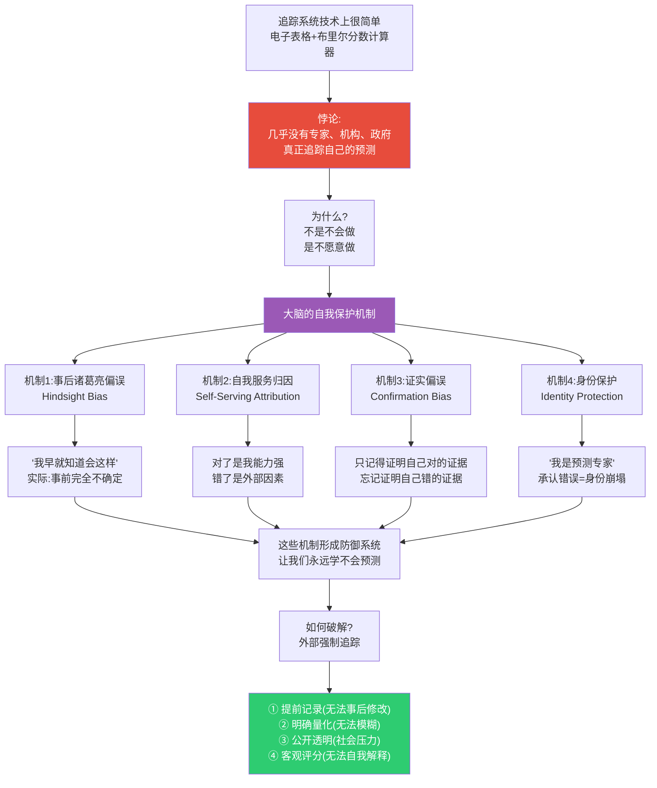
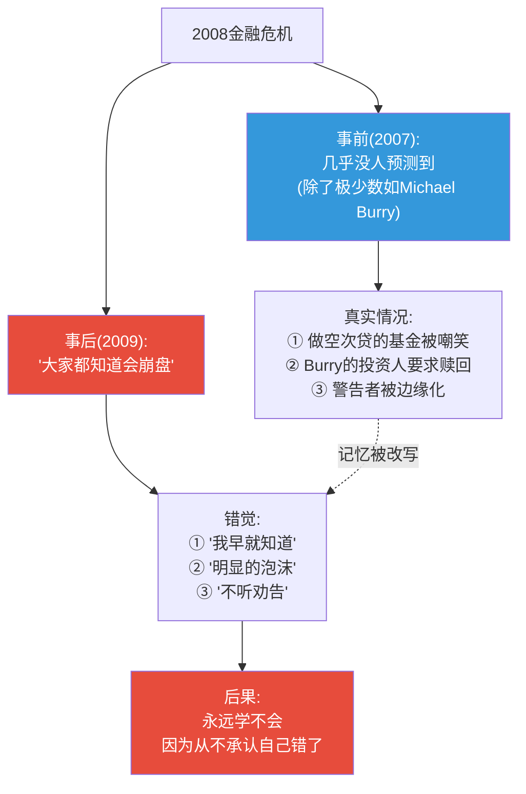
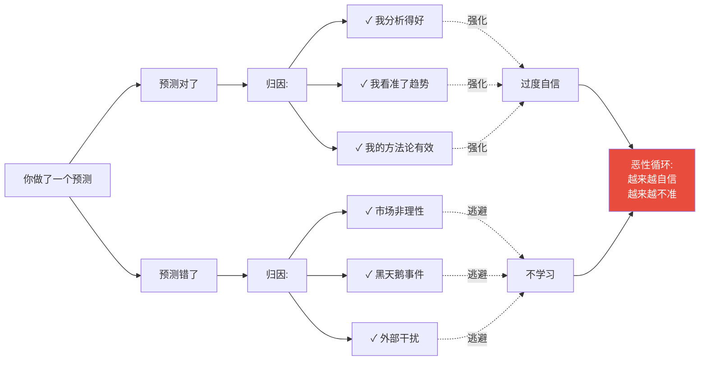
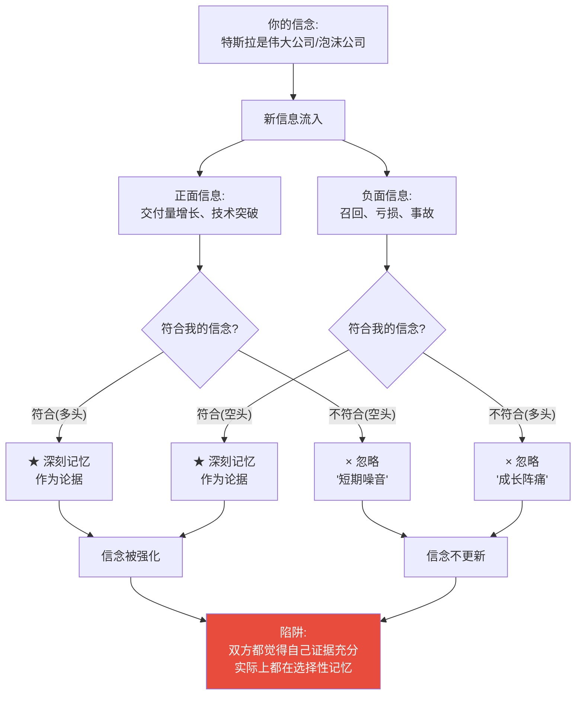
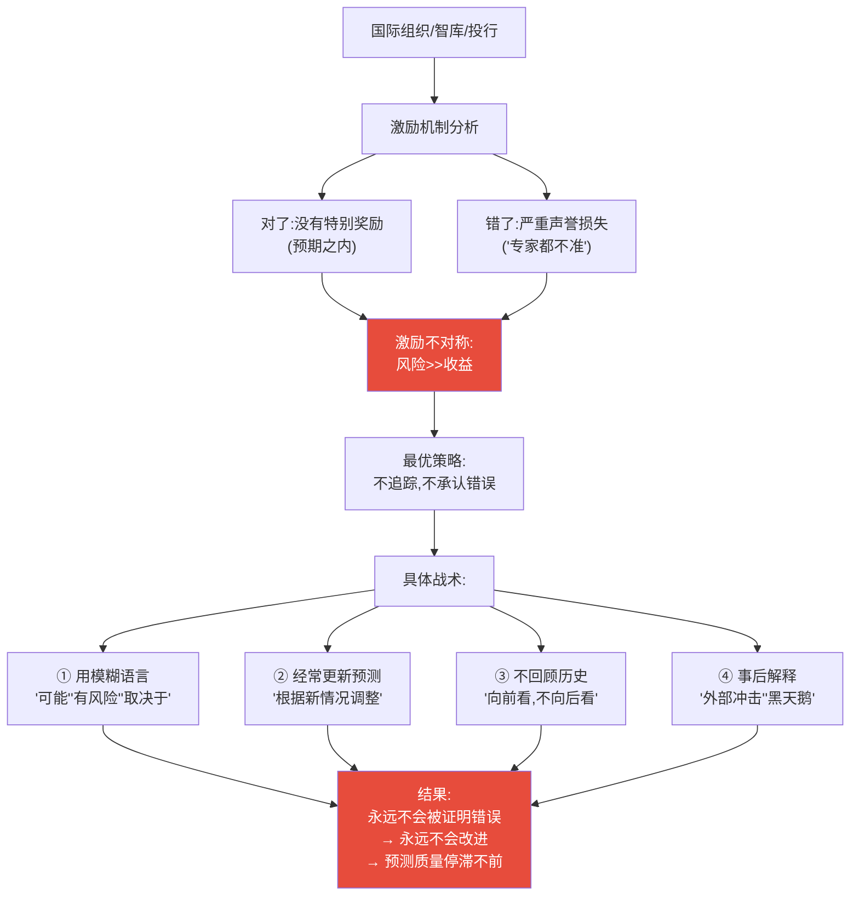
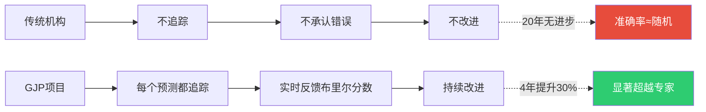
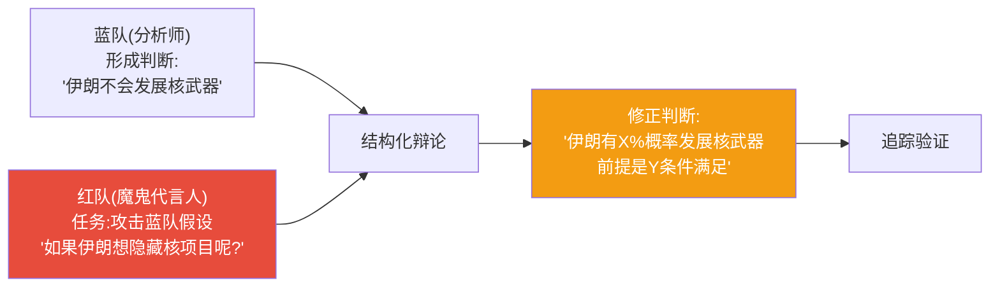
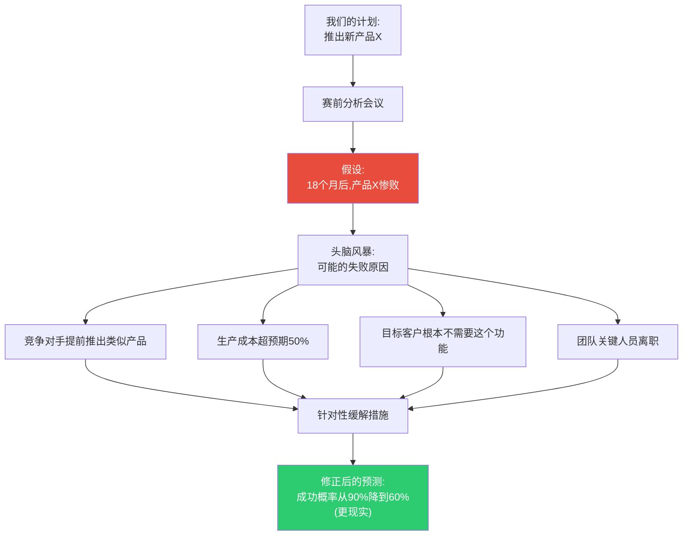

# 第3章:为什么我们抗拒追踪
> 沈老师视角 · 2026-03-25

这章的核心命题:追踪预测准确性在技术上很简单,但在心理上极其困难。我们的大脑有系统性的自我欺骗机制,专门用来保护自尊免受预测错误的伤害。

---

## 一、本章核心流图



---

## 二、关键概念裁判:事后诸葛亮偏误

### 真实世界案例1:2008年金融危机

**2007年的预测现状**:
- 美联储主席伯南克(2007年3月):"次贷问题不会蔓延到整体经济"
- 高盛CEO布兰克费恩(2007年):"市场波动在正常范围"
- 99%的经济学家:没有预测到2008年崩盘

**2009年的事后叙事**:
- "这明显是泡沫,任何人都看得出来"
- "我早就觉得不对劲"
- "很多人都警告过,只是没人听"



**判断练习**:
- 例1:你在2019年底预测"2020年全球经济增长3%",然后COVID-19爆发 → **如果你说"谁能料到疫情",这是合理的**(黑天鹅事件)
- 例2:你在2019年底预测"2020年全球经济增长3%",疫情后说"我当时就觉得不对劲,有预感" → **这是事后诸葛亮偏误**(你当时明确预测了3%)
- 例3:Michael Burry在2005-2007年持续做空次贷,有记录可查 → **这不是事后诸葛亮**(有提前记录)

---

## 三、关键概念裁判:自我服务归因

### 真实世界案例2:股票投资者的归因模式

**实验观察**(心理学研究):
- 给投资者追踪他们的股票预测6个月
- 成功的预测,82%归因为"我的分析能力"
- 失败的预测,78%归因为"市场非理性""黑天鹅事件""操纵"



**真实案例:软银孙正义的WeWork投资**

**2019年之前**:
- 孙正义投资WeWork 100亿美元
- 估值470亿美元
- 孙正义:"我能看到300年后的未来"

**2019年WeWork IPO失败,估值暴跌80%**:
- 孙正义归因:"创始人Neumann管理不善"(外部归因)
- 不是:"我对共享办公的商业模式判断错误"(内部归因)

**对比:孙正义成功投资阿里巴巴**:
- 归因:"我有远见,看到了马云的潜力"(内部归因)
- 不说:"我运气好,刚好在互联网泡沫后低价进入"

**判断练习**:
- 你投资一只股票赚了30% → 你说"我研究得透彻" → **可能是自我服务归因**(也可能是运气)
- 你投资一只股票亏了30% → 你说"庄家操纵" → **典型的自我服务归因**(不承认判断错误)
- 你追踪自己100次投资,发现赚钱时70%是看对了行业趋势,亏钱时60%是忽视了财务风险 → **这是真正的学习**(模式识别而非归因偏误)

---

## 四、关键概念裁判:证实偏误

### 真实世界案例3:特斯拉多头vs空头

**特斯拉多头**(看涨者):
- 记住:每次交付量超预期、股价上涨、新工厂开工
- 忽略:产能地狱、质量问题、马斯克承诺跳票
- 解释:"短期困难,长期伟大"

**特斯拉空头**(看跌者):
- 记住:每次召回、事故、财务压力
- 忽略:销量增长、技术领先、市占率提升
- 解释:"泡沫迟早破裂"



**2020年真实结果**:
- 特斯拉股价2020年涨800%
- 许多空头爆仓
- 但空头的叙事不变:"泡沫更大了,崩盘会更惨"

**2022年真实结果**:
- 特斯拉股价2022年跌65%
- 空头说:"看,我说对了吧"
- 多头说:"短期波动,长期看好"

**关键洞察**:双方都在"证实自己",而不是"寻求真相"。

**判断练习**:
- 你是比特币多头,看到一篇"比特币技术突破"就转发,看到"比特币诈骗"就忽略 → **证实偏误**
- 你是比特币空头,刚好相反 → **证实偏误**
- 你追踪比特币正负面新闻的比例,发现自己转发的是7:1正面,但实际新闻是5:5 → **识别出证实偏误**

---

## 五、结构可视化:为什么机构不追踪预测

### 真实世界案例4:世界银行、IMF的经济预测

**事实**:
- 世界银行、IMF每年发布各国GDP增长预测
- 几乎从不公开回顾去年预测的准确性
- 2000-2020年,预测准确率不比简单外推模型好

**为什么不追踪?**



**真实案例:IMF对希腊危机的预测(2010-2015)**

- **2010年预测**:希腊GDP萎缩2.6%,然后复苏
- **2015年实际**:希腊GDP累计萎缩25%
- **IMF的反应**:2015年发表报告,承认"低估了财政紧缩的负面影响"
- **关键问题**:为什么2010-2014年不追踪?为什么等到2015年才承认?

**对比:超级预测家项目(GJP)**



---

## 六、破解防御机制的方法

### 方法1:预承诺(Pre-commitment)

**真实案例:保罗·萨缪尔森的赌约**

1980年,经济学家保罗·萨缪尔森和朱利安·西蒙打赌:
- **萨缪尔森**:未来10年,5种金属价格会上涨(资源枯竭论)
- **西蒙**:未来10年,5种金属价格会下跌(技术进步论)
- **关键**:具体金属、具体时间、公开赌约,无法反悔

**1990年结果**:
- 5种金属全部下跌
- 西蒙赢得赌约
- 萨缪尔森承认错误(因为有预承诺,无法事后解释)

**教训**:预承诺破解了事后诸葛亮偏误。

### 方法2:红队-蓝队对抗

**真实案例:美国情报机构的红队演练**



**关键**:红队不是"捣乱",是系统性地寻找蓝队的证实偏误。

### 方法3:赛前分析(Premortem)

**真实案例:英特尔的"建设性对抗"文化**

英特尔前CEO安迪·格鲁夫的方法:
- **不问**:"这个战略会成功吗?"
- **而问**:"假设这个战略失败了,最可能的原因是什么?"



**为什么有效**:
- 破解了过度自信
- 合法化了"唱反调"
- 提前暴露盲点

---

## 七、本章可执行模型

### 核心机制:防御系统的拆解

```
人类大脑的预测防御系统:
┌─────────────────────────────────┐
│ 事后诸葛亮 → 我永远是对的(事后)  │
│ 自我归因 → 对了是我,错了是外部   │
│ 证实偏误 → 只看到支持我的证据    │
│ 身份保护 → 承认错误=自我崩塌    │
└─────────────────────────────────┘
           ↓
    永远学不会预测
           ↓
破解方法:外部强制系统
┌─────────────────────────────────┐
│ ① 预承诺(提前记录,无法修改)      │
│ ② 公开透明(社会压力)            │
│ ③ 客观评分(布里尔分数)          │
│ ④ 红队对抗(系统性挑战)          │
│ ⑤ 赛前分析(提前考虑失败)        │
└─────────────────────────────────┘
```

### if-then规则:

| 条件 | 结果 |
|------|------|
| **如果** 预测不被记录 | **则** 事后诸葛亮偏误生效,永远学不会 |
| **如果** 有预承诺(如公开赌约) | **则** 无法事后解释,被迫学习 |
| **如果** 只有自己看到结果 | **则** 自我归因偏误生效,对了是能力,错了是运气 |
| **如果** 结果公开透明 | **则** 社会压力迫使诚实面对 |
| **如果** 没有红队挑战 | **则** 证实偏误让你只看到支持自己的证据 |
| **如果** 有魔鬼代言人 | **则** 被迫考虑反面证据 |

---

## 八、接入已有认知体系

### 同构关系:
- **与卡尼曼"系统1的偏误"同构**:
  - 卡尼曼:大脑有系统性的认知捷径,导致偏误
  - 泰洛克:大脑有系统性的自我保护,导致无法学习预测
  - **共同结构**:偏误不是偶然,是大脑的特性

- **与"刻意练习"的反馈循环同构**:
  - 埃里克森:专家需要即时、准确的反馈
  - 泰洛克:预测需要追踪系统提供反馈
  - **共同原则**:没有反馈=没有进步

### 互补关系:
- 填补了"为什么聪明人也不学习"的解释空缺
- 不是智商问题,是防御机制问题
- 追踪系统是破解防御机制的外部工具

### 矛盾关系:
- **与"相信自己"的励志叙事矛盾**:
  - 励志叙事:"相信自己,永不放弃"
  - 泰洛克:"过度相信自己=拒绝反馈=永远学不会"
  - **条件差异**:
    - 在执行层面(坚持训练),相信自己有价值
    - 在认知层面(判断准确性),怀疑自己是必需的
  - **解决方案**:区分"执行自信"和"认知谦逊"

---

## 九、沈老师的元评论

这一章揭示了一个残酷的真相:**阻碍我们学习预测的,不是外部世界的复杂性,而是我们自己的大脑。**

大脑的这些防御机制不是bug,是feature——在进化环境中,它们保护了我们的社会地位和自尊。但在现代需要准确判断的环境中,它们成了致命缺陷。

**关键洞察**:
1. **自我欺骗是自动的**:你不需要有意撒谎,大脑自动改写记忆
2. **聪明人更擅长自我欺骗**:因为有更强的事后解释能力
3. **唯一的破解方法是外部系统**:靠意志力对抗大脑是不够的

从我的认知建模角度:
- **能画出来才算懂** → 如果不追踪,你永远不知道自己真正懂不懂
- **裁判=理解** → 但大脑会作弊,需要外部裁判
- **孤岛知识会消失** → 不被验证的"经验"会被大脑改写成自我强化的虚假记忆

这一章告诉我们:建立追踪系统不是"最好有",是"必须有"。否则,你的所有预测经验,都会被大脑的防御机制扭曲,变成虚假的自信。

**真实世界的残酷案例**:
- 投资者平均自评收益率:比实际高5-7%
- 医生平均自评诊断准确率:85%,实际:65%
- 专家平均自评预测准确率:80%,实际:50%(等于随机)

这不是撒谎,是大脑自动改写记忆的结果。唯一的解药:追踪系统。

---

*第3章建模完成。核心:我们不追踪预测,不是因为不会,而是因为大脑有系统性的自我欺骗机制。破解方法是外部强制追踪。*
