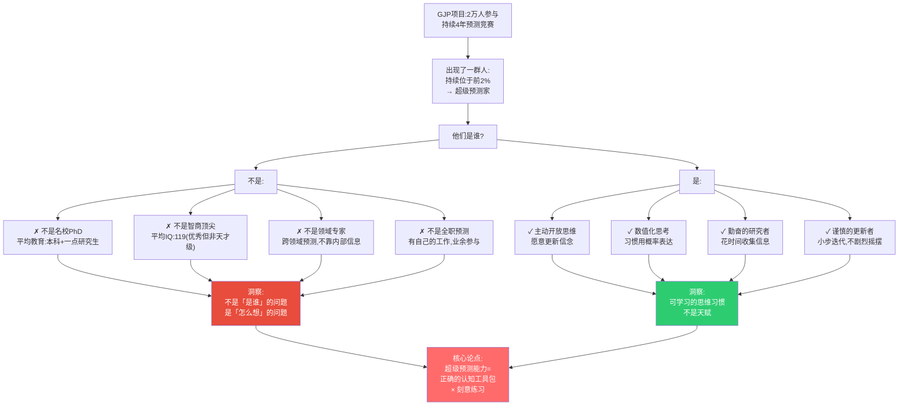
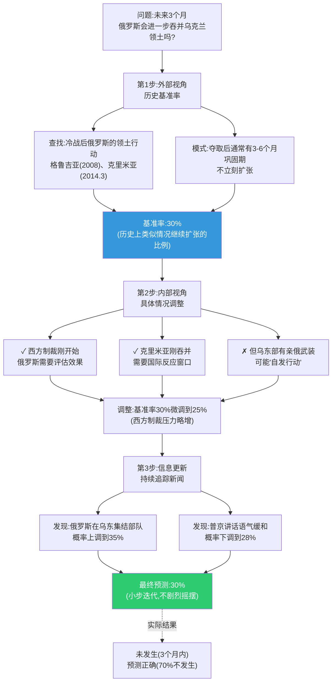
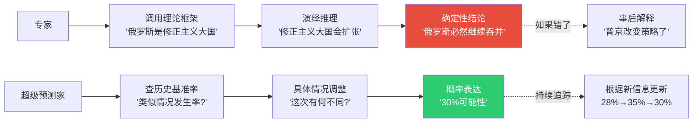
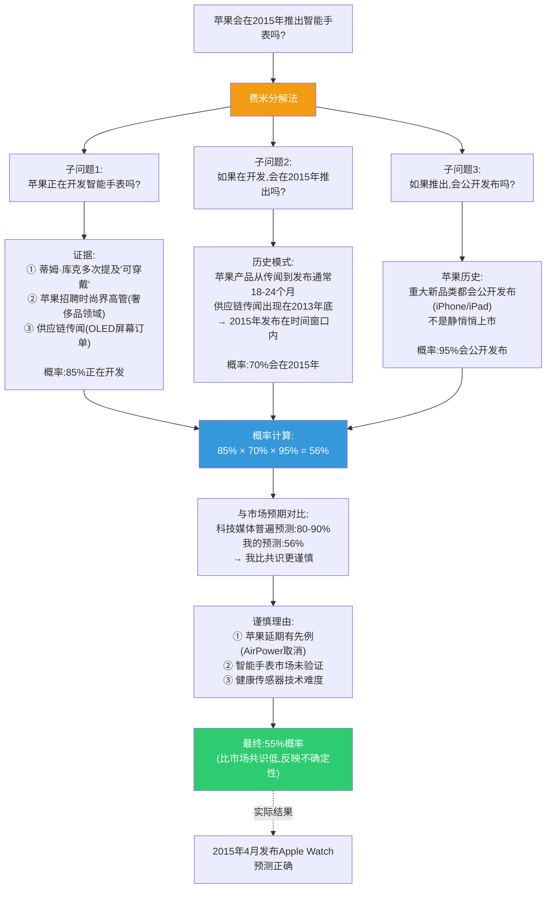
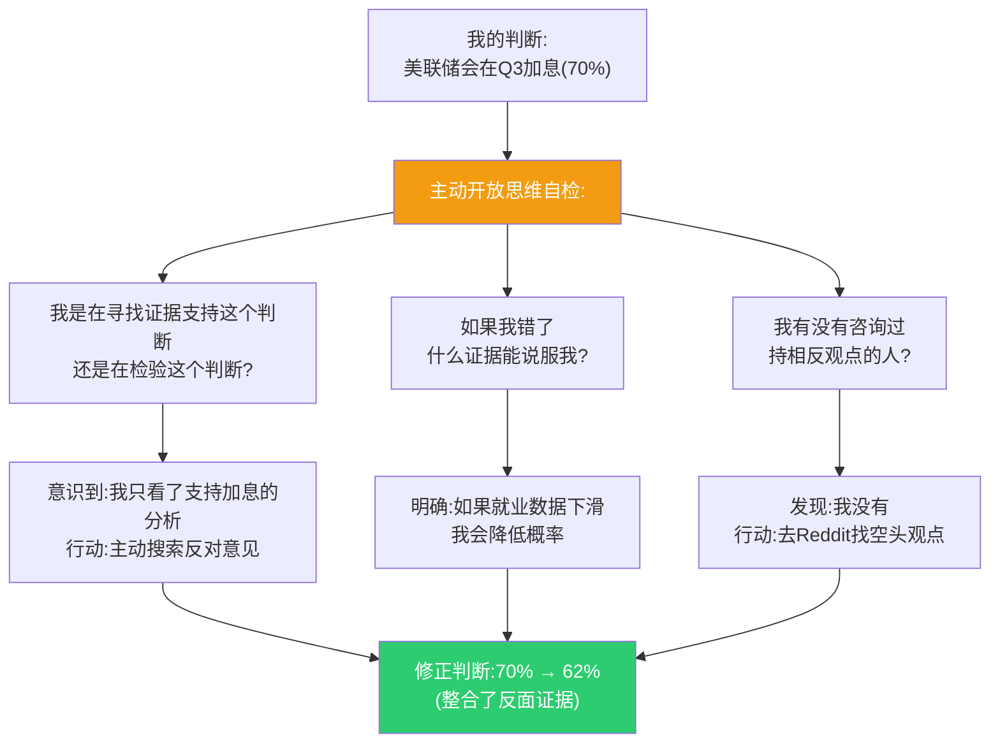
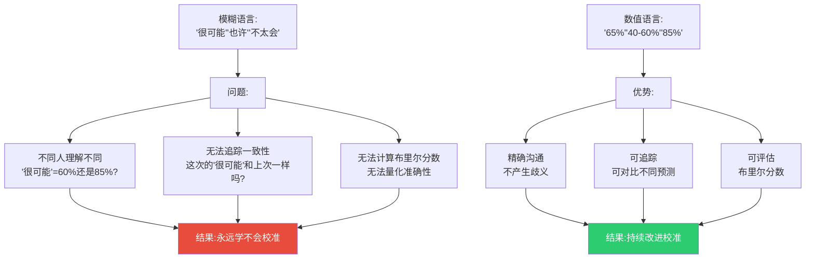
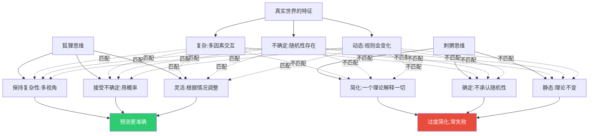
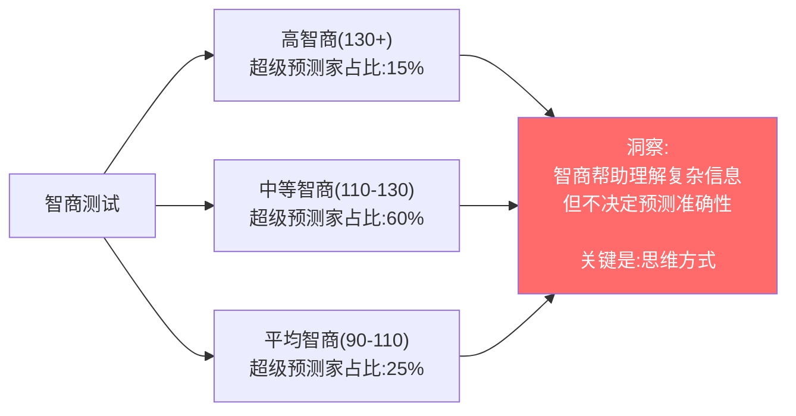
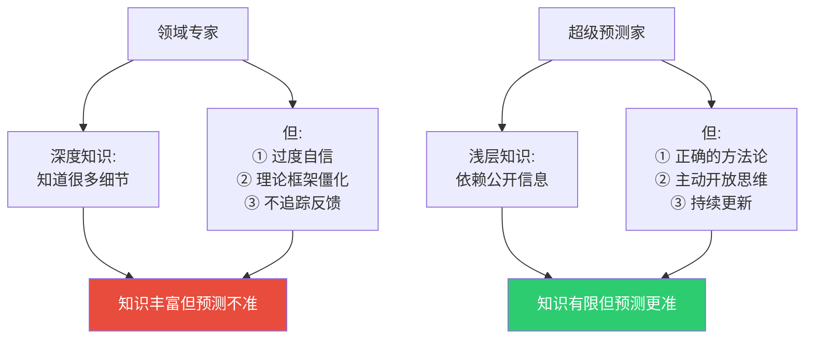

# 第4章:超级预测家的画像
> 沈老师视角 · 2026-03-25

这章的核心命题:超级预测家不是天才,不是内部人,不是超级计算机。他们是使用特定思维方式的普通人,而这种思维方式可以被学习。

---

## 一、本章核心流图



---

## 二、真实超级预测家案例分析

### 案例1:比尔·弗莱克 - 退休公务员

**背景**:
- 55岁,内布拉斯加州,退休的美国农业部职员
- 教育:数学本科(未完成PhD)
- 爱好:观鸟

**预测表现**:
- GJP项目中约300个预测
- 布里尔分数:0.16(远优于专家平均0.27)
- 持续4年保持前1%

**他如何预测"乌克兰会被俄罗斯进一步吞并吗?"(2014)**



**关键特征**:
1. **从基准率开始**(不是从直觉开始)
2. **小幅调整**(不是从0%跳到100%)
3. **持续更新**(每周回顾,微调概率)
4. **数值化**(30%,不是"可能")

**对比:典型专家的预测方式**



---

### 案例2:让·皮埃尔(化名) - 投资分析师

**背景**:
- 40多岁,法国人,在美国工作
- 教育:工程学位+MBA
- 职业:科技行业分析师

**预测表现**:
- 布里尔分数:0.15(接近理论最优)
- 特别擅长科技和地缘政治预测

**他如何预测"苹果会在2015年推出智能手表吗?"(2014年中)**



**关键技术:费米估算**
- 将复杂问题分解为可估算的子问题
- 每个子问题独立评估概率
- 组合概率(乘法法则)
- **不追求精确,追求方向正确**

---

### 案例3:蒂姆·明卡(化名) - 退休药剂师

**背景**:
- 60多岁,澳大利亚
- 教育:药学学位
- 特点:极端谨慎,更新频繁

**预测风格可视化**


**对比:过度自信者的预测曲线**


**蒂姆的特点**:
1. **从不确定开始**(50%,不是从自己的直觉开始)
2. **小步更新**(每次2-5%,不是大幅跳跃)
3. **高频回顾**(每周重新评估,不是做完就忘)
4. **双向敏感**(正面和负面信息都反应,不是选择性)

---

## 三、超级预测家的共同特征

### 特征1:主动开放思维(Actively Open-Minded Thinking)

**量表测试结果**(心理学标准测试):
- 超级预测家平均分:75/100
- 普通预测者平均分:58/100
- 专家平均分:55/100

**具体行为表现**:

| 思维类型 | 封闭思维 | 主动开放思维 |
|----------|----------|--------------|
| **对待信念** | 身份的一部分 | 可检验的假说 |
| **反对证据** | 威胁,要反驳 | 信息,要整合 |
| **改变主意** | 软弱的表现 | 学习的标志 |
| **确定性** | 追求确定答案 | 舒适于不确定 |
| **错误** | 避免承认 | 主动寻找 |

**真实案例:超级预测家的自我对话**



---

### 特征2:数值化/概率化思维

**超级预测家 vs 普通人的语言对比**

| 情境 | 普通人 | 超级预测家 |
|------|--------|------------|
| 很可能发生 | "很有可能" | "75%概率" |
| 不太确定 | "也许吧" | "40-60%之间" |
| 几乎确定 | "肯定会" | "90%,但保留10%意外空间" |
| 新信息出现 | "看来我想对了" | "将先验65%更新到后验72%" |

**为什么数值化重要?**



**真实世界类比:温度计 vs "今天有点冷"**

- "今天有点冷" → 每个人理解不同,无法比较
- "今天15°C" → 精确,可比较,可根据历史校准衣着选择

---

### 特征3:认知风格的"狐狸"特质

**伯林的狐狸测试**(简化版):

**题目:你更认同哪种说法?**

1. "世界是复杂的,很少有简单答案" (狐狸)
   vs "复杂表象背后往往有简单规律" (刺猬)

2. "我的看法经常随新证据改变" (狐狸)
   vs "我对核心信念很少改变" (刺猬)

3. "预测需要综合多种因素" (狐狸)
   vs "预测需要抓住主要矛盾" (刺猬)

**超级预测家平均得分:80%狐狸特质**
**专家平均得分:45%狐狸特质**(更多刺猬)

**为什么狐狸更准?**



**真实世界类比**:

**刺猬型思维**:
- 马克思主义者:一切都是阶级斗争
- 自由市场原教旨:一切问题市场能解决
- 技术乐观主义者:技术能解决一切

**狐狸型思维**:
- "这个问题部分是阶级问题,但也有文化、技术、偶然因素"
- "市场在X情况下有效,但在Y情况下失效,需要Z类干预"
- "技术能解决A问题,但会带来B副作用,需要C类社会机制配合"

---

## 四、反直觉的发现

### 发现1:智商不是决定因素



**真实对比**:
- 诺贝尔经济学奖得主对经济预测的准确性:≈随机
- 高中教育的超级预测家对经济预测的准确性:显著优于专家

**为什么?** 智商帮助你"想清楚理论",但预测需要"接受现实复杂性"。高智商者反而容易陷入"刺猬陷阱"(相信自己的理论)。

---

### 发现2:领域知识不是决定因素

**实验设计**:
- 让超级预测家预测完全陌生的领域(如亚洲地缘政治)
- 让该领域专家做同样预测
- 比较准确性

**结果**:
- 超级预测家(外行):布里尔分数 0.18
- 领域专家:布里尔分数 0.26
- **超级预测家更准,即使在不是他们专业的领域**



**洞察**:预测≠知识渊博。预测=正确使用知识。

---

## 五、本章可执行模型

### 超级预测家的操作系统(OS)

```
输入:需要预测的问题
↓
第1层:心态设置
□ 将判断视为假说(不是身份)
□ 从50%开始(最大不确定性)
□ 接受"我可能错了"
↓
第2层:信息处理
□ 外部视角:历史基准率
□ 费米分解:拆成子问题
□ 多视角:寻找反面证据
↓
第3层:概率表达
□ 用数字(不是"可能""也许")
□ 范围表达(如40-60%,当非常不确定时)
□ 明确条件(在X条件下Y%,在Z条件下W%)
↓
第4层:持续更新
□ 每周回顾
□ 小步调整(2-5%)
□ 追踪反馈(事后检验)
↓
输出:校准良好的概率判断
```

### if-then规则:

| 条件 | 超级预测家的做法 | 普通人的做法 |
|------|------------------|--------------|
| 面对新问题 | 从基准率开始 | 从直觉开始 |
| 得到反面信息 | 调整概率下降 | 解释掉/忽略 |
| 预测对了 | 检查是否运气好 | 认为自己能力强 |
| 预测错了 | 分析判断漏洞 | 归因外部因素 |
| 被问确定性 | "70%,不是100%" | "肯定会/绝不会" |

---

## 六、接入已有认知体系

### 同构关系:

**与德鲁克"有效管理者"同构**:
- 德鲁克:有效性不是天赋,是实践出来的习惯
- 泰洛克:预测能力不是天赋,是思维习惯
- **共同结构**:都是技能,不是才能;都可学习,不靠天分

**与爵士乐即兴演奏同构**:
- 爵士乐手:有固定和弦框架,但在框架内灵活即兴
- 超级预测家:有基准率锚点,但根据新信息灵活调整
- **共同结构**:结构+灵活=高水平表现

### 互补关系:

- 填补了卡尼曼《思考快与慢》的"然后怎么办"
- 卡尼曼告诉你"大脑有这些偏误"
- 泰洛克告诉你"用这些习惯对抗偏误"

### 矛盾关系:

**与格拉德威尔《异类》(1万小时定律)的张力**:
- 格拉德威尔:成为专家需要1万小时刻意练习
- 泰洛克:超级预测家平均每周投入2-3小时,4年≈500小时
- **解决方案**:
  - 1万小时定律适用于:技能型(如小提琴、象棋)
  - 超级预测不是技能堆积,是思维方式转变
  - 500小时足够**如果练习方法正确**(有追踪反馈)

---

## 七、沈老师的元评论

这一章最重要的发现:**超级预测家不是超人,是普通人+正确方法**。

这打破了两个常见迷思:
1. **天才论**:"预测能力是天赋" → 错,是可学习的习惯
2. **信息论**:"内部消息最重要" → 错,公开信息+正确处理更重要

**关键洞察**:
- 智商帮助你"想",但不帮助你"准"
- 知识帮助你"懂",但不帮助你"对"
- **正确的思维方式才是核心**

从我的认知建模角度:
- **能画出来才算懂** → 超级预测家能用概率数字精确表达不确定性
- **裁判=理解** → 他们持续追踪自己的预测,接受评分
- **孤岛知识会消失** → 他们用费米分解、基准率锚定,将新知识接入已有结构

这一章给我们最大的启发:**你也可以成为超级预测家**。不需要天赋,不需要内幕,只需要:
1. 主动开放思维
2. 数值化表达
3. 从基准率开始
4. 小步迭代更新
5. 追踪反馈

这是一个"去神秘化"的过程。预测不再是先知的魔法,而是工匠的手艺。

---

*第4章建模完成。核心:超级预测家=普通人+正确的思维方式。关键是怎么想,不是是谁。*
