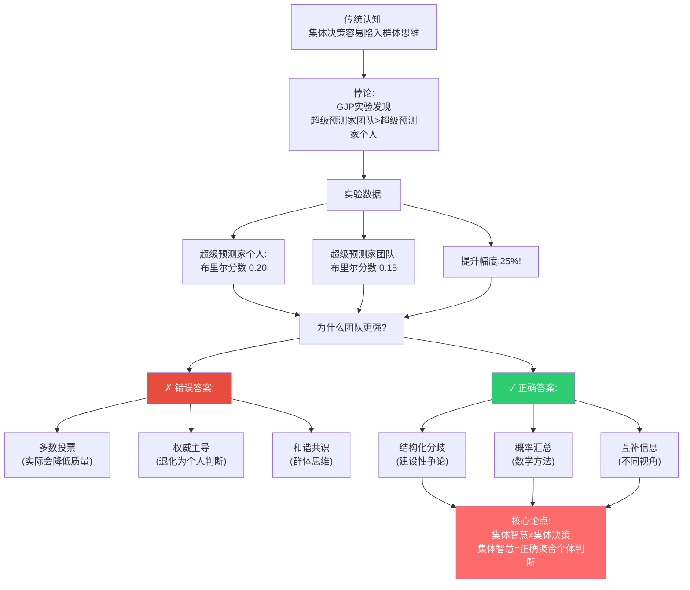
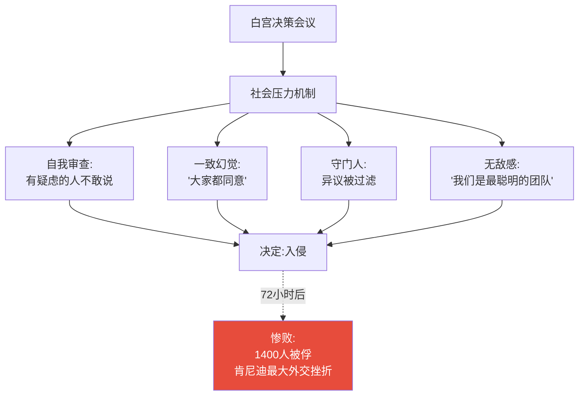
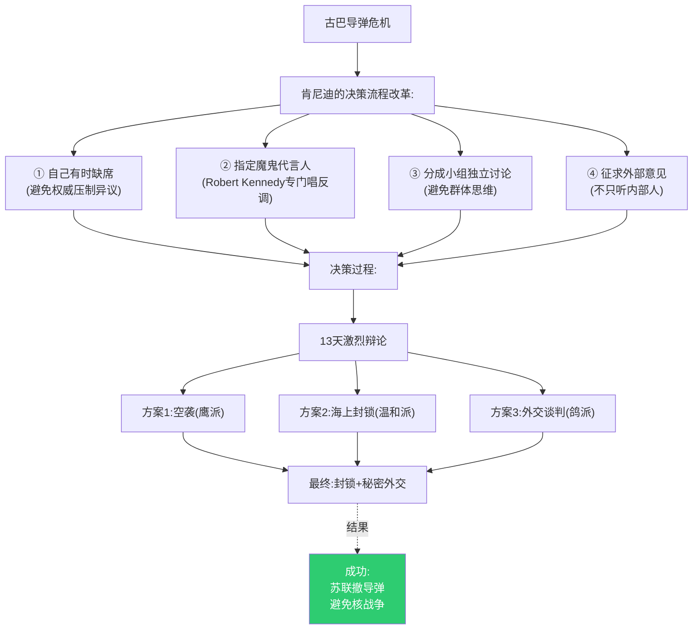
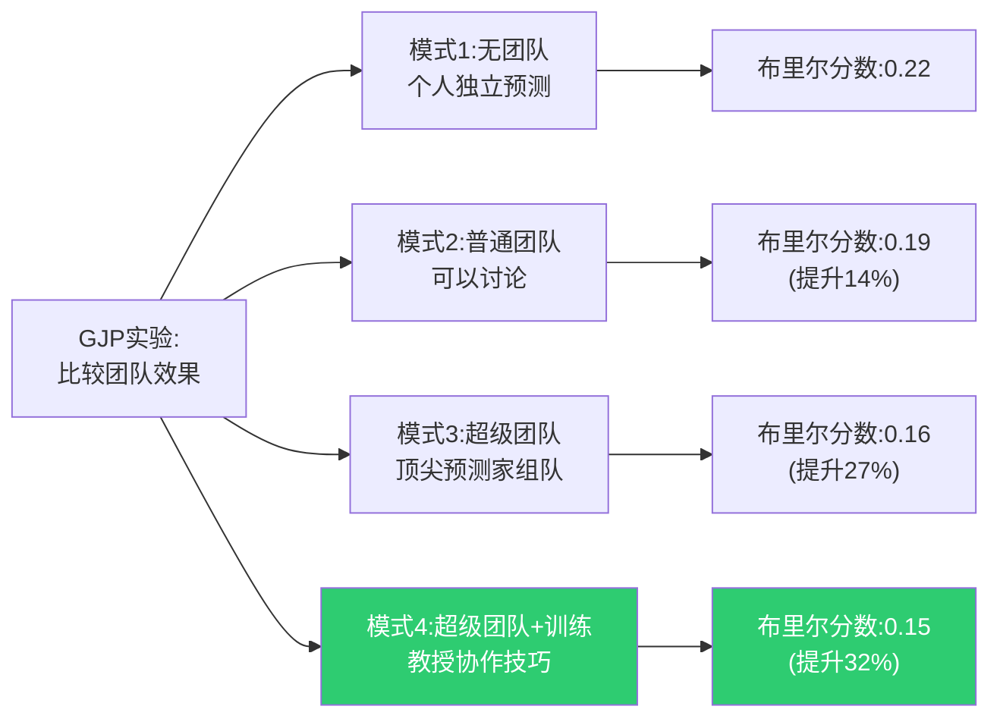
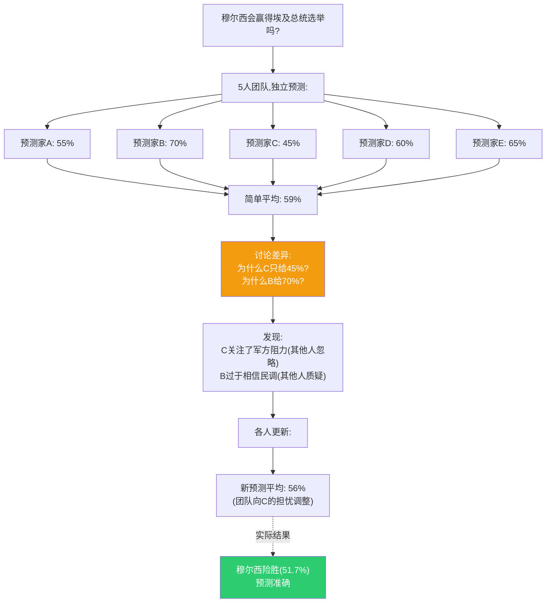
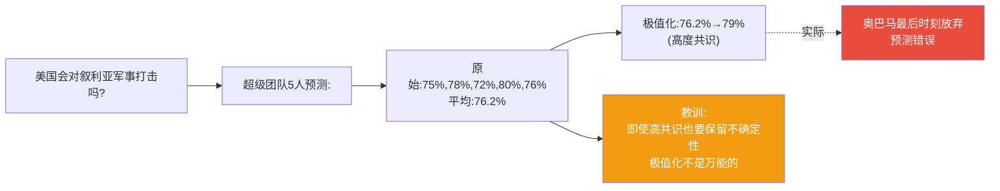
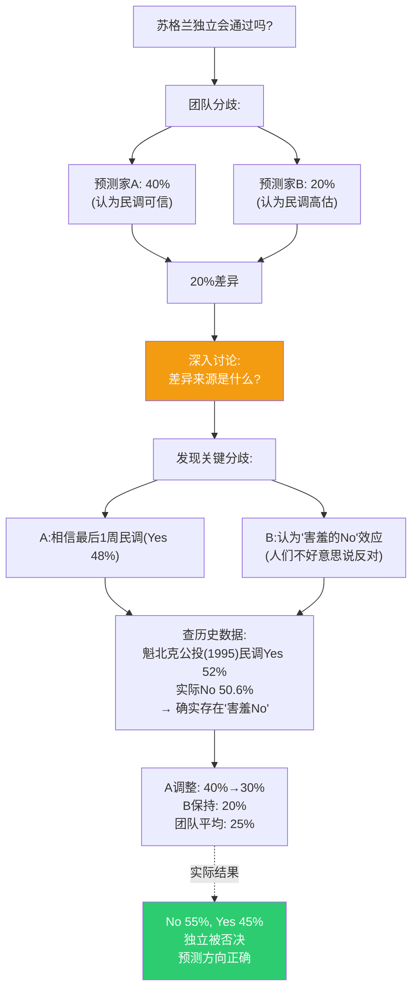
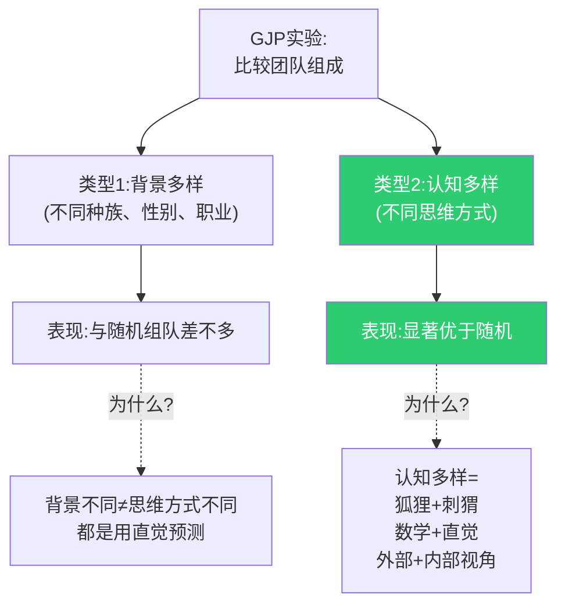
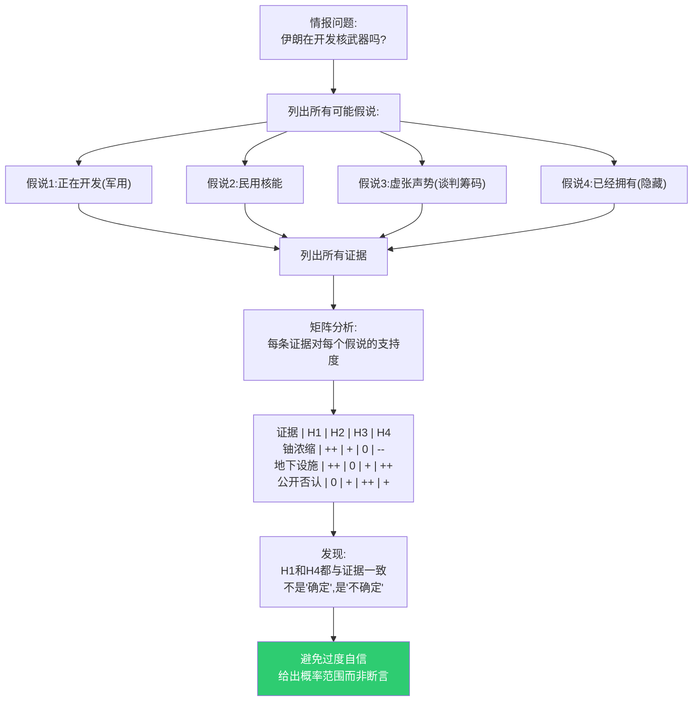

# 第5章:超级团队——1+1>2的科学
> 沈老师视角 · 2026-03-25

这章的核心命题:正确组织的预测团队可以超越最好的个人。但"正确组织"不是开会投票,而是结构化的集体智慧机制。

---

## 一、本章核心流图



---

## 二、真实历史案例:群体的失败与成功

### 案例1:猪湾事件(1961)——群体思维的灾难

**背景**:
- 1961年4月,肯尼迪政府策划入侵古巴
- 参与决策:CIA局长、国务卿、国防部长、参谋长联席会议
- 全是美国最聪明的人,哈佛耶鲁毕业,二战英雄

**决策过程**(后来心理学家Irving Janis分析):



**事后发现**:
- 参谋长联席会议主席Arthur Radford私下认为"这个计划不可能成功"
- 但在会议上他保持沉默
- 历史学家Arthur Schlesinger Jr.在会后日记写:"我应该说出我的担忧"
- 但会上他也没说

**关键洞察**:聪明人≠好团队。缺乏结构的团队决策会更差。

---

### 案例2:古巴导弹危机(1962)——正确的团队决策

**背景**:
- 猪湾事件1年后
- 苏联在古巴部署核导弹
- 同样的团队,但肯尼迪改变了决策流程

**肯尼迪的改革**(基于猪湾教训):



**对比**:

| 维度 | 猪湾事件(失败) | 导弹危机(成功) |
|------|----------------|----------------|
| **领导者角色** | 主导讨论 | 有时缺席 |
| **异议处理** | 被压制 | 被鼓励 |
| **决策方式** | 快速共识 | 多轮辩论 |
| **信息来源** | 内部 | 内部+外部 |
| **时间压力** | 匆忙 | 13天深思 |

**关键洞察**:同样的人,不同的流程,完全不同的结果。

---

## 三、GJP超级团队的秘密

### 实验设计:比较4种团队模式



**发现1**:普通人组队也有帮助(14%提升)
**发现2**:高手组队提升更大(27%)
**发现3**:高手+正确方法=最强(32%)

---

### 超级团队的4个机制

#### 机制1:独立预测后汇总(不是先讨论)

**错误流程**:
```
团队会议 → 讨论 → 投票 → 结果
(容易群体思维)
```

**正确流程**:
```
1. 每人独立预测(不交流)
2. 提交各自的概率判断
3. 数学汇总(见下文)
4. 讨论差异(不是讨论结论)
5. 各人独立更新自己的预测
```

**真实案例:2012年埃及大选**



**关键**:讨论不是为了达成共识,是为了**暴露每个人的独特信息**。

---

#### 机制2:极值化(Extremizing)

**数学原理**:如果多个独立的聪明人都同意,真实概率应该更极端。

**公式**(简化版):
```
团队预测 = (平均预测 - 50%) × 1.2 + 50%
```

**例子**:

| 场景 | 平均预测 | 极值化后 | 理由 |
|------|----------|----------|------|
| 3人都说60% | 60% | 62% | 独立共识应更自信 |
| 3人都说80% | 80% | 86% | 强共识应更强 |
| 3人说30%/50%/70% | 50% | 50% | 分歧大不极值化 |

**真实案例:2013年叙利亚化武攻击**



**边界**:极值化有风险,只在高质量预测家+低分歧时使用。

---

#### 机制3:精准的不同意(Precision Disagreement)

**不是**:"我觉得会发生" vs "我觉得不会"
**而是**:"我给65%" vs "我给40%",然后**讨论25%差异的来源**

**真实案例:2014年苏格兰独立公投**



**关键流程**:
1. 量化分歧(40% vs 20%)
2. 找出分歧根源(信民调 vs 不信民调)
3. 查历史数据验证
4. 各人根据新信息独立更新

---

#### 机制4:认知多样性>人口多样性

**GJP的反直觉发现**:



**真实数据**:
- 按性别/种族多样性组队:布里尔分数0.18
- 按认知风格多样性组队:布里尔分数0.15
- **认知多样性=思维方式互补**

**例子:理想的5人团队**

| 成员 | 认知风格 | 贡献 |
|------|----------|------|
| A | 狐狸+数学 | 基准率,费米分解 |
| B | 刺猬+历史 | 深度理论框架 |
| C | 外部视角 | 宏观趋势 |
| D | 内部视角 | 具体细节 |
| E | 魔鬼代言人 | 专门唱反调 |

---

## 四、真实世界应用:情报分析改革

### 案例:CIA的"竞争性假说分析"(ACH方法)

**背景**:9/11后,美国情报界被批评"群体思维"(都认为伊拉克有WMD)

**改革**(Richards Heuer开发的方法):



**2007年NIE报告**:
- 旧方法:断言"伊朗正在开发核武器"
- 新方法:"伊朗停止了武器化研究(中等确信度),但继续浓缩铀(高确信度)"
- **关键改进**:明确不确定性,不强行共识

---

## 五、本章可执行模型

### 建立有效预测团队的清单

```
□ 步骤1:独立预测(每人先独立,不讨论)
  - 强制:提交前不能看别人的预测
  - 格式:必须是具体概率数字

□ 步骤2:汇总(数学方法,不是投票)
  - 简单平均(适用于普通团队)
  - 加权平均(如果有历史准确率)
  - 极值化(仅当共识强+分歧小时)

□ 步骤3:讨论分歧(不是讨论结论)
  - 问:"为什么你的预测和团队平均差>10%?"
  - 找出:独特信息 vs 错误假设
  - 禁止:说服别人接受你的数字

□ 步骤4:独立更新(各人重新判断)
  - 吸收新信息
  - 独立决定是否调整
  - 再次汇总

□ 步骤5:指定魔鬼代言人(轮流)
  - 专门找团队判断的漏洞
  - 不是"捣乱",是结构化角色
  - 每次轮换(避免被边缘化)
```

### if-then规则:

| 情况 | 错误做法 | 正确做法 |
|------|----------|----------|
| 团队讨论前 | 先开会讨论 | 先独立预测 |
| 预测分歧大 | 强行达成共识 | 深入讨论分歧根源 |
| 某人总是对 | 让他主导决策 | 仍然独立预测+汇总 |
| 某人总是错 | 踢出团队 | 分析为什么错,学习 |
| 大家都同意 | 放心了 | 指定人唱反调 |

---

## 六、接入已有认知体系

### 同构关系:

**与Ray Dalio的"可信度加权"同构**:
- Bridgewater:决策时按历史准确率加权每个人的意见
- GJP:团队预测时可以按布里尔分数加权
- **共同结构**:不是民主(一人一票),是精英制(按表现加权)

**与开源软件开发同构**:
- 代码提交:独立工作 → Pull Request → Code Review → 合并
- 预测流程:独立预测 → 提交 → 团队讨论 → 独立更新
- **共同原则**:先独立,再协作

### 互补关系:

- 填补了"如何组织集体决策"的操作空缺
- 群体心理学告诉我们"群体思维很危险"
- GJP告诉我们"如何在避免群体思维的同时利用集体智慧"

### 矛盾关系:

**与"头脑风暴"的常见做法矛盾**:
- 头脑风暴:鼓励所有人自由发言,不批判
- GJP方法:先独立思考,再结构化讨论
- **条件差异**:
  - 头脑风暴适合创意生成(发散思维)
  - 结构化方法适合判断和预测(收敛思维)

---

## 七、沈老师的元评论

这一章最重要的洞察:**集体智慧≠集体决策**。

多数人以为"团队决策"就是"开会、讨论、投票",但这恰恰是最低效的。GJP用数据证明:

1. **先独立,再汇总** > 先讨论,再投票
2. **结构化分歧** > 强求共识
3. **认知多样性** > 人口多样性
4. **概率汇总** > 多数投票

猪湾事件和导弹危机的对比太经典了:同样的人,不同的流程,一个惨败,一个成功。

**关键操作原则**:
- 保护独立性(先独立预测,避免锚定效应)
- 利用分歧(分歧=信息,不是障碍)
- 结构化异议(魔鬼代言人是角色,不是惩罚)
- 数学聚合(不是政治妥协)

从我的认知建模角度:
- **能画出来才算懂** → 团队流程必须可视化,每个步骤明确
- **裁判=理解** → 团队准确性可追踪,验证哪种流程有效
- **孤岛知识会消失** → 团队讨论是为了暴露隐藏信息,不是说服

这一章告诉我们:聪明人组成的团队可以很愚蠢(猪湾),也可以很睿智(导弹危机)。差别不在人,在流程。

---

*第5章建模完成。核心:正确的团队流程可以让1+1>2,错误的流程让1+1<1。关键是先独立后汇总,利用分歧而非消除分歧。*
