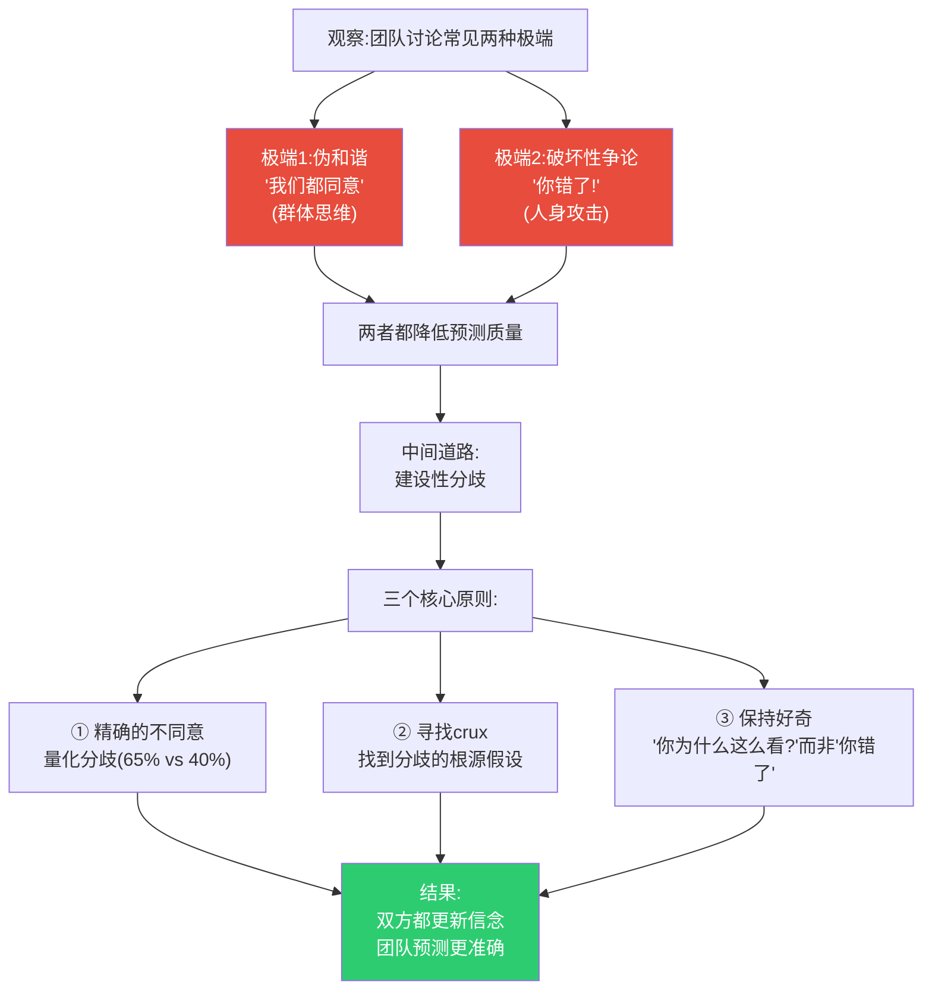
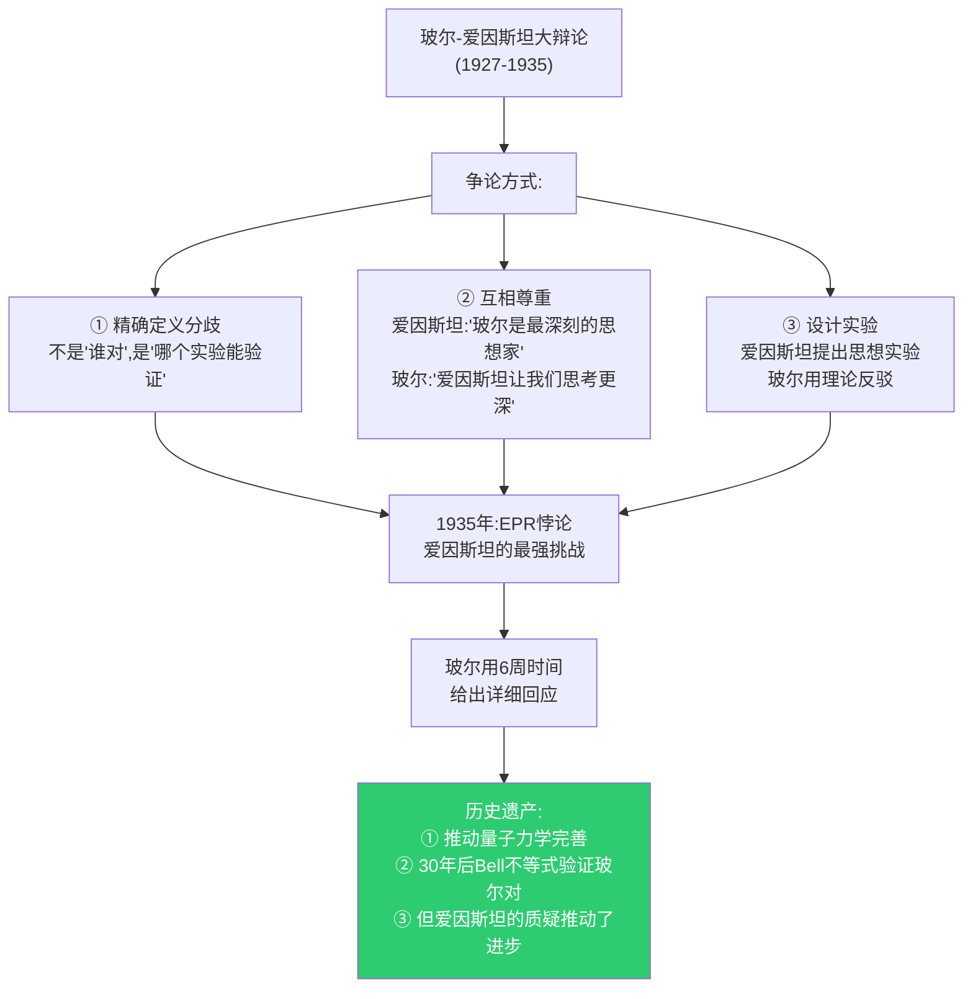
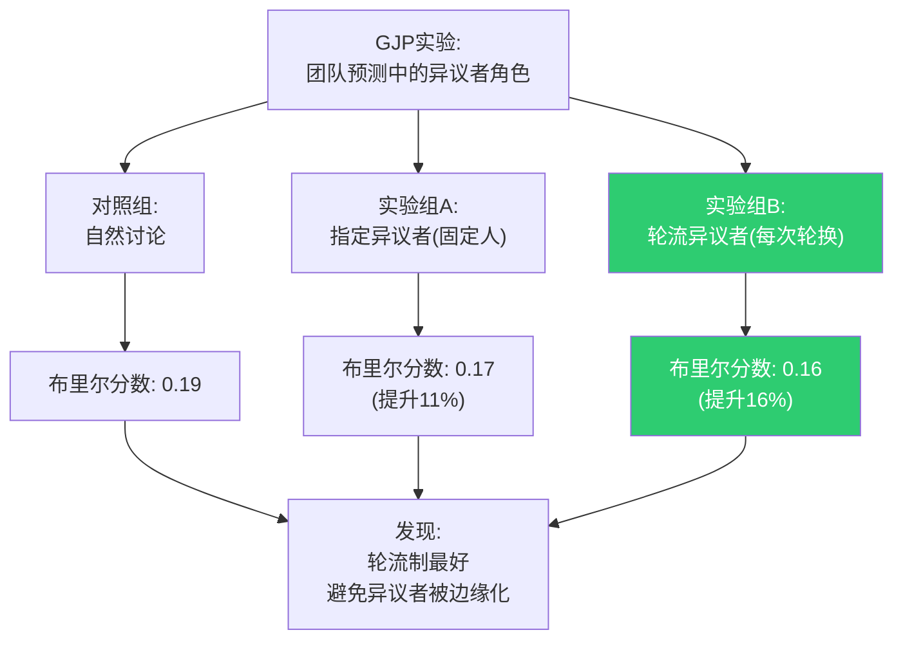
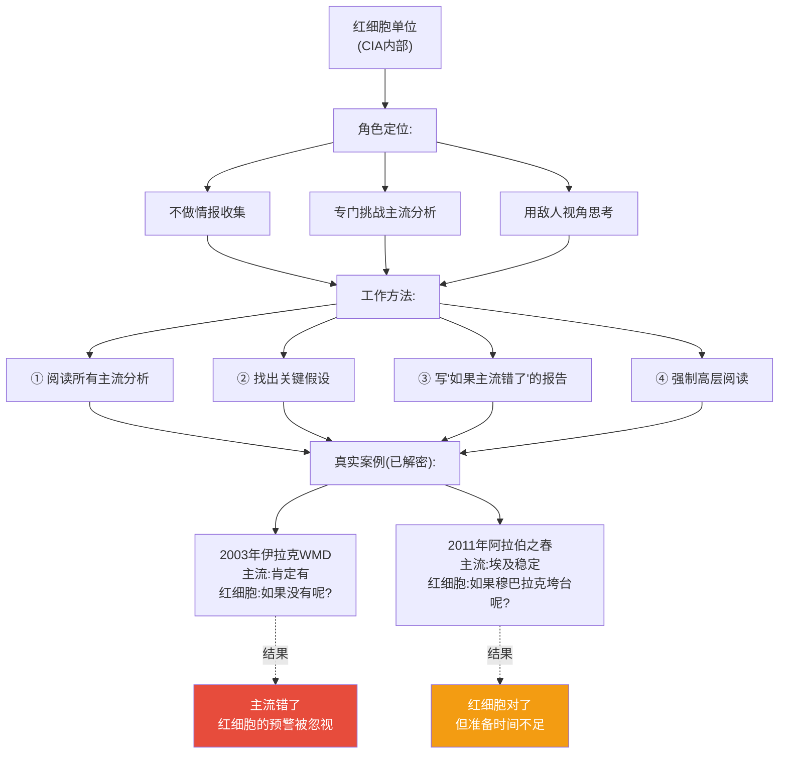
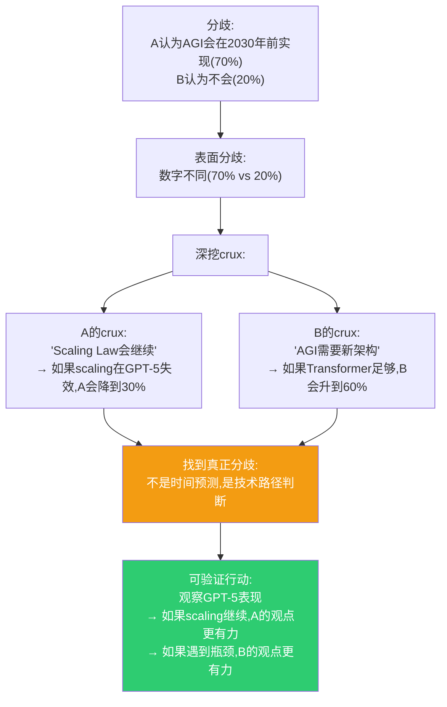
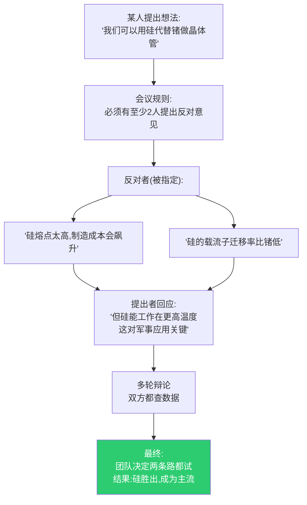
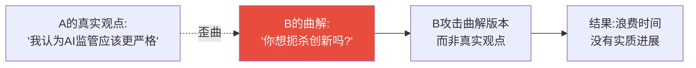

# 第6章:对话的艺术——建设性分歧的力量
> 沈老师视角 · 2026-03-25

这章的核心命题:分歧是信息,不是威胁。正确的争论方式可以提升判断质量,错误的争论方式导致群体思维或人身攻击。

---

## 一、本章核心流图



---

## 二、真实历史案例:玻尔vs爱因斯坦的量子力学大辩论

### 背景(1920s-1930s)

**两位巨人的分歧**:
- **尼尔斯·玻尔**: 量子力学是完备的,不确定性是本质
- **爱因斯坦**: "上帝不掷骰子",量子力学不完备



**关键特征**(建设性分歧的典范):

1. **精确化分歧**: 不是泛泛争论,而是具体到"测量前粒子状态是否确定"
2. **可验证性**: 双方都同意"最终由实验决定"
3. **相互尊敬**: 终生保持友谊,尽管根本分歧
4. **推动进步**: 爱因斯坦"输了"辩论,但他的挑战让量子力学更严格

**对比:破坏性争论的例子**

**牛顿vs胡克**(17世纪):
- 关于光的本质争论
- 演变成人身攻击
- 牛顿延迟发表《光学》直到胡克去世
- **结果**: 科学进步被延迟

---

## 三、GJP中的"建设性异议者"(Devil's Advocate)实验

### 实验设计(2012-2013)



### 异议者的三种任务

**任务1: 挑战共识**
```
团队共识:"俄罗斯会在Q2吞并乌东,概率75%"

异议者:"等等,我们的75%是基于什么?
- 如果普京优先考虑经济制裁影响呢?
- 如果西方的红线比我们预期更硬呢?
- 历史上克里米亚后有巩固期,为什么这次不同?"

→ 结果:团队重新审视假设,调整到60%
```

**任务2: 寻找遗漏的情景**
```
团队讨论:"美联储加息25bp或50bp,两种情景"

异议者:"我们是否遗漏了'不加息'的可能?
虽然鲍威尔说会加息,但如果:
- 银行业出现系统性风险
- 就业数据突然恶化
他有可能暂停"

→ 结果:团队增加第三种情景(10%概率)
```

**任务3: 质疑基准率**
```
团队:"根据历史,新药三期成功率30%,所以这个药30%"

异议者:"我们的基准率是否适用?
- 这个药是全新机制,历史数据相关吗?
- 最近10年成功率是否不同于全历史?
- 这个公司的历史成功率高于平均吗?"

→ 结果:团队调整基准率或扩大不确定区间
```

---

## 四、真实案例:CIA的"红细胞"(Red Cell)单位

### 起源(2001年,9/11后改革)

**背景**:
- 9/11后检讨:情报界未能"连点成线"
- 问题之一:分析师陷入既定叙事,忽视异常信号

**解决方案**:成立"红细胞"单位



**关键设计**:
1. **制度化**: 不是"鼓励异议",是"强制异议"
2. **保护机制**: 红细胞成员不会因"唱反调"被惩罚
3. **直达高层**: 报告直接呈送给局长,不被中层过滤

**局限性**:
- 红细胞警告常被忽视(因为太异端)
- 2003年伊拉克WMD就是案例:红细胞质疑被边缘化
- **教训**: 制度化异议还不够,需要文化支持

---

## 五、对话技术:Crux寻找法

### 什么是Crux?

**定义**: 如果改变,会改变你结论的关键假设

**例子**:



### Crux寻找的4步法

**步骤1: 量化当前分歧**
```
不要:"我觉得会,你觉得不会"
而要:"我给65%,你给30%,我们差35%"
```

**步骤2: 列出各自的关键假设**
```
A的假设:
1. 市场需求会增长(80%确信)
2. 竞争对手不会提前推出(60%确信)
3. 监管不会收紧(70%确信)

B的假设:
1. 市场需求会增长(80%确信) ← 一致
2. 竞争对手会提前推出(65%确信) ← 分歧!
3. 监管会收紧(55%确信) ← 分歧!
```

**步骤3: 识别crux**
```
问A:"如果竞争对手确实提前推出,你的65%会变成多少?"
A:"降到40%"

问B:"如果竞争对手不会提前推出,你的30%会变成多少?"
B:"升到50%"

→ Crux找到了:竞争对手时间线
```

**步骤4: 聚焦可验证信息**
```
与其继续争论"会不会提前",不如:
- 查竞争对手的招聘信息
- 查专利申请
- 查供应链订单
→ 用数据缩小分歧
```

---

## 六、真实案例:Bell实验室的"周五下午讨论会"

### 背景(1950s-1970s,晶体管发明时期)

**传统**:
- 每周五下午,强制参加
- 任何人可以提出问题或想法
- **规则**: 必须有人唱反调



**关键设计**:
1. **强制反对**: 不是"如果有人反对",是"必须有人反对"
2. **轮流角色**: 每次不同的人当反对者,避免标签化
3. **数据导向**: 反对必须有理由,不能只是"我不喜欢"

**成果**:
- 晶体管(1947)
- 激光(1958)
- Unix操作系统(1969)
- C语言(1972)
- **9位诺贝尔奖得主**

---

## 七、对话的反模式:7种破坏性行为

### 反模式1: 稻草人谬误



**正确做法**:
```
B:"让我确认:你是说监管应该针对特定风险(如深度伪造),
而不是全面限制研究,对吗?"

A:"对,就是这个意思"

→ 现在可以有实质讨论
```

### 反模式2: 人身攻击(Ad Hominem)

```
错误:"你只是想保护你的既得利益"
正确:"你的论据中,X部分我有不同看法,因为[数据]"
```

**真实案例**: 气候科学辩论
- 破坏性:"气候学家拿政府资助,当然说气候变化"
- 建设性:"你的模型预测2020年温度,实际数据是否验证?"

### 反模式3: 滑坡谬误

```
错误:"如果我们接受A,就会导致B,然后C,最后Z(灾难)"
(中间的因果链没有论证)

正确:"A会导致B的概率是X%,因为[历史数据]
即使B发生,导致C的概率只有Y%,因为[机制分析]"
```

### 反模式4: 确认偏误式提问

```
错误:"所有证据都支持我,对吧?"
(预设答案,不是真问)

正确:"我的观点是X,基于[证据A,B,C]
哪些证据会让你更新判断?我们一起看看那些证据"
```

### 反模式5: 权威论证(Appeal to Authority)

```
错误:"诺贝尔奖得主X这么说,所以肯定对"

正确:"X的观点是[具体论证],我们评估一下这个论证本身"
```

**注意**: 专家意见是**证据**,但不是**论证的替代品**

### 反模式6: 二元对立(False Dichotomy)

```
错误:"你要么支持A,要么反对进步"

正确:"关于A,我们有多种立场:
① 完全支持
② 有条件支持(条件是X)
③ 支持修改版B
④ 完全反对
你的立场在哪里?我的在②,因为[理由]"
```

### 反模式7: 坚持到底(Sunk Cost in Argument)

```
错误:"我已经争论了1小时,不能认输"

正确:"新证据显示我之前的判断有误,
我更新我的概率从60%到35%"
```

**超级预测家的特点**: 改变主意不痛苦,因为目标是**准确**,不是**赢**

---

## 八、本章可执行模型

### 建设性对话的检查清单

**开始前**:
```
□ 明确目标:寻求真相,不是赢得争论
□ 量化立场:各自给出概率数字
□ 确认分歧:我们的数字差多少?为什么重要?
```

**讨论中**:
```
□ 寻找crux:什么假设如果改变,会改变你的结论?
□ 数据导向:用可验证信息,不是轶事
□ 保持好奇:"你为什么这么看?"而非"你错了"
□ 精确语言:不说"总是""从不",说"X%情况下"
```

**异议者角色**(轮流):
```
□ 挑战共识:如果大家都同意,找3个可能错的地方
□ 遗漏情景:我们是否考虑了所有可能?
□ 基准率:我们的历史类比是否恰当?
```

**结束后**:
```
□ 各人独立更新:不是"达成共识",是各自重新判断
□ 记录分歧:如果仍有分歧,记录crux,设定验证条件
□ 感谢异议:明确感谢唱反调的人
```

---

## 九、接入已有认知体系

### 同构关系:

**与苏格拉底式对话同构**:
- 苏格拉底:通过提问暴露矛盾
- Crux寻找:通过提问找到关键假设
- **共同方法**: 提问>说服

**与科学辩论同构**:
- 玻尔vs爱因斯坦:精确分歧+可验证
- 超级预测家:量化分歧+追踪验证
- **共同原则**: 让证据裁判,不是让权威裁判

### 互补关系:

- 填补了"如何有效争论"的操作细节
- 卡内基《人性的弱点》教你"不要争论"
- 本章教你"何时需要争论,如何建设性争论"

### 矛盾关系:

**与"和谐文化"矛盾**:
- 东方文化:"和为贵,避免冲突"
- 超级预测:"分歧是信息,应该显性化"
- **条件差异**:
  - 社交场合:和谐有价值
  - 判断决策:显性化分歧有价值
- **解决方案**: 区分场合,不是所有对话都需要争论

---

## 十、沈老师的元评论

这一章最深刻的洞察:**分歧≠敌意,共识≠智慧**。

很多人(尤其是管理者)追求"团队共识",认为分歧是问题。但数据显示:
- 快速达成共识的团队:布里尔分数0.21
- 有建设性分歧的团队:布里尔分数0.16
- **差异25%!**

关键是**如何争论**,不是**是否争论**:
- 破坏性争论:人身攻击,稻草人,赢>准确
- 建设性分歧:量化分歧,寻找crux,准确>赢

**玻尔vs爱因斯坦**是黄金标准:
- 根本分歧(量子不确定性)
- 终生辩论(30年)
- 相互尊敬(认为对方最聪明)
- 推动进步(辩论完善了理论)

**Bell实验室**的制度设计很聪明:
- 强制反对(不是鼓励,是强制)
- 轮流角色(避免标签化)
- 数据导向(不能只是"我不喜欢")

从我的认知建模角度:
- **能画出来才算懂** → Crux必须能画成决策树
- **裁判=理解** → 用数据裁判分歧,不是用权威
- **孤岛知识会消失** → 分歧暴露隐藏信息,整合后成为团队智慧

这一章告诉我们:**如果你的团队从不争论,要么是群体思维,要么是人们不敢说话**。真正的高绩效团队,表面看起来在"吵架",实际上在"寻找真相"。

关键是:**创造安全环境,让异议不会被惩罚**。这需要领导者明确:"我奖励的是准确,不是服从;我惩罚的是不追踪,不是预测错误。"

---

*第6章建模完成。核心:分歧是信息不是威胁,建设性争论的技术可以学习,关键是量化分歧+寻找crux+保持好奇。*
