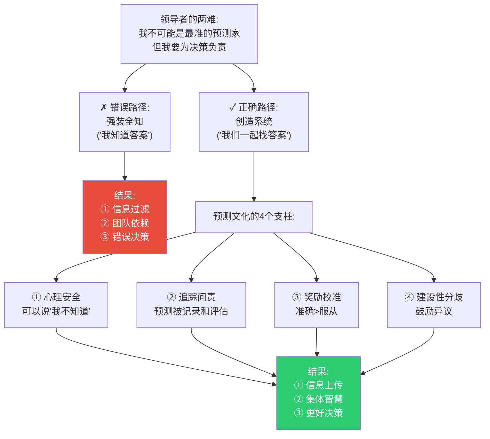
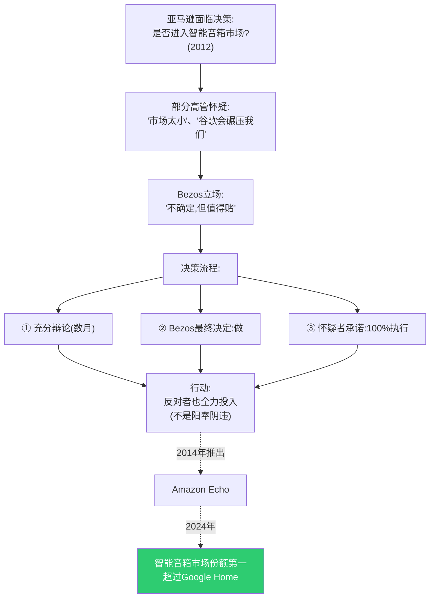
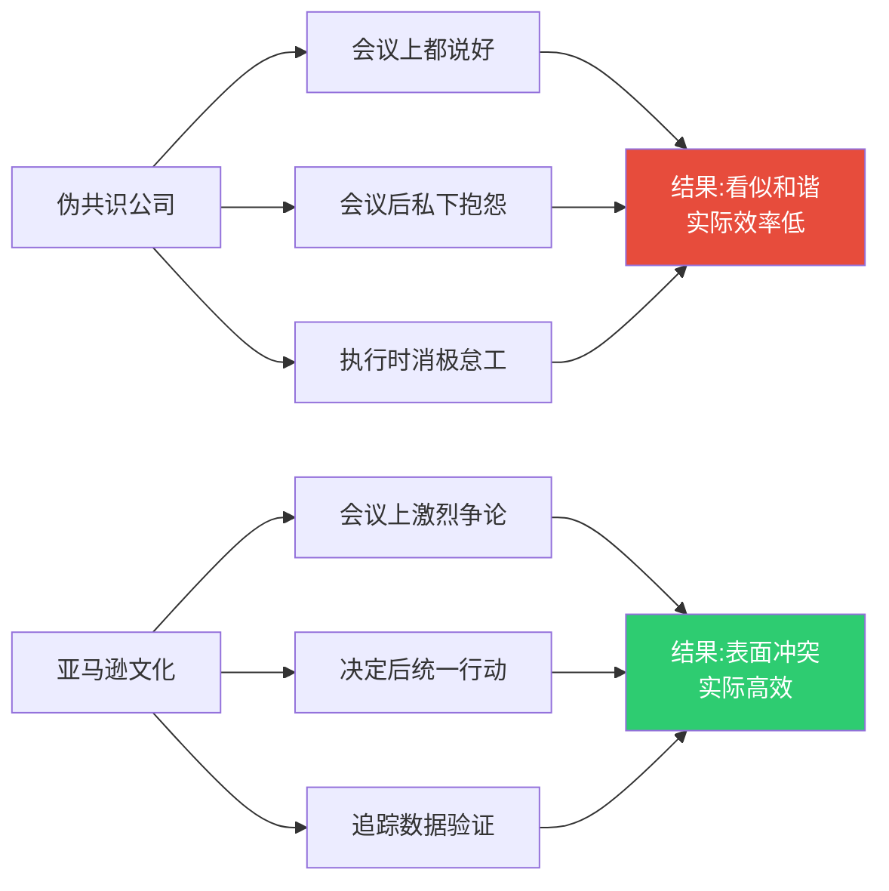
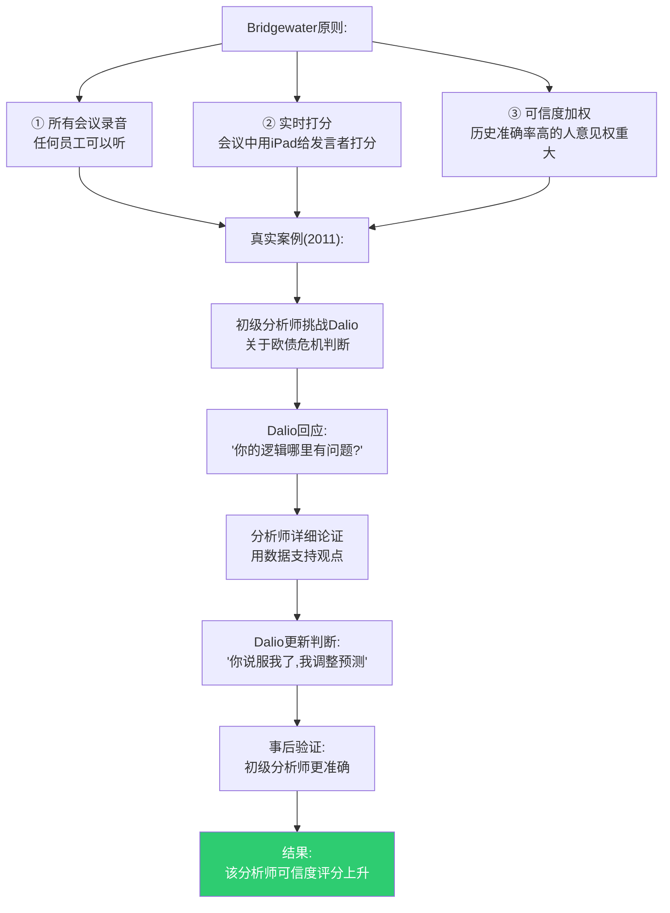
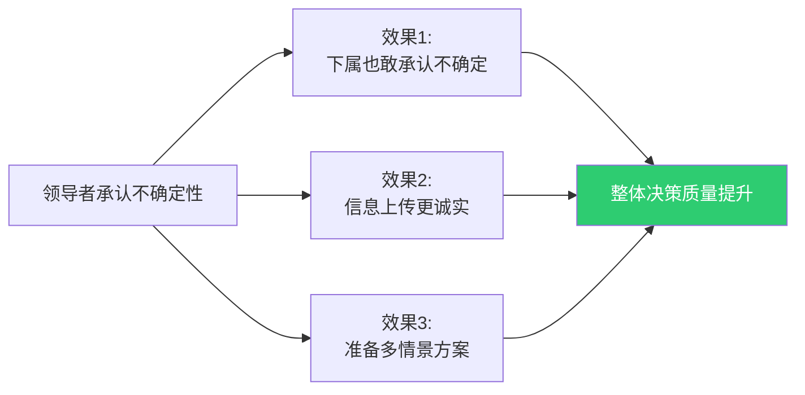
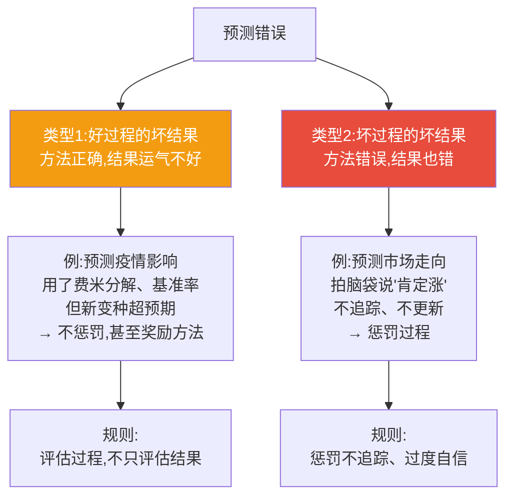
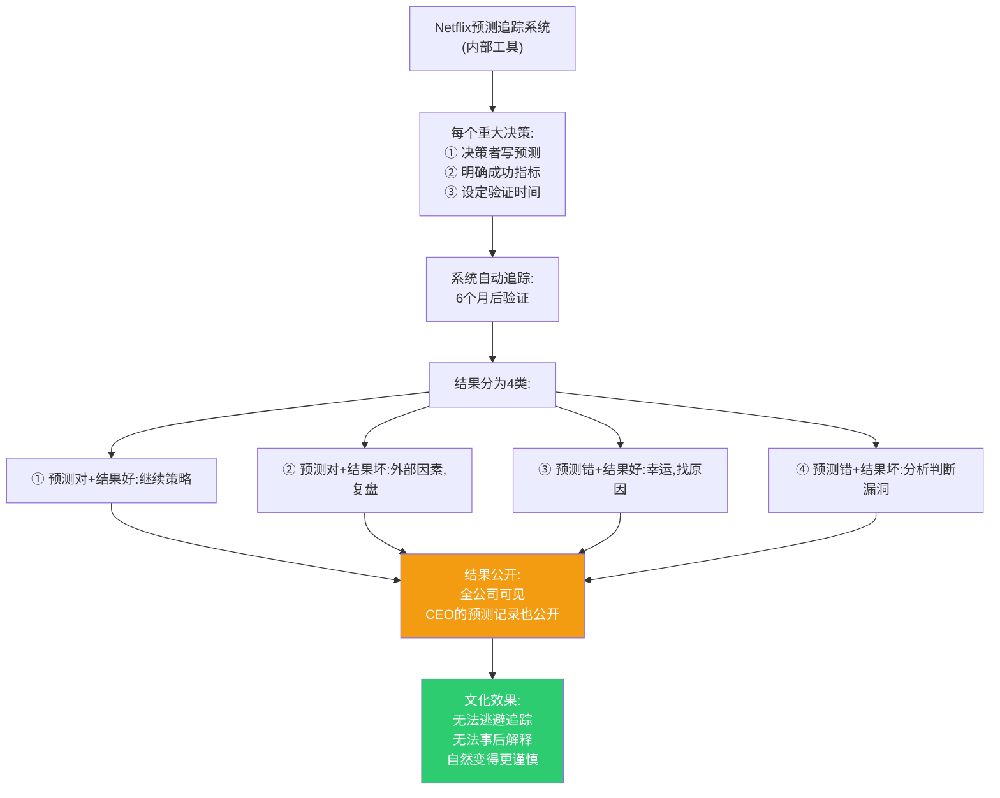
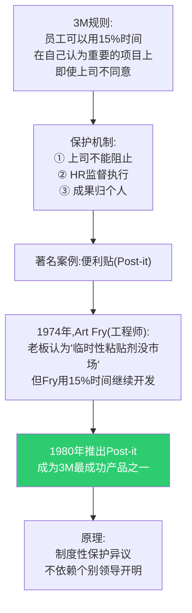
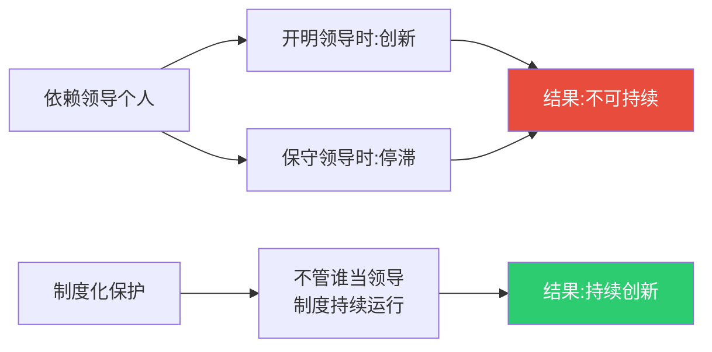

# 第7章:领导力——培养预测文化
> 沈老师视角 · 2026-03-25

这章的核心命题:领导者不需要是最好的预测家,但需要创造让好预测发生的环境。预测文化不是自然形成的,需要刻意设计。

---

## 一、本章核心流图



---

## 二、真实案例:亚马逊的"不同意并承诺"(Disagree and Commit)

### Jeff Bezos的领导哲学

**2016年致股东信**中明确阐述:

> "如果你确信某个方向正确,即使没有共识,也要坚持。但如果你不确定,或者数据模糊,那就'不同意并承诺'——快速做决定,全力执行,即使你不同意。"



**关键制度设计**:

1. **辩论时**:
   - 任何人可以挑战(包括挑战CEO)
   - 必须用数据("我觉得"不够)
   - 写6页备忘录(不是PPT)强迫深度思考

2. **决定后**:
   - 即使你反对,也要100%执行
   - 不能说"我早说过吧"
   - 追踪结果,数据说话

3. **奖励机制**:
   - 奖励"提出有理有据的反对"
   - 不奖励"永远跟老板意见一致"
   - 晋升考察"独立思考能力"

**对比:伪共识文化的公司**



---

## 三、真实案例:Bridgewater的"极度透明"(Radical Transparency)

### Ray Dalio的原则

**背景**:
- 全球最大对冲基金
- 核心文化:"极度求真,极度透明"

**具体实践**:



**可信度加权系统**:

| 预测者 | 历史准确率 | 可信度权重 | 本次预测 | 加权后 |
|--------|------------|------------|----------|--------|
| 分析师A | 72% | 1.2 | 60% | 72% |
| 分析师B | 55% | 0.8 | 70% | 56% |
| 分析师C | 68% | 1.0 | 50% | 50% |
| **团队预测** | - | - | - | **63%** |

**关键洞察**:
- 不是民主(一人一票)
- 不是独裁(老板说了算)
- 是精英制(按历史准确率加权)

**争议**:
- 很多人受不了这种文化(30%新员工1年内离职)
- 但留下的人形成强文化
- **成果**: 2008年金融危机中盈利14%,行业平均-19%

---

## 四、领导者的4个关键行为

### 行为1:公开承认不确定性

**反模式**:
```
记者:"市场会复苏吗?"
CEO:"肯定会,我们很有信心"
(内心:我也不知道,但不能显得软弱)
```

**正确模式**:

**真实案例:Jamie Dimon(摩根大通CEO,2020年)**

```
Q: "疫情对经济的影响会持续多久?"

Dimon: "我不知道。没人真正知道。我们准备了3个情景:
① V型复苏(30%概率):疫苗快速推出
② U型复苏(50%概率):疫情持续1-2年
③ L型衰退(20%概率):结构性改变

我们针对每个情景都有应对计划。"
```



**数据支持**:
- 研究显示:领导者说"我不确定"后
- 团队成员诚实表达不确定性增加40%
- 决策质量提升(用多情景规划)

---

### 行为2:奖励准确,不惩罚错误

**区分两种错误**:



**真实案例:Google的"庆祝失败"文化**

**2008年,Google Wave项目**:
- 雄心勃勃的协作工具
- 投入巨大
- 2010年宣布失败,关闭

**Larry Page的反应**:
```
"团队做了正确的尝试:
① 明确假设(人们需要新的协作方式)
② 快速原型
③ 真实用户测试
④ 诚实承认失败

这个过程值得奖励,即使结果失败。
从Wave学到的技术用在了Gmail和Docs中。"
```

**关键**:
- 不惩罚"经过深思熟虑的失败"
- 惩罚"不做功课的冒进"或"掩盖失败的欺骗"

---

### 行为3:追踪并公开预测记录

**Netflix的"Feedback 360"**:



**Reed Hastings(Netflix CEO)的预测记录**(部分公开):
- 2011年预测"DVD业务会平稳下降" → 对(布里尔分数0.12)
- 2016年预测"原创内容订阅转化率70%" → 错(实际55%,布里尔分数0.28)
- **关键**:CEO的错误预测也公开,展示"追踪是常态"

---

### 行为4:建立制度化的异议渠道

**3M的"15%时间"规则**(实际应用)**:



**对比:依赖领导个人风格的公司**



---

## 五、组织层面的预测文化阶梯

### 第1级:混乱(大多数组织)

```
特征:
□ 预测不被记录
□ 事后随意解释
□ 错误被掩盖
□ 正确被夸大

结果:永远学不会
```

### 第2级:追踪(少数先进组织)

```
特征:
□ 重大决策被记录
□ 定期回顾
□ 计算准确率

例子:Google的OKR系统
不足:追踪但不奖励准确性
```

### 第3级:校准(稀有)

```
特征:
□ 用布里尔分数量化
□ 奖励校准良好的预测
□ 区分过程和结果

例子:Bridgewater的可信度系统
不足:文化要求太高,难推广
```

### 第4级:系统性(极少)

```
特征:
□ 预测市场或竞赛
□ 自动追踪和反馈
□ 异议被制度性保护
□ 领导者也被追踪

例子:情报界的HFC竞赛
挑战:需要组织转型
```

---

## 六、领导者的自我检查

### 你的组织在哪一级?

**测试1: 信息上传**
```
问下属:"项目按时完成的概率?"

如果答案是:
□ "肯定能" → 1级(伪装确定性)
□ "我们会尽力" → 2级(模糊)
□ "70%,因为X风险" → 3级(量化+理由)
□ "上周75%,今天65%,因为Y变化" → 4级(持续更新)
```

**测试2: 错误处理**
```
当下属预测错误时,你的第一反应:

□ "你为什么判断错?" → 1级(责备)
□ "下次注意" → 2级(表面)
□ "你的方法哪里需要改进?" → 3级(过程焦点)
□ "和你过去10次预测对比,这次偏差在哪?" → 4级(系统追踪)
```

**测试3: 异议处理**
```
当下属公开不同意你的判断:

□ "我是老板,听我的" → 1级(权威压制)
□ "你的意见我记下了" → 2级(表面接受)
□ "你的依据是什么?我们讨论一下" → 3级(开放讨论)
□ "你的历史准确率多少?这次crux是什么?" → 4级(系统评估)
```

---

## 七、从1级到4级的路径

### 阶段1: 开始追踪(3个月)

```
步骤:
1. 选择1个领域(如项目交付时间)
2. 强制记录预测(模板:问题+概率+时间)
3. 每月回顾一次
4. 不惩罚错误,只展示数据

目标:建立"追踪是安全的"文化
```

### 阶段2: 引入校准(6个月)

```
步骤:
1. 学习布里尔分数
2. 计算团队平均分
3. 识别系统性偏误(过度自信/保守)
4. 奖励准确性

目标:从"追踪"到"改进"
```

### 阶段3: 制度化异议(12个月)

```
步骤:
1. 建立红队或轮流异议者
2. 保护机制:异议者不被惩罚
3. 领导者示范:公开改变主意
4. 追踪异议的价值

目标:异议成为职责,不是勇气
```

### 阶段4: 系统自动化(18个月+)

```
步骤:
1. 建立预测市场或内部平台
2. 自动追踪和反馈
3. 可信度系统(历史准确率)
4. 领导者的预测也被追踪

目标:系统大于个人
```

---

## 八、本章可执行模型

### 领导者的每日/每周/每月行动

**每日**:
```
□ 至少一次说"我不确定"或"我可能错了"
□ 问至少一个下属:"你的判断是什么?(用概率)"
□ 当有人不同意你时,问"为什么?",不是"听我的"
```

**每周**:
```
□ 在团队会议上追踪上周的预测
□ 明确感谢提出异议的人
□ 分享一个你改变主意的例子
```

**每月**:
```
□ 回顾本月所有记录的预测
□ 计算团队布里尔分数
□ 识别系统性偏误
□ 调整激励机制:奖励准确,不只奖励乐观
```

---

## 九、接入已有认知体系

### 同构关系:

**与Peter Senge《第五项修炼》同构**:
- Senge:学习型组织需要心理安全
- 超级预测文化:需要"可以说我不知道"
- **共同原则**:文化>个人能力

**与Ed Catmull《创新公司》(皮克斯)同构**:
- Catmull:Braintrust(批评小组)提升创意
- 超级预测:红队/异议者提升判断
- **共同机制**:制度化的建设性批评

### 互补关系:

- 填补了"如何在组织落地预测方法"的空缺
- 个人可以学会超级预测(前面章节)
- 组织需要文化支持(本章)

### 矛盾关系:

**与"领导者应该果断"的传统观念矛盾**:
- 传统:领导者不能说"我不知道"(显得软弱)
- 超级预测:领导者必须承认不确定(诚实)
- **解决方案**:
  - 果断在执行层面(一旦决定,坚决执行)
  - 谦逊在判断层面(承认不确定,用概率)
  - Bezos的"不同意并承诺"完美结合两者

---

## 十、沈老师的元评论

这一章最重要的洞察:**预测文化不会自然形成,需要领导者刻意设计**。

大多数组织的默认文化是:
- 伪装确定性(不能说"我不知道")
- 惩罚错误(预测错了会被批评)
- 奖励乐观(总是说"能完成"的人被提拔)

这种文化下,信息自然过滤,判断质量自然下降。

**改变需要三个层次**:

1. **领导者行为**(最重要,最快见效)
   - 公开承认不确定性
   - 公开改变主意
   - 奖励准确,不惩罚错误

2. **制度设计**(中期,可持续)
   - 追踪系统
   - 异议保护机制
   - 可信度加权

3. **文化渗透**(长期,最强大)
   - "准确>服从"成为共识
   - "我不知道"不再是软弱
   - "改变主意"不再是丢脸

**真实案例的启示**:
- 亚马逊:"不同意并承诺"(行为示范)
- Bridgewater:"可信度加权"(制度设计)
- 3M:"15%时间"(异议保护)
- Netflix:"360追踪"(系统化)

从我的认知建模角度:
- **能画出来才算懂** → 文化阶梯必须可视化(1-4级)
- **裁判=理解** → 追踪系统是组织的裁判
- **孤岛知识会消失** → 个人的好方法如果没有文化支持会消失

这一章告诉领导者:**你的核心任务不是做最好的预测,而是创造让好预测发生的系统**。就像教练不需要跑得最快,但需要设计让运动员跑得最快的训练系统。

**最实用的建议**:从明天开始,在团队会议上说一次"我不确定,我的判断是X%,你们的判断是多少?"。这一句话会开始改变文化。

---

*第7章建模完成。核心:领导者创造预测文化,不是靠个人魅力,而是靠行为示范+制度设计+文化渗透。关键是让"承认不确定"变得安全。*
