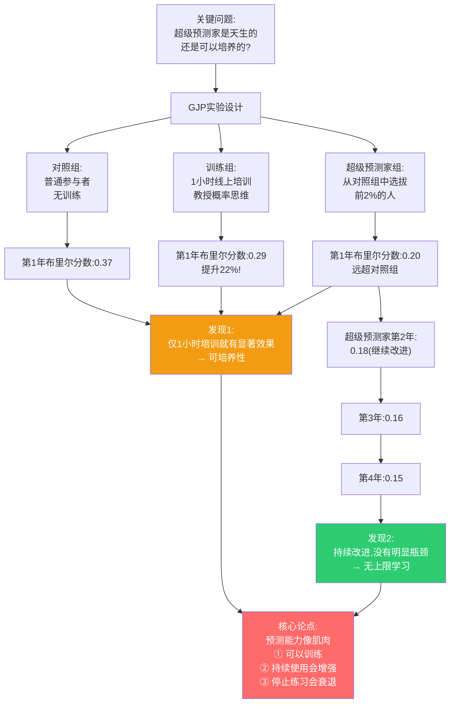
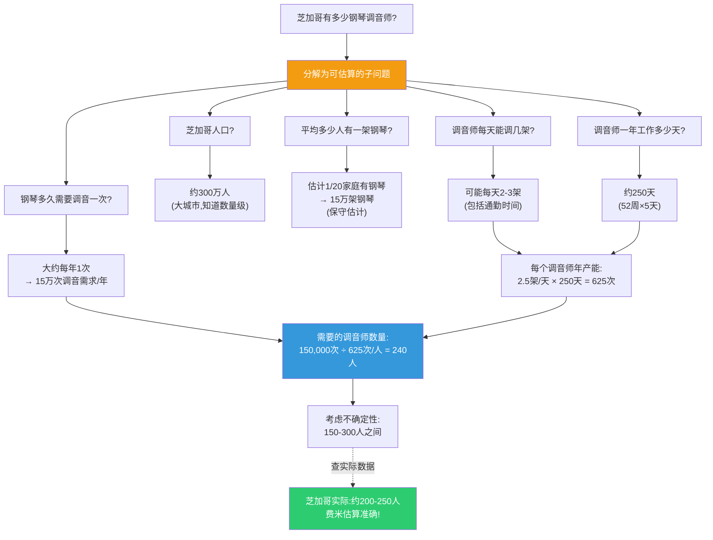
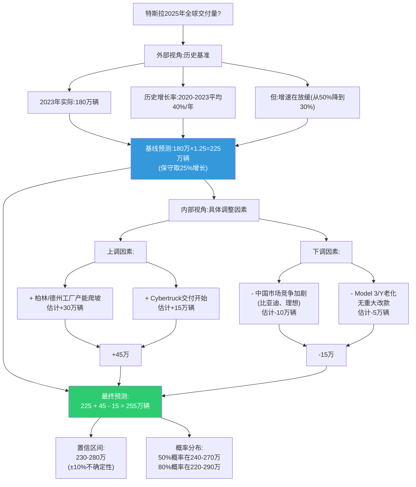
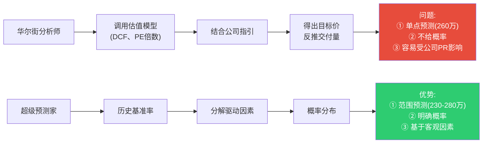
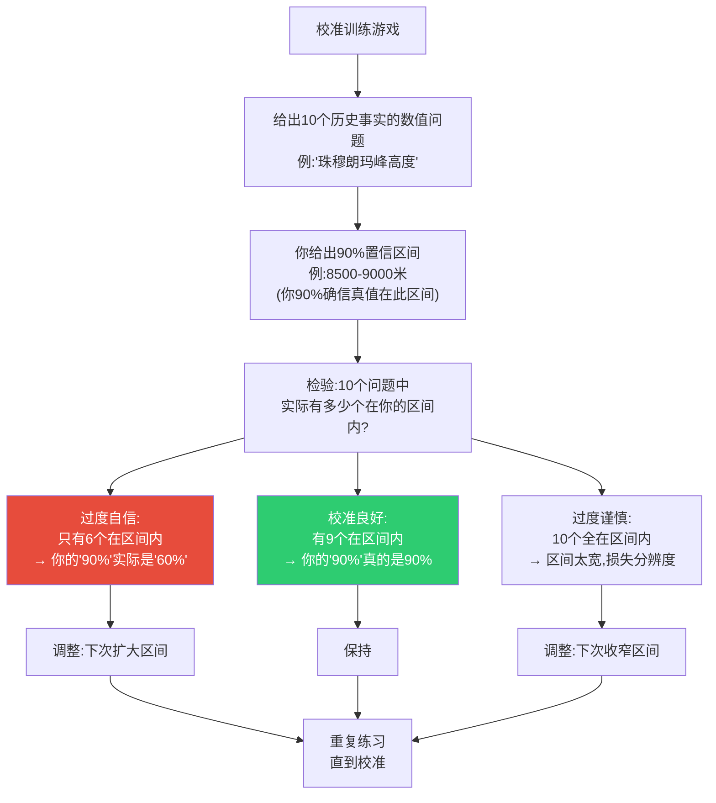
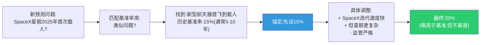
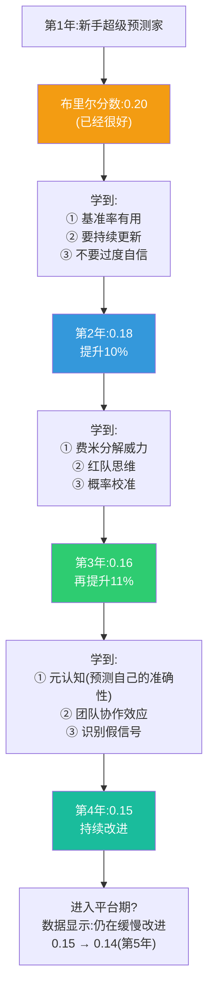
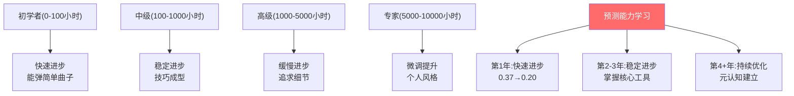
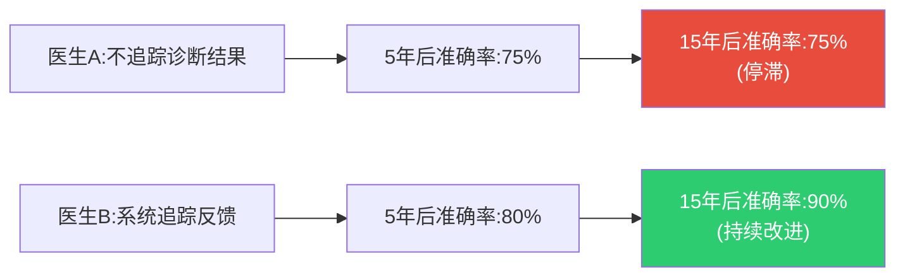
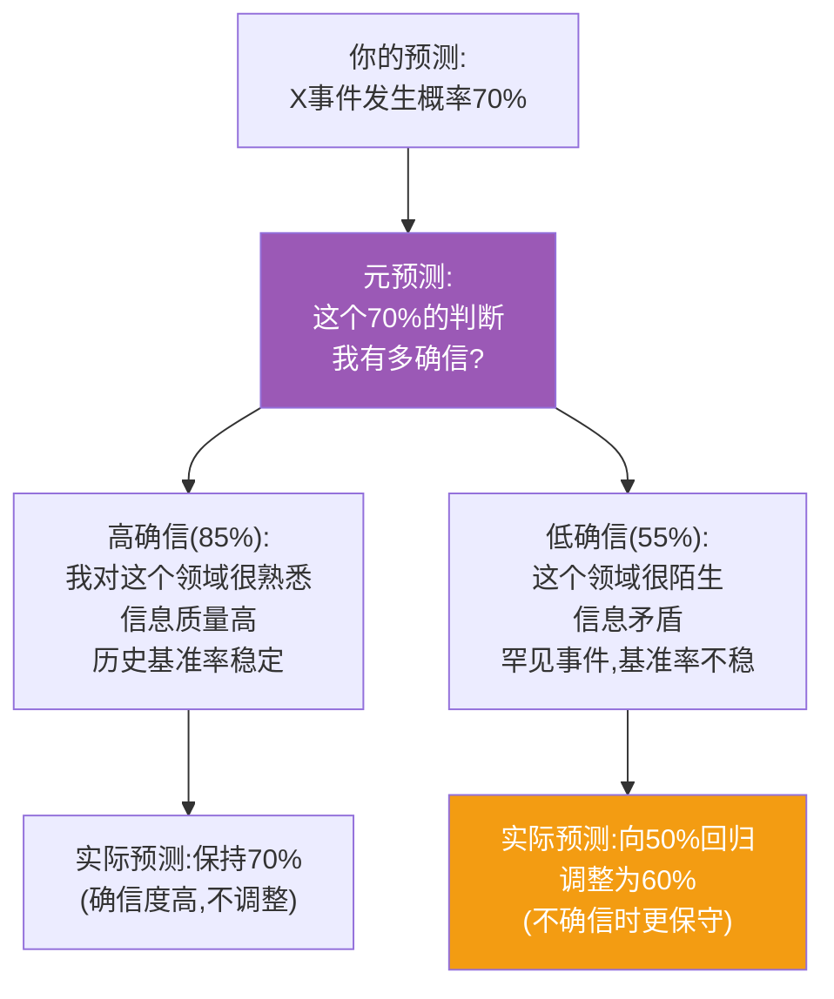

# 第8章:永续学习——超级预测家的成长曲线
> 沈老师视角 · 2026-03-25

这章的核心命题:超级预测家不是"发现"的,是"培养"的。通过正确的反馈循环和刻意练习,普通人可以持续提升预测能力,且这种提升没有明显上限。

---

## 一、本章核心流图



---

## 二、真实世界案例:费米分解的力量

### 案例1:芝加哥有多少钢琴调音师?

这是恩里科·费米(物理学家)著名的例题,超级预测家用类似方法处理不确定问题。

**问题**:芝加哥大约有多少钢琴调音师?(没有查询资料)

**典型错误路径**:
- "我不知道" → 放弃
- "大概几百个吧" → 猜测,无根据

**费米分解路径**:



**关键洞察**:
1. **不需要精确数字**:每个子问题都是估算,但组合起来接近真相
2. **误差会抵消**:高估某项×低估另一项=平衡
3. **数量级正确最重要**:是100级别还是1000级别?

---

### 案例2:特斯拉2025年全球交付量预测

**真实超级预测家的分解过程**(2024年初预测2025年):



**对比:典型分析师的预测方式**



---

## 三、刻意练习的具体方法

### 方法1:预测日记(Forecasting Journal)

**超级预测家的标准格式**:

```markdown
## 预测记录 #0042
**日期**: 2024-03-25
**问题**: OpenAI会在2024年Q3发布GPT-5吗?

### 初始判断(2024-03-25)
- **概率**: 40%
- **推理**:
  - 基准率:GPT-4发布于2023.03,距今12个月
  - 历史:GPT-3到GPT-4间隔15个月
  - 上调因素:竞争压力(Claude 3, Gemini)
  - 下调因素:GPT-4刚更新多模态,需要时间消化反馈
- **关键假设**:
  - 如果Q2有重大技术突破新闻 → 上调到55%
  - 如果Sam Altman公开说"需要更多时间" → 下调到25%

### 更新1(2024-05-10)
- **新信息**: OpenAI发布GPT-4o(优化版),不是GPT-5
- **调整**: 40% → 30%
- **理由**: 优化版意味着还在榨取GPT-4架构的潜力

### 更新2(2024-07-01)
- **新信息**: Bloomberg报道"GPT-5训练遇到瓶颈"
- **调整**: 30% → 15%
- **理由**: 技术瓶颈通常导致延期

### 最终结果(2024-09-30)
- **实际**: 未发布
- **布里尔分数**: (0.15-0)² = 0.0225(优秀)
- **复盘**:
  - ✓ 基准率判断正确(不会那么快)
  - ✓ 对技术信号敏感(及时下调)
  - ✗ 初始40%可能还是略高,下次从30%开始
```

**关键要素**:
1. **明确概率**(不是"可能""也许")
2. **记录推理**(可以事后检验思路)
3. **预设更新触发**(什么信息会改变判断)
4. **持续更新**(不是做完就忘)
5. **事后复盘**(学习在哪里)

---

### 方法2:校准训练(Calibration Training)

**练习:90%置信区间测试**



**真实数据**:
- 未训练者:说"90%确信"时,实际准确率约60-70%
- 经过50次练习:准确率提升到85-90%
- **校准是可以训练的肌肉记忆**

---

### 方法3:基准率库(Base Rate Library)

**超级预测家的个人数据库**:

| 事件类型 | 历史基准率 | 样本量 | 来源 |
|----------|------------|--------|------|
| 科技公司IPO后1年内股价翻倍 | 15% | 100+ | 2010-2020 |
| 独裁者在位10年后被推翻 | 8% | 50+ | 二战后数据 |
| 美联储单次加息>0.5% | 12% | 过去40年 | 美联储历史 |
| 重大软件项目延期>3个月 | 65% | 个人工作经验 |
| 新药三期临床试验成功 | 30-40% | FDA数据 |

**使用流程**:



**为什么基准率库重要?**
- 防止"从零开始"的直觉陷阱
- 提供客观锚点
- 积累个人元知识(关于预测本身的知识)

---

## 四、成长曲线的真实数据

### GJP项目追踪:4年成长轨迹



**关键发现**:
1. **第一年提升最快**(从0.37到0.20,45%提升)
2. **后续持续但放缓**(每年5-10%提升)
3. **没有明显瓶颈**(第4年仍在改进)
4. **停止练习会退步**(离开项目1年后,分数上升)

---

## 五、真实世界类比:技能习得曲线

### 类比1:学习乐器



**相似点**:
- 都有初期快速增长
- 都需要刻意练习
- 都有反馈循环(老师纠正 vs 布里尔分数)
- 都可以持续改进

**不同点**:
- 乐器需要肌肉记忆(数千小时)
- 预测主要是认知习惯(数百小时即见效)

---

### 类比2:医生的诊断准确率

**医学研究数据**:
- 实习医生诊断准确率:60%
- 5年经验医生:75%
- 15年经验医生:85%
- 但:**不追踪反馈的医生,5年后停止进步**



**关键洞察**:
- 经验≠能力提升
- **经验+反馈=能力提升**
- 超级预测家的核心优势:系统化反馈

---

## 六、元认知:预测自己的准确性

### 高级技能:元预测(Meta-Forecasting)

**问题**:不仅预测事件,还预测自己这个预测的准确性。

**案例**:



**真实案例:超级预测家的元认知对话**

> "我预测俄罗斯会在Q1入侵乌克兰,概率65%。但我对这个判断的确信度只有60%,因为:
> 1. 我不了解俄罗斯内部决策
> 2. 历史基准率不稳定(罕见事件)
> 3. 信息高度政治化
>
> 所以我实际给出的预测是55%(向50%回归15%)"

**为什么元认知重要?**
- 防止"不知道自己不知道"
- 在不确定度高时自动保守
- 提升长期校准质量

---

## 七、本章可执行模型

### 永续学习的反馈循环

```
┌─────────────────────────────────────┐
│         刻意练习循环                 │
├─────────────────────────────────────┤
│ 1. 做预测(明确、数值化)              │
│    ↓                                 │
│ 2. 记录推理(可回溯)                  │
│    ↓                                 │
│ 3. 持续更新(根据新信息)              │
│    ↓                                 │
│ 4. 等待验证(几天到几个月)            │
│    ↓                                 │
│ 5. 计算布里尔分数(量化表现)          │
│    ↓                                 │
│ 6. 深度复盘(分析误差来源)            │
│    ├─ 是信息不足?                    │
│    ├─ 是过度自信?                    │
│    ├─ 是基准率错误?                  │
│    └─ 是更新太慢/太快?               │
│    ↓                                 │
│ 7. 提取教训(更新内部模型)            │
│    ↓                                 │
│ 8. 应用到下一个预测 → 回到步骤1      │
└─────────────────────────────────────┘

关键:每一步都不能省略
最重要:步骤6和7(大多数人跳过这里)
```

### if-then规则:

| 情况 | 正确做法 | 错误做法 |
|------|----------|----------|
| 预测对了 | 分析是能力还是运气 | 认为自己厉害 |
| 预测错了 | 分析判断漏洞 | 归因外部因素 |
| 布里尔分数变差 | 回顾最近10个预测找模式 | 认为是运气不好 |
| 布里尔分数变好 | 检验是否过度保守 | 认为自己进步了 |
| 新领域预测 | 从基准率开始,大幅扩大不确定区间 | 用旧领域的信心 |

---

## 八、接入已有认知体系

### 同构关系:

**与"刻意练习"(Anders Ericsson)同构**:
- 埃里克森:专家技能=刻意练习+即时反馈
- 泰洛克:超级预测家=刻意练习+布里尔分数反馈
- **共同结构**:技能习得的必要条件=目标明确的练习+准确反馈

**与"复利效应"同构**:
- 投资:每年10%增长,10年后2.6倍
- 预测:每年10%改进,4年后0.37→0.20(45%提升)
- **共同原理**:持续的小幅改进,长期产生巨大差异

### 互补关系:

- 填补了"如何从新手到专家"的具体路径
- 格拉德威尔《异类》说"需要1万小时"
- 泰洛克说"500小时就能显著提升,但需要正确方法"
- 关键差异:有反馈的500小时 > 无反馈的5000小时

### 矛盾关系:

**与"直觉专家"(Gary Klein)的张力**:
- Klein:经验丰富的专家直觉很准(消防员、护士)
- 泰洛克:经验丰富的专家预测不准(经济学家、政治分析家)
- **条件差异**:
  - 直觉在**重复性、快反馈**环境中有效(消防:火场模式识别)
  - 直觉在**非重复、慢反馈**环境中失效(预测:罕见事件,反馈延迟)
- **解决方案**:识别你的领域属于哪一类

---

## 九、沈老师的元评论

这一章最激动人心的发现:**预测能力没有上限,只要你持续刻意练习。**

这打破了"预测是天赋"的迷思。数据清楚显示:
1. **1小时训练就有22%提升** → 门槛很低
2. **4年持续改进45%** → 潜力很大
3. **第4年仍在进步** → 没有瓶颈

但这也揭示了一个残酷现实:**大多数人不会进步,不是因为能力上限,而是因为不做刻意练习。**

**为什么大多数人不进步?**
1. 不追踪预测(没有反馈)
2. 不复盘错误(逃避痛苦)
3. 不更新模型(固守经验)
4. 不承认无知(保护自尊)

从我的认知建模角度:
- **能画出来才算懂** → 费米分解强制你画出问题结构
- **裁判=理解** → 布里尔分数是最诚实的裁判
- **孤岛知识会消失** → 基准率库是系统化知识积累

这一章给我们的启示:**成为超级预测家是一场马拉松,不是短跑。**
- 入门容易(1小时训练就见效)
- 精进需要时间(4年持续改进)
- 关键是持续性(停止练习会退步)

最重要的不是"我现在准不准",而是"我一年后会比现在准多少"。成长曲线比起点重要。

---

*第8章建模完成。核心:超级预测能力可以通过刻意练习持续提升,且没有明显上限。关键是反馈循环。*
