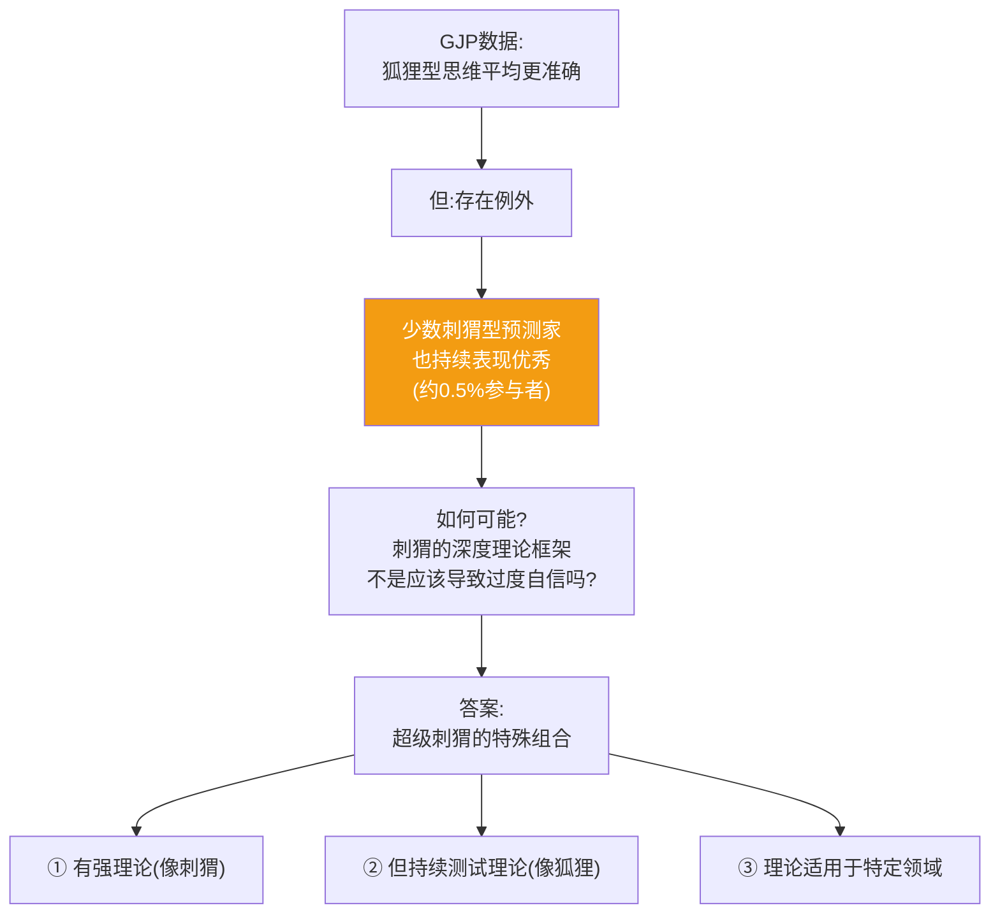
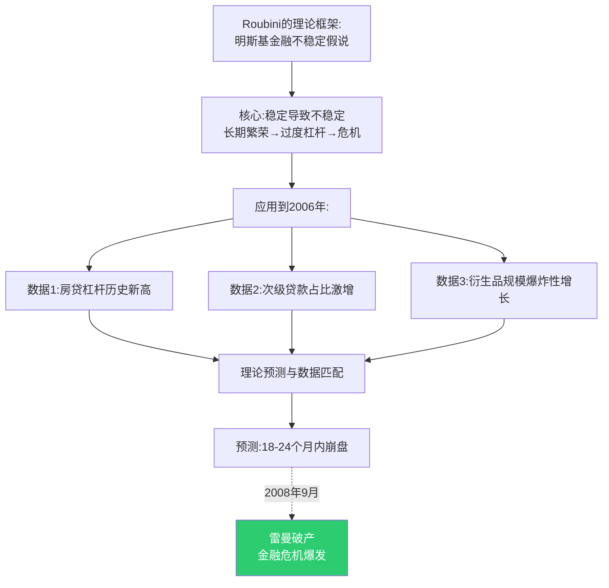
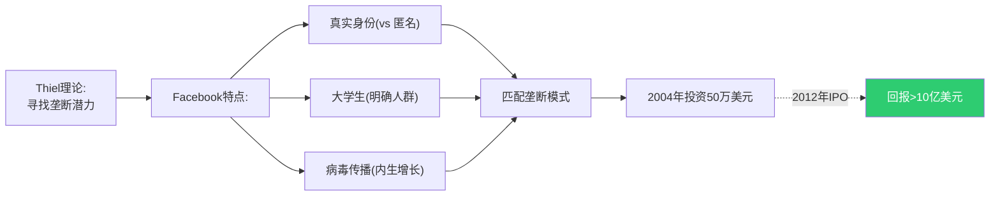
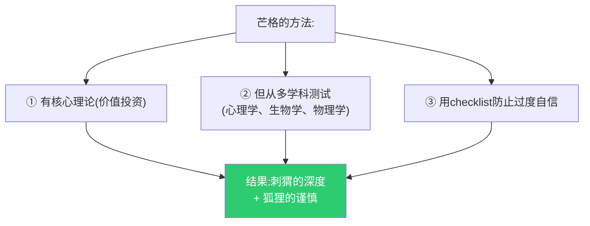
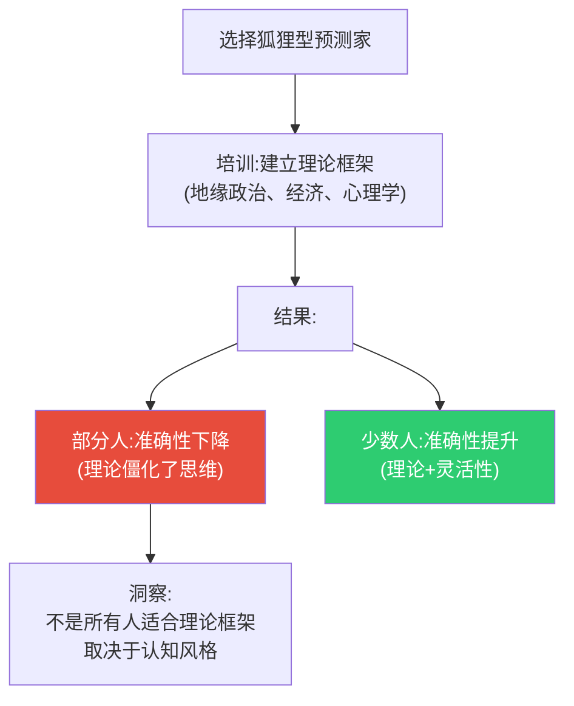

# 第9章:超级刺猬——例外还是趋势?
> 沈老师视角 · 2026-03-25

这章的核心命题:虽然数据显示狐狸平均比刺猬准确,但存在少数"超级刺猬"——同时拥有强理论框架和准确预测的人。他们如何做到的?

---

## 一、核心悖论



---

## 二、真实案例:Nouriel Roubini预测2008金融危机

### 背景

**2006年IMF会议**,Roubini(纽约大学教授)预测:
- 美国房地产泡沫将破裂
- 引发系统性金融危机
- 银行业将崩溃

**当时反应**:被嘲笑为"末日博士"(Dr. Doom)

### 为什么他预测对了?



### 关键特征(超级刺猬 vs 普通刺猬)

| 维度 | 普通刺猬 | 超级刺猬(Roubini) |
|------|----------|-------------------|
| **理论** | 永远适用 | 有适用边界 |
| **数据** | 解释数据配合理论 | 用数据测试理论 |
| **预测** | 确定性断言 | 概率+时间窗口 |
| **错误** | 事后解释 | 承认边界 |

**Roubini不是完美**:
- 2010年后多次预测"崩盘即将来临"
- 但没有发生
- **他的理论适用于债务危机,不适用所有场景**

---

## 三、真实案例:Peter Thiel的反向投资

### 2004年投资Facebook

**背景**:
- 社交网络已有Friendster、MySpace
- 大多数投资者认为市场饱和

**Thiel的理论框架**:
```
"垄断理论":
真正有价值的公司会形成网络效应垄断
不是"更好的社交网络",是"完全不同维度"
```

**应用**:


### 为什么他是"超级刺猬"?

1. **有强理论**: 垄断>竞争
2. **但测试理论**: 不是所有公司都投,只投符合"垄断特征"的
3. **承认边界**: 2000年dot-com泡沫时也犯过错误

**对比:普通刺猬投资者**
- 有理论:"科技改变世界"
- 不测试:所有科技公司都投
- 结果:2000年泡沫破裂时损失惨重

---

## 四、超级刺猬的共同模式

### 模式1: 理论有明确适用域

**普通刺猬**: "我的理论解释一切"
**超级刺猬**: "我的理论在X条件下适用"

**例子:巴菲特**
```
理论:"价值投资"(买低估公司)

适用域:
✓ 可预测现金流的传统行业
✓ 有护城河的公司
✗ 高科技公司(承认不懂)
✗ 加密货币(明确说"不投资不懂的")

结果:在适用域内持续优秀
不在适用域时承认无知
```

### 模式2: 持续测试理论边界

**真实案例:芒格的"格栅理论"**

虽然巴菲特-芒格被认为是价值投资"刺猬",但:


### 模式3: 理论与数据的动态平衡

```
普通刺猬:理论>数据
(数据不符合理论就忽略数据)

超级狐狸:数据>理论
(理论只是组织数据的工具)

超级刺猬:理论↔数据
(理论指导搜索,数据验证理论)
```

---

## 五、超级刺猬可以被培养吗?

### GJP的培训实验(2013-2014)

**实验**: 能否把狐狸训练成超级刺猬?



**关键因素**:
- **开放性人格**(Big Five)高的人可以驾驭理论
- 低开放性的人用理论反而变僵化

---

## 六、实践建议

### 如果你是狐狸:

```
□ 不一定要成为刺猬
□ 但可以学习:在你熟悉的领域建立理论框架
□ 例:如果你预测科技行业10年,总结你的"行业规律"
□ 用这个框架提升速度,但保持灵活性
```

### 如果你是刺猬:

```
□ 明确你的理论适用边界
□ 在边界内深度应用
□ 在边界外谦虚承认无知
□ 例:巴菲特不投科技,不是弱点,是自知
```

### 组织层面:

```
□ 不要强制统一思维方式
□ 狐狸和刺猬都需要
□ 狐狸适合新领域探索
□ 刺猬适合成熟领域优化
□ 超级刺猬适合长期战略
```

---

## 七、本章可执行模型

### 判断你是否是"超级刺猬"潜质

```
□ 我有一个核心理论框架
□ 我可以明确说出理论的适用边界
□ 我用数据测试理论,而非解释数据
□ 我承认理论失效时(例子:____)
□ 我在适用域内的准确率高于平均

如果5个都✓ → 你可能是超级刺猬
如果前3个✓,后2个✗ → 你是普通刺猬(危险)
如果都✗ → 你是狐狸(没问题)
```

---

*第9章建模完成。核心:超级刺猬是理论+谦逊的罕见组合,有强框架但知道边界,适合特定场景,不是所有人都应该追求。*
