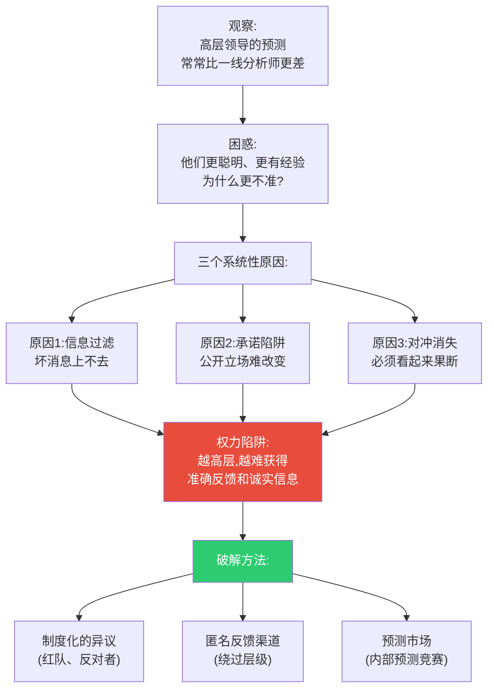
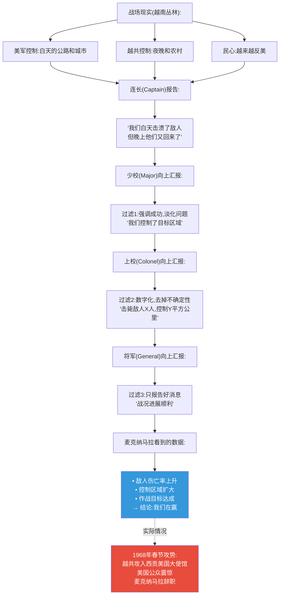
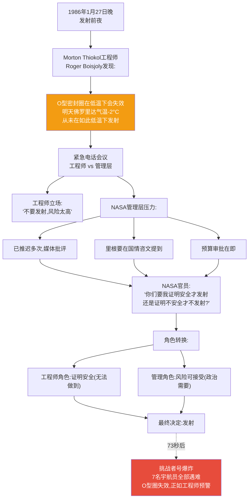
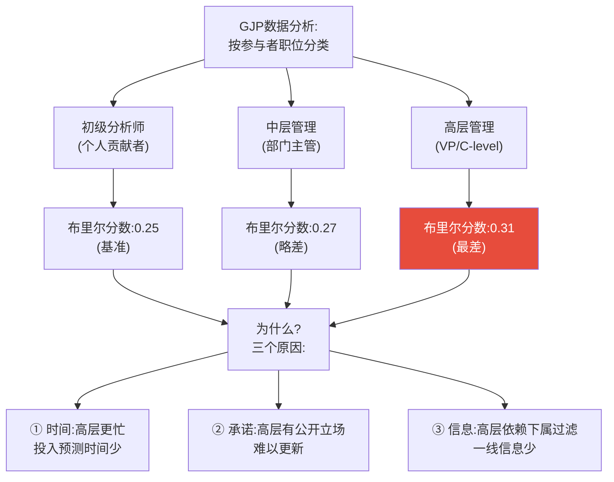
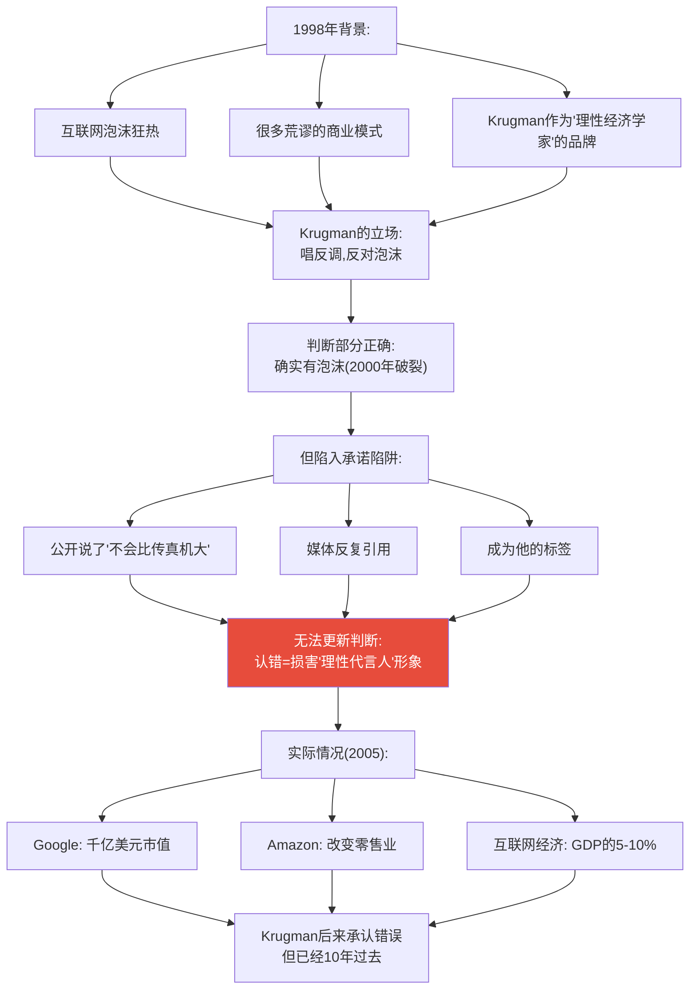
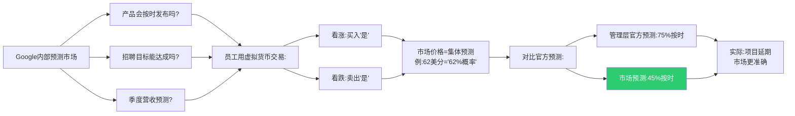
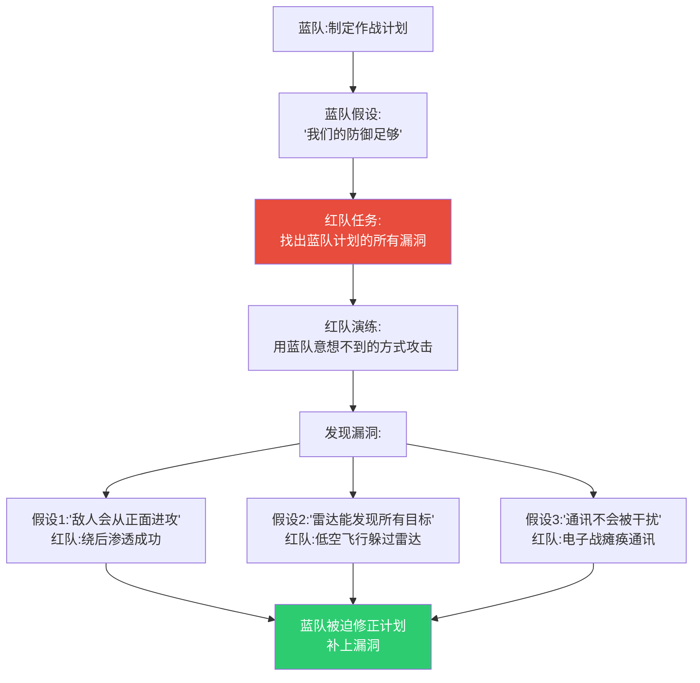
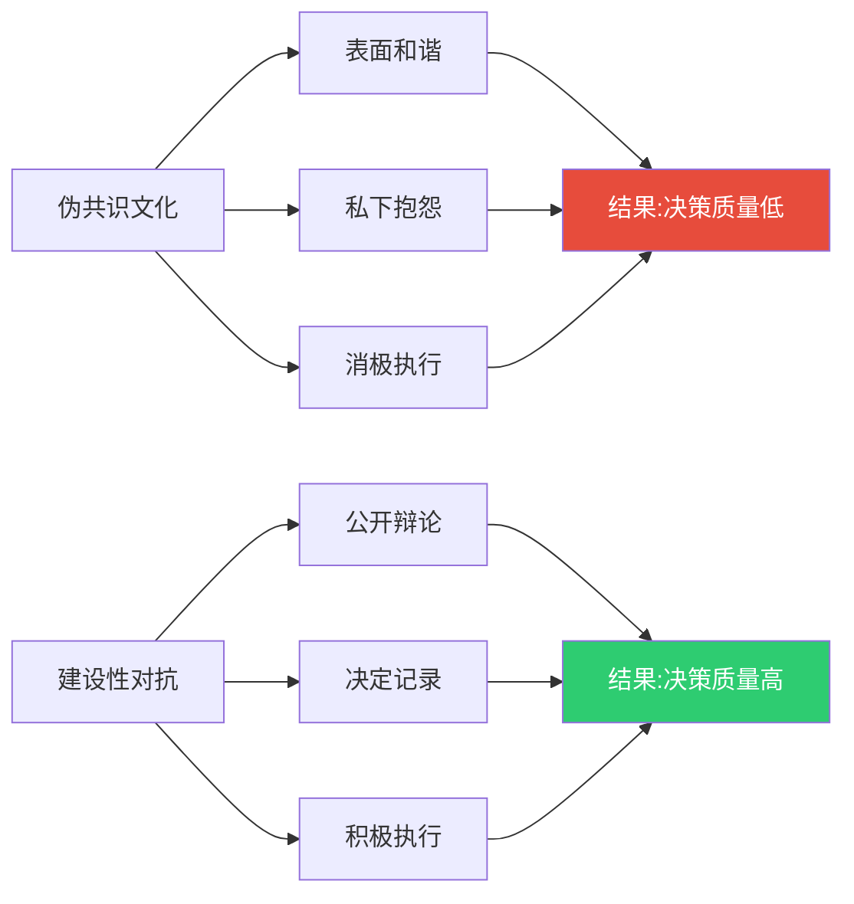

# 第10章:领导者困境——权力如何扭曲判断
> 沈老师视角 · 2026-03-25

这章的核心命题:越接近权力中心,预测越不准。不是因为领导者愚蠢,而是因为权力位置系统性地扭曲了信息流和激励机制。

---

## 一、本章核心流图



---

## 二、真实历史案例:越战中的信息过滤

### 案例1:麦克纳马拉的数字陷阱(1964-1968)

**背景**:
- Robert McNamara,国防部长(前福特汽车总裁)
- 著名的数据驱动管理者("麦克纳马拉的神童")
- 越战期间依赖"硬数据"评估战况

**信息过滤的层级放大效应**:



**每一层的激励机制**:
- 连长:想要提拔 → 报告积极进展
- 少校:想要星星(升准将)→ 不传递坏消息
- 上校:保护下属 → 把"混乱"说成"挑战"
- 将军:已公开承诺"胜利在望"→ 不能自相矛盾

**麦克纳马拉的致命错误**:
- 相信"硬数据"(击毙数、控制区)
- 忽视"软信息"(民心、士气)
- 没有建立**绕过层级的信息渠道**

**历史对比:林肯在南北战争中的做法**

Lincoln访问前线时会:
1. 直接找普通士兵聊天(绕过将军)
2. 阅读士兵家信(了解真实士气)
3. 接见逃兵(了解为什么逃跑)
4. **不惩罚传递坏消息的人**

---

### 案例2:NASA挑战者号灾难(1986)——工程师的警告被忽视

**时间线**:



**罗杰斯委员会调查**(物理学家Richard Feynman参与):

Feynman的著名演示:
- 在听证会上,他拿一杯冰水
- 把O型圈样品放进去
- 取出后用钳子夹,橡胶失去弹性
- 无需复杂报告,一个实验说明一切

**事后工程师Boisjoly的证词**:
> "管理层要我脱下工程师帽子,戴上管理者帽子。那一刻,我知道我们输了。工程师的职责是说真话,不管听众想不想听。"

**关键洞察**:
- 工程师给出概率判断:"30-40%失效风险"
- 管理层要的是确定性:"证明它不安全"
- **举证责任倒置**杀死了7个人

---

## 三、GJP实验:层级与准确性的关系

### 实验数据:职位越高,越不准?



**但有例外**:
- 那些**匿名参与**的高管,布里尔分数0.23(优于平均)
- 关键差异:**没有公开立场**,可以自由更新判断

---

## 四、承诺陷阱:公开预测的代价

### 真实案例:Paul Krugman的互联网预测(1998)

**1998年,《红鲱鱼》杂志采访**:

> Krugman预测:"到2005年,互联网对经济的影响不会比传真机大。"

**为什么一个诺贝尔奖得主会犯如此明显的错误?**



**对比:超级预测家的做法**

超级预测家如果1998年预测:
- 不会说"不会比传真机大"(绝对断言)
- 会说"互联网在2005年占GDP 3-7%"(概率区间)
- 每季度根据新数据更新
- 匿名参与,没有品牌压力

**关键差异**:
| 维度 | 公共知识分子 | 超级预测家 |
|------|--------------|------------|
| **表达方式** | 确定性断言 | 概率判断 |
| **更新频率** | 很少(损害权威) | 持续(鼓励) |
| **身份绑定** | 观点=身份 | 观点=可测试假说 |
| **错误成本** | 声誉损失 | 布里尔分数 |

---

## 五、破解权力陷阱的制度设计

### 方法1:预测市场(Google的内部实践)

**Google从2005年开始运行内部预测市场**:



**为什么预测市场更准?**

1. **匿名性**:没人知道你买了什么,没有政治压力
2. **激励对齐**:预测准确有奖励(虚拟货币可兑换奖品)
3. **分散信息**:一线工程师的判断被聚合
4. **持续更新**:每天交易,价格实时反映新信息

**历史数据**(Google内部报告,2008):
- 预测市场准确率:85%
- 管理层官方预测准确率:65%
- **预测市场甚至比管理层更早发现问题**

---

### 方法2:红队制度(美国军方实践)

**起源**:冷战时期,模拟苏联视角攻击美国防御

**现代应用**:



**2002年千禧挑战演习**(Millennium Challenge):

**蓝队**(美军):
- 最先进装备
- 网络中心战
- 卫星、无人机、精确制导

**红队**(退役将军Paul Van Riper扮演伊朗):
- 用摩托车传令(绕过电子侦听)
- 用渔船伪装(雷达忽视小目标)
- 用自杀式快艇(非常规战术)

**结果**:
- 红队在演习开始后10分钟击沉美军航母
- 蓝队"阵亡"2万人
- **暴露了美军对非常规战术的准备不足**

**争议**:演习主办方后来修改规则让蓝队"赢",Van Riper愤怒辞职

**教训**:红队只有在**允许真正挑战**时才有用,否则是作秀。

---

### 方法3:建设性的对抗文化(Intel案例)

**Andy Grove的"不同意并承诺"(Disagree and Commit)**

```mermaid
flowchart TD
    DECISION["Intel面临重大决策:\n退出存储芯片,转向微处理器(1985)"]

    DECISION --> DEBATE["激烈辩论:"]

    DEBATE --> SIDE1["反对派(存储芯片VP):\n'这是我们的核心业务\n日本竞争虽激烈但可以打'"]

    DEBATE --> SIDE2["支持派(Grove):\n'存储芯片利润率已跌破5%\n微处理器是未来'"]

    SIDE1 & SIDE2 --> PROCESS["Grove的决策流程:"]

    PROCESS --> P1["① 全员可以挑战CEO决定"]
    PROCESS --> P2["② 必须用数据,不能用情绪"]
    PROCESS --> P3["③ 辩论记录在案"]
    PROCESS --> P4["④ CEO最终决定"]
    PROCESS --> P5["⑤ 决定后全员执行(即使不同意)"]

    P1 & P2 & P3 & P4 & P5 --> FINAL["Grove决定:退出存储"]

    FINAL --> EXECUTE["反对派VP:\n虽然我不同意\n但我会100%执行"]

    EXECUTE -.->|"结果"| SUCCESS["Intel成为微处理器霸主\n市值从19亿增长到2000亿"]

    style SUCCESS fill:#2ecc71,color:#fff
```



**关键原则**:
- 辩论时:鼓励不同意,用数据说话
- 决定后:服从执行,不能阳奉阴违
- **"建设性对抗"≠内斗,而是制度化的挑战机制**

**对比:很多公司的"共识文化"**



---

## 六、本章可执行模型

### 权力陷阱诊断清单

**你的组织有这些症状吗?**

```
□ 信息过滤症状:
  - 高层总是最后知道坏消息
  - "汇报材料"和"内部版本"不一样
  - 下属花很多时间"管理向上沟通"

□ 承诺陷阱症状:
  - 领导公开承诺后,团队不敢说"做不到"
  - 预测一旦公布就很少更新
  - 错误预测被事后解释成"条件变了"

□ 对冲消失症状:
  - 领导要求"明确答案",不接受"不确定"
  - 概率判断被视为"不够坚定"
  - "我们有80%把握"被要求改成"我们会成功"
```

### 破解方案:

| 问题 | 症状 | 解决方案 |
|------|------|----------|
| **信息过滤** | 坏消息传不上来 | ① 匿名反馈渠道<br>② 领导直接接触一线<br>③ 预测市场 |
| **承诺陷阱** | 公开立场难改 | ① 用概率表达<br>② 定期更新<br>③ 奖励改变主意 |
| **对冲消失** | 被迫假装确定 | ① 接受不确定性<br>② 概率范围<br>③ 红队挑战 |

---

## 七、接入已有认知体系

### 同构关系:

**与"委托-代理问题"(经济学)同构**:
- 经济学:代理人(管理层)目标≠委托人(股东)
- 预测准确性:下属目标(取悦上司)≠组织目标(准确预测)
- **共同结构**:激励错位导致信息扭曲

**与"信息不对称"同构**:
- 二手车市场:卖家知道车况,买家不知道
- 组织层级:下属知道实情,领导不知道
- **破解方法**:信号机制(预测市场=信号)

### 互补关系:

- 填补了"为什么聪明领导做蠢决策"的系统性解释
- 不是个人问题,是**位置**的问题
- 制度设计可以补偿位置的劣势

### 矛盾关系:

**与"领导力=决断力"的传统观念矛盾**:
- 传统:好领导应该果断、确定、不动摇
- GJP:好预测需要谦逊、不确定、持续更新
- **条件差异**:
  - 在执行层面,果断有价值(团队需要方向)
  - 在判断层面,谦逊有价值(概率思维)
- **解决方案**:区分"判断模式"和"执行模式"

---

## 八、沈老师的元评论

这一章揭示的真相令人不安:**权力本身就是认知障碍**。

不是说领导者不聪明,而是权力位置系统性地制造了三个陷阱:
1. **信息向上过滤**(好消息放大,坏消息过滤)
2. **承诺锁定**(公开立场后难以更新)
3. **确定性压力**(被迫假装知道答案)

麦克纳马拉、NASA管理层、Krugman都不是愚蠢的人,但他们都陷入了位置带来的认知陷阱。

**最深刻的洞察**:GJP数据显示,高层管理者**匿名参与**时表现优于平均,说明问题不在人,在**角色和激励**。

破解方法不是"让领导更聪明",而是**制度设计**:
- 预测市场(绕过层级,聚合分散信息)
- 红队制度(制度化的挑战)
- 建设性对抗(鼓励不同意)

从我的认知建模角度:
- **能画出来才算懂** → 信息流动路径必须可视化,看清楚过滤发生在哪
- **裁判=理解** → 预测市场是最诚实的裁判,因为钱(即使虚拟)不撒谎
- **孤岛知识会消失** → 一线工程师的判断如果上不去,就等于不存在

这一章最重要的实践启示:**如果你是领导,主动建立绕过你的信息渠道**。不是因为你不信任下属,而是因为你知道**位置本身就是偏见**。

---

*第10章建模完成。核心:权力是认知障碍,不是因为领导者愚蠢,而是因为位置系统性地扭曲信息和激励。破解需要制度设计,不是个人修养。*
