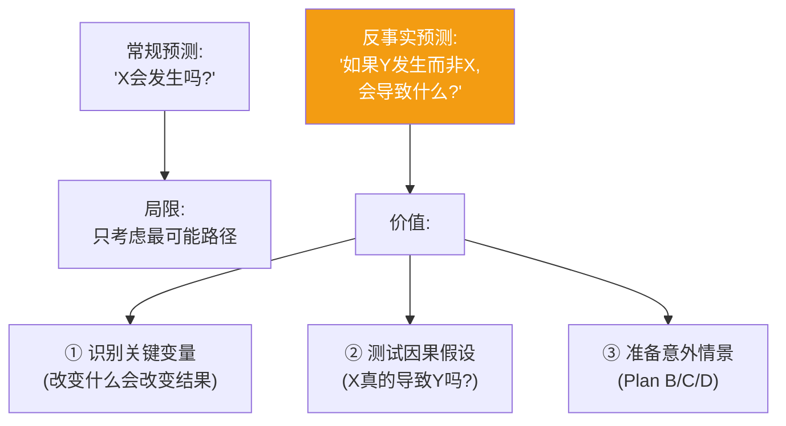
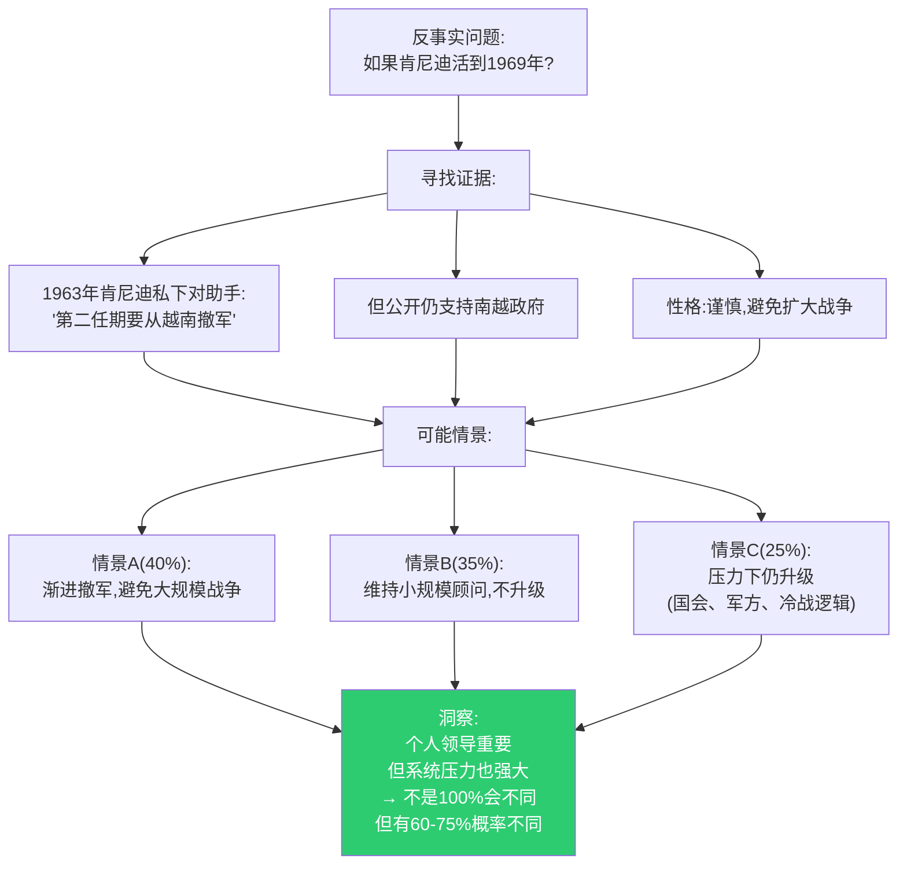
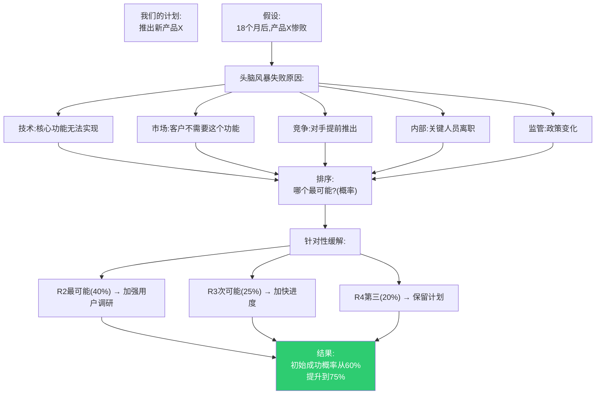
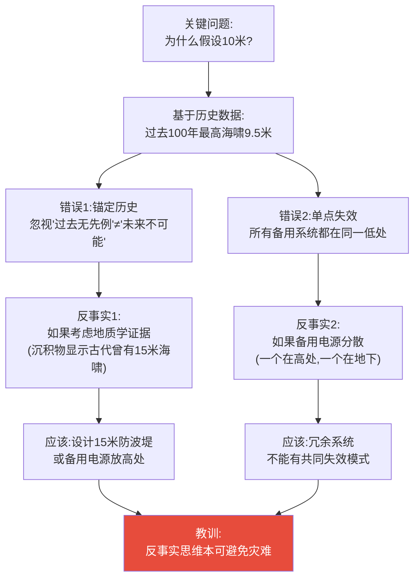
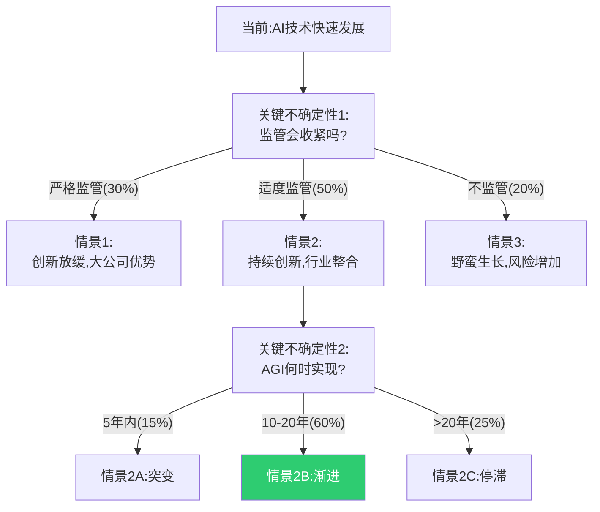

# 第11章:反事实思维——"如果...会怎样?"
> 沈老师视角 · 2026-03-25

这章的核心命题:超级预测家不仅预测"会发生什么",还系统性地思考"如果不同,会怎样"。反事实思维(counterfactual thinking)是提升预测的强大工具。

---

## 一、核心概念



---

## 二、真实历史案例:肯尼迪遇刺后的反事实分析

### 背景(1963年11月22日)

**事实**: 肯尼迪遇刺,林登·约翰逊继任

**历史学家的反事实问题**:
"如果肯尼迪没有遇刺,越战会不同吗?"



**为什么这个练习有价值?**
- 识别关键变量:领导人性格 vs 系统压力
- 测试因果:不是"肯尼迪=和平",而是"概率不同"
- 避免历史决定论:"历史必然如此"是懒惰思维

---

## 三、超级预测家的反事实工具:赛前分析(Premortem)

### Gary Klein发明的方法

**传统postmortem**(事后分析):
"项目失败了,原因是什么?"

**Premortem**(赛前分析):
"假设项目已经失败了,最可能的原因是什么?"



**真实案例:Pixar的"Braintrust"会议**

每部电影中期,进行premortem:
```
问题:"假设这部电影票房惨败,为什么?"

2009年《飞屋环游记》:
- 识别风险:"老人主角,儿童观众不感兴趣"
- 缓解方案:增加小孩角色、冒险元素
- 结果:票房7.35亿美元,奥斯卡最佳动画
```

---

## 四、反事实思维的4个层次

### 层次1:向上反事实(Upward Counterfactual)

**定义**: "如果我做得更好,会怎样?"

**价值**: 识别改进机会

**例子**:
```
预测失败:"我预测特朗普2020年连任(70%),实际落选"

向上反事实:
"如果我考虑了疫情对现任总统的影响,
如果我权重了郊区女性选民的变化,
→ 我会给50-55%,更准确"
```

### 层次2:向下反事实(Downward Counterfactual)

**定义**: "如果更糟,会怎样?"

**价值**: 感恩和风险意识

**例子**:
```
成功案例:"我们的产品按时上市"

向下反事实:
"如果供应链延期(15%概率差点发生),
如果主工程师离职(他收到过offer),
→ 我们其实有30%风险失败,要感谢运气成分"
```

### 层次3:横向反事实(Lateral Counterfactual)

**定义**: "如果环境不同,会怎样?"

**价值**: 测试策略鲁棒性

**例子**:
```
当前策略:"押注电动车"

横向反事实:
"如果石油价格跌到30美元/桶(10%概率),
如果固态电池未能突破(40%概率),
如果政府补贴取消(30%概率),
→ 我们的策略在多少情景下仍然有效?"
```

### 层次4:系统性反事实(Systemic Counterfactual)

**定义**: "如果规则改变,会怎样?"

**价值**: 识别结构性风险

**例子**:
```
假设:"民主制度是稳定的"

系统性反事实:
"如果社交媒体导致极化(正在发生),
如果经济不平等持续扩大(正在发生),
如果外部势力干预选举(已有案例),
→ 民主制度的稳定性如何?需要什么新机制?"
```

---

## 五、真实案例:2011年日本福岛核灾难

### 反事实分析揭示的系统性失败

**事实经过**:
- 2011年3月11日:9.0级地震
- 海啸高14米,超过防波堤10米设计
- 备用发电机被淹,反应堆熔毁

**东京电力的事前风险评估**:
```
假设:最大海啸高度10米
设计:防波堤10米
结论:安全
```

**反事实分析揭示的错误**:



**关键洞察**:
- 不是"没人能预测"
- 是"系统性忽视反事实情景"
- **如果问"如果超过10米呢?"早该问的问题**

---

## 六、超级预测家如何使用反事实

### 工具1:关键变量识别法

```
步骤1:列出你预测的关键假设
例:"欧洲央行会加息(70%)"

假设:
A. 通胀率持续>2%目标(90%确信)
B. 失业率保持低位(70%确信)
C. 没有系统性金融危机(80%确信)

步骤2:反事实测试
如果A假设错(通胀突然下降),你的70%会变成?
→ 变成20%
→ A是关键变量

如果B假设错(失业率上升),你的70%会变成?
→ 变成50%
→ B是重要但非关键

如果C假设错(银行危机),你的70%会变成?
→ 变成0%
→ C是关键变量

步骤3:监控关键变量
重点追踪A和C,而非所有变量
```

### 工具2:情景树构建



**使用方法**:
- 不是预测"哪个会发生"
- 是准备"每个情景下怎么办"
- 壳牌的情景规划就是这个方法

---

## 七、反事实思维的陷阱

### 陷阱1:过度后悔(Hindsight Bias)

```
错误:"如果我当时买了比特币,现在就发财了"
(忽视:当时基于你的信息,不买是合理的)

正确:"基于当时的信息,我的判断是X
事后看,我忽略了Y信息
下次类似情况,我会[具体改进]"
```

### 陷阱2:无限制反事实

```
错误:"如果希特勒考上艺术学校,就没有二战"
(太多假设,无法验证)

正确:反事实应该:
① 只改变一个变量
② 有历史证据支持可能性
③ 可以推导逻辑链
```

### 陷阱3:历史决定论

```
错误:"历史必然如此,个人无法改变"

正确:"历史有概率分布
个人改变概率,不决定结果
例:肯尼迪存活,越战不同的概率60-75%,不是100%"
```

---

## 八、本章可执行模型

### 每个重要预测的反事实检查清单

```
□ 列出3个关键假设
□ 对每个假设做反事实测试:
  "如果这个假设错了,我的预测会变成多少?"
□ 识别关键变量(改变最大的假设)
□ 监控关键变量的早期信号
□ 准备至少3个情景(乐观/基准/悲观)
□ 每个情景的应对方案
```

### Premortem模板

```
假设:[时间]后,[项目]失败了

最可能的失败原因:
1. _________ (概率:__%)
2. _________ (概率:__%)
3. _________ (概率:__%)

针对每个原因的缓解措施:
1. _________
2. _________
3. _________

调整后的成功概率:从__% 到 __%
```

---

## 九、沈老师的元评论

反事实思维是**想象力与严谨性的结合**:
- 想象力:能够构想不同的可能
- 严谨性:基于证据,不是天马行空

**最有价值的应用**:
1. **识别关键变量**(什么真正重要)
2. **测试因果假设**(X真的导致Y吗)
3. **准备多情景**(Plan B/C/D)

**福岛案例**特别深刻:
- 不是"无法预测"
- 是系统性忽视"如果更糟呢?"
- **一个简单的反事实问题本可救命**

从我的认知建模角度:
- **能画出来才算懂** → 情景树必须可视化
- **裁判=理解** → 反事实可以事后验证(识别关键变量是否正确)
- **孤岛知识会消失** → 反事实连接不同情景,形成完整认知网络

这一章告诉我们:**好的预测者不仅想"会怎样",还想"如果不同会怎样"**。这不是悲观,是全面。不是杞人忧天,是风险管理。

---

*第11章建模完成。核心:反事实思维是识别关键变量、测试因果、准备多情景的强大工具。关键是有限度的反事实(基于证据),不是无限想象。*
