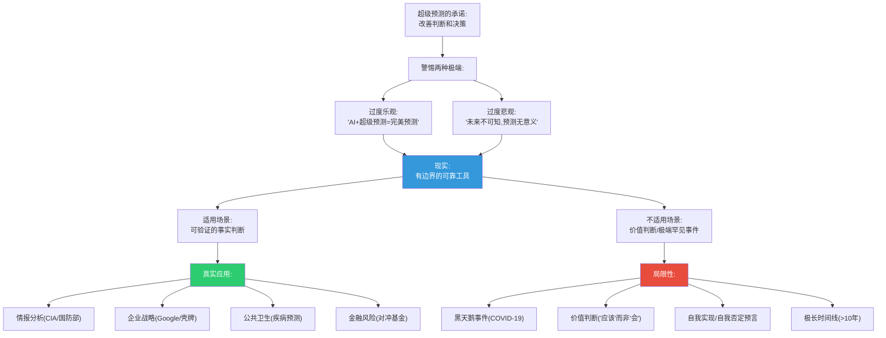
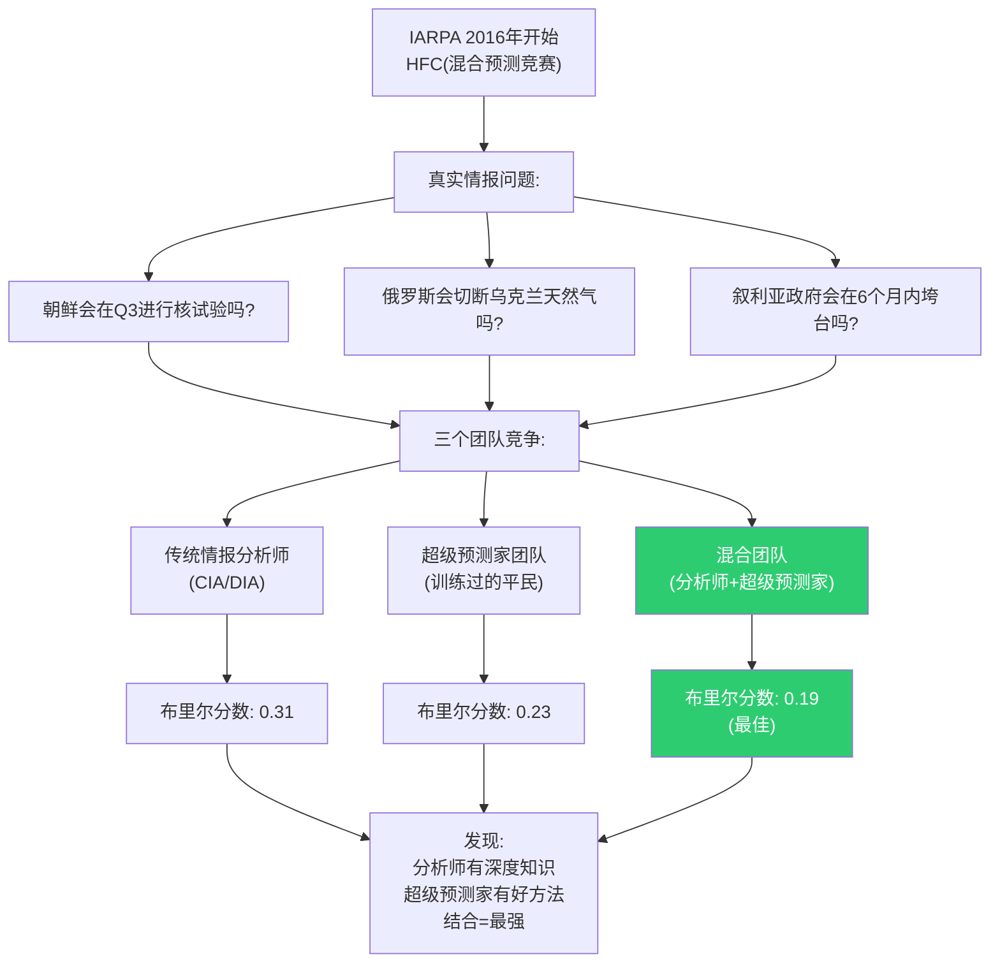
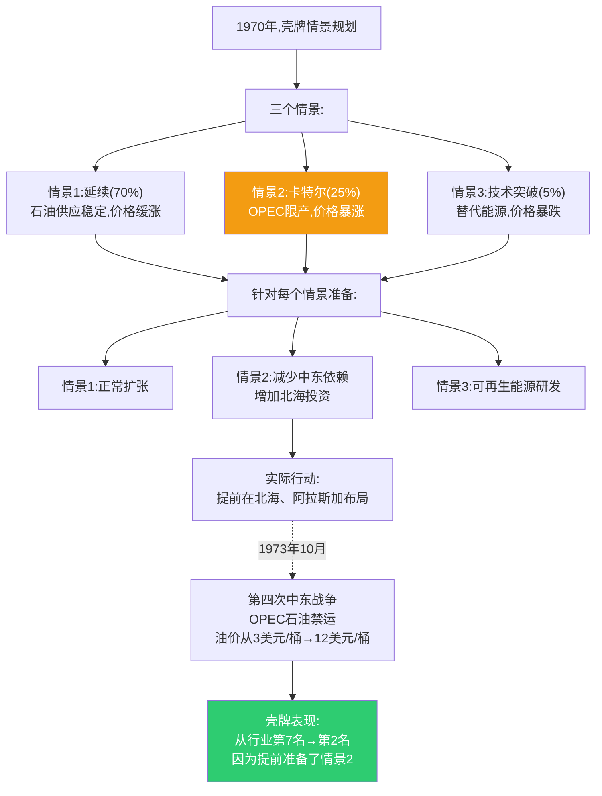
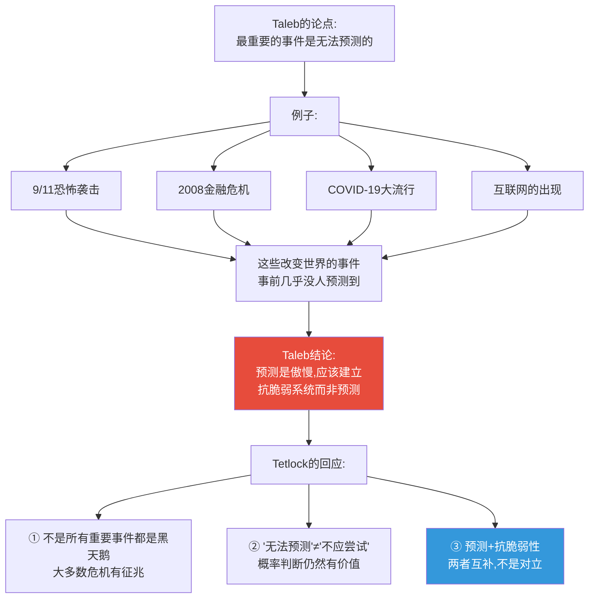
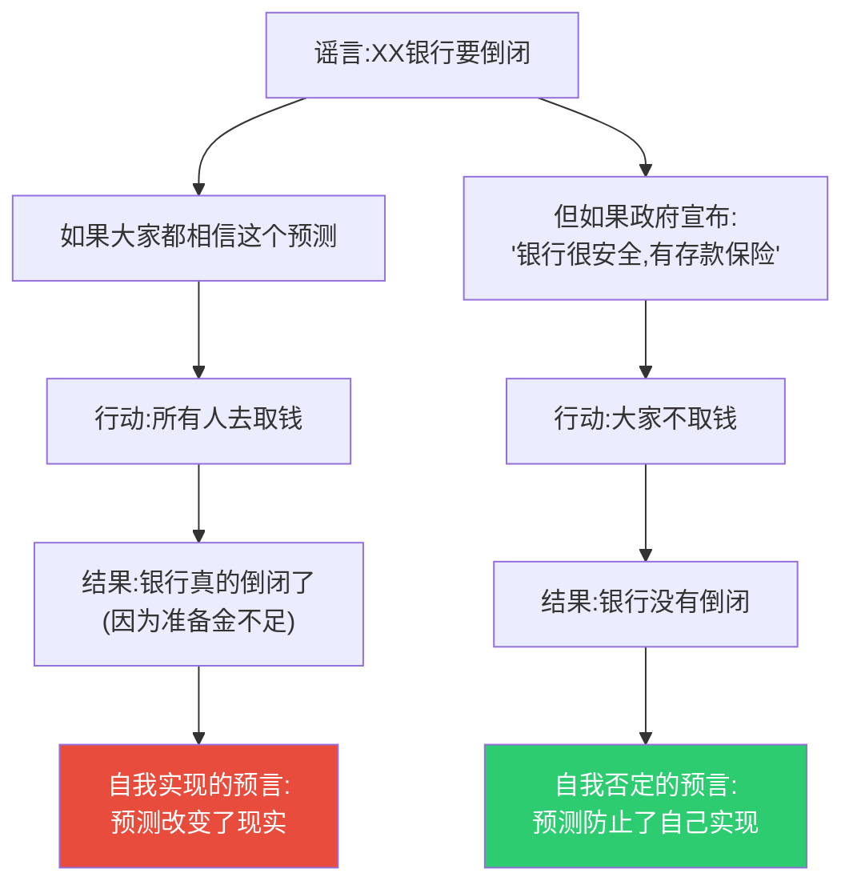
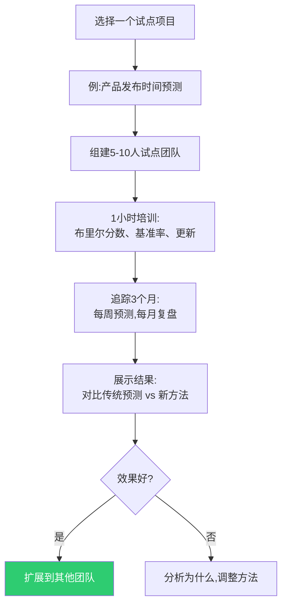
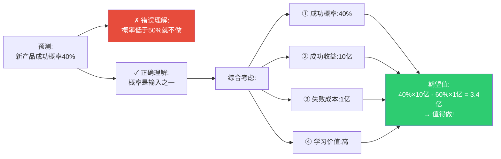

# 第12章:超越梦想——真实世界的应用与局限
> 沈老师视角 · 2026-03-25

这章的核心命题:超级预测不是万能的,但在正确的场景下,它可以改变组织和个人的决策质量。关键是知道什么时候用,什么时候不用。

---

## 一、本章核心流图



---

## 二、真实应用案例

### 案例1:美国情报高级研究计划局(IARPA)——GJP之后

**背景**:
- 2011-2015,IARPA资助GJP项目
- 2015年后,方法被整合进美国情报界

**具体应用**(已解密部分):



**2018年《华盛顿邮报》报道**:
- 美国国家情报总监办公室(ODNI)建立内部预测竞赛
- 2000+分析师参与
- 用布里尔分数排名和反馈
- **结果**:整体分析质量提升15-20%

**关键改变**:
- 从"写报告"到"做概率预测+持续更新"
- 从"事后解释"到"事前追踪"
- 从"分析师个人判断"到"集体校准"

---

### 案例2:壳牌石油的情景规划(1960s至今)

**历史背景**:
- 1960s,壳牌创立"情景规划"部门
- 不做单一预测,做多情景准备

**1973年石油危机预判**:



**壳牌方法的本质**:
- 不是"预测未来",是"准备多种未来"
- 不问"会发生什么",问"如果X发生,我们怎么办"
- **概率思维的组织级应用**

**2020年代应用**:
- 壳牌现在用超级预测方法校准情景概率
- 例:能源转型情景从"可能"变成"35-55%概率在2040年前"
- 更精确的概率→更优的资本配置

---

### 案例3:Good Judgment Open——公开平台

**背景**:
- 2015年,GJP项目结束后
- Philip Tetlock团队创建公开平台
- 任何人可以参与预测,免费

**截至2024年数据**:
- 累计用户:50,000+
- 累计预测:500,000+
- 验证预测:100,000+
- **超级预测家识别率**:持续约2-3%

**真实问题例子**(2022-2024):

| 问题 | 超级预测家预测 | 大众预测 | 实际结果 |
|------|----------------|----------|----------|
| 俄罗斯2022年入侵乌克兰(2022.1预测) | 65% | 35% | 发生 ✓ |
| 拜登赢得2024初选(2023.6预测) | 85% | 60% | 退选 ✗ |
| 英国脱欧后贸易协议(2020) | 75%达成 | 50% | 达成 ✓ |
| OpenAI CEO Sam Altman被解雇后复职(2023.11) | 70% | 40% | 复职 ✓ |

**平台价值**:
- 训练场:新人可以练习,获得反馈
- 众包智慧:聚合大量预测,比单个专家准
- 研究平台:学者可以研究判断和决策

---

## 三、超级预测的边界:什么时候不适用

### 边界1:黑天鹅事件(定义上不可预测)

**Nassim Taleb的批评**(《黑天鹅》作者):



**真实案例:COVID-19**

**2019年底征兆**:
- 12月30日:李文亮医生在微信群警告"SARS样病毒"
- 1月初:泰国发现输入病例
- 1月20日:钟南山确认人传人

**超级预测家表现**(Good Judgment Open):
- 1月25日预测:"全球感染人数会超过10,000?" → 平均85%(实际远超)
- 2月初预测:"WHO会宣布全球大流行?" → 平均60%(3月11日宣布)
- 2月中预测:"美国会有超过100死亡?" → 平均70%(实际110万+)

**关键洞察**:
- COVID-19不是完全的黑天鹅(有征兆)
- 但疫情规模超出预期(部分黑天鹅)
- **超级预测家比大众反应更快,但也不能完美预测规模**

**Taleb是对的部分**:
- 最极端的尾部事件确实难以预测(如疫情死亡110万 vs 10万)
- 建立鲁棒性系统很重要(如医疗储备)

**Tetlock是对的部分**:
- 即使不能完美预测,概率判断仍有价值
- 70%概率vs 10%概率,决策应该不同
- **两者结合**:用预测指导准备,用鲁棒性应对意外

---

### 边界2:自我实现/否定的预言

**例子:银行挤兑**



**真实案例:2023年硅谷银行(SVB)倒闭**

**时间线**:
- 3月8日:SVB宣布需要筹资
- 3月9日:风投在社交媒体建议创业公司取钱
- 3月9日下午:420亿美元被提取(史上最快挤兑)
- 3月10日:SVB倒闭

**预测的角色**:
- 风投的"预测"(警告)加速了挤兑
- 变成自我实现
- **预测本身改变了概率**

**超级预测在这类情况的局限**:
- 无法预测"如果我公布预测,预测本身会如何改变结果"
- 需要考虑"预测被公开"的影响
- **策略性考量**:有时好预测不应公开

---

### 边界3:价值判断("应该"vs"会")

**超级预测适用**:"X会发生吗?"(事实判断)
**超级预测不适用**:"X应该发生吗?"(价值判断)

**例子对比**:

| 问题类型 | 可以预测 | 不能预测 |
|----------|----------|----------|
| 法律 | "最高法院会推翻堕胎权吗?" ✓ | "最高法院应该推翻堕胎权吗?" ✗ |
| 科技 | "AGI会在2030年前实现吗?" ✓ | "我们应该开发AGI吗?" ✗ |
| 环境 | "全球气温会上升2°C吗?" ✓ | "我们应该接受2°C上升吗?" ✗ |

**为什么价值判断不适用?**
- 没有客观的"对错"
- 取决于个人价值观
- 布里尔分数无法计算(没有"实际结果")

---

## 四、组织层面的应用建议

### 建议1:从小范围试点开始

**错误路径**:
```
CEO读了《超级预测》
↓
宣布:"我们要成为数据驱动的预测型组织"
↓
强制全公司用概率预测
↓
员工抵触,流于形式
↓
6个月后放弃
```

**正确路径**:



**真实案例:Google的内部预测市场**
- 2005年:10个问题,50人试点
- 2006年:成功后扩展到100+问题
- 2008年:常态化,成为决策工具之一
- **关键**:不是强制,是自愿参与,证明有效才扩展

---

### 建议2:不要惩罚诚实的不确定性

**反模式**:
```
员工:"这个项目按时完成的概率是60%"
老板:"什么叫60%?你到底能不能按时?"
员工心想:"下次我说90%,反正不追踪"
```

**正确模式**:
```
员工:"这个项目按时完成的概率是60%"
老板:"谢谢诚实。如果你说60%,那影响因素是什么?"
员工:"主要是X模块的依赖不确定"
老板:"好,我们针对X做备份方案"
→ 项目延期风险被提前管理
```

**文化关键**:
- 奖励校准良好的预测(包括诚实的50%)
- 不惩罚预测错误(如果方法正确)
- 惩罚的是:不追踪、事后解释、过度自信

---

### 建议3:预测≠决策,是决策输入



**关键**:预测提供概率,决策还需要考虑:
- 收益/成本
- 风险偏好
- 战略价值
- 学习机会

---

## 五、个人层面的应用建议

### 适合应用超级预测的场景

**✅ 职业选择**:
```
问题:"转行做AI,5年后这个领域还会高薪吗?"

方法:
1. 查基准率:过去技术热潮的持续时间
2. 分解:AI需求、人才供给、技术成熟度
3. 概率判断:70%会继续高薪,但定义可能变化
4. 决策:即使只有70%,考虑其他因素(兴趣、转型成本)
```

**✅ 投资决策**:
```
问题:"比特币会涨到10万吗?"

方法:
1. 不要单点预测(会/不会)
2. 概率分布:10%概率<5万,40%在5-10万,30%在10-15万,20%>15万
3. 期望值计算
4. 决策:根据风险承受度配置仓位
```

**✅ 重大决策的时机**:
```
问题:"现在应该买房吗?"

方法:
1. 分解:利率、房价、个人收入、政策
2. 多情景:"如果利率再涨" "如果房价再跌"
3. 每个情景的概率和影响
4. 决策:根据最可能的2-3个情景准备
```

### 不适合的场景

**✗ 日常琐事**:
- "午饭吃什么"不需要费米估算
- 过度分析导致决策疲劳
- **简单问题用直觉,复杂问题用方法**

**✗ 快速反应场景**:
- 驾驶中突然冲出行人
- 需要立刻反应,没时间概率思考
- **培训直觉,不是替代直觉**

**✗ 已经有可靠模型的领域**:
- 天气预报(已有气象模型)
- 不需要重新发明轮子
- **用现有工具,不要从头做**

---

## 六、本章可执行模型

### 超级预测适用性检查清单

```
问题:"[描述你的预测问题]"

□ 可验证性检查:
  - 有明确的验证日期?
  - 结果可以客观观察?
  - 不是价值判断?

□ 信息充分性检查:
  - 有历史数据或可比案例?
  - 不是完全前所未有的事件?
  - 可以收集到相关信息?

□ 时间窗口检查:
  - 反馈时间<2年?(超过太久难以学习)
  - 足够时间收集信息?(不是明天就要答案)

□ 影响检查:
  - 预测质量对决策有实质影响?
  - 值得投入时间精力?

如果4个检查都通过 → 适合用超级预测方法
如果有2个以上✗ → 考虑其他方法或简化处理
```

---

## 七、沈老师的元评论

这一章最重要的信息:**超级预测是工具,不是信仰**。

过度乐观者会说:"我们可以预测一切"
过度悲观者会说:"未来不可知,预测无意义"

**现实是**:
- 可以预测:大多数中短期的、可验证的事实判断
- 不能预测:黑天鹅、价值判断、自我实现的预言
- 关键是:**知道边界,在边界内精进**

真实应用案例显示:
- 情报界提升15-20%准确性
- 壳牌靠情景规划度过多次危机
- Google预测市场辅助决策

但这些都不是"完美预测",而是"更好的判断"。

**最深刻的洞察**:
预测方法的价值不在于"总是对",而在于:
1. **可追踪**(知道自己准不准)
2. **可改进**(通过反馈学习)
3. **可聚合**(团队智慧)
4. **有边界**(知道适用范围)

从我的认知建模角度:
- **能画出来才算懂** → 适用边界必须明确可视化
- **裁判=理解** → 在边界内持续追踪,在边界外承认无知
- **孤岛知识会消失** → 预测方法需要接入组织流程,不能孤立存在

**实践建议**:
1. 从小范围开始(试点项目)
2. 文化先行(接受不确定性)
3. 预测是输入,不是决策本身
4. 承认边界,不过度承诺

这一章是全书的落地。理论再完美,不应用就是零。但应用也要有智慧:知道在哪用,怎么用,以及最重要的——什么时候不用。

**最后的真相**:
超级预测不能让你成为先知,但可以让你成为更好的决策者。不是因为你能看到未来,而是因为你学会了**诚实地面对不确定性**。

---

*第12章建模完成。全书完成。核心:超级预测是有边界的可靠工具,在适用范围内精进,在边界外承认无知。预测方法+抗脆弱性=应对不确定世界的最佳组合。*
