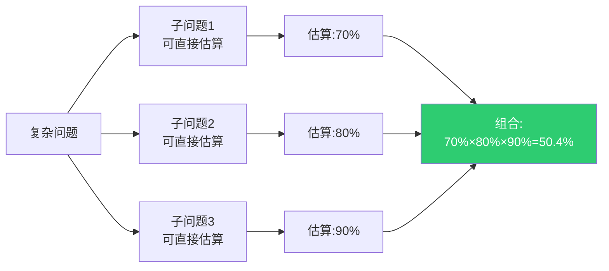
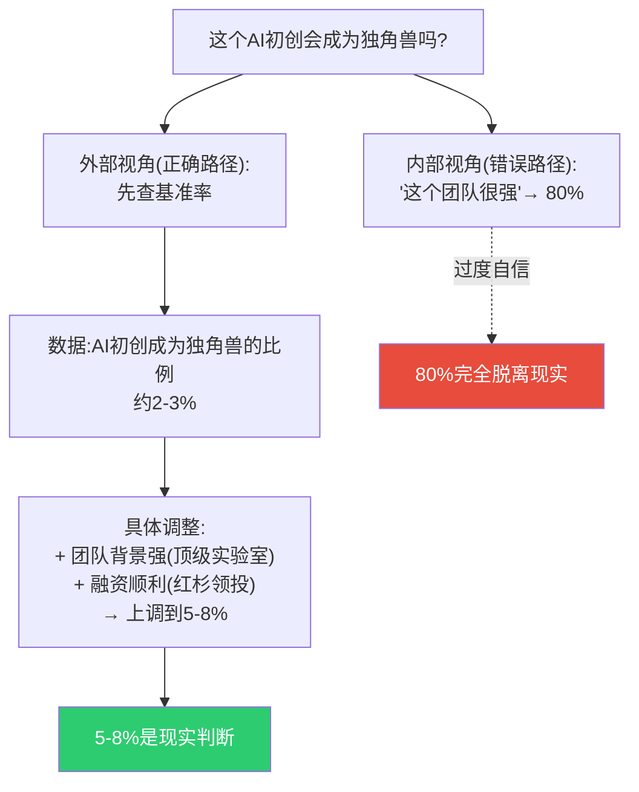
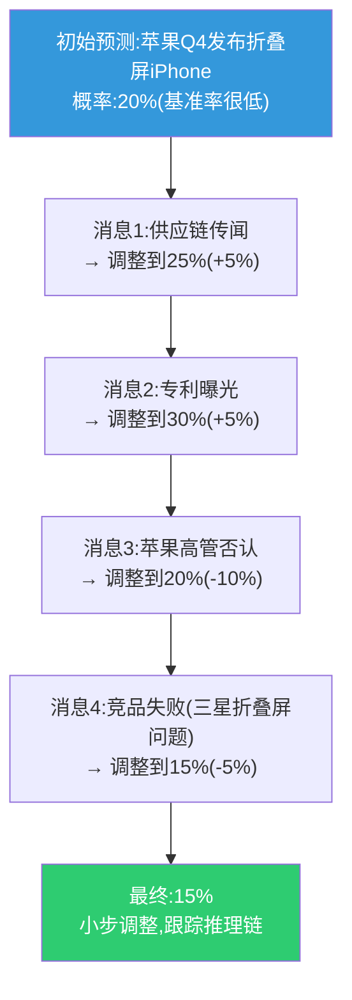
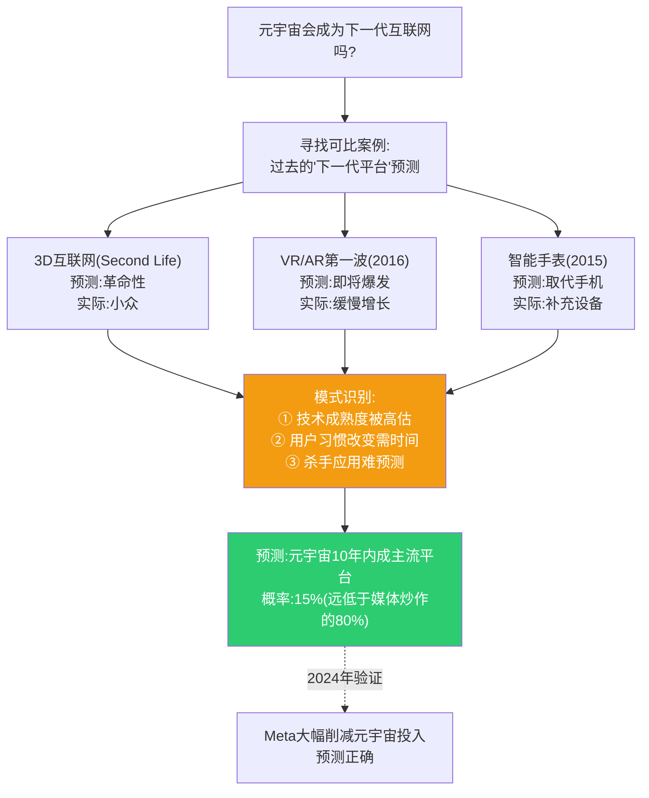
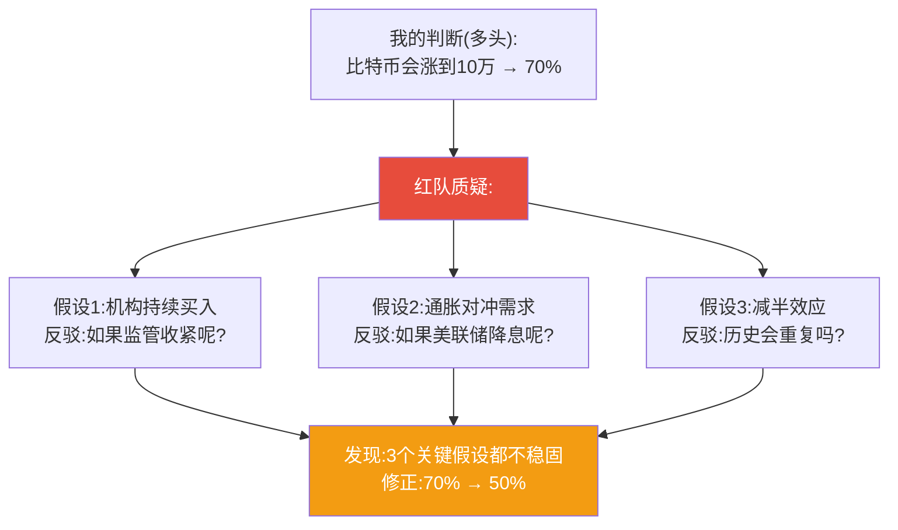
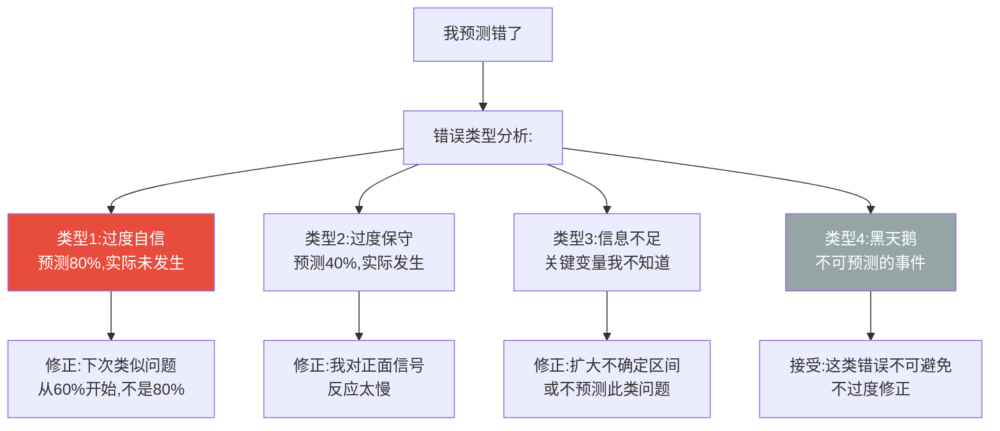

# 超级预测十诫 + 可执行工具包
> 沈老师视角 · 实践手册 · 2026-03-25

这是从全书提炼的可直接应用的方法论工具包,按照"立刻可以上手"的原则组织。

---

## 一、超级预测十诫(原书附录提炼)

### 1. 分解问题 (Decompose)

**原则**:复杂问题拆成简单子问题。

**操作**:费米估算法



**真实案例**:
- ❌ "中国会在2030年前统一台湾吗?" → 太复杂,无从下手
- ✅ 拆解:
  - ① 中国是否有军事能力?(95%)
  - ② 美国是否会军事干预?(70%)
  - ③ 如果美国干预,中国是否仍会行动?(30%)
  - ④ 习近平在2030年前仍掌权?(80%)
  - 组合:95%×70%×30%×80%≈16%

---

### 2. 外部视角优先 (Outside View)

**原则**:先看基准率(类似事件的历史发生率),再调整。

**操作**:

```
步骤1:问"历史上类似情况发生率是多少?"
步骤2:以此为锚点
步骤3:根据具体情况微调(通常±10-20%)
步骤4:如果调整>50%,质疑自己是否过度相信内部视角
```

**真实案例:初创公司估值**



---

### 3. 小步更新 (Update Incrementally)

**原则**:根据新信息小幅调整,不剧烈摇摆。

**操作**:贝叶斯更新

```
典型更新幅度:
- 重要正面信息:+5-10%
- 重要负面信息:-5-10%
- 决定性证据:+20-30%
- 小道消息:±2-5%

警告:如果一条新闻让你的判断从30%跳到70%
→ 你可能过度反应了
```

**真实案例:iPhone新品预测**



**对比:错误的剧烈摇摆**


---

### 4. 寻找可比案例 (Seek Comparison Classes)

**原则**:找历史上结构相似的案例,提取模式。

**操作模板**:

```
这个问题本质上是:
[ ] 技术采用问题(iPhone vs 智能手表 vs VR)
[ ] 地缘冲突问题(乌克兰 vs 格鲁吉亚 vs 克里米亚)
[ ] 政策变化问题(加息 vs 降息历史)
[ ] 市场泡沫问题(2000互联网 vs 2008房地产 vs 2021加密货币)

查找该类别的:
1. 基准发生率
2. 典型时间线
3. 成功/失败的关键因素
```

**真实案例:元宇宙预测(2022)**



---

### 5. 走钢丝,别跳跃 (Extremize Sparingly)

**原则**:避免极端概率(0-5%或95-100%),除非证据极强。

**操作**:

```
概率分配原则:
- 50%: 完全不确定
- 30-70%: 典型预测区间(承认不确定性)
- 15-85%: 有一定把握
- 5-95%: 极高把握(罕见)
- 0-100%: 几乎从不使用

警告:如果你给出95%
→ 问自己"什么证据能让我改到80%?"
→ 如果容易找到,说明不该是95%
```

**真实案例对比**

| 预测 | 新手 | 超级预测家 |
|------|------|------------|
| 拜登赢得2024大选 | 90%(过度自信) | 55-65%(承认不确定) |
| 俄乌战争2024年内结束 | 5%(过度悲观) | 20-30%(保留可能) |
| AI会取代大部分工作 | 95%(极端) | 40-60%(取决于定义) |

---

### 6. 平衡内外视角 (Balance Inside and Outside Views)

**原则**:基准率(外部)提供锚点,具体情况(内部)提供调整。

**操作流程**:

```mermaid
flowchart TD
    START["问题:X会发生吗?"]

    START --> OUT["外部视角:\n类似事件历史发生率?"]
    OUT --> BASE["得到基准率:例如25%"]

    BASE --> IN["内部视角:\n这次有什么特殊的?"]

    IN --> SPEC1["特殊因素1:强化基准 → +5%"]
    IN --> SPEC2["特殊因素2:弱化基准 → -8%"]
    IN --> SPEC3["特殊因素3:不确定 → ±0%"]

    SPEC1 & SPEC2 & SPEC3 --> FINAL["最终:25%+5%-8%=22%"]

    FINAL --> CHECK{"调整幅度<30%?"}
    CHECK -- "是" --> OK["合理"]
    CHECK -- "否" --> WARN["警告:可能过度相信内部视角"]

    style BASE fill:#3498db,color:#fff
    style OK fill:#2ecc71,color:#fff
    style WARN fill:#e74c3c,color:#fff
```



---

### 7. 寻找可证伪线索 (Look for Clashing Causal Forces)

**原则**:主动寻找反对自己判断的证据。

**操作**:红队思维

```
我的判断:X会发生(70%)

强制性反问:
1. 如果X不会发生,最可能的原因是什么?
2. 什么证据能说服我降低概率?
3. 我有没有忽略的反面证据?
4. 支持我的证据质量如何?(传闻 vs 数据)
5. 我是否在选择性记忆?

行动:
- 主动搜索"为什么X不会发生"
- 咨询持相反观点的人
- 列出必须成立的假设,逐一检验
```

**真实案例:比特币价格预测**



---

### 8. 面对不确定时谨慎 (Strike the Right Balance Between Under- and Overconfidence)

**原则**:在50%附近徘徊不是软弱,是诚实。

**操作**:校准自检

```
如果你的预测是:
- 50±5%: 坦然接受不确定性(✓)
- 大量70-80%: 检查是否过度自信(?)
- 大量30-40%: 可能过度悲观(?)
- 很少50%: 你在逃避"不知道"(✗)

金标准:
你的"70%"实际应该70%发生
你的"30%"实际应该30%发生
→ 通过追踪100+预测验证校准
```

---

### 9. 寻找预测线索,但别过度解读 (Look for the Errors Behind Your Errors)

**原则**:从错误中学习,但别过度修正。

**操作**:错误分类法



---

### 10. 团队合作 (Bring Out the Best in Others and Let Others Bring Out the Best in You)

**原则**:集体智慧 > 个人智慧,但需要正确方法。

**操作**:见第5章超级团队(此处简化)

```
有效团队预测:
✓ 成员独立预测,再汇总
✓ 建设性争论(不是谁赢谁输)
✓ 魔鬼代言人角色
✓ 透明的概率表达

无效团队预测:
✗ 直接投票(群体思维)
✗ 权威主导(其他人跟随)
✗ 和谐为上(不争论)
✗ 模糊表达("大概会吧")
```

---

## 二、实用工具包

### 工具1:预测模板(可复制)

```markdown
# 预测记录

## 基本信息
- **日期**: YYYY-MM-DD
- **问题**: [明确可验证的问题]
- **验证日期**: YYYY-MM-DD
- **当前概率**: XX%

## 推理过程

### 外部视角(基准率)
- 历史类似事件: [描述]
- 基准发生率: XX%
- 来源: [数据来源]

### 费米分解(如适用)
- 子问题1: [描述] → XX%
- 子问题2: [描述] → XX%
- 子问题3: [描述] → XX%
- 组合概率: XX%

### 内部视角(调整因素)
- 上调因素:
  - [因素1]: +X%
  - [因素2]: +X%
- 下调因素:
  - [因素1]: -X%
  - [因素2]: -X%

### 最终判断
- **概率**: XX%
- **置信区间**: XX%-XX%
- **关键假设**: [列出2-3个关键假设]

## 更新触发器
- 如果[事件A]发生 → 上调到XX%
- 如果[事件B]发生 → 下调到XX%

## 更新记录

### 更新1 (YYYY-MM-DD)
- **新信息**: [描述]
- **调整**: XX% → XX%
- **理由**: [简述]

---

## 最终结果 (YYYY-MM-DD)
- **实际发生**: 是/否
- **布里尔分数**: (XX-0)² = XX
- **复盘**:
  - 做对了: [具体分析]
  - 做错了: [具体分析]
  - 下次改进: [具体行动]
```

---

### 工具2:基准率速查表(需自己积累)

**建议结构**:

| 领域 | 事件类型 | 基准率 | 时间窗口 | 样本量 | 更新日期 |
|------|----------|--------|----------|--------|----------|
| 科技 | 重大软件项目延期 | 65% | 项目周期 | 个人经验 | 2024-03 |
| 商业 | 初创公司5年内倒闭 | 90% | 5年 | SBA数据 | 2023-01 |
| 地缘 | 小规模冲突升级为战争 | 15% | 6个月 | 冷战后数据 | 2024-01 |
| 金融 | 熊市后V型反转 | 30% | 12个月 | 1950-2020 | 2024-02 |

**使用方法**:
1. 遇到新问题,先查表
2. 找最接近的可比类别
3. 以基准率为起点
4. 根据具体情况调整

---

### 工具3:概率词汇对照表

**目的**:消除语言歧义,强制数值化

| 模糊词 | 转化为概率 | 使用场景 |
|--------|------------|----------|
| 几乎肯定 | 90-95% | 极高把握 |
| 很可能 | 70-80% | 有把握但保留意外 |
| 可能 | 55-65% | 略倾向发生 |
| 不确定 | 45-55% | 真正不知道 |
| 不太可能 | 30-40% | 略倾向不发生 |
| 很不可能 | 15-25% | 低概率但非零 |
| 几乎不可能 | 5-10% | 极低但保留可能 |

**强制规则**:
- 禁止使用模糊词
- 必须用数字表达
- 如果不确定,给范围(如40-60%)

---

### 工具4:快速校准测试

**10题快速测试**(90%置信区间):

```
给出你90%确信的区间(不能查询):

1. 珠穆朗玛峰高度(米): [____] - [____]
2. 中国人口(亿): [____] - [____]
3. iPhone初代发布年份: [____] - [____]
4. 地球到月球距离(万公里): [____] - [____]
5. 比特币历史最高价(美元): [____] - [____]
6. 第二次世界大战结束年份: [____] - [____]
7. 人体骨骼数量: [____] - [____]
8. 光速(万公里/秒): [____] - [____]
9. 人类平均寿命(岁): [____] - [____]
10. 亚马逊创立年份: [____] - [____]

评分:
- 8-10个在区间内: 校准良好 ✓
- 6-7个: 略过度自信
- 5个以下: 严重过度自信 ✗
- 10个全中且区间很窄: 可能过度保守

调整:
- 过度自信 → 下次扩大区间20%
- 过度保守 → 下次收窄区间10%
```

---

## 三、21天养成超级预测习惯

### 第1周:建立基础

**Day 1-3**:
- 追踪自己的3个预测(用模板)
- 强制用数字表达概率
- 每天花15分钟

**Day 4-7**:
- 学习查找基准率
- 尝试费米分解一个问题
- 完成一次校准测试

### 第2周:刻意练习

**Day 8-10**:
- 开始小步更新练习
- 每天更新昨天的预测
- 记录更新理由

**Day 11-14**:
- 尝试红队思维
- 主动寻找反面证据
- 与他人争论(建设性)

### 第3周:形成系统

**Day 15-17**:
- 建立个人基准率库
- 至少记录10个领域的基准率
- 开始使用可比案例

**Day 18-21**:
- 第一次复盘周
- 回顾所有预测
- 计算平均布里尔分数
- 识别系统性偏误

**之后**:
- 每周5个新预测
- 每月1次深度复盘
- 每季度1次校准测试
- 持续至少6个月见显著效果

---

## 四、沈老师的实践建议

### 从哪里开始?

**新手路线(推荐)**:
```
Week 1: 只做3件事
1. 用数字代替"可能""也许"
2. 追踪5个预测(写下来)
3. 完成1次校准测试

Week 2-4: 加入基准率
4. 每个预测都先查历史数据
5. 从基准率开始,再调整

Month 2-3: 加入分解思维
6. 学习费米估算
7. 复杂问题拆成3-5个子问题

Month 4+: 元认知
8. 预测自己的准确性
9. 识别自己的系统性偏误
10. 建立个人知识库
```

### 最容易犯的3个错误

1. **追踪不够**:做了预测就忘了
   - 解决:设置提醒,每周回顾

2. **不复盘**:结果出来了,不分析为什么对/错
   - 解决:强制写50字复盘

3. **过度自信**:总是给70-80%,很少给50%
   - 解决:每月做一次校准测试

### 如何知道自己进步了?

**量化指标**:
- 布里尔分数下降(0.37→0.30→0.25)
- 校准测试改善(60%→75%→85%)
- 预测数量增加(说明你在练习)

**定性指标**:
- 开始舒适地说"50%"(不再逃避不确定)
- 改变主意不再痛苦(柔性思维)
- 能预测自己哪类问题准/不准(元认知)

---

*工具包完成。核心:方法论 × 刻意练习 = 超级预测能力。立刻开始,从追踪第一个预测开始。*
