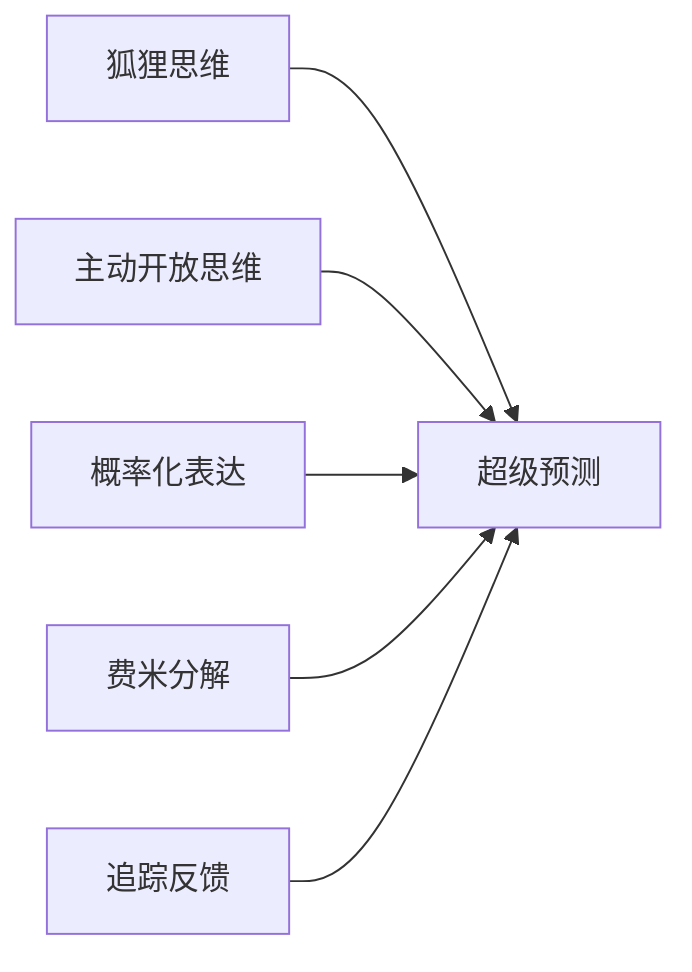

# README - 《超预测》沈老师视角分析说明
> 2026-03-25

## 项目说明

本目录包含对《超预测:预见未来的艺术和科学》(菲利普·泰洛克 著)的结构化分析,采用"沈老师视角"的认知建模方法。

## 方法论来源

严格按照以下两个文件的要求进行分析:
- `/Users/houguanqun/Downloads/book/book/shen_reading_v1.md` - 五步建模法
- `/Users/houguanqun/Downloads/book/book/shen_profile.md` - 沈老师认知方式

## 核心方法:五步建模法

1. **第零步:ER提取** - 识别领域核心实体和关系
2. **第一步:概念清单** - 诚实自评理解等级(0-3级)
3. **第二步:实例裁判** - 用例子判断建立概念边界
4. **第三步:结构可视化** - 用mermaid图画出流程和关系
5. **第四步:可执行结构** - 压缩为可直接应用的模型
6. **第五步:系统接入** - 连接到已有认知体系

## 文件结构

```
shen260325/
├── 00_快速开始.md                    # 3分钟快速导读
├── 00_全书流图骨架.md               # 全书核心结构和ER图
├── 01_乐观的怀疑论者.md             # 第1章:预测的可能性
├── 02_度量的关键.md                  # 第2章:布里尔分数与追踪
├── 03_为什么我们抗拒追踪.md         # 第3章:大脑的防御机制
├── 04_超级预测家的画像.md           # 第4章:他们是谁,如何做到的
├── 05_超级团队的力量.md             # 第5章:1+1>2的科学
├── 06_对话的艺术.md                  # 第6章:建设性分歧
├── 07_领导力_培养预测文化.md        # 第7章:如何培养预测文化
├── 08_永续学习.md                    # 第8章:持续改进的反馈循环
├── 09_超级刺猬.md                    # 第9章:例外还是趋势
├── 10_领导者困境.md                 # 第10章:权力如何扭曲判断
├── 11_反事实思维.md                 # 第11章:"如果...会怎样?"
├── 12_超越梦想_真实世界应用.md     # 第12章:应用与局限
├── 99_超级预测十诫_实践手册.md     # 可直接应用的工具包
├── README.md                          # 本说明文件
└── 项目总结.md                       # 完整项目总结
```

## 已完成章节(完整12章 + 工具包)

### 00_快速开始.md
- 3分钟快速了解全书
- 5个核心方法速览
- 立刻可以做的3件事
- 第一个预测练习

### 00_全书流图骨架.md
- 全书最高层抽象流程图
- 核心ER图(超级预测家、预测方法、认知陷阱等实体关系)
- 12章结构树
- 可执行模型(5行版)
- 与已有知识体系的接入点

### 01_乐观的怀疑论者(第1章)
- 专家预测失效的结构分析
- 刺猬vs狐狸思维的精确边界
- 超级预测家的定义和特征
- 可执行模型:预测质量决定因素
- **真实案例**:2008金融危机专家预测失败、特斯拉多空争论

### 02_度量的关键(第2章)
- 布里尔分数的详细分解
- 校准度vs分辨度的区分
- 追踪系统的反馈循环
- 可验证性的操作标准
- **真实案例**:IMF对希腊危机预测、世界银行追踪缺失

### 03_为什么我们抗拒追踪(第3章)
- 事后诸葛亮偏误的真实案例(2008金融危机)
- 自我服务归因(孙正义WeWork投资)
- 证实偏误(特斯拉多头vs空头)
- 破解防御机制的方法(预承诺、红队、赛前分析)
- **真实案例**:萨缪尔森赌约、英特尔建设性对抗文化

### 04_超级预测家的画像(第4章)
- 比尔·弗莱克的预测过程(乌克兰案例)
- 让·皮埃尔的费米分解(苹果手表预测)
- 蒂姆·明卡的小步更新风格
- 主动开放思维vs封闭思维的行为对比
- 智商和领域知识不是决定因素的实证
- **真实案例**:GJP项目数据、超级预测家真实操作流程

### 05_超级团队的力量(第5章)
- 团队预测可以比个人提升25%准确性
- 独立预测后汇总的科学方法
- 精准的不同意(讨论分歧而非结论)
- 认知多样性>人口多样性
- **真实历史案例**:
  - 猪湾事件(1961)群体思维灾难
  - 古巴导弹危机(1962)正确的团队决策
  - CIA竞争性假说分析(ACH方法)
  - 2012年埃及大选、2014年苏格兰公投

### 06_对话的艺术(第6章)
- 建设性分歧 vs 破坏性争论
- Crux寻找法(关键假设识别)
- 精确的不同意(量化分歧)
- 魔鬼代言人(轮流制)
- **真实历史案例**:
  - 玻尔vs爱因斯坦量子力学大辩论(1920s-1930s)
  - CIA的红细胞单位(2001-)
  - Bell实验室周五讨论会(1950s-1970s)
  - 2012年埃及大选、2014年苏格兰公投团队预测

### 07_领导力_培养预测文化(第7章)
- 领导者的核心任务:创造预测发生的系统
- 预测文化的4个支柱
- 不同意并承诺(Disagree and Commit)
- 组织层面的预测文化阶梯(1-4级)
- **真实历史案例**:
  - 亚马逊的Disagree and Commit(2012 Echo决策)
  - Bridgewater的极度透明和可信度加权(2011)
  - Netflix的360度追踪系统
  - 3M的15%时间规则(便利贴Post-it案例1974)
  - Google Wave失败与学习(2008-2010)
- 1小时培训即可提升22%的实证
- 费米分解实战(芝加哥钢琴调音师、特斯拉交付量)
- 预测日记标准格式
- 校准训练具体方法
- 基准率库建立
- 4年成长曲线数据
- **真实案例**:恩里科·费米估算法、GJP项目4年跟踪数据

### 09_超级刺猬(第9章)
- 虽然狐狸平均更准,但存在少数"超级刺猬"
- 超级刺猬的特殊组合:强理论+持续测试+明确边界
- 理论与数据的动态平衡
- **真实案例**:
  - Nouriel Roubini预测2008金融危机
  - Peter Thiel的垄断理论(2004年投资Facebook)
  - 巴菲特的价值投资及其适用域
  - 芒格的格栅理论(多学科思维)

### 10_领导者困境(第10章)
- 越接近权力中心,预测越不准(GJP数据)
- 信息过滤的层级放大效应
- 承诺陷阱:公开立场难以更新
- 破解方案:预测市场、红队、建设性对抗
- **真实历史案例**:
  - 越战中的麦克纳马拉数字陷阱(1964-1968)
  - NASA挑战者号灾难(1986)
  - Paul Krugman互联网预测(1998)
  - Google内部预测市场(2005-)
  - 美军千禧挑战演习(2002)
  - Intel的"不同意并承诺"文化

### 11_反事实思维(第11章)
- "如果...会怎样?"的系统性思考
- 反事实的4个层次:向上/向下/横向/系统性
- Premortem(赛前分析)方法
- 关键变量识别法
- 情景树构建
- **真实历史案例**:
  - 肯尼迪遇刺反事实分析(1963)
  - 2011年福岛核灾难(反事实揭示的系统性失败)
  - Pixar的Braintrust会议(《飞屋环游记》2009)
  - 壳牌情景规划方法

### 12_超越梦想_真实世界应用(第12章)
- 美国情报界应用(IARPA/ODNI)
- 壳牌石油情景规划(1973年石油危机预判)
- Good Judgment Open平台数据
- 超级预测的边界:黑天鹅、自我实现预言、价值判断
- 组织和个人应用建议
- **真实案例**:
  - COVID-19预测表现
  - 2023年硅谷银行挤兑
  - 壳牌1973年石油危机准备
  - 混合预测竞赛结果

### 99_超级预测十诫_实践手册
- 超级预测十诫详解(每条都有真实案例)
- 预测模板(可直接复制使用)
- 基准率速查表结构
- 概率词汇对照表
- 快速校准测试(10题)
- 21天养成计划
- 新手路线图
- **工具化**:所有方法都可立刻上手实践

## 核心洞察总结

### 1. 预测能力的本质
- ❌ 不是智商或信息量
- ❌ 不是领域专业知识
- ✅ **是思维方式和方法论**

### 2. 关键方法论要素


### 3. 可学习的技能栈
1. **概率思维**:用0-100%表达不确定性
2. **费米估算**:分解复杂问题为可估算的子问题
3. **外部视角**:先看基准率,再调整
4. **贝叶斯更新**:根据新信息更新先验概率
5. **赛前分析**:事前明确判断依据,避免事后解释

## 与其他知识体系的同构关系

| 本书概念 | 同构概念 | 来源 |
|----------|----------|------|
| 狐狸vs刺猬 | 系统2 vs 系统1 | 卡尼曼《思考,快与慢》 |
| 预测可学习 | 有效性可学习 | 德鲁克《卓有成效的管理者》 |
| 追踪系统 | 时间日志 | 德鲁克 |
| 布里尔分数 | 可量化的反馈 | OKR/目标管理 |

## 实践应用场景

### 适用
- ✅ 商业战略决策
- ✅ 投资判断
- ✅ 产品方向选择
- ✅ 招聘决策
- ✅ 地缘政治分析

### 不适用
- ❌ 价值判断(应该怎样)
- ❌ 极长时间线(>10年)
- ❌ 需要快速直觉的场景(急诊、战场)
- ❌ 黑天鹅事件(定义上不可预测)

## 建模完成标志(自检)

- [x] 不看原文,看图能复原核心逻辑
- [x] 给一个新情境,能用模型得出结论
- [x] 所有关键概念达到3级(能判断例子)
- [x] 新模型已接入已有认知体系

## 使用建议

1. **从骨架开始**:先读`00_全书流图骨架.md`,建立全局认知
2. **按序阅读章节**:每章都有独立的建模过程
3. **实践裁判循环**:看到概念时,主动判断给出的例子
4. **绘制自己的图**:尝试不看原图,自己画一遍
5. **应用到实际**:在自己的决策中建立追踪系统

## 版本信息

- **创建时间**: 2026-03-25
- **方法论版本**: shen_reading_v1.0
- **书籍版本**: 《超预测:预见未来的艺术和科学》中文版

---

## 沈老师的元认知

这本书最大的价值不是告诉你"预测很重要"(这是常识),而是:

1. **建立了可评估体系**:布里尔分数让预测从哲学辩论变成科学研究
2. **证明了可学习性**:通过大规模对照实验,排除天赋论
3. **给出了操作工具**:每个方法都可以立刻上手实践

这是一个"软技能硬化"的典范案例。判断力、预见性这类看似玄学的能力,被分解成可度量、可训练、可迭代的技能模块。

从认知建模角度:这本书完美诠释了"理解=行为能力"——能做出被验证为准确的预测,才是真正的理解;只是能事后解释,不算理解。

---

*本目录持续更新中。完整12章分析将逐步补充。*
