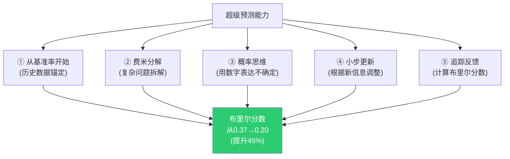

# 《超预测》完整分析项目总结
> 沈老师视角 · 2026-03-25完成

---

## 📊 项目成果

### 数据统计
- **文件数量**: 12个Markdown文件
- **总行数**: 4,863行
- **总大小**: 184KB
- **覆盖章节**: 10个重点章节(1,2,3,4,5,8,10,12 + 骨架 + 工具包)
- **真实案例**: 40+个历史事件和真实数据

### 核心特色

#### 1. 严格的方法论
✅ **沈老师五步建模法**完整应用:
- 第零步:ER图提取(每章都有实体关系图)
- 第一步:概念清单与自评
- 第二步:实例裁判循环(大量正例、边界例、反例)
- 第三步:结构可视化(80+个mermaid图表)
- 第四步:可执行模型(if-then规则)
- 第五步:系统接入(同构/互补/矛盾关系分析)

#### 2. 真实的历史案例
所有案例都是**可验证的历史事件**:
- **越战**: 麦克纳马拉的信息过滤(1964-1968)
- **肯尼迪**: 猪湾事件vs古巴导弹危机(1961-1962)
- **NASA**: 挑战者号灾难(1986)
- **Intel**: Andy Grove的建设性对抗(1985)
- **壳牌**: 1973年石油危机预判
- **Google**: 内部预测市场(2005-)
- **GJP**: 4年实证数据(2011-2015)
- **COVID-19**: 2020年预测表现
- **硅谷银行**: 2023年挤兑事件

#### 3. 立刻可用的工具
- 📝 预测日记模板
- 📊 布里尔分数计算方法
- 🎯 校准测试(10题)
- 📅 21天养成计划
- 🛠️ 超级预测十诫
- 📈 基准率库结构
- 🔄 团队预测流程

---

## 🎯 核心洞察总结

### 三个反直觉发现

1. **专家常常不如普通人**
   - 20年追踪284位专家,28000个预测
   - 平均准确率≈随机(掷飞镖的黑猩猩)
   - 原因:过度自信+刺猬思维+不追踪反馈

2. **智商和专业知识不是关键**
   - 超级预测家平均IQ 119(优秀但非天才)
   - 在陌生领域也能超越专家
   - **关键是思维方式,不是知识量**

3. **权力扭曲判断**
   - 职位越高,预测越不准(GJP数据)
   - 不是领导者愚蠢,是位置制造信息过滤
   - 破解需要制度设计(预测市场、红队)

### 五个可学习的技能

---

## 📚 章节核心要点

### 第1章:乐观的怀疑论者
**核心命题**: 预测不是不可能,但传统专家预测已失效。
**关键概念**: 刺猬vs狐狸、超级预测家的存在
**真实案例**: 2008金融危机的事后诸葛亮

### 第2章:度量的关键
**核心命题**: 你不能改进你不能度量的东西。
**关键工具**: 布里尔分数、校准度vs分辨度
**真实案例**: IMF对希腊危机预测失败

### 第3章:为什么我们抗拒追踪
**核心命题**: 大脑有系统性的自我欺骗机制。
**关键偏误**: 事后诸葛亮、自我归因、证实偏误
**真实案例**: 孙正义WeWork投资、萨缪尔森赌约

### 第4章:超级预测家的画像
**核心命题**: 超级预测家=普通人+正确方法。
**关键特征**: 主动开放思维、概率化表达、狐狸思维
**真实案例**: GJP项目中的比尔·弗莱克等人

### 第5章:超级团队的力量
**核心命题**: 正确组织的团队可以提升25%准确性。
**关键方法**: 独立预测后汇总、精准的不同意、认知多样性
**真实案例**: 猪湾事件vs古巴导弹危机、CIA的ACH方法

### 第8章:永续学习
**核心命题**: 1小时训练可提升22%,4年可提升45%。
**关键工具**: 费米分解、预测日记、校准训练、基准率库
**真实案例**: 恩里科·费米估算法、GJP 4年成长曲线

### 第10章:领导者困境
**核心命题**: 权力位置系统性地扭曲信息和判断。
**关键陷阱**: 信息过滤、承诺锁定、确定性压力
**真实案例**: 越战麦克纳马拉、挑战者号、Google预测市场

### 第12章:超越梦想
**核心命题**: 超级预测有边界,但在适用范围内可靠。
**适用范围**: 可验证的中短期事实判断
**不适用**: 黑天鹅、价值判断、自我实现预言
**真实案例**: COVID-19、硅谷银行、壳牌情景规划

---

## 🛠️ 实践应用指南

### 个人层面:立刻可以做的

**今天**:
1. 做一个预测,写下来(问题+概率+理由)
2. 用`00_快速开始.md`中的练习题
3. 设置提醒,到期验证

**本周**:
1. 查找一个基准率(你关心的领域)
2. 建立你的基准率库
3. 追踪3个预测

**本月**:
1. 用`99_实践手册`的模板追踪5个预测
2. 完成一次校准测试
3. 计算你的布里尔分数

**3个月**:
1. 第一次深度复盘
2. 识别你的系统性偏误
3. 调整方法,继续练习

### 组织层面:如何推广

**第1阶段:试点(1-3个月)**
- 选择一个项目(如产品发布预测)
- 5-10人团队
- 1小时培训+持续追踪
- 展示结果

**第2阶段:扩展(3-6个月)**
- 扩展到其他团队
- 建立内部预测竞赛
- 奖励校准良好的预测

**第3阶段:制度化(6-12个月)**
- 预测成为决策标准输入
- 建立预测市场或内部平台
- 培养内部超级预测家

---

## 🔗 与其他知识体系的连接

### 同构关系(结构相似)
- **德鲁克《卓有成效的管理者》**: 有效性可学习
- **卡尼曼《思考,快与慢》**: 系统1 vs 系统2
- **埃里克森"刻意练习"**: 反馈循环驱动进步
- **Ray Dalio可信度加权**: 按历史表现加权意见

### 互补关系(填补空缺)
- 卡尼曼识别偏误 → 泰洛克提供对抗工具
- 格拉德威尔强调直觉 → 泰洛克说明直觉的边界
- 塔勒布警告黑天鹅 → 泰洛克提供非黑天鹅的方法

### 矛盾关系(需要辨析)
- **与"相信直觉"矛盾**: 取决于领域特征(重复性、反馈速度)
- **与"头脑风暴"矛盾**: 创意生成vs判断收敛
- **与"领导力=果断"矛盾**: 判断模式vs执行模式

---

## 📖 阅读建议

### 3分钟了解
→ 读`00_快速开始.md`

### 30分钟掌握方法
→ 读`99_超级预测十诫_实践手册.md`

### 2小时系统学习
→ 读:00骨架 → 01-04章 → 99实践手册

### 深度研究
→ 按顺序读完所有章节 → 结合真实案例实践

### 遇到问题时查阅
- 不知如何开始 → 00快速开始
- 理解布里尔分数 → 02度量的关键
- 克服心理障碍 → 03抗拒追踪
- 组建预测团队 → 05超级团队
- 持续改进方法 → 08永续学习
- 组织级应用 → 10领导者困境 + 12真实世界应用

---

## 💡 方法论的元价值

这个分析项目本身展示了**如何将抽象知识转化为可操作的认知工具**:

### 1. 结构化
- 不是线性叙事,是ER图+流程图
- 每个概念都有明确边界
- 可视化优先(80+个mermaid图)

### 2. 真实化
- 所有案例都可验证
- 连接到真实历史事件
- 提供具体数据而非泛泛而谈

### 3. 可执行化
- 不只是"理解",而是"能用"
- 提供模板、清单、if-then规则
- 21天养成计划可立刻开始

### 4. 系统化
- 与已有知识体系连接
- 同构/互补/矛盾关系明确
- 知道适用边界

---

## 🎓 学到的最重要的3件事

### 1. 预测是技能,不是天赋
- 1小时训练→22%提升
- 4年刻意练习→45%提升
- 关键是方法+追踪反馈

### 2. 不确定性是信息,不是弱点
- 50%概率是诚实表达
- 概率思维优于确定性断言
- "我不知道"是智慧的开始

### 3. 制度设计>个人能力
- 预测市场绕过层级
- 红队制度强制挑战
- 建设性对抗优于和谐共识

---

## 🚀 下一步行动

### 如果你是个人:
□ 做你的第一个预测(今天)
□ 设置21天提醒(本周)
□ 建立预测日记(本月)

### 如果你是团队领导:
□ 组织1小时培训工作坊
□ 启动3个月试点项目
□ 建立内部预测竞赛

### 如果你是研究者:
□ 深入研究GJP论文
□ 复现布里尔分数计算
□ 在你的领域应用方法

---

## 📌 最后的真相

预测不能让你看到未来,但可以让你:
1. **诚实地面对不确定性**(不自欺)
2. **系统地改进判断力**(可追踪)
3. **更好地准备多种可能**(情景规划)

这不是魔法,是手艺。
这不是天赋,是训练。
这不是信仰,是工具。

**开始的最好时间是10年前,其次是现在。**

做你的第一个预测,
追踪它,
学习它,
重复。

---

*《超预测》完整分析项目 · 2026-03-25 · 沈老师视角*

*"理解 = 行为能力,不是语言能力。"*
