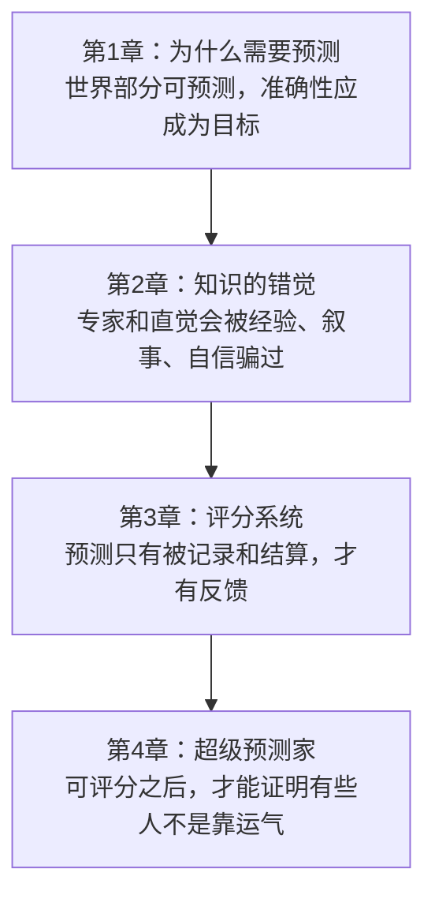
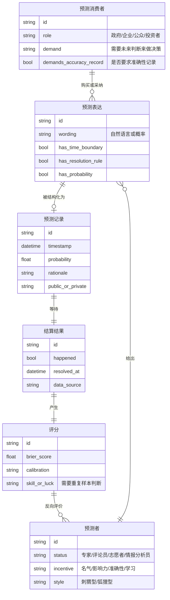
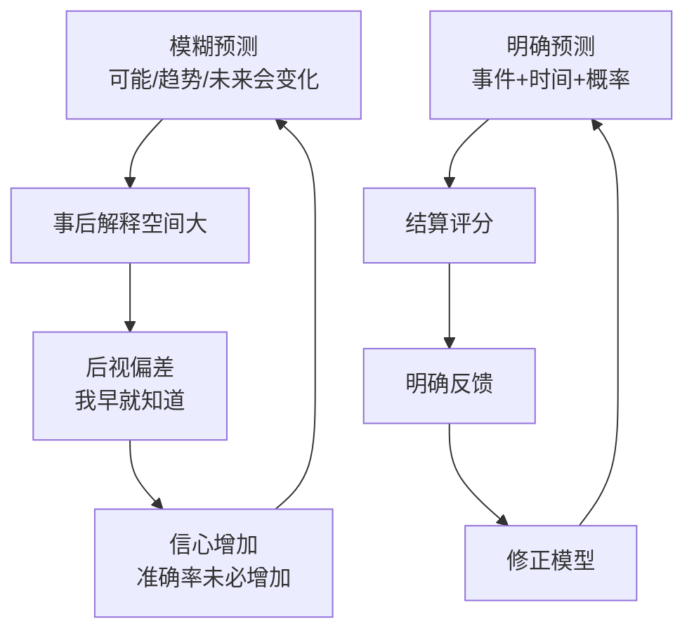
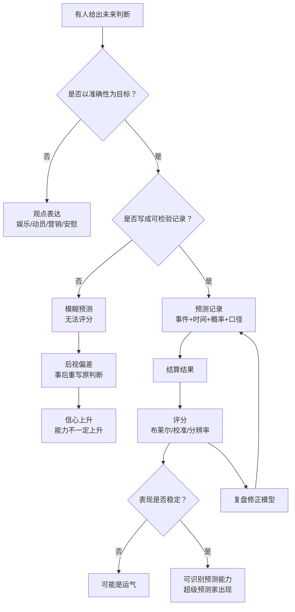
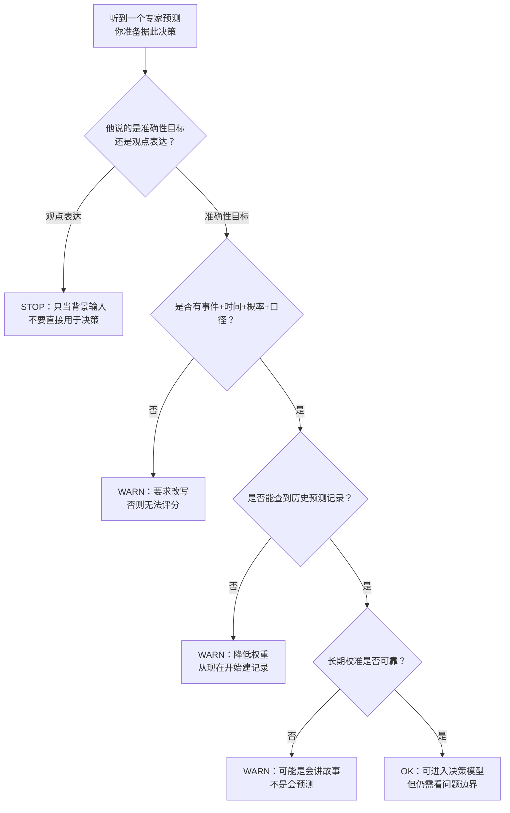
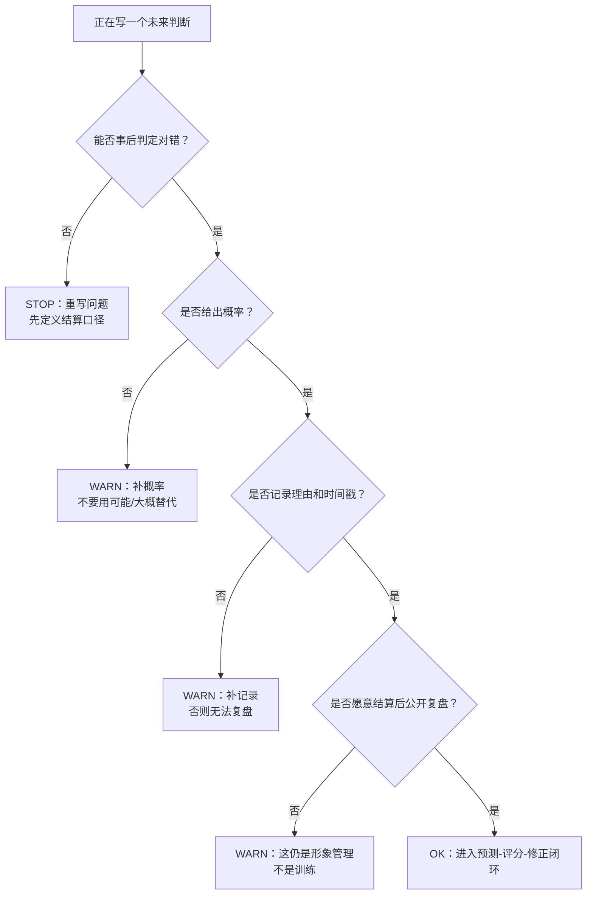

# 《超预测》第1-4章：预测为什么必须从观点表达变成可检验记录
> 沈老师视角 · 第一批合并建模 · 覆盖正文 `text00006`-`text00025`

## 1. Pre-Step：章节分组扫描（新书时）

本批次合并第1-4章，因为这四章共同回答一个前提问题：预测这件事为什么不能继续停留在“专家说法、媒体评论、经验判断”层面，而必须变成可记录、可评分、可比较的系统。

章节依赖图：

推荐分组：

- 第1-4章合并建模。原因：第1章提出“预测需要准确性目标”，第2章说明“没有实验和反馈，人会以为自己懂”，第3章建立“如何评分”，第4章证明“评分后能筛出稳定高水平者”。拆开后任一章都不完整。

每批的核心问题：

- 第一批回答：预测为什么必须从“观点表达”变成“可检验记录”？

## 2. 读前诊断

这批内容是论证书 + 概念书。

我想提取的是一套判断标准：一个未来判断什么时候只是观点，什么时候已经进入可训练的预测系统。

核心预判：

- 如果预测不能被记录，就无法对抗后视偏差。
- 如果预测不能被评分，就无法区分能力和运气。
- 如果预测者不用概率表达，就无法校准信心。
- 如果组织不要求准确性证明，就会继续奖励名气、口才和叙事能力。

## 3. Step 0：骨架提取

### 第一批ER骨架

关键建模判断：本批次的中心实体不是“专家”，而是“预测记录”。专家如果没有可检验记录，无法被查询、比较、复盘；记录才是把预测从意见市场拉进训练系统的最小数据结构。

### 反馈回路

完成标志：看完这张图，第一批的主旨就很清楚：预测行业长期不进步，不是因为未来完全不可知，而是因为多数预测没有进入“预测-评估-修正”的闭环。

## 4. Step 1：概念速览

- 可预测性：不是“未来能不能被完全知道”，而是“某类问题在某个时间尺度上能被预测到什么程度”。天气明天可预测性较高，十年后的地缘冲突就低得多。→ 进Step 2
- 准确性目标：预测必须把准确性作为显式目标，否则可能只是娱乐、动员、安慰或营销。→ 进Step 2
- 知识的错觉：人会把解释能力、自信、专业身份误认为真实判断能力。医学史和专家政治预测都说明，经验不经检验会制造错觉。→ 进Step 2
- 可检验记录：预测需要事前留下事件、时间、概率、理由和结算口径。没有记录，就只能靠记忆和辩论。
- 布莱尔得分：用来衡量概率预测和结果之间距离的评分方式。它让“预测得准不准”从感觉变成数值。→ 进Step 2
- 狐狸型思维：用多种视角、多个模型、小步修正来判断。它不迷信单一大理论。
- 刺猬型思维：用一个大观点解释很多事情。表达有力，但容易把复杂世界压成单因果叙事。→ 进Step 2
- 群体智慧：独立个体各自带来部分信息，错误互相抵消，有效信息累积。但独立性丧失后，群体会变蠢。
- 超级预测家：在大量可评分预测中持续表现优异的人。重点不是身份，而是方法可重复。

## 5. Step 2：实例裁判循环（含执行清单）

Step 2待执行清单：

- ☑ 可预测性
- ☑ 准确性目标
- ☑ 知识的错觉
- ☑ 布莱尔得分
- ☑ 刺猬型思维

---

【可预测性】

正例：判断“明天早高峰某路段是否拥堵”。它有大量历史规律、短时间跨度、稳定机制，因此可预测性较高。

边界例：判断“未来一年某技术标准是否被行业采纳”。可以预测，但需要限定领域、参与者、标准组织进度和结算口径，可预测性中等。

反例伪装：判断“未来十年哪个无名人物会成为下一任总统”。表面是预测问题，实际时间太长、路径依赖太强、参考信息太弱，不适合重投入预测。

陷阱说明：很多人把“有些事不可预测”误推成“预测没有意义”。正确边界是：问题、期限和情境共同决定可预测性。

边界定义（一句话）：可预测性 = 在特定问题和时间尺度上，已有信息能把未来不确定性压缩到什么程度。

☑ 可预测性 完成

---

【准确性目标】

正例：情报预测比赛要求同一时间、同一问题、同一结算规则下提交概率，目标就是准确性。

边界例：企业战略会上请专家讲未来趋势。它可能包含预测，但如果没有评分和结算，准确性只是目标之一，甚至不是主要目标。

反例伪装：财经节目里专家用强烈语言描述未来。它可能更像娱乐、营销或身份表演，而不是以准确性为唯一目标的预测。

陷阱说明：预测常常有隐性目标：让听众安心、让支持者兴奋、让客户觉得钱花得值。只要目标不是准确性，后面就不会自然出现评分系统。

边界定义（一句话）：准确性目标 = 预测活动以事后命中质量为第一评价标准，而不是以表达效果为标准。

☑ 准确性目标 完成

---

【知识的错觉】

正例：一个医生相信自己多年经验能判断治疗是否有效，但没有对照试验支持。经验可能有价值，也可能只是重复错误。

边界例：一个资深架构师说某技术路线会失败。这个判断值得听，但如果他从不记录历史判断，就无法区分经验和叙事能力。

反例伪装：专家能把过去事件解释得头头是道，所以他能预测未来。解释过去和预测未来是两种能力，前者更容易被后视偏差污染。

陷阱说明：人最容易把“能解释”当成“真懂”。但解释可以在结果出现后重写，预测必须在结果出现前下注。

边界定义（一句话）：知识的错觉 = 把未经检验的经验、解释和自信误认为真实能力。

☑ 知识的错觉 完成

---

【布莱尔得分】

正例：预测某事件发生概率为80%，最后发生，得分较好；如果未发生，得分很差。它惩罚自信但错误。

边界例：两个人都方向正确，一个给55%，一个给85%。如果事件发生，85%更有信息量；但长期看还要检查他的85%档是否真的约85%命中。

反例伪装：只统计“猜对几次”。这会丢掉概率强弱，把谨慎判断和强判断混成一类。

陷阱说明：没有概率评分，组织会奖励“听起来很准”的人；有概率评分，才能发现谁长期校准、谁只是会讲故事。

边界定义（一句话）：布莱尔得分 = 把概率判断与真实结果之间的误差变成可比较的训练信号。

☑ 布莱尔得分 完成

---

【刺猬型思维】

正例：一个评论者用“技术民族主义必然上升”解释所有政策变化，并据此预测未来。单一理论贯穿一切，这是刺猬型。

边界例：一个人有核心理论，但会主动寻找反例、调整概率、引入其他模型。他带刺猬倾向，但已经向狐狸型靠拢。

反例伪装：一个人表达很犀利、观点一致，所以预测力强。表达一致可能只是叙事稳定，不代表对复杂系统更敏感。

陷阱说明：刺猬型容易赢得注意力，因为它给人确定感；狐狸型常显得犹豫，因为它保留复杂性。但预测质量看的是结果记录，不是表达气势。

边界定义（一句话）：刺猬型思维 = 用一个大理论压缩复杂世界，并高估该理论对未来的解释力。

☑ 刺猬型思维 完成

---

Step 2完成确认：☑ 可预测性  ☑ 准确性目标  ☑ 知识的错觉  ☑ 布莱尔得分  ☑ 刺猬型思维

## 6. Step 3：结构可视化（含差异列表）

差异列表：

【原文有、图里没有】

- 书中大量历史案例没有逐个保留：医学试验、苏联剧变、精准预测项目、道格和比尔等，都被压缩成“没有检验就无反馈，有检验才可比较”的结构。
- 狐狸/刺猬模型的性格细节没有展开，只保留其对预测记录质量的影响。
- 群体智慧在本批中只作为前奏出现，组织层面的详细机制放到第三批。

【图里有、原文没明说的推论】

- 我把第1-4章抽象成“预测质量基础设施”的建立过程。
- 我把“预测记录”作为中心实体，这是工程化重构，不是作者的叙事顺序。

## 7. Step 4：可执行模型

核心机制（一句话）：

未来判断只有被改写成可结算概率记录，才能从“观点市场”进入“能力训练系统”。

触发条件 → 结果：

- 当专家只给趋势判断、不写概率和期限时 → 不能把它当成可评分预测。
- 当组织只看专家身份、不看历史记录时 → 会把名气误认为判断力。
- 当预测没有结算规则时 → 后视偏差会让所有人都觉得自己没错。
- 当预测有大量样本和评分时 → 才能区分运气、群体平均能力和稳定高水平。

### 诊断方向：听到一个专家预测时

### 预防方向：自己准备发表预测时

失效边界：

- 如果问题本身无法结算，这套评分机制不能硬套。
- 如果预测目标不是准确性，而是动员、安慰或沟通愿景，不应假装它是可评分预测。
- 如果样本太少，单次评分不能证明能力，只能作为反馈。

## 8. Step 5：接入已有体系

【同构】与“软件测试从手工感觉到自动化回归”的迁移同构。

结构是：

- 专家观点 = 手工测试员说“我感觉没问题”
- 可检验预测 = 自动化测试用例
- 结算结果 = 测试执行结果
- 布莱尔得分 = 测试质量和缺陷统计
- 历史校准 = 长期CI趋势

正向迁移：如果一个系统没有测试记录，只靠资深工程师说“这个模块应该稳定”，这在工程上不可接受；同理，重大预测没有历史记录，只靠专家自信，也不应被高权重采纳。

反向迁移：用这批模型看工程评审，可以推出一个动作：重大架构判断要留下“预测记录”。例如“我判断这个方案在未来12个月内支持3倍流量的概率是70%，失败条件是缓存穿透、数据迁移、团队维护成本”。一年后结算，而不是只记得当时谁说服了谁。

【互补】填补“判断能力如何验收”的空缺。

我原有体系擅长建模对象和流程，但对“人做出的未来判断”缺少验收机制。本批次补上了最小机制：记录、结算、评分。

【矛盾】与“尊重专家经验”存在张力。

条件差异：

- 专家在确定性知识领域有高价值，例如数据库原理、协议规范、编译器错误。
- 专家在开放复杂系统里必须接受评分，例如战争、市场、政策、组织变化。

解决：尊重专家输入，但让专家预测也进入记录系统。权威可以提高初始权重，不能免除结算。

【更新图】

## 9. 建模完成自检

- [x] 不看原文，只看图，能复原核心逻辑：预测要从观点变成记录。
- [x] 给一个新情境，能用flowchart判断专家预测是否可用。
- [x] Step 2执行清单已全部打勾。
- [x] Step 3差异列表已输出。
- [x] Step 4入口是具体场景：听到专家预测、自己发表预测。
- [x] Step 5包含同构和反向迁移。
- [x] 没有新增模板外章节。

## 10. 一句话总结

当你听到任何人预测未来时，先别问他说得多聪明，先问他有没有留下“事件、时间、概率、口径、理由”的记录；没有记录，预测就只是观点，有记录并能结算，才开始有训练价值。
