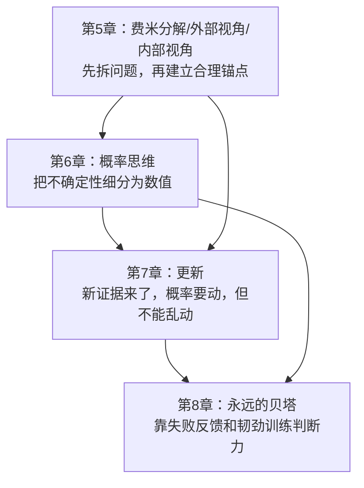
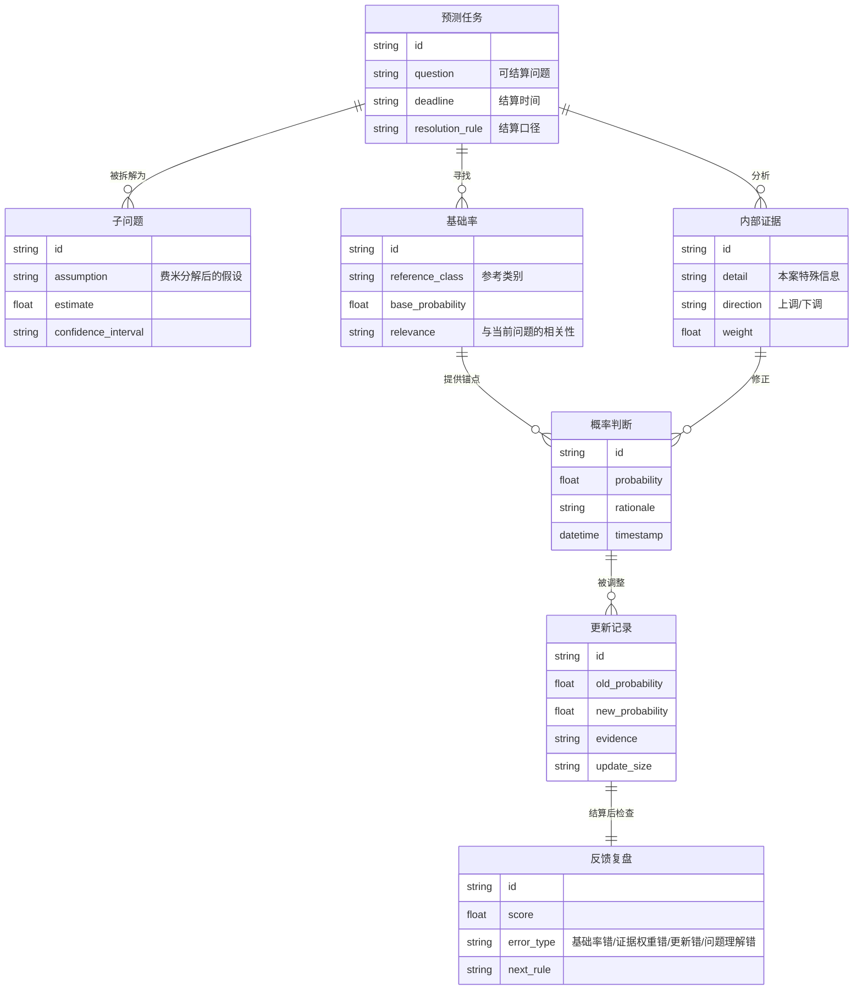
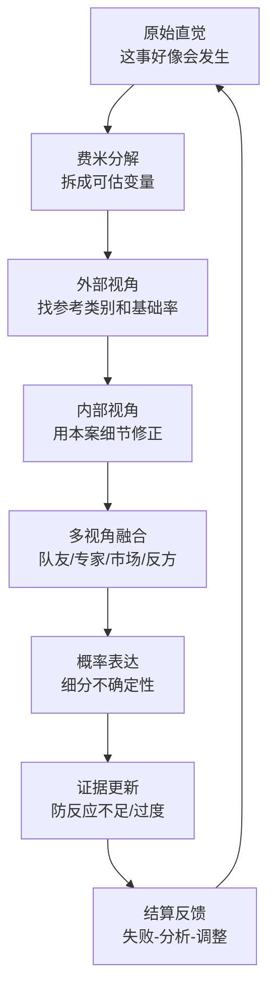
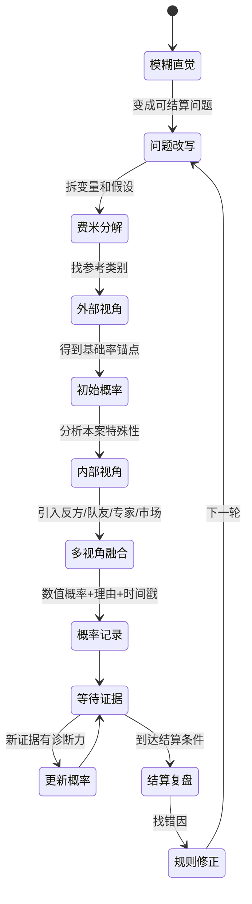
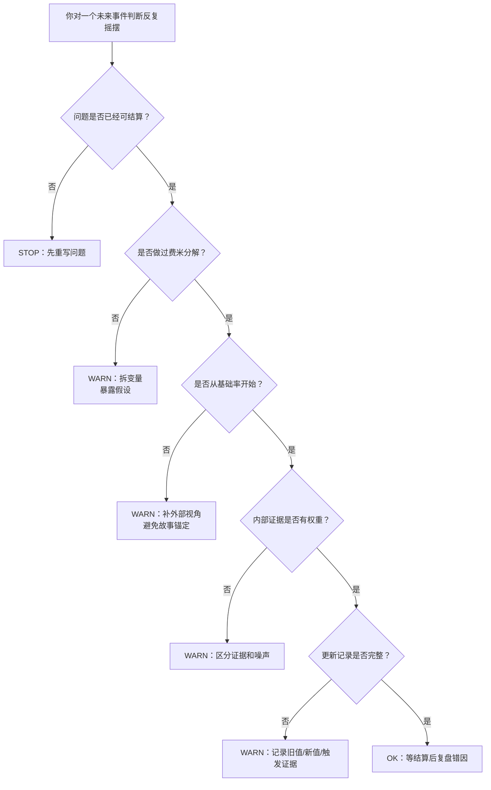
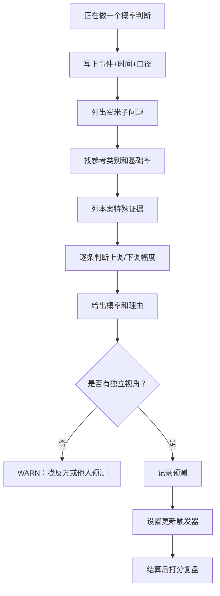
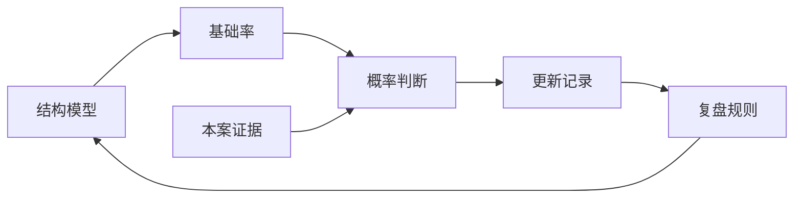

# 《超预测》第5-8章：一个人如何把模糊判断加工成可校准的概率判断
> 沈老师视角 · 第二批合并建模 · 覆盖正文 `text00026`-`text00051`

## 1. Pre-Step：章节分组扫描（新书时）

本批次合并第5-8章，因为它们共同构成个人预测操作系统：先拆问题，再找基础率，再用细节修正，再用概率表达不确定性，再随着新证据更新，最后用反馈训练自己。

章节依赖图：

推荐分组：

- 第5-8章合并建模。原因：第5章给加工流程，第6章给表达语言，第7章给动态修正，第8章给长期训练机制。任何一章单独拿出来都会变成孤立技巧。

每批的核心问题：

- 第二批回答：一个人如何把模糊判断加工成可校准的概率判断？

## 2. 读前诊断

这批内容是工具书。

我想提取的是一个操作流程：当我面对一个不确定问题时，如何从“一团感觉”走到“可记录、可更新、可复盘的概率判断”。

核心预判：

- 初始判断不能从本案故事开始，要从可比较类别开始。
- 概率不是装饰，是不确定性的操作界面。
- 更新不是摇摆，是根据证据诊断力调参数。
- 练习不是重复判断，而是明确反馈后的修正循环。

## 3. Step 0：骨架提取

### 个人预测ER骨架

### 个人预测加工线

完成标志：这批读完后，预测不再是“想一想给答案”，而是一个有输入、处理、输出、反馈的个人算法。

## 4. Step 1：概念速览

- 费米分解：把一个看似无从下手的问题拆成多个可估的变量。关键不是算得精确，而是把黑盒直觉打开。→ 进Step 2
- 外部视角：先问同类事情通常怎样，用基础率做初始锚点。→ 进Step 2
- 内部视角：再看本案有什么特殊信息，决定从基础率上调还是下调。→ 进Step 2
- 视角融合：把外部视角、内部视角、他人观点和反方假设合成一个判断。像蜻蜓复眼，不是单眼盯着一个故事。
- 概率思维：承认不确定性不可消除，用数值表达“有多可能”。80%同时意味着20%不发生。→ 进Step 2
- 概率细分：不要只用“会/不会/也许”三档，也不要把50%当作“不知道”的代名词。
- 更新：新证据出现后调整概率。难点是判断更新幅度。→ 进Step 2
- 反应不足：新证据已经改变局势，但你因为惰性或锚定不动。
- 反应过度：新信息只是噪声，你却大幅调整。
- 永远的贝塔：把自己的判断系统当成持续迭代版本，靠失败反馈改进。→ 进Step 2
- 韧劲：预测训练周期长、反馈慢、运气噪声大，需要长期坚持。

## 5. Step 2：实例裁判循环（含执行清单）

Step 2待执行清单：

- ☑ 费米分解
- ☑ 外部视角
- ☑ 内部视角
- ☑ 概率思维
- ☑ 更新
- ☑ 永远的贝塔

---

【费米分解】

正例：估算“某新功能上线后一个月能否达到10万日活”，拆成目标用户数、触达率、转化率、留存率、使用频次。

边界例：估算“某战略会不会成功”。可以做费米分解，但必须先定义成功指标，否则拆出来的是虚假变量。

反例伪装：直接说“我凭经验觉得有七成”。这可能有价值，但没有暴露中间假设，无法复盘哪里错。

陷阱说明：费米分解不是为了显得理性，而是为了把“黑盒判断”拆成可检查的假设表。

边界定义（一句话）：费米分解 = 把大判断拆成若干可估变量，使错误能被定位。

☑ 费米分解 完成

---

【外部视角】

正例：判断一个项目是否延期，先看过去同类项目延期率，而不是先听项目经理讲这次多特殊。

边界例：没有完全同类案例时，找相近参考类别，并明确相关性较弱。例如新兴技术采用率可参考相邻技术扩散速度。

反例伪装：说“这次情况不同，所以历史没有意义”。很多时候这只是内部视角在逃避基础率。

陷阱说明：内部故事天然更有吸引力，外部视角抽象、无聊，但它提供更好的初始锚点。

边界定义（一句话）：外部视角 = 先用同类历史频率给判断设定初始概率锚。

☑ 外部视角 完成

---

【内部视角】

正例：基础率显示同类项目延期率60%，但本项目需求冻结早、团队熟练、依赖少，于是把延期概率下调到45%。

边界例：本案细节很多，但有些只是叙事噪声。只有能改变发生概率的细节才应进入修正。

反例伪装：收集大量本案材料，然后完全忘记基础率。这不是深入，是被故事带走。

陷阱说明：内部视角必须服务于“从基础率修正多少”，不能取代基础率。

边界定义（一句话）：内部视角 = 用本案特殊证据对基础率做有方向、有幅度的修正。

☑ 内部视角 完成

---

【概率思维】

正例：说“我判断有65%概率上线延期”，同时承认35%不会延期。这是概率判断。

边界例：说“我比较有把握”。这不是概率思维，除非能映射到一个数值区间。

反例伪装：给出73%这种很细的数字，但没有任何分解、基础率和证据。数字精细不等于判断精细。

陷阱说明：概率语言的价值在于强迫你保留不确定性，而不是用数字制造权威感。

边界定义（一句话）：概率思维 = 用可校准的数值表达不确定性，并同时承认反面概率存在。

☑ 概率思维 完成

---

【更新】

正例：原本认为延期概率45%，后来关键依赖方接口冻结失败，把概率上调到70%，并记录原因。

边界例：出现一条传闻说依赖方可能延期。是否更新取决于消息源可靠性、独立性和对最终事件的诊断力。

反例伪装：每天看一条消息就从30%跳到80%，再跳回40%。这不是更新，是被噪声驱动。

陷阱说明：更新的难点不是“要不要动”，而是“动多少”。反应不足和反应过度都会毁掉原本不错的判断。

边界定义（一句话）：更新 = 按新证据的诊断力调整概率，并让调整幅度可复盘。

☑ 更新 完成

---

【永远的贝塔】

正例：每次预测结算后，记录错因：基础率选错、证据权重错、更新时间晚、问题理解错，然后改下一次规则。

边界例：连续几次预测得分好。不能认为自己已经稳定精通，因为运气噪声可能很大，仍要看长期记录。

反例伪装：预测很多次，但从不复盘，只是积累“经验”。这会增加自信，不一定增加能力。

陷阱说明：实践只有在有明确反馈时才是训练；没有反馈的重复会把错误固化。

边界定义（一句话）：永远的贝塔 = 把判断力当成持续迭代系统，用反馈而不是面子驱动升级。

☑ 永远的贝塔 完成

---

Step 2完成确认：☑ 费米分解  ☑ 外部视角  ☑ 内部视角  ☑ 概率思维  ☑ 更新  ☑ 永远的贝塔

## 6. Step 3：结构可视化（含差异列表）

差异列表：

【原文有、图里没有】

- 阿拉法特、芝加哥钢琴调音师、本·拉登、北冰洋海冰、靖国神社等案例没有逐一展开，只保留其对应的操作节点。
- 概率哲学中的可认知不确定性与偶然不确定性没有详细铺开，只被纳入“概率思维”和“失效边界”。
- 超级预测家的个人故事没有保留，只保留“反馈慢、需要韧劲”的训练机制。

【图里有、原文没明说的推论】

- 我把第5-8章合并成一个个人算法状态机。
- 我把“更新记录”视为独立实体，因为没有旧概率、新概率和触发证据，就无法训练更新幅度。

## 7. Step 4：可执行模型

核心机制（一句话）：

高质量个人预测 = 费米分解打开黑盒 + 外部视角设锚 + 内部视角修正 + 概率表达 + 证据更新 + 反馈复盘。

触发条件 → 结果：

- 当问题大到无法估计时 → 先费米分解，不要直接给结论。
- 当本案故事很有吸引力时 → 强制先找基础率。
- 当想说“可能”时 → 改写成概率区间或具体概率。
- 当新证据出现时 → 先判断证据诊断力，再决定更新幅度。
- 当预测错了时 → 不问“我怎么这么倒霉”，先问错在流程哪个环节。

### 诊断方向：你的判断为什么不稳

### 预防方向：正在做一个概率判断

失效边界：

- 缺少可结算问题时，个人预测流程不能启动。
- 没有任何参考类别时，外部视角只能给粗锚，不能假装精确。
- 证据噪声很大、时间跨度很长时，概率要保守，不要过度细分。
- 反馈周期太长时，需要中间代理指标，否则训练速度会很慢。

## 8. Step 5：接入已有体系

【同构】与“架构方案评审中的容量估算”同构。

结构是：

- 费米分解 = 拆QPS、读写比、峰值系数、缓存命中率、存储增长。
- 外部视角 = 查同类系统历史容量和故障率。
- 内部视角 = 看本系统特殊约束。
- 概率判断 = 不是写“应该撑得住”，而是写“12个月内不重构撑住3倍流量的概率为X”。
- 更新 = 上线后根据真实流量和故障调整判断。
- 复盘 = 半年后检查估算偏差。

正向迁移：面对战略或架构判断时，先做费米分解，再找基础率，不要直接被本案故事带走。

反向迁移：用这批模型改造日常学习，可以要求每次读一个工具方法时都写“适用概率”和“失败条件”，之后用真实案例更新，而不是只做概念摘抄。

【互补】填补“从结构理解到概率判断”的空缺。

ER图和状态机能帮助理解系统，但不能自动给出“未来是否发生”的概率。本批次补的是从结构到概率的加工流程。

【矛盾】与“工程师追求确定性”的习惯存在张力。

条件差异：

- 可验证的确定性问题，用测试和事实解决。
- 开放系统里的未来判断，用概率和更新解决。

解决：先分类。确定性问题不要概率化；不确定问题不要伪装成确定答案。

【更新图】

## 9. 建模完成自检

- [x] 不看原文，只看状态机，能复原个人预测流程。
- [x] 给一个新情境，能用flowchart判断自己卡在哪一步。
- [x] Step 2执行清单已全部打勾。
- [x] Step 3差异列表已输出。
- [x] Step 4入口是具体场景：判断摇摆、正在做概率判断。
- [x] Step 5包含同构和反向迁移。
- [x] 没有新增模板外章节。

## 10. 一句话总结

当你面对一个模糊的未来判断时，不要直接问“我觉得会不会”，先拆变量、找基础率、用本案证据修正，再把结果写成概率并持续更新；判断力不是一次想准的能力，而是每轮反馈后调参的能力。
