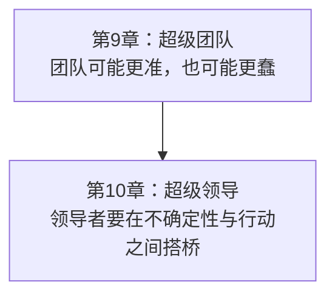
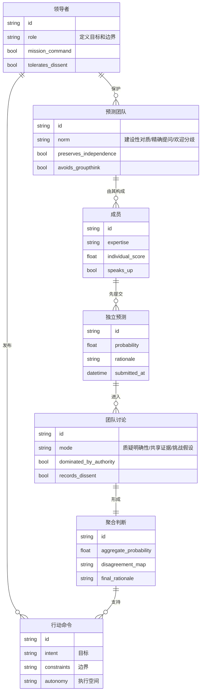
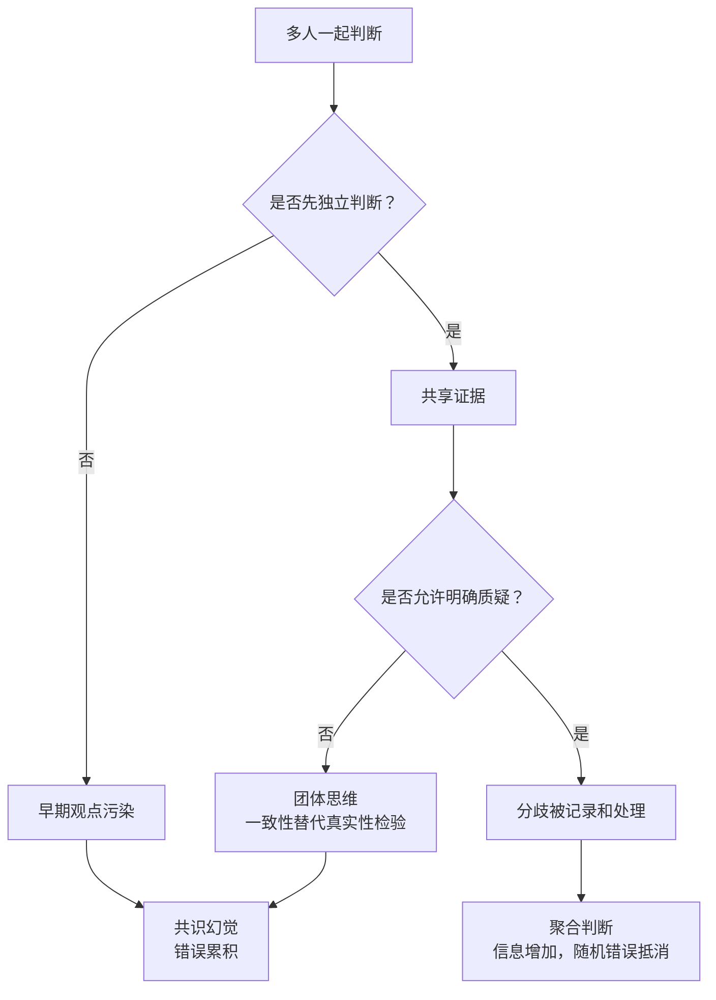
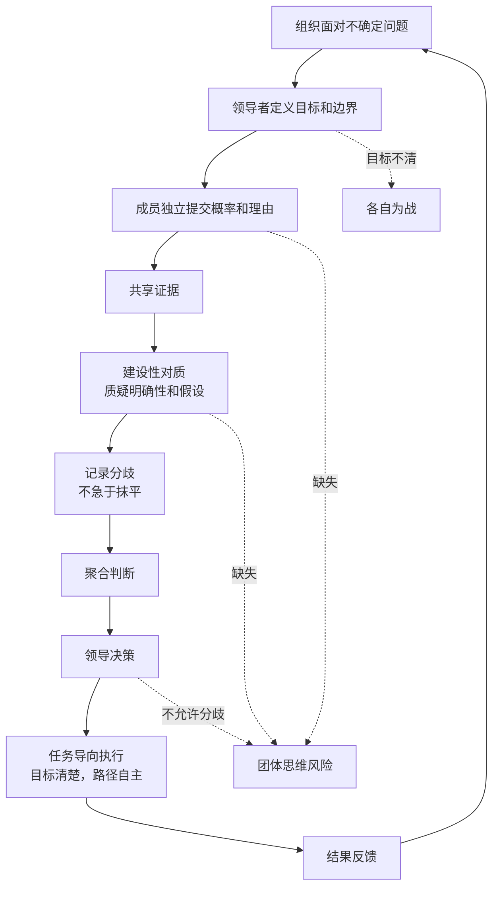
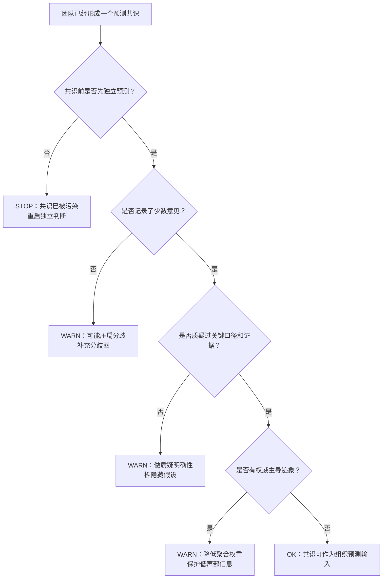
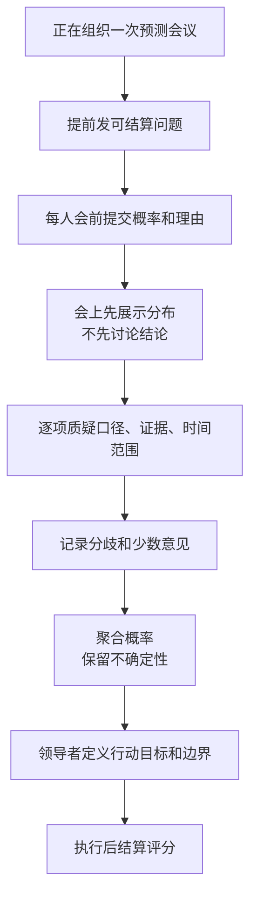
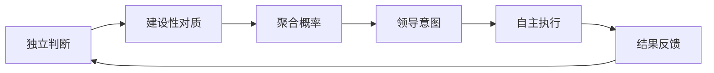

# 《超预测》第9-10章：组织如何让多人预测变准，而不是变成共识幻觉
> 沈老师视角 · 第三批合并建模 · 覆盖正文 `text00052`-`text00060`

## 1. Pre-Step：章节分组扫描（新书时）

本批次合并第9-10章，因为它们共同回答组织问题：个人判断力如何进入团队和领导系统，并且不被权威、共识、执行压力污染。

章节依赖图：

推荐分组：

- 第9-10章合并建模。原因：第9章解决“多人如何共同判断”，第10章解决“判断如何进入行动”。团队没有领导接口会停留在讨论，领导没有团队独立判断会变成自信幻觉。

每批的核心问题：

- 第三批回答：组织如何让多人预测变准，而不是变成共识幻觉？

## 2. 读前诊断

这批内容是组织设计书。

我想提取的是一套组织机制：怎样让团队既能共享信息，又不丢掉独立性；领导者怎样既保持决断，又不消灭概率思维。

核心预判：

- 团队的价值来自分布式信息，不来自气氛一致。
- 团队的风险来自独立性丧失、认知懒惰和权威污染。
- 领导者的关键不是给答案，而是定义目标、边界和讨论规则。
- “先争论、后执行”必须制度化，否则组织要么乱，要么蠢。

## 3. Step 0：骨架提取

### 组织预测ER骨架

### 团队从智慧到愚蠢的分岔

完成标志：组织预测系统的核心不是“大家一起讨论”，而是“先保护独立信息，再设计冲突和聚合”。

## 4. Step 1：概念速览

- 团体思维：团队为了维持一致和安全感，压制批判性思考和真实性检验。→ 进Step 2
- 独立判断：每个成员在被他人影响前先给出自己的概率和理由。它是群体智慧的前提。→ 进Step 2
- 建设性对质：不是吵架，而是用精确问题挑战模糊表达和隐藏假设。
- 质疑明确性：问“你说的成功指什么口径”“证据是什么”“时间范围多长”。这是把观点变成可检查结构的工具。→ 进Step 2
- 超级团队：成员能力强只是起点，更重要的是团队规范能让信息流动、错误被挑战、少数意见不被压扁。→ 进Step 2
- 领导者两难：领导要自信、决断、描绘目标；预测要求谦卑、概率、持续修正。表面冲突，实际可以通过角色分离解决。
- 任务导向指挥：领导者说明目标和边界，不规定每一步怎么做，让一线根据现场不确定性判断。→ 进Step 2
- 敢于谏言，服从大局：决策前强力反对，决策后全力执行。它把争论期和执行期分开。
- 特殊的谦卑：不是没信心，而是承认局势复杂、自己可能错，因此主动设计反馈和纠偏。

## 5. Step 2：实例裁判循环（含执行清单）

Step 2待执行清单：

- ☑ 团体思维
- ☑ 独立判断
- ☑ 质疑明确性
- ☑ 超级团队
- ☑ 任务导向指挥

---

【团体思维】

正例：一个战略小组里没人愿意挑战CEO的乐观判断，大家把沉默当作同意，最后形成高风险共识。

边界例：团队最终一致支持某方案。是否团体思维取决于一致之前是否有独立判断、反方证据和真实辩论。

反例伪装：团队气氛好、效率高、很快达成共识。表面健康，实际可能是成员不愿制造冲突。

陷阱说明：团体思维最危险的地方是它给人“我们都想过了”的感觉，但真实性检验可能根本没发生。

边界定义（一句话）：团体思维 = 团队一致性压倒证据检验，导致错误不是抵消而是累积。

☑ 团体思维 完成

---

【独立判断】

正例：每个成员先私下提交概率和理由，再进入团队讨论。

边界例：团队先听几位专家背景介绍，再各自判断。可能可行，但要防止专家表达先锚定所有人。

反例伪装：会议上轮流发言。后发言的人已经被前面观点影响，这不是真正独立。

陷阱说明：群体智慧依赖错误的独立性。如果所有人被同一个权威锚定，错误会同向累积。

边界定义（一句话）：独立判断 = 在社会影响进入之前，保留每个成员原始信息和判断。

☑ 独立判断 完成

---

【质疑明确性】

正例：有人说“市场会明显改善”，你问“明显是收入、线索、成交率还是续费？改善多少？到什么时候？”。

边界例：有人使用比喻表达直觉。可以先允许表达，但进入预测系统前必须改写成可检查命题。

反例伪装：直接说“我不同意”。这只是立场对立，不是揭示假设。

陷阱说明：很多分歧藏在词里，不在结论里。把词问清楚，争论才会进入结构层。

边界定义（一句话）：质疑明确性 = 用具体口径、证据和时间问题，把模糊观点拆成可检查假设。

☑ 质疑明确性 完成

---

【超级团队】

正例：团队成员先独立判断，随后共享证据、挑战假设、记录分歧，最后聚合概率。

边界例：由一群高水平个人组成团队。还不一定是超级团队，因为强个人也可能互相压制或偷懒。

反例伪装：团队里有明星专家，所以整体一定更准。明星专家可能成为污染源，让其他人的信息不再独立。

陷阱说明：超级团队不是“高手集合”，而是“高手之间的信息处理协议”。

边界定义（一句话）：超级团队 = 用规范把个体信息聚合成更准判断，同时防止共识污染。

☑ 超级团队 完成

---

【任务导向指挥】

正例：领导告诉团队“目标是三个月内把P0故障率降50%，不能牺牲支付成功率”，具体方案由一线制定。

边界例：高风险合规动作需要严格步骤。此时执行自由度要降低，但目标和边界仍需说清。

反例伪装：领导完全放手，说“你们自己看着办”。这不是任务导向，是目标缺失。

陷阱说明：任务导向指挥不是弱领导，而是把决策权下放到信息最新的位置，同时保留战略意图一致。

边界定义（一句话）：任务导向指挥 = 上级定义意图和边界，下级根据现场不确定性自主选择路径。

☑ 任务导向指挥 完成

---

Step 2完成确认：☑ 团体思维  ☑ 独立判断  ☑ 质疑明确性  ☑ 超级团队  ☑ 任务导向指挥

## 6. Step 3：结构可视化（含差异列表）

差异列表：

【原文有、图里没有】

- 猪湾事件、古巴导弹危机、毛奇、德国国防军、艾森豪威尔、彼得雷乌斯、3M、亚马逊、沃尔玛等案例没有展开，只保留其组织机制。
- 德军案例的历史争议没有在图中表现，价值判断放在模型边界里。

【图里有、原文没明说的推论】

- 我把第9章团队机制和第10章领导机制合成一个“组织预测协议”。
- 我把“分歧记录”作为关键节点。原文强调讨论和独立性，这里进一步工程化为可审计对象。

## 7. Step 4：可执行模型

核心机制（一句话）：

组织预测要先保护个体独立信息，再通过建设性对质聚合，最后由领导者把概率判断转成带目标和边界的行动。

触发条件 → 结果：

- 当团队先讨论再判断时 → 早期观点会污染所有人。
- 当团队追求舒服的一致时 → 团体思维替代真实性检验。
- 当成员只反对结论、不追问口径时 → 分歧停留在情绪层。
- 当领导者只要确定答案时 → 组织会奖励自信，惩罚诚实概率。
- 当领导者只给步骤不给意图时 → 一线无法处理现场变化。

### 诊断方向：团队共识是否可信

### 预防方向：正在组织一次预测会议

失效边界：

- 高度保密或极端时间压力下，完整团队流程可能不可用，但至少要保留独立判断和事后复盘。
- 如果领导者不允许被质疑，超级团队机制会退化成装饰。
- 如果团队成员没有基本能力或信息，聚合无法凭空产生智慧。
- 如果执行阶段继续无限争论，组织会失去行动力；必须区分争论期和执行期。

## 8. Step 5：接入已有体系

【同构】与“分布式系统中的一致性协议”同构。

结构是：

- 成员独立预测 = 多副本本地状态。
- 团队讨论 = gossip交换信息。
- 建设性对质 = 冲突检测。
- 聚合判断 = 共识算法输出。
- 领导目标 = 上层业务意图。
- 任务导向执行 = 边缘节点根据本地信息自主决策。

正向迁移：像分布式系统一样，组织预测不能让一个主节点随意覆盖所有副本的信息；要先收集各节点状态，再做冲突解决和聚合。

反向迁移：用任务导向指挥反过来看工程管理，可以推出一个原则：架构负责人不要把方案步骤写死，而要说清目标、约束和不可破坏的边界，让最接近代码和运行状态的人做局部判断。

【互补】填补“个人模型如何进入组织”的空缺。

第二批解决个人如何判断，本批解决多人判断如何不被组织动力学毁掉。

【矛盾】与“领导要自信决断”存在张力。

条件差异：

- 判断期需要谦卑、概率、质疑、慢思考。
- 执行期需要清晰、信心、边界、行动。

解决：把阶段显式分开。决策前鼓励反对，决策后服从大局；但执行中保留现场更新和反馈通道。

【更新图】

## 9. 建模完成自检

- [x] 不看原文，只看图，能复原组织预测机制。
- [x] 给一个新情境，能判断团队共识是否可信。
- [x] Step 2执行清单已全部打勾。
- [x] Step 3差异列表已输出。
- [x] Step 4入口是具体场景：团队已形成共识、正在组织预测会议。
- [x] Step 5包含同构和反向迁移。
- [x] 没有新增模板外章节。

## 10. 一句话总结

当一个团队很快形成预测共识时，先别高兴，先查三件事：每个人是否先独立下注，分歧是否被记录，关键口径是否被追问；没有这三件事，共识很可能不是群体智慧，而是组织压力的形状。
