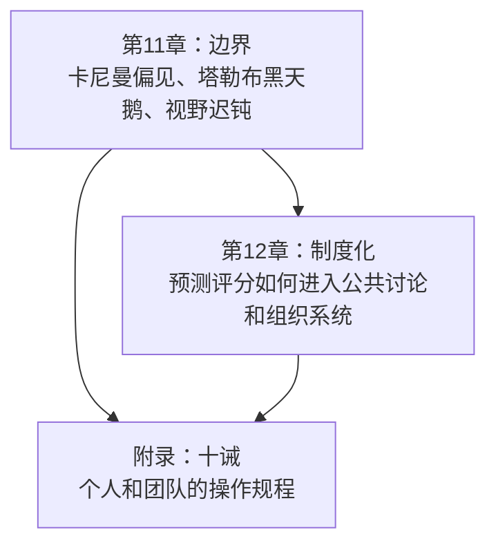
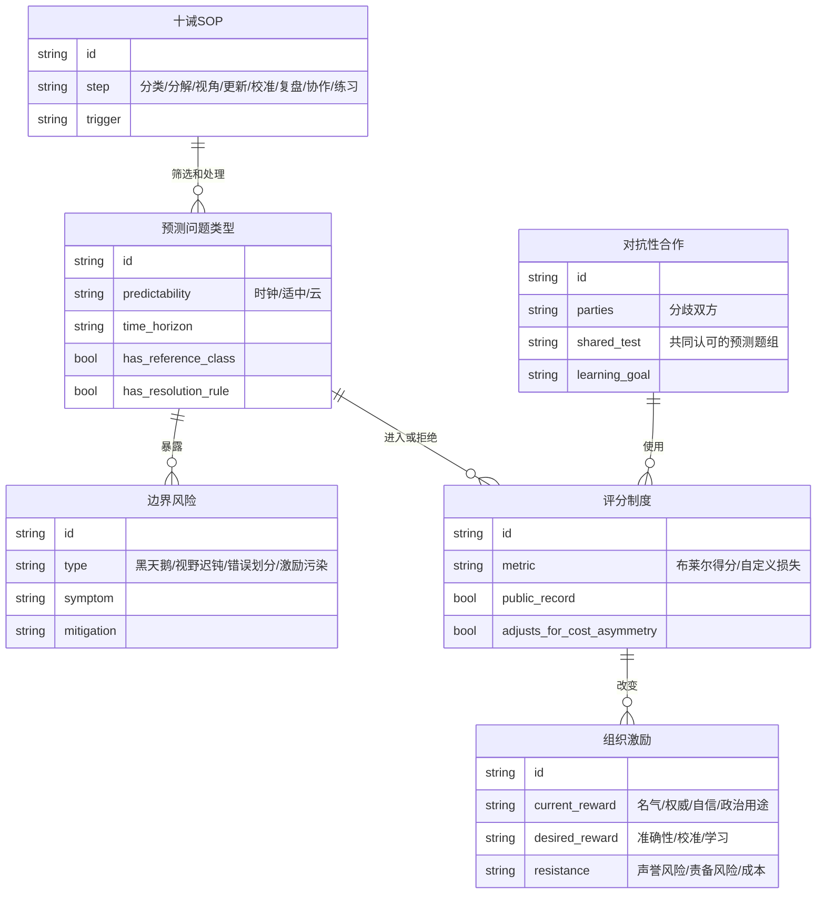
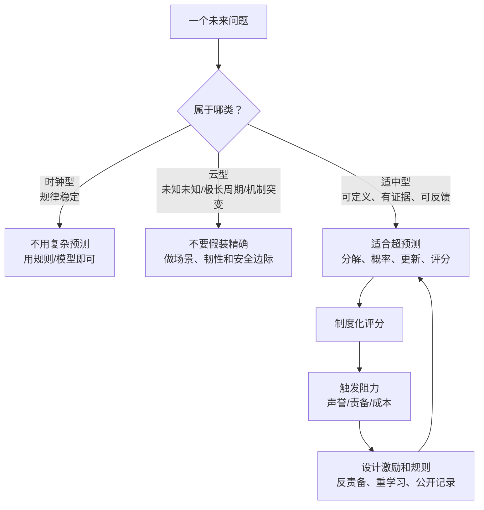
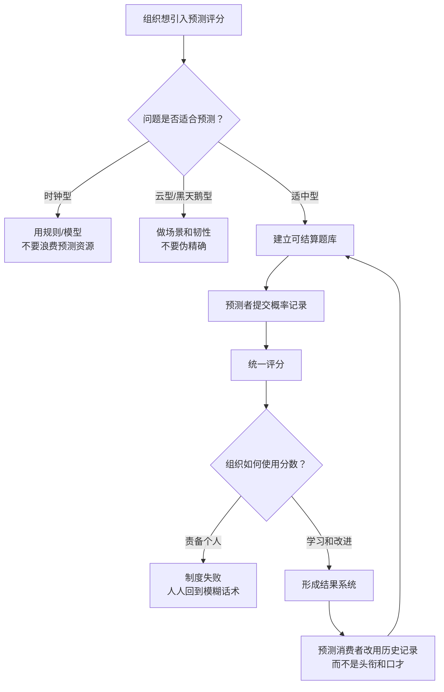
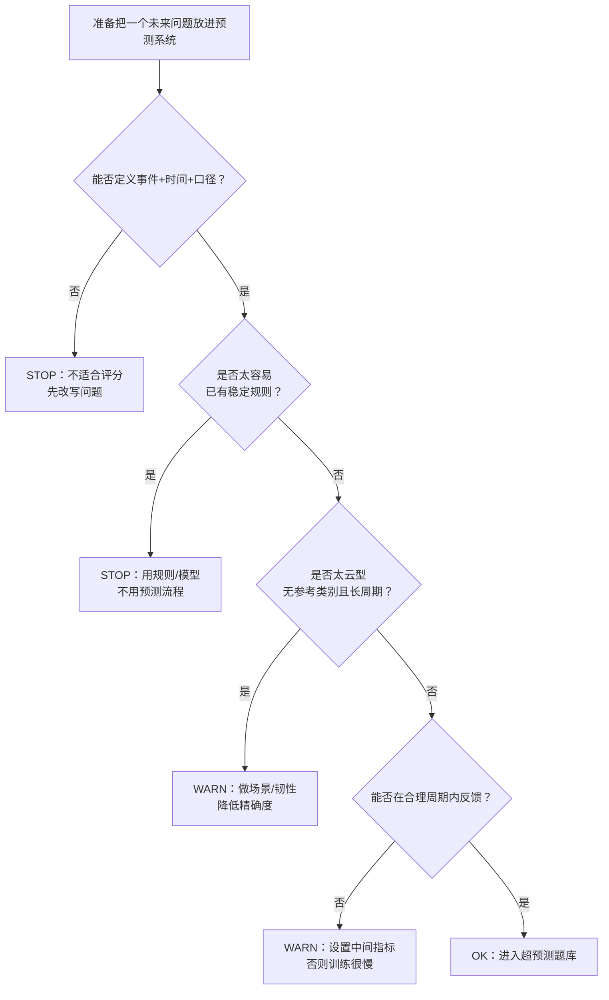
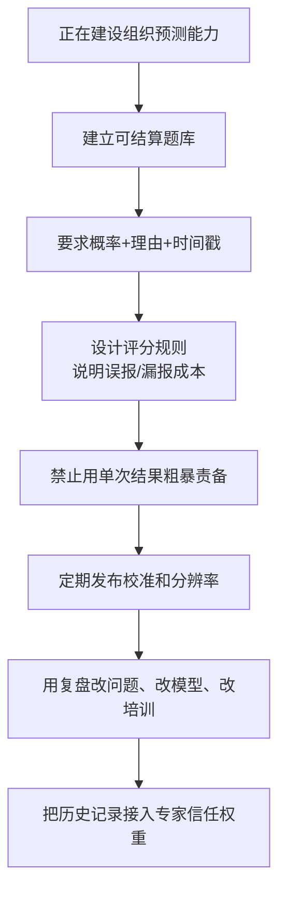
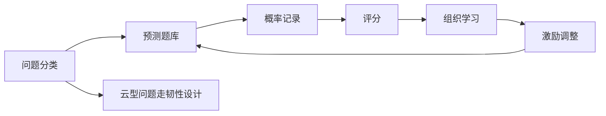

# 《超预测》第11-12章 + 附录：超级预测的适用边界在哪里，怎样把它变成组织能力
> 沈老师视角 · 第四批合并建模 · 覆盖正文 `text00061`-`text00069` + `text00071`

## 1. Pre-Step：章节分组扫描（新书时）

本批次合并第11-12章和附录，因为它们共同回答最后一个问题：超预测方法能推到多远，遇到黑天鹅和制度阻力时怎么办，以及如何把方法压缩成可执行规程。

章节依赖图：

推荐分组：

- 第11-12章 + 附录合并建模。原因：第11章划边界，第12章谈制度变革，附录提供操作清单。边界不清，制度化会变成过度自信；没有制度化，十诫只能停留在个人技巧。

每批的核心问题：

- 第四批回答：超级预测的适用边界在哪里，怎样把它变成组织能力？

## 2. 读前诊断

这批内容是边界说明 + 制度设计 + 操作手册。

我想提取的是两类东西：

- 判断边界：什么时候该用超预测，什么时候该承认问题不适合精确预测。
- 落地机制：怎样让预测评分进入组织和公共讨论，而不是只靠少数人的自觉。

核心预判：

- 黑天鹅不是“所有预测无效”，而是提醒我们识别问题类型。
- 分数不是完美真理，但比头衔、口才、信心更可改进。
- 制度化的阻力来自利益和面子：评分会暴露谁只是会讲。
- 十诫本质上是一套预测操作SOP，不是格言。

## 3. Step 0：骨架提取

### 边界与制度ER骨架

### 方法边界图

完成标志：本批不是给超预测神化，而是给它装上边界、接口和组织落地条件。

## 4. Step 1：概念速览

- 黑天鹅：超出经验想象且影响巨大的事件。它提醒我们历史样本和模型有边界。→ 进Step 2
- 视野迟钝：没有根据时间范围、规模范围调整概率。例如3个月和6个月的事件概率几乎给一样。→ 进Step 2
- 所见即全部：把自己眼前看到的信息当作全部世界，忘记查外部数据和替代视角。
- 错误划分：把70%预测遇到未发生事件当成“预测错了”，忽视概率判断本来允许反面结果。→ 进Step 2
- 评分制度：用统一规则记录和评价预测，使准确性可见。
- 分数的可改进性：布莱尔得分不完美，但可以调整损失权重，比无评分状态强。
- “谁-谁”现状：人们关心谁说的、站哪边、服务谁，而不是预测记录如何。
- 对抗性合作：分歧双方共同定义能检验分歧的预测题组，用结果学习，而不是互相表演。→ 进Step 2
- 最终结果系统：类似医学中记录治疗和结果，用结果反馈改善实践。
- 十诫SOP：从问题筛选到分解、视角、更新、复盘、协作和练习的操作清单。→ 进Step 2

## 5. Step 2：实例裁判循环（含执行清单）

Step 2待执行清单：

- ☑ 黑天鹅
- ☑ 视野迟钝
- ☑ 错误划分
- ☑ 对抗性合作
- ☑ 十诫SOP

---

【黑天鹅】

正例：一个从历史经验中很难想象、发生后重塑系统的事件，属于黑天鹅边界。

边界例：某国一年内是否提前选举。它可能意外，但仍可定义、跟踪和评分，不应因为“政治复杂”就归入黑天鹅。

反例伪装：一次小概率但已被明确纳入风险清单的事故。它是低概率风险，不一定是黑天鹅。

陷阱说明：很多人用黑天鹅给懒惰找借口：既然有未知未知，就不预测任何事。正确做法是分类：适中型问题继续预测，云型问题做韧性设计。

边界定义（一句话）：黑天鹅 = 历史样本和想象范围都难覆盖、且影响巨大的系统跃迁事件。

☑ 黑天鹅 完成

---

【视野迟钝】

正例：判断某政权3个月内垮台给15%，6个月内给24%，概率随时间窗口合理变化。

边界例：某些事件主要由固定日期决定，3个月和6个月窗口差别可能不大。要看事件机制。

反例伪装：对3个月、6个月、12个月都给40%，因为“感觉就是这个风险水平”。这通常是没有处理时间视野。

陷阱说明：人容易回答“支持和反对证据强不强”，却忘了真正问题是“在这个时间范围内有多可能”。

边界定义（一句话）：视野迟钝 = 概率没有随时间、规模或数量范围变化而变化。

☑ 视野迟钝 完成

---

【错误划分】

正例：我预测某事件70%发生，结果没发生。这不能直接说明预测错，只能进入长期校准样本。

边界例：我预测99%发生，结果没发生。单次也不能绝对判死刑，但应强烈复盘是否过度自信。

反例伪装：领导说“你不是说会发生吗？现在没发生，所以你错了”。这是把概率预测误当成确定承诺。

陷阱说明：错误划分会惩罚诚实概率，奖励模糊措辞。组织若不解决它，就没人愿意说数字。

边界定义（一句话）：错误划分 = 把概率预测按单次结果粗暴切成对错，忽视概率本身的含义。

☑ 错误划分 完成

---

【对抗性合作】

正例：凯恩斯主义者和紧缩派共同定义一组通胀、就业、货币指标的预测题，几年后一起看结果。

边界例：双方都愿意打赌，但题目只覆盖一个指标。可以开始，但不能宣称解决整个理论争端。

反例伪装：公开辩论互相质问。没有共同认可的可结算问题，就只是表演。

陷阱说明：重大分歧常常不是一题定胜负，而是一组题逐步显示各自模型在哪些条件下有效。

边界定义（一句话）：对抗性合作 = 分歧双方共同设计可检验预测，用结果约束各自模型。

☑ 对抗性合作 完成

---

【十诫SOP】

正例：面对新问题时，先判断是否值得预测，再分解、找外部视角、调内部视角、更新、复盘、协作练习。

边界例：附录列了十余条建议，但不是每个问题都要完整跑一遍。高成本问题完整跑，低成本问题轻量跑。

反例伪装：把十诫当成励志格言。它的价值不在背诵，而在触发具体动作。

陷阱说明：读懂十诫不等于会预测。它像骑自行车的说明书，需要练习、反馈和调整。

边界定义（一句话）：十诫SOP = 把超预测方法压缩成可重复执行的操作规程。

☑ 十诫SOP 完成

---

Step 2完成确认：☑ 黑天鹅  ☑ 视野迟钝  ☑ 错误划分  ☑ 对抗性合作  ☑ 十诫SOP

## 6. Step 3：结构可视化（含差异列表）

差异列表：

【原文有、图里没有】

- 卡尼曼、塔勒布、弗林、纳特·西尔弗、科德曼、经济政策争论等案例没有展开，只保留其机制。
- 附录十诫没有逐条按原文详述，而是压缩成SOP类别。
- “数字可能被滥用”的人文主义反对没有展开成哲学讨论，只放入评分制度的边界。

【图里有、原文没明说的推论】

- 我把超预测的落地抽象成“题库 + 记录 + 评分 + 激励”的组织系统。
- 我把问题先分为时钟型、适中型、云型，作为是否进入预测流程的路由器。

## 7. Step 4：可执行模型

核心机制（一句话）：

超预测适合可定义、可跟踪、可反馈的中等难度问题；要制度化它，必须同时设计题库、评分、反责备机制和学习激励。

触发条件 → 结果：

- 当问题太容易、规律稳定时 → 用规则，不需要超预测。
- 当问题太混沌、极长周期、未知未知主导时 → 做韧性和场景，不要假装精确概率。
- 当组织用单次结果责备概率预测者时 → 所有人都会回到模糊语言。
- 当分数公开但不解释边界时 → 数字会被政治化和误用。
- 当分歧双方愿意共同定义测试题时 → 公共争论才可能从立场战变成学习系统。

### 诊断方向：一个问题是否适合超预测

### 预防方向：正在把预测变成组织能力

失效边界：

- 预测题库质量低，制度化会制造垃圾分数。
- 评分被当成问责武器，预测者会自我保护。
- 指标不考虑误报和漏报成本，会扭曲行为。
- 黑天鹅型问题不能靠评分系统消灭，只能通过冗余、韧性、安全边际应对。
- 没有预测消费者的需求变化，供给侧再努力也会被观点市场吞没。

## 8. Step 5：接入已有体系

【同构】与“平台治理中的SLO制度化”同构。

结构是：

- 预测题库 = SLO目录。
- 预测记录 = 指标采集。
- 评分规则 = 错误预算。
- 错误划分 = 单次故障就否定整套系统。
- 黑天鹅 = 超出SLO覆盖范围的灾难场景。
- 制度化阻力 = 团队害怕指标暴露问题。

正向迁移：像SLO一样，预测评分要事先定义指标和错误预算。不能故障后才改口径，也不能只在出事时拿指标问责。

反向迁移：用超预测看平台治理，可以推出一个动作：不要只发布可用性数字，还要发布“团队此前对风险的概率判断”和“事后校准”。这样能训练风险识别，而不只是统计事故。

【互补】填补“方法边界和组织激励”的空缺。

前几批说明怎么预测，本批说明什么时候别预测，以及怎样让预测不被组织激励破坏。

【矛盾】与“数字化治理天然更客观”存在张力。

条件差异：

- 数字有清晰口径、合理激励、持续审查时，是改进工具。
- 数字被拿来装权威、甩锅或排除坏样本时，会制造新幻觉。

解决：数字必须和口径、边界、复盘制度一起上线。单独上线一个分数，只是新的权力工具。

【更新图】

## 9. 建模完成自检

- [x] 不看原文，只看图，能判断超预测适用边界。
- [x] 给一个新情境，能用flowchart决定是否进入预测题库。
- [x] Step 2执行清单已全部打勾。
- [x] Step 3差异列表已输出。
- [x] Step 4入口是具体场景：准备放入预测系统、建设组织预测能力。
- [x] Step 5包含同构和反向迁移。
- [x] 没有新增模板外章节。

## 10. 一句话总结

当你想把超预测用于组织时，先做路由：太容易的问题交给规则，太混沌的问题交给韧性设计，只有可定义、可跟踪、可反馈的中等难度问题才进入题库；然后用评分来学习，不要用评分来羞辱人。
