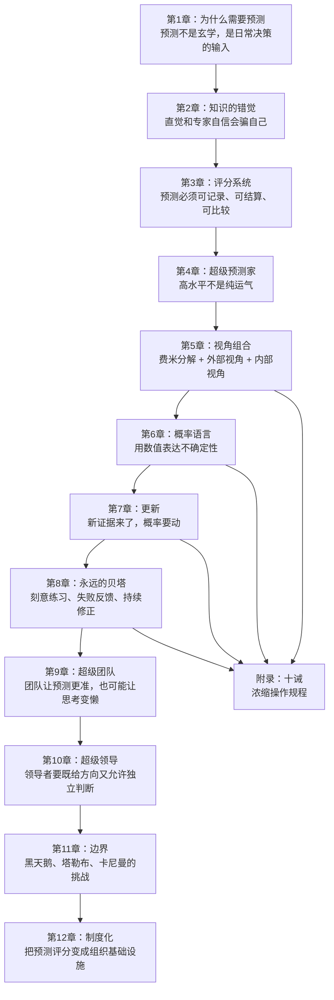
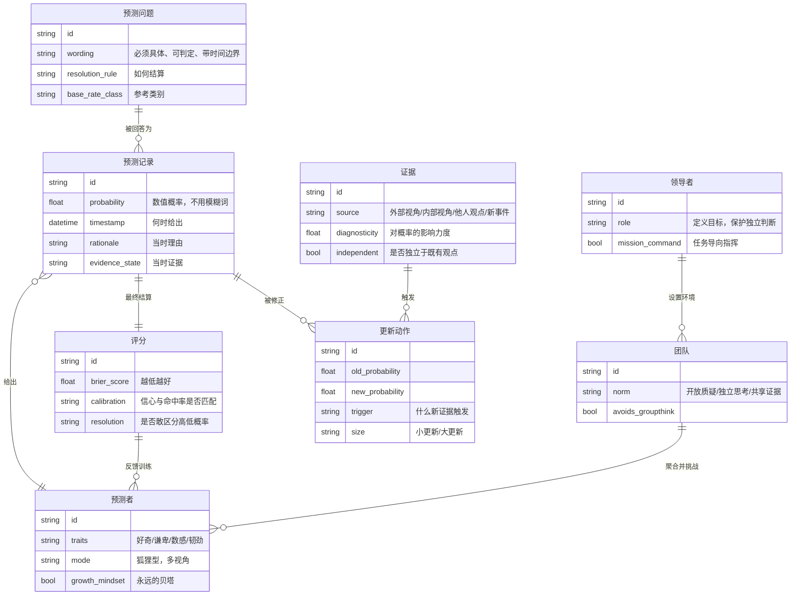
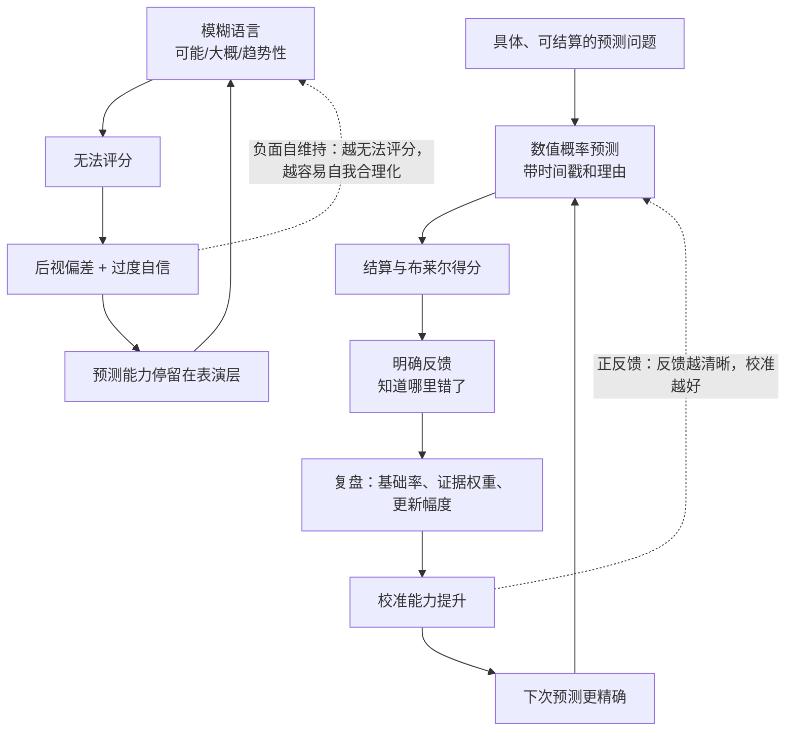
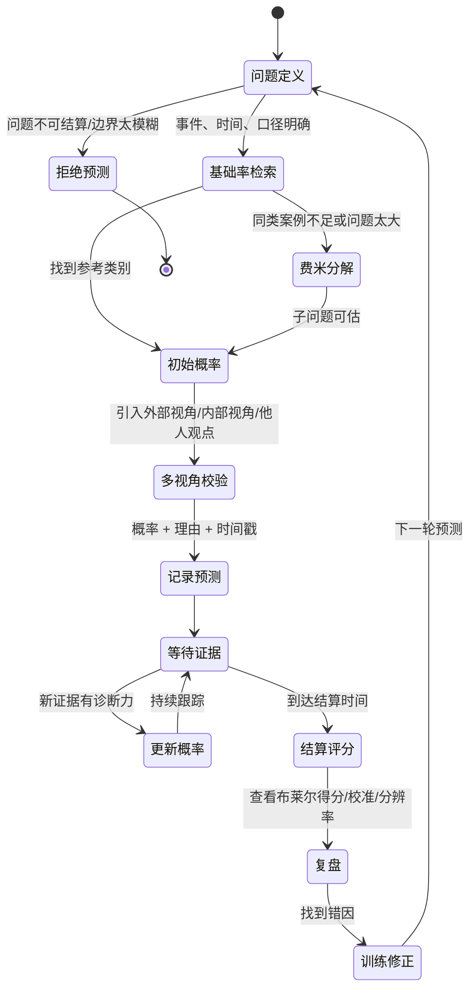
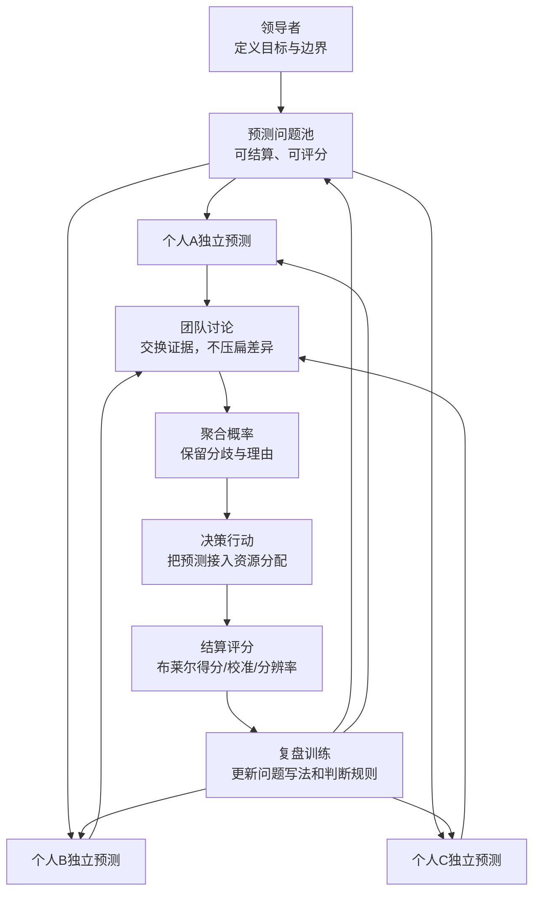
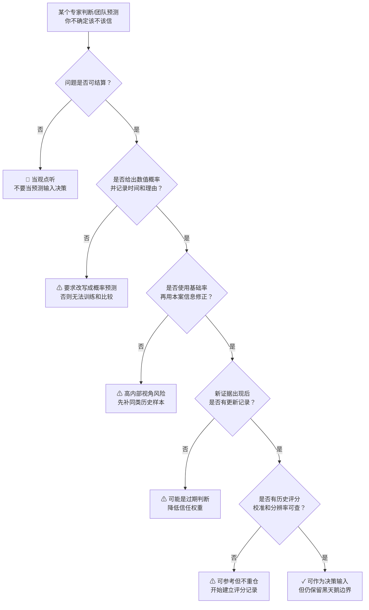
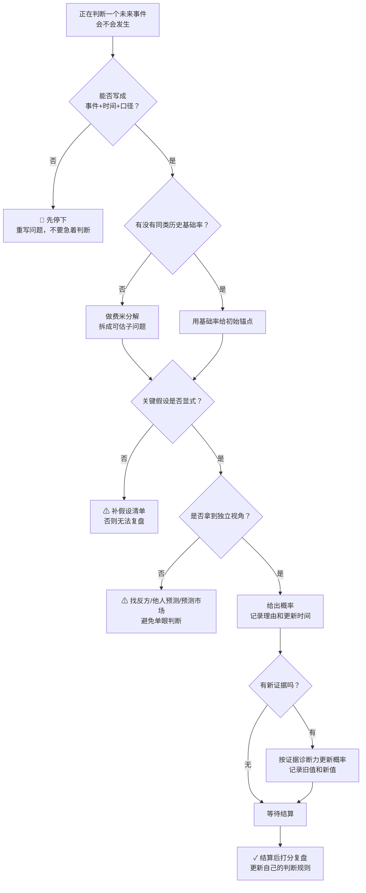
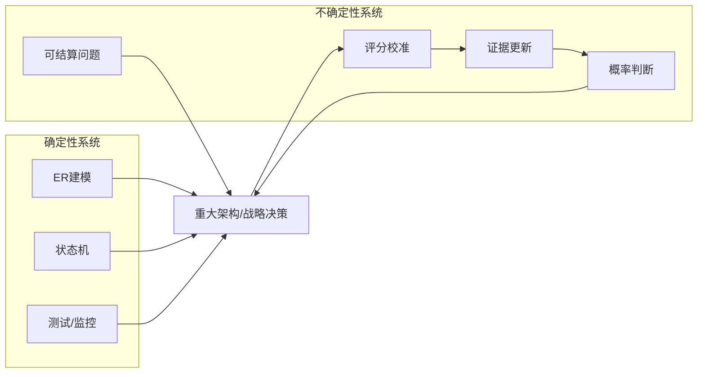

# 《超预测》沈老师视角建模
> 2026-05-28 · 基于 `book25H2/temp_extract` 正文 · 读书分析引擎 v3.4

## 1. Pre-Step：章节分组扫描（新书时）

章节依赖图：

推荐分组：

- 第一批：第1-4章，合并建模。原因：没有“为什么要预测、为什么专家会错、如何评分、超级预测是否真实”这四个前提，后面的操作方法没有可信基础。
- 第二批：第5-8章，合并建模。原因：这几章共同构成个人预测操作系统，拆开会丢掉“分解、量化、更新、练习”的闭环。
- 第三批：第9-10章，合并建模。原因：个人能力如何进入团队和领导系统，是同一个组织设计问题。
- 第四批：第11-12章 + 附录，合并建模。原因：边界、制度化和十诫共同回答“这个方法能推到多远，如何长期落地”。

每批的核心问题：

- 第一批回答：预测为什么必须从“观点表达”变成“可检验记录”？
- 第二批回答：一个人如何把模糊判断加工成可校准的概率判断？
- 第三批回答：组织如何让多人预测变准，而不是变成共识幻觉？
- 第四批回答：超级预测的适用边界在哪里，怎样把它变成组织能力？

本次建模选择：全书统一建模。理由是全书不是并列技巧清单，而是同一个因果系统的四层结构：问题定义层、个人算法层、组织协作层、制度反馈层。拆开读会导致模型只剩技巧，失去反馈闭环。

## 2. 读前诊断

这本书的类型：概念书 + 工具书 + 论证书。

它表面上讲“谁预测得准”，实际在建立一套判断质量控制系统：

- 概念书：把“预测”从天赋、名气、口才中剥离出来，定义成可测量技能。
- 工具书：给出分解问题、使用基础率、概率表达、持续更新、复盘反馈的方法。
- 论证书：用预测比赛和专家研究证明，高质量判断不是神秘直觉，而是可训练流程。

我想从这本书提取什么：

- 一套判断标准：什么时候一个预测值得信任？
- 一个操作流程：我自己做不确定性判断时怎么走？
- 一个组织模型：团队和领导如何让预测质量上升，而不是被权威和共识污染？

## 3. Step 0：骨架提取

### 全书ER骨架

核心节点不是“超级预测家”，而是“预测记录”。因为只要预测没有被写成可结算记录，就没有评分；没有评分，就没有反馈；没有反馈，就没有训练；没有训练，所谓经验只会把信心养大，不一定把准确率养大。

### 全书因果回路

完成标志：看着这张图，能知道这本书的底层机制不是“聪明人猜得准”，而是“把判断放进可计量反馈回路里训练”。

## 4. Step 1：概念速览

- 预测：对未来某个可判定事件给出概率判断。比如“未来12个月某服务SLA是否低于99.9%”是预测，“这个服务未来风险很大”不是预测。→ 进Step 2
- 可结算问题：问题写法必须让事后能判定发生或没发生。没有时间边界、事件边界和结算规则，就只是观点。→ 进Step 2
- 布莱尔得分：衡量概率预测准确性的损失函数，越低越好。它惩罚自信但错误，也区分“60%正确”和“90%正确”的质量差异。→ 进Step 2
- 校准：你说70%会发生的一批事，最后大约70%真的发生。校准不是“每次都猜中”，而是信心和真实频率匹配。→ 进Step 2
- 分辨率：不仅信心匹配，还能把不同事件区分开。永远说50%可能很校准，但没有信息量。→ 进Step 2
- 外部视角：先看同类事情的历史基础率，不急着沉迷本案细节。比如估项目延期，先看类似项目历史延期率。
- 内部视角：再用本案的特殊信息修正基础率。比如这个项目团队换了负责人、需求冻结程度更高，所以从基础率上调或下调。
- 费米分解：把大问题拆成能估的小问题。不是为了算得精确，而是逼自己暴露假设。
- 蜻蜓式预测：像复眼一样并行吸收多个视角，再合成判断。重点不是“观点多”，而是视角之间尽量独立。
- 更新：新证据到来后主动调整概率。判断力不只体现在初始预测，更体现在更新幅度是否合适。→ 进Step 2
- 永远的贝塔：把自己当成可迭代系统，持续试错、反馈、修正。不是人格谦虚，是训练机制。
- 超级团队：团队通过独立判断、互相挑战和信息共享提高准确率；如果只追求一致，会变成团体思维。→ 进Step 2
- 任务导向指挥：领导者明确目标和边界，把判断空间交给一线。它解决的是“不确定环境下，集中控制会变慢”的问题。
- 黑天鹅边界：有些事件无法稳定预测，但这不等于所有预测都无效。关键是区分问题是否可被拆解、评分和更新。→ 进Step 2

## 5. Step 2：实例裁判循环（含执行清单）

Step 2待执行清单：

- ☑ 预测
- ☑ 可结算问题
- ☑ 布莱尔得分
- ☑ 校准
- ☑ 分辨率
- ☑ 更新
- ☑ 超级团队
- ☑ 黑天鹅边界

---

【预测】

正例：我判断“未来30天内，核心支付链路会出现一次P0故障”的概率是15%，并记录时间、理由和触发条件。→ 属于预测，因为它有事件边界、时间边界和概率。

边界例：我判断“支付链路未来一段时间不太稳”。→ 不算严格预测，只是风险感受。它可以作为预测原料，但还没有变成可检验判断。

反例伪装：我说“支付链路必然会在某天出事，因为技术债太多”。→ 表面很坚定，实际不一定是好预测。没有概率、时间范围和结算规则时，坚定只是语气，不是预测质量。

陷阱说明：很多人会把“有判断”误认为“有预测”，因为两者都在谈未来。但预测必须能被事后评分，否则只是语言表演。

边界定义（一句话）：预测 = 对一个可判定未来事件给出带时间边界的概率判断。

☑ 预测 完成

---

【可结算问题】

正例：“到2026-12-31，A产品月活是否超过100万，以后台统计口径为准。”→ 可结算，因为事件、时间、数据口径都明确。

边界例：“A产品今年能否成功？”→ 不可直接结算。除非先定义成功是收入、留存、月活还是战略价值。

反例伪装：“A产品今年会获得市场认可。”→ 看似商业问题，实际无法评分。不同人可以事后把“认可”解释成媒体报道、客户访谈或销售线索。

陷阱说明：模糊问题最危险，因为它让预测者永远有退路。结果好时说自己预测对了，结果坏时说别人理解错了。

边界定义（一句话）：可结算问题 = 事前写清楚“什么算发生、何时结算、用什么口径判断”的问题。

☑ 可结算问题 完成

---

【布莱尔得分】

正例：我给“某事件会发生”80%，最后发生了，损失较低；如果最后没发生，损失很高。→ 布莱尔得分会奖励正确的高信心，也惩罚错误的高信心。

边界例：两个人都预测事件会发生，一个给51%，一个给90%，最后发生了。谁更好？→ 通常90%更好，因为他不仅方向对，而且更敢表达强信号。但如果长期总是90%而命中率只有60%，就会被校准指标惩罚。

反例伪装：一个人总说50%，很多时候看起来“不犯错”。→ 这不是好预测。50%降低了被打脸的风险，但几乎不提供决策信息。

陷阱说明：很多组织只记“对/错”，不记概率，这会把60%判断和95%判断压成同一种结果，训练信号被毁掉。

边界定义（一句话）：布莱尔得分 = 把概率判断和最终结果之间的距离变成损失函数，让预测质量可以比较。

☑ 布莱尔得分 完成

---

【校准】

正例：某预测者所有给70%的事件中，长期约70%发生。→ 校准好。

边界例：一个预测者今年10个90%事件全发生了，他校准好吗？→ 不能立刻下结论。样本太小，而且只看90%档位不够，要看长期多档位。

反例伪装：一个预测者10次猜中8次，所以校准好。→ 不一定。若他每次都给99%，但只中80%，就是过度自信。

陷阱说明：准确率回答“方向对不对”，校准回答“信心有没有过头”。领导和专家最容易在这里翻车：方向大体对，但信心表达严重超标。

边界定义（一句话）：校准 = 概率语言和现实频率之间的匹配程度。

☑ 校准 完成

---

【分辨率】

正例：面对10个问题，预测者能把强信号事件给80%-90%，弱信号事件给20%-30%，且长期表现符合。→ 分辨率高。

边界例：一个预测者全部给45%-55%，长期校准不错。→ 校准可能还行，但分辨率低，对决策帮助小。

反例伪装：一个预测者经常给极端概率，显得很有洞察。→ 如果极端概率没有长期命中支撑，就是过度自信，不是高分辨率。

陷阱说明：好预测不是“保守就行”。如果模型永远不敢拉开概率，它保护了面子，但没有减少决策不确定性。

边界定义（一句话）：分辨率 = 在保持校准的前提下，把不同风险强度区分出来的能力。

☑ 分辨率 完成

---

【更新】

正例：原本判断“某政策三个月内出台”概率40%，后来出现正式征求意见稿，把概率更新到70%，并记录更新理由。→ 合格更新。

边界例：新闻出现一条匿名爆料，要不要从40%更新到70%？→ 不一定。先判断消息源可靠性、是否独立、是否已经被市场吸收，再决定更新幅度。

反例伪装：每看到一条新闻就大幅改概率。→ 不是敏锐，是噪声驱动。更新不是摇摆，更新幅度要匹配证据诊断力。

陷阱说明：预测失败常见两种错：反应不足和反应过度。前者是新证据来了不动，后者是每个刺激都当成结构性变化。

边界定义（一句话）：更新 = 根据新证据的独立性和诊断力，调整概率到新的合理位置。

☑ 更新 完成

---

【超级团队】

正例：每个人先独立预测，再共享理由，互相挑战假设，最后聚合。→ 这是能提高准确率的团队预测。

边界例：团队开会讨论后达成一个共识概率。→ 可能有效，也可能无效。关键看独立判断是否被保留，少数意见是否被认真处理。

反例伪装：团队气氛很好，大家很快一致认为某事80%会发生。→ 高风险。舒服的一致性可能是团体思维，不是群体智慧。

陷阱说明：团队不是天然比个人强。团队只有在“独立性 + 多样信息 + 质疑规范 + 聚合机制”存在时才放大判断力，否则只会放大权威偏差。

边界定义（一句话）：超级团队 = 用规则保护独立思考，再用协作聚合信息的预测系统。

☑ 超级团队 完成

---

【黑天鹅边界】

正例：预测“未来一年某国是否举行提前选举”可以拆解、找基础率、跟踪证据，适合超预测方法。

边界例：预测“未来十年是否出现一种彻底改变世界的新技术”。→ 部分可讨论，但很难稳定评分和更新，越靠近未知未知，方法越弱。

反例伪装：因为黑天鹅存在，所以所有预测都没意义。→ 错。黑天鹅提醒边界，不是取消中短期、可定义问题的预测价值。

陷阱说明：塔勒布式警告针对的是对极端不确定性的过度模型化；泰洛克式训练针对的是可定义问题里的概率判断。二者不是互相消灭，而是分工。

边界定义（一句话）：黑天鹅边界 = 当问题无法稳定定义、缺少参考类别、无法持续反馈时，预测训练的收益会快速下降。

☑ 黑天鹅边界 完成

---

Step 2完成确认：☑ 预测  ☑ 可结算问题  ☑ 布莱尔得分  ☑ 校准  ☑ 分辨率  ☑ 更新  ☑ 超级团队  ☑ 黑天鹅边界

## 6. Step 3：结构可视化（含差异列表）

### 预测操作状态机

### 组织预测结构图

差异列表：

【原文有、图里没有】

- 比尔·弗莱克、阿拉法特、本·拉登、猪湾事件、毛奇、艾森豪威尔、苏格兰公投等案例没有逐一进入图。它们在图里被压缩为“问题定义、基础率、更新、团队、领导、结算”这些操作节点。
- 附录“十诫”的具体措辞没有逐条呈现。它们被吸收到 Step 4 的流程和失效边界里。
- 作者与卡尼曼、塔勒布的思想关系没有展开成思想史，只保留为“黑天鹅边界”。

【图里有、原文没明说的推论】

- 我把全书建模成一个“判断质量控制系统”，原文更多是研究叙事 + 案例讲解，不直接使用这个系统工程表述。
- 我把“预测记录”定为中心实体，这是从沈老师的ER建模视角推出来的。原文强调超级预测家，但按可操作性看，训练闭环真正依赖的是可记录、可评分的数据结构。
- 我把团队和领导放在同一个组织反馈环里。原文分章讲团队和领导，这里推断它们共同解决“预测质量如何进入组织行动”的问题。

## 7. Step 4：可执行模型

核心机制（一句话）：

预测质量不是来自名气、直觉或知识量，而是来自一个闭环：把未来判断写成可结算概率，持续更新，事后评分，再用反馈修正下一次判断。

触发条件 → 结果：

- 当预测没有时间边界和结算口径时 → 无法评分，经验不会转化为能力。
- 当预测只用“可能、大概、趋势”这类词时 → 后视偏差会吞掉反馈。
- 当只看本案细节、不看基础率时 → 内部视角会把特殊性放大。
- 当看到新证据却不更新时 → 原预测会变成过期缓存。
- 当团队先讨论再个人判断时 → 权威和共识会污染独立信息。
- 当领导者只要确定答案、不允许概率表达时 → 组织会奖励自信表演，惩罚诚实判断。

### 诊断方向：判断一个预测能不能信

### 预防方向：自己正在做一个不确定性判断

失效边界：

- 问题无法定义清楚，且无法约定结算口径时，不适合进入完整预测流程。
- 时间跨度太长、变量机制会变、参考类别不稳定时，概率精度要降低，更多用于场景规划而不是单点判断。
- 极端尾部事件、未知未知、范式突变，不能靠布莱尔得分式训练完全解决。
- 有明确确定性答案的问题，不需要预测流程，直接查事实、跑实验或用规则。
- 组织不允许记录错误、不允许概率语言、不允许事后评分时，超级预测无法制度化，只能停留在个人习惯。

## 8. Step 5：接入已有体系

【同构】与“线上系统可观测性 + 模型训练闭环”同构，结构是：

- 预测问题 = 线上SLO定义。必须明确口径，否则监控无意义。
- 预测记录 = 日志。没有日志就没有复盘。
- 布莱尔得分 = loss function。它让“判断质量”从感觉变成可优化指标。
- 校准 = SLO达成率与告警阈值匹配。告警说P1，实际只是P3，就是校准差。
- 更新 = 模型再训练或配置热更新。新证据来了，旧参数必须动。
- 复盘 = incident review。目的不是找人背锅，而是修正系统。

正向迁移：用线上系统的逻辑处理预测，就会推出一条硬规则：凡是影响重大决策的预测，都必须有“问题定义、概率、理由、时间戳、结算规则、复盘记录”。没有这些字段，就像没有trace id的线上故障，事后只能吵架，不能定位。

反向迁移：用《超预测》的逻辑反过来改造架构决策，可以推出一个新动作：重大架构判断不要只写“推荐方案A”，而要写“我判断A在12个月内支撑3倍流量且不重构的概率是65%，主要失败条件是X/Y/Z”。三个月后更新概率，半年后结算。这会把架构师的判断力从口碑变成可训练资产。

【互补】填补了已有体系中“不确定性判断如何训练”的空缺。

原来我熟悉的是确定性系统：ER图、状态机、接口契约、测试、监控。问题是，架构和战略里大量判断不是确定性的：某技术路线会不会成熟、某团队能不能交付、某市场窗口会不会关闭。《超预测》补上的是不确定性系统的训练方法：不是追求确定答案，而是把不确定判断纳入记录、评分和更新。

【矛盾】与“专家经验”在信任来源上存在张力。

专家经验的默认逻辑是：履历越强、领域越深、表达越自信，越值得信。超预测的逻辑是：是否值得信，要看历史预测记录、校准和分辨率。

条件差异：

- 在有确定知识和稳定规则的领域，专家经验很有价值，例如数据库隔离级别、编译器错误、法规条文。
- 在复杂开放系统里，专家经验容易变成叙事优势，不一定转化为预测优势，例如地缘政治、市场变化、组织转型。

解决：确定性问题尊重专家规则，不确定性问题要求专家也进入预测记录和评分系统。

【矛盾】与“黑天鹅不可预测”在边界上存在张力。

超预测说：很多看似复杂的问题可以预测得比随机好。黑天鹅说：真正改变系统的事件常常超出模型和历史样本。

条件差异：

- 中短期、可定义、可跟踪、有反馈的问题，超预测有效。
- 极端尾部、未知未知、长周期范式变化，超预测只能降低局部错误，不能消灭根本不确定性。

解决：把预测系统当成仪表盘，不当成水晶球。仪表盘能提高驾驶质量，但不能保证路上没有塌方。

【更新图】

## 9. 建模完成自检

- [x] 不看原文，只看图，能复原核心逻辑：预测必须进入可记录、可评分、可更新的反馈闭环。
- [x] 给一个新情境，能用flowchart得出结论：专家判断是否可信，先看问题是否可结算、概率是否记录、历史是否评分。
- [x] Step 2执行清单已全部打勾，无跳过。
- [x] Step 3的差异列表已输出。
- [x] Step 4的flowchart入口是具体工作场景，不是抽象现象。
- [x] Step 5的同构分析包含了反向迁移。
- [x] 输出章节结构符合固定列表，没有自行添加“作者背景”“扩展思考”等章节。
- [x] 一句话总结能作为触发信号：三个月后遇到专家预测、架构判断、战略判断时，能想起这套模型。

## 10. 一句话总结

当你听到一个专家、团队或自己说“这事大概率会发生”时，先别问他说得有没有道理，先问它能不能被写成“事件+时间+口径+概率+结算规则”：写不出来就是观点，写出来、能评分、会更新，才是可以训练和信任的预测。
