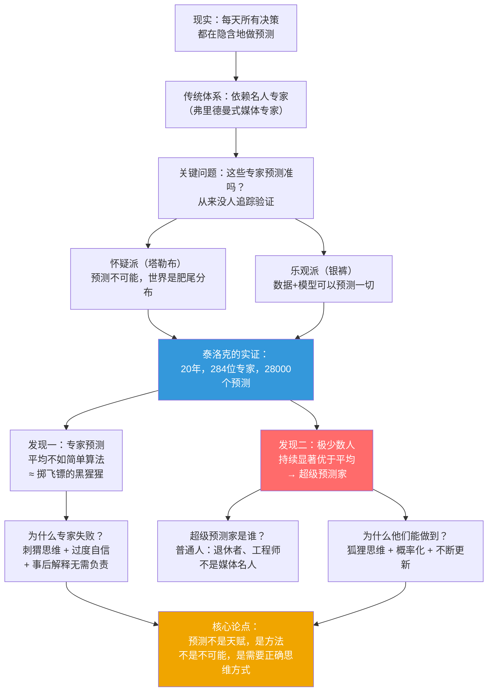
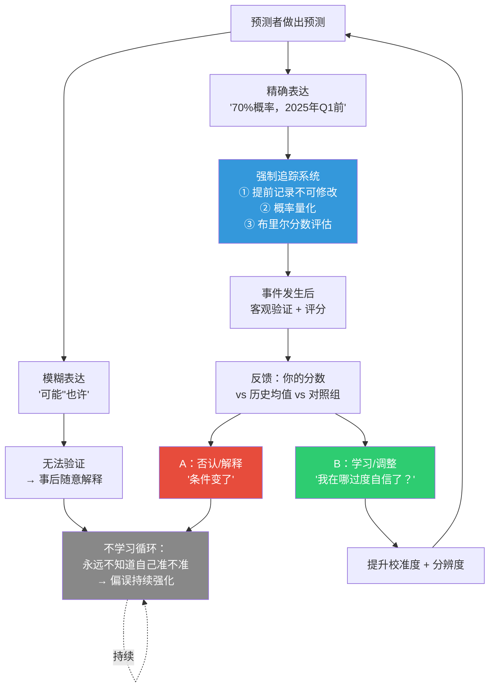
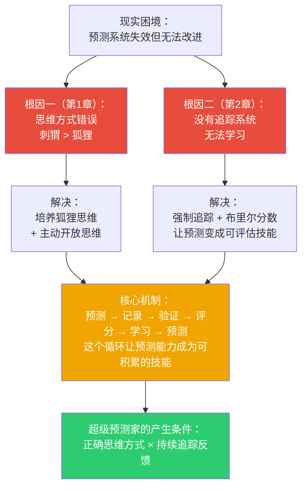
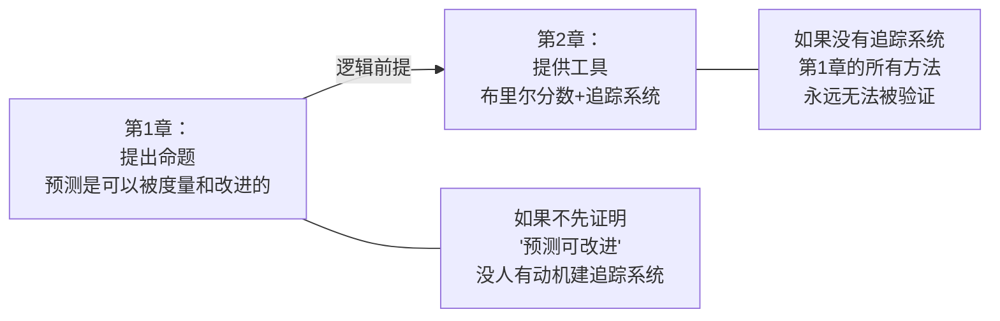
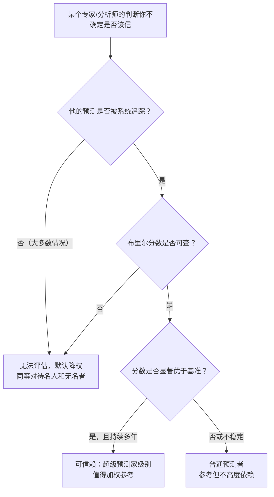
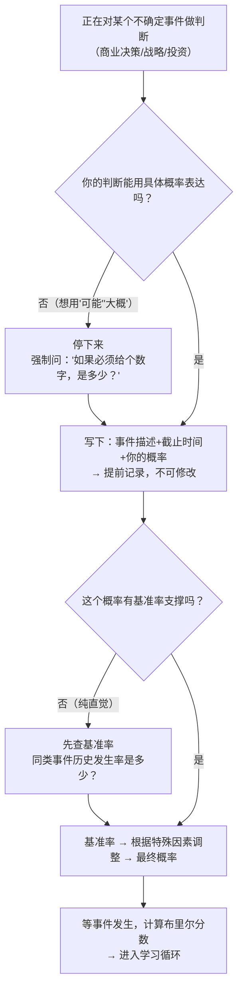

# 《超预测：预见未来的艺术和科学》前两章建模
> 沈老师视角 · v3.1 · 2026-03-30

> 书是原料，你是工厂。产出不是总结，是下次遇到这个情境时能自动触发的判断。

---

## 读前诊断（Pre-read，2分钟）

**① 这是什么类型的书？**

**论证书**——作者（菲利普·泰洛克）为一个核心论点提供实证支撑：**预测能力不是天赋，是可以被系统性培养的方法论产物**。前两章的结构是：先破（专家预测系统失效），再立（用度量工具重建可信的预测体系）。

**② 我想从这两章里提取什么？**

- 一套**判断标准**：如何区分"真正有用的预测"和"看起来权威但实际无法验证的预测"
- 一个**操作工具**：布里尔分数——把模糊的判断力变成可量化的技能
- 一个**元认知框架**：为什么追踪是进步的唯一路径（不只是预测领域，任何技能领域都成立）

---

## Step 0：骨架提取

**问题类型**：两章回答的是不同层面的问题，需要两张图。

- 第1章：谁和谁有关系、为什么专家失效 → **ER图 + 因果结构**
- 第2章：为什么会自我维持（专家的无效循环）+ 如何破解 → **因果回路图（CLD）**

### 骨架图一：第1章——预测失效的实体关系



### 骨架图二：第2章——追踪系统的反馈环（CLD）



> **完成标志**：看着两张图，对这两章有60%的直觉——第1章是"发现问题"，第2章是"建立基础设施"。

---

## Step 1：概念速览

- **专家预测失效**：不是"专家不聪明"，而是"专家的聪明被刺猬思维和事后解释能力抵消了"。专家在解释过去时有价值，但在预测未来时常常不如简单算法。→ **进Step 2**（边界：专家在什么条件下预测才可靠？）

- **刺猬 vs 狐狸（伯林分类法）**：刺猬用一个大理论解释一切（马克思主义者、奥地利学派）；狐狸多视角、根据情况调整、接受矛盾。实证结果：刺猬预测比随机还差，狐狸显著优于平均。→ **进Step 2**（边界：刺猬在简单系统里有效，比如物理学；在复杂系统才失效）

- **超级预测家（Superforecaster）**：在大规模预测竞赛中持续位于前2%的普通人。不是高智商，不是内部消息，不是领域专家——是思维方式不同。→ **进Step 2**（边界：一次好成绩 vs 持续多年的好成绩）

- **布里尔分数（Brier Score）**：`BS = (预测概率 - 实际结果)²`，范围[0,2]，0为完美。不是对错率，而是"概率判断质量"的度量——奖励诚实的不确定性，严惩过度自信。→ **进Step 2**（边界：60%预测对了，和99%预测对了，布里尔分数完全不同）

- **校准度（Calibration）**：当你说60%时，是不是真的60%概率发生？长期校准良好 = 不撒谎。→ **进Step 2**（边界：校准≠分辨度）

- **分辨度（Resolution）**：你能区分"非常可能"和"不太可能"吗？永远说50%的人校准完美但分辨度为零。→ **进Step 2**（与校准度一起裁判）

- **可验证性（Verifiability）**：一个预测必须满足：变量明确、时间明确、概率量化、结果可客观判断。否则永远可以事后解释。

- **事后诸葛亮偏误（Hindsight Bias）**：事情发生后，大脑自动重写记忆，觉得"我早就知道"。这让不追踪的预测者永远学不会——因为他们不承认自己错了。

---

## Step 2：实例裁判循环

### 【刺猬 vs 狐狸】

**正例（刺猬）**：
一位奥地利经济学派学者，认为政府干预必然导致通胀和经济崩溃。2008年金融危机后美联储大规模QE，他预测"恶性通胀即将来临"（2010年）。结果：通胀始终温和，他持续预测通胀来临并持续错误，但每次都有新理由解释为什么"这次推迟了但迟早会来"。→ **典型刺猬**：理论不可被证伪，反例被事后解释吸收。

**边界例**：
一位量子物理学家用标准模型预测粒子行为，高度确定，不接受外来干扰。他是刺猬吗？→ **不是**。刺猬思维在简单、封闭、有精确数学规律的系统里是正确的——量子物理满足这些条件。刺猬失效的条件是：**复杂社会系统，反馈迟缓，变量互相影响**。同样的确定性思维，物理学里有效，地缘政治里失效。边界精确在：**系统的封闭性和可测量性**。

**反例伪装（看起来是狐狸，其实是刺猬）**：
一位政治分析师声称"我综合经济、历史、文化多个视角"，但最终结论永远是"美国霸权不可撼动"。无论什么新信息，都被解释为"支持这个结论或短期波动"。→ **实质上是刺猬**：多视角只是装饰，核心结论从不更新。区别刺猬和狐狸的不是"引用了多少角度"，而是**当证据指向相反结论时，是否真的更新信念**。

**陷阱说明**：很多人误以为刺猬=固执/蠢，狐狸=开明/聪明。实际上刺猬往往非常聪明，理论非常深刻（想想马克思），问题不在智识，在**认识论**——把理论当身份认同，而非当假说。

**边界定义（一句话）**：刺猬是把"我的理论解释一切"当作信仰保护的人；狐狸是把"我的理论"当作可替换假说的人——区别不在智商，在当反证出现时的行为模式。

---

### 【布里尔分数 vs 准确率】

**正例（布里尔分数的价值）**：
预测者A：预测"明天下雨概率70%"，结果下雨。BS = (0.7-1)² = 0.09
预测者B：预测"明天下雨概率99%"，结果下雨。BS = (0.99-1)² = 0.0001
→ B的分数更好，但B承担了更大风险。如果错了：B的BS = (0.99-0)² = 0.98（灾难性）

→ **布里尔分数正确反映了这个区别**，简单准确率（两人都"对了"）无法区分。

**边界例**：
一个人长期预测所有事情都是50%概率，从不偏移。他的布里尔分数 ≈ 0.25（因为50%预测某事发生，如果没发生，BS = 0.25）。他的校准度完美，分辨度为零。他是好的预测者吗？→ **不是，但他比随机猜测（BS≈0.5）好**，而且他完全诚实。布里尔分数确实给他打了"勉强及格"而非"优秀"——这是正确的。边界在：0.25是"诚实的无知"，0.15以下才是"有判断力"。

**反例伪装**：
一个人在预测竞赛里布里尔分数很低（0.12），每次都对。你说他是超级预测家。→ **需要核查**：如果竞赛只有10个样本，极低分可能是运气。超级预测家的定义需要**大样本 + 持续多年**。单次竞赛的低布里尔分数不足以认定。

**陷阱说明**：很多人误以为"预测对了就是好预测"。但预测"99%会发生"然后发生了，不比预测"70%会发生"然后发生了强多少——区别在于谁承担了多少风险，谁诚实表达了多少不确定性。布里尔分数的核心是**惩罚过度自信，不只是奖励正确**。

**边界定义（一句话）**：布里尔分数度量的是"概率判断和现实的距离"，不是"对错"——一个自信犯错的人，比一个谨慎犯错的人得到更严厉的惩罚，因为前者不诚实表达不确定性。

---

### 【校准度 vs 分辨度】

**正例（高校准、高分辨）**：
超级预测家对简单问题给90%，对复杂问题给55%。长期来看，他给90%的事有90%真的发生了，给55%的事有55%真的发生了。且他愿意说出高概率或低概率（不缩水到50%）。→ **理想状态**。

**边界例（高校准、低分辨）**：
气象局预报员在所有预报中，只要不确定就给50%，确定时给90%。他的校准度极好，但分辨度很低（大量50%预报没有信息量）。BS ≈ 0.23。他是好预测者吗？→ **在校准维度是，在分辨度维度不是**。他对外宣称"我的预报很准"（校准角度是真的），但他实际上传递的信息量很少。

**反例伪装（高分辨、低校准）**：
一个大胆的分析师，从不说50%——总是说90%或10%。他的分辨度很高，但实际上他说90%的事只有60%发生了（过度自信）。→ **这是危险的**：看起来有判断力，但实际上系统性过度自信，布里尔分数会很差（因为过度自信被严厉惩罚）。

**陷阱说明**：很多人把"敢于给出明确判断"误认为是好预测者的标志。敢说90%不是优点——诚实地说90%（当真的有90%把握时）才是优点。区别在于：你的90%有没有被校准验证过。

**边界定义（一句话）**：校准是"你说多少，现实就有多少"的诚实度；分辨度是"你敢不敢在真有把握时说高概率"的判断力——两者缺一不可，但大多数人缺的是校准而非分辨度。

---

## Step 3：结构可视化

### 两章联动的核心逻辑图



### 为什么第1章必须在第2章之前



**差异列表：**

```
【原文有、图里没有体现的】
- 泰洛克实验的规模数据：20年/284位专家/28000预测（图里简化了）
- GJP（优秀判断力项目）与情报机构IARPA的关系（政府背景）
- 布里尔分数的分解公式：BS = 校准度损失 + 分辨度损失 + 不确定性基准
- 事后诸葛亮偏误的神经科学机制（大脑主动重写记忆）

【图里有、原文没明说的推论】
- 两章是"诊断系统"的两个层面：第1章是症状诊断，第2章是基础设施建设
- 校准和分辨度的权衡：如果只能改进一个，优先改进校准（因为过度自信比谨慎犯错更危险）
- 追踪系统本身就是干预：一旦知道会被评分，行为立刻改变（类似OKR的"观察者效应"）
```

---

## Step 4：可执行模型

### 核心机制（一句话）

**预测能力的本质是反馈循环的密度**——追踪越精确、反馈越快、样本量越大，判断力提升越快；不追踪=零学习，跟做了多少预测无关。

### 触发条件 → 结果

- 当面对不确定性判断 → 强制用数字（0-100%）而非模糊词，否则永远无法学习
- 当有人说"我早就知道" → 问"你提前写下来了吗？"——没有 = 事后诸葛亮偏误
- 当评估一个"专家"的可信度 → 问"他的预测被追踪了吗？布里尔分数是多少？"——没有追踪 = 无法评估
- 当发现自己总是对的 → 警惕：可能是样本太小，或者你在问可验证性差的问题

### 诊断方向（遇到问题时）



### 预防方向（自己做判断时）



### 失效边界

- 黑天鹅事件（定义上不可预测）不适用——但可以预测"是否处于肥尾分布领域"
- 需要极快反应的场景（急诊、战场）不适用——直觉在此有价值
- 纯价值判断（"应该怎样"）不适用——布里尔分数只能评估事实判断
- 时间线超过10年的预测：反馈太慢，学习循环失效

---

## Step 5：接入已有体系

### 【同构】

**与德鲁克"有效性可学习"同构**
- 德鲁克：管理能力不是天赋，是可以通过记录时间、设定目标、持续反馈来培养的实践
- 泰洛克：预测能力不是天赋，是可以通过记录预测、量化评估、持续更新来培养的技能
- 相同底层结构：**追踪 → 觉察 → 调整**

  **正向迁移**：德鲁克的"时间日志"逻辑可以直接搬到预测管理——建立"预测日志"，记录决策前的判断、事后的结果、误差分析
  **反向迁移**：用泰洛克的"布里尔分数"逻辑，可以给德鲁克的管理效能建立量化指标——不只是"完成了吗"，而是"完成的概率判断对了吗"

**与卡尼曼"系统1 vs 系统2"同构**
- 刺猬思维 ≈ 系统1（快速、直觉、自信、不可被干预）
- 狐狸思维 ≈ 系统2（慢思考、分析、愿意修正）
- 差异：卡尼曼告诉你偏误是什么，泰洛克告诉你如何通过追踪系统对抗偏误

  **正向迁移**：卡尼曼的系统2激活技巧（放慢判断、用基准率、注意锚定效应）可以直接用于提升布里尔分数
  **反向迁移**：布里尔分数的反馈机制本身就是训练系统2介入的工具——长期追踪让系统1的"快判断"逐渐被校准

### 【互补】

- 填补了"如何对抗不确定性"的**操作层空缺**
- 卡尼曼：认知偏误是什么（诊断）
- 泰洛克：如何用追踪+布里尔分数对抗认知偏误（治疗）
- 两者合并：才是一个完整的"在不确定性下做高质量判断"的工具箱

### 【矛盾】

**与格拉德威尔《眨眼之间》存在张力**
- 格拉德威尔：直觉专家（消防队长、艺术鉴定师）在特定领域极度准确
- 泰洛克：专家预测在复杂问题上常常失败

  **条件差异解决矛盾**：
  - 直觉有效的条件：**重复性高、反馈快、模式固定**（象棋、消防、急诊）
  - 直觉失效的条件：**系统复杂、反馈延迟、存在随机成分**（地缘政治、股市、人事预测）
  - 两人都对，适用域不同

  **新推论**：用布里尔分数可以实证判断"这个人的直觉在这个领域是否可信"——而不是靠主观感觉。直觉好不好，追踪就知道了。

### 【更新图（Step 0版本）】

在原骨架图基础上，新增连接：
- 校准度 ↔ 分辨度：两者独立，相互补充，不可互相替代
- 追踪系统 → 事后诸葛亮偏误（负反馈环：追踪打破偏误）
- 刺猬思维 → 媒体曝光度（正相关）→ 公众信任度（正相关）→ 真实预测能力（负相关）——这是一个扭曲的激励结构

---

## 建模完成自检

- [x] 不看原文，只看图，能复原两章核心逻辑
- [x] 给一个新情境（如：如何评估某专家的可信度），能用flowchart得出结论
- [x] Step 1中所有标记"进Step 2"的概念都已执行，一个没漏
- [x] Step 3的差异列表已输出
- [x] Step 4的flowchart入口是具体工作场景（"正在对某个不确定事件做判断"），不是抽象现象
- [x] Step 5的同构分析包含了反向迁移
- [x] 一句话总结见下方

---

## 一句话总结（路由触发器）

> 当你发现自己在说"这件事我不确定，但感觉大概……"——如果没有提前写下来接受评分，你实际上什么都没学到；布里尔分数告诉你的不是"你对不对"，而是"你有没有诚实面对自己的不确定性"——过度自信的正确，不比谨慎的错误好多少。

**检验**：3个月后，当某个同事/合伙人说"我早就知道市场会这样"——你会想起这个模型，然后问："你当时写下来了吗？你的布里尔分数是多少？"能触发，合格。

---

## 沈老师元评论（两章联读视角）

两章合在一起看，它们解决的是同一个问题的两个层面：

**第1章**：证明了"预测是可以被评估的"——这是整本书的认识论基础。没有这个基础，任何方法论都是空谈，因为无法验证。

**第2章**：提供了"评估的工具"——布里尔分数+追踪系统。这是从哲学命题到工程实现的跳跃。

两章组合完成了一件事：**把"预测"从艺术变成了工程**。

从我的认知建模角度：

- **能画出来才算懂** → 泰洛克强迫预测者用数字表达，这就是"画出来"的预测版本。说不出概率的人，不算真正理解了这个问题的不确定性。

- **裁判 = 理解** → 做预测+接受布里尔分数评判，是建立判断力的唯一路径。被动学习"预测方法"，不如主动做100个预测+追踪结果。

- **孤岛知识会消失** → 不追踪的预测经验，不会累积成真正的判断力。大脑会自动把"错了的预测"重写成"我早就知道了"，损失的不只是这一次，是整个学习机会。

**这两章是全书的地基——后面所有的"超级预测方法"都依赖"预测可以被度量"这个前提。**

---

*前两章建模完成。核心：①预测是方法，不是天赋（第1章）；②改进依赖度量，度量依赖追踪（第2章）。两章合力：把预测从艺术变成可学习的工程技能。*

*书目：《超预测：预见未来的艺术和科学》· 菲利普·泰洛克 / 丹·加德纳 著*
