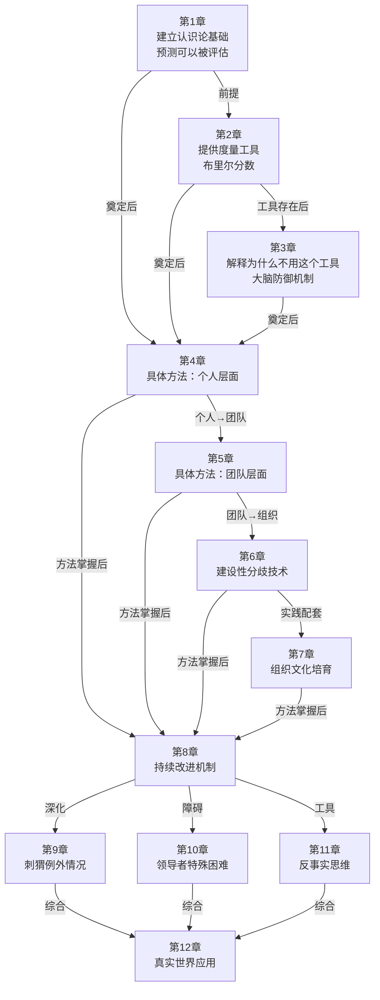
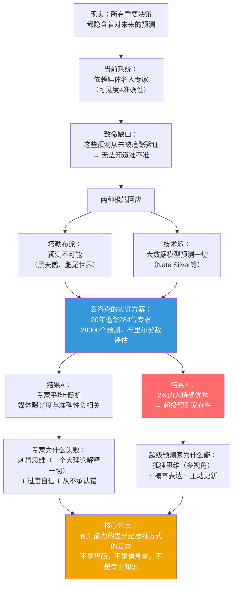
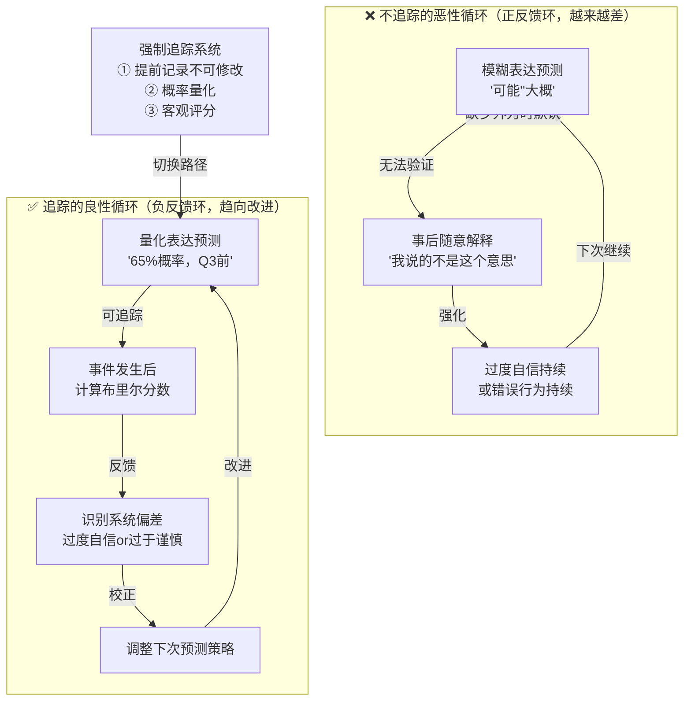
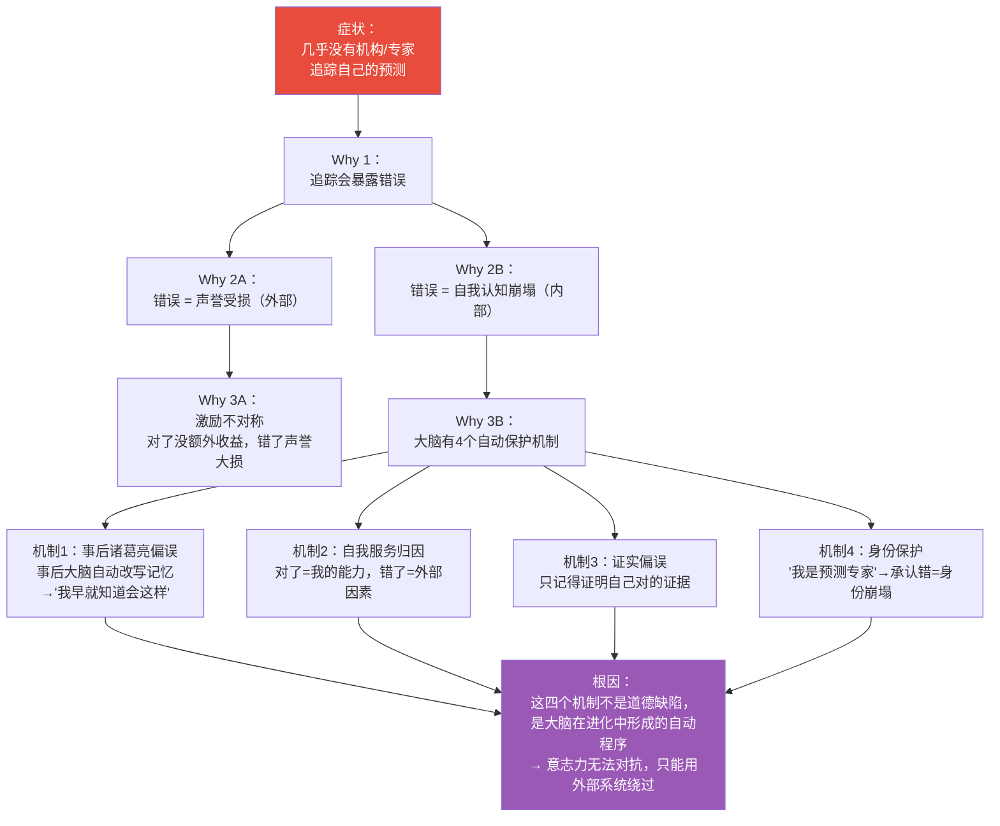
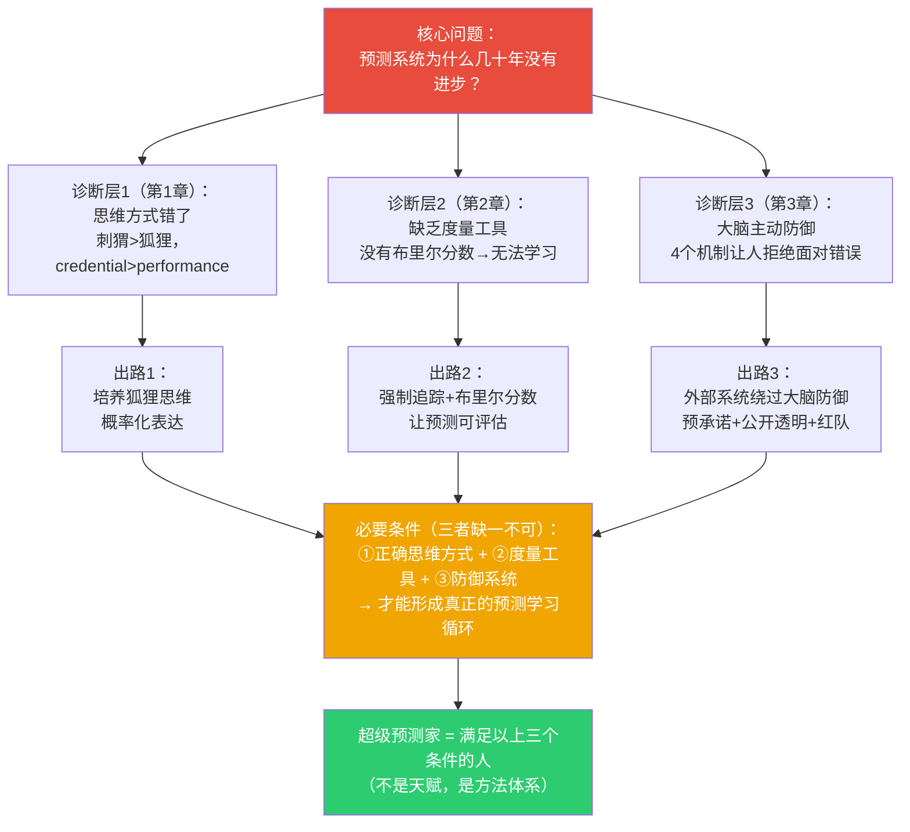
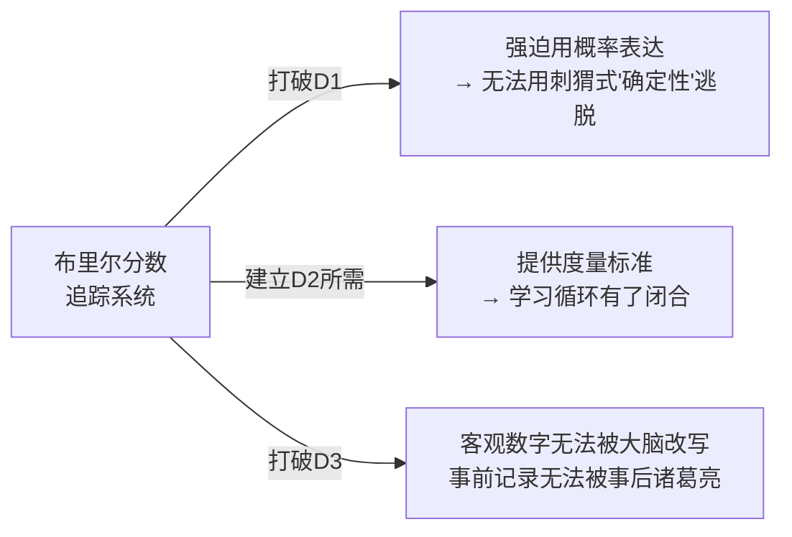
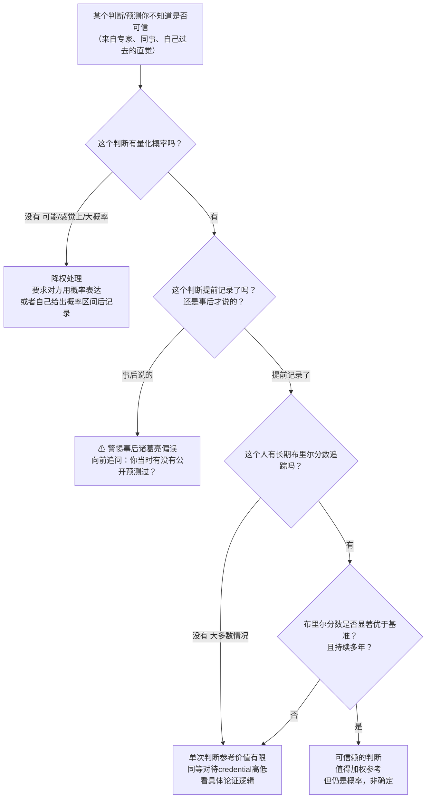

# 《超预测：预见未来的艺术和科学》建模
> 沈老师视角 · v3.2 · 2026-03-30

> 书是原料，你是工厂。章节是作者的单位，认知模型是你的单位。

---

## Pre-Step：章节分组扫描

**目录扫描结果（12章）：**

| 章节 | 标题 | 核心命题（一句话） |
|------|------|------------------|
| 第1章 | 乐观的怀疑论者 | 专家预测不准，但极少数人持续优秀——预测不是天赋，是方法 |
| 第2章 | 度量的关键 | 布里尔分数让预测从"无法验证"变成"可量化的技能" |
| 第3章 | 为什么我们抗拒追踪 | 大脑有系统性自我保护机制，阻止我们从预测错误中学习 |
| 第4章 | 超级预测家的画像 | 超级预测家用的具体方法：费米分解+外部视角+贝叶斯更新 |
| 第5章 | 超级团队的力量 | 正确组建的团队比个人预测准确25%，关键是独立+多样性 |
| 第6章 | 对话的艺术 | 建设性分歧的技术：找关键分歧点，而不是赢得争论 |
| 第7章 | 领导力：培养预测文化 | 领导者的任务是创造系统，而不是提供答案 |
| 第8章 | 永续学习 | 超级预测家的持续改进机制：刻意练习+反馈校准 |
| 第9章 | 超级刺猬 | 少数刺猬型专家也能持续准确——但有严格前提条件 |
| 第10章 | 领导者困境 | 越靠近权力中心，预测越不准——信息过滤+承诺陷阱 |
| 第11章 | 反事实思维 | "如果X没发生会怎样"——识别关键变量和决策节点 |
| 第12章 | 超越梦想：真实世界应用 | 方法在情报机构、商业、公共政策中的落地与边界 |

### 章节依赖图



### 推荐分组

```
第一批：第1-3章（合并）
合并原因：三章构成完整的"问题诊断单元"——
  第1章建立认识论（预测可以被评估），
  第2章提供工具（布里尔分数），
  第3章解释工具为何没被使用（大脑防御）。
  把第3章单独建模，读者不知道"防御机制"是在阻碍什么；
  把第2章单独建模，读者不知道"度量"为什么重要。
  分开任何一章，对应的模型都无法独立使用。
本批回答：为什么预测系统失效？以及，在知道工具的前提下，
          为什么还是没有人使用这个工具？

第二批：第4-7章（合并）
合并原因：四章是"解决方案的完整图谱"——
  第4章是个人方法，第5-6章是团队方法，第7章是组织落地。
  没有第4章，第5章的"团队如何放大个人"看不懂。
本批回答：超级预测家具体用什么方法？如何扩展到团队和组织？

第三批：第8-12章（可分可合，视阅读目标而定）
各章相对独立，但都以前两批的基础为前提。
第8章（如何持续改进）适合独立建模后直接实践。
第9-11章是对第4-7章结论的修正和边界，可合并为一批。
第12章是独立的应用综述，可单独建模。

→ 当前执行第一批（第1-3章）建模。
```

---

## 读前诊断

**① 书籍类型：论证书**

核心论点：预测能力不是天赋，是可学习的思维方式——泰洛克用20年实验证明这个命题。第1-3章是这个论证的地基：先证明"专家失效"（第1章），再提供"如何度量"（第2章），再解释"为什么没人度量"（第3章）。

**② 从这三章提取：**

- 一套**判断标准**：哪种"专家判断"值得信赖，哪种不值得
- 一个**操作工具**：布里尔分数的使用逻辑（不只是计算，是其背后的激励结构）
- 一个**元认知**：为什么聪明人也学不会预测——大脑的四个防御机制

---

## Step 0：骨架提取

三章各回答不同维度的问题，需要三种图。

**第1章问题**：谁和谁有关系、专家为什么失效 → **ER图 + 因果结构**

**第2章问题**：为什么会自我维持（不追踪→不学习→不改进的循环）→ **因果回路图（CLD，有闭合反馈环）**

**第3章问题**：根因是什么（大脑为什么拒绝追踪）→ **Why-Why树**

### 图一：第1章骨架——专家失效与超级预测家出现



### 图二：第2章骨架——追踪与不追踪的两个反馈环（CLD）

> ⚠ 以下是因果回路图，必须包含闭合反馈环。



### 图三：第3章骨架——为什么不追踪的Why-Why树



---

## Step 1：概念速览

- **专家（credential定义 vs performance定义）**：当前社会用"学历+职位+媒体曝光"定义专家，但泰洛克的实验用"可验证的预测准确性"定义。两种定义给出完全不同的人选，而且后者和前者的相关性接近零甚至负相关。→ **进Step 2**（边界：什么情况下credential专家的判断值得信赖？）

- **刺猬 vs 狐狸（伯林分类）**：刺猬用一个大理论框架解释一切，答案鲜明确定；狐狸用多视角、灵活调整，不给确定性答案。实证：刺猬预测不如随机，狐狸显著优于平均。→ **进Step 2**（边界：刺猬在简单封闭系统里有效，分类的关键判断标准是什么？）

- **超级预测家（Superforecaster）**：在大规模预测竞赛中持续进入前2%的普通人，不是高智商、不是内部消息、不是领域专家——是思维方式不同。→ **进Step 2**（边界：一次运气好 vs 持续多年的可重复优秀）

- **布里尔分数（Brier Score）**：`BS = (预测概率 - 实际结果)²`，范围[0,2]，0为完美。不是对错率，而是"概率判断质量"——奖励诚实的不确定性，严惩过度自信的错误。→ **进Step 2**（边界：60%对了 vs 99%对了，分数差很大）

- **校准度（Calibration）**：你说"70%"时，是否真的有70%概率发生？长期校准好 = 不系统性高估或低估自己的把握。

- **分辨度（Resolution）**：你能区分"很可能"和"有点可能"吗？永远说50%的人校准完美但分辨度为零——什么信息都没传递。→ **进Step 2**（和校准度合并裁判）

- **可验证性（Verifiability）**：预测必须满足4条：变量明确 + 时间明确 + 概率量化 + 结果可客观判断。任何一条缺失，预测者都能事后解释逃脱验证。

- **事后诸葛亮偏误（Hindsight Bias）**：事情发生后，大脑自动改写记忆，觉得"早就知道会这样"。这不是撒谎，是神经机制。唯一破解：提前记录，事后无法修改。→ **进Step 2**（边界：合理回溯学习 vs 事后诸葛亮的区别）

- **自我服务归因（Self-serving Attribution）**：对了归因为自己能力，错了归因为外部因素。导致永远不知道自己的方法哪里有效、哪里有缺陷。

- **证实偏误（Confirmation Bias）**：选择性记忆支持自己观点的证据，忽视反对证据。让两个持相反观点的人看同样的新闻流，都觉得"证明了自己对"。

- **预承诺（Pre-commitment）**：提前公开记录判断，制造无法事后修改的约束。破解事后诸葛亮偏误的唯一可靠机制。

---

## Step 2：实例裁判循环

```
Step 2 执行清单（从 Step 1 抄过来，逐条打勾）：
☑ 专家（credential vs performance定义）→ 已完成
☑ 刺猬 vs 狐狸 → 已完成
☑ 超级预测家 → 已完成
☑ 布里尔分数 → 已完成
☑ 校准度 + 分辨度（合并裁判）→ 已完成
☑ 事后诸葛亮偏误 → 已完成
```

---

### 【专家（credential vs performance定义）】

**正例（credential专家≠performance专家）**：
诺贝尔经济学奖得主保罗·克鲁格曼，1998年写道"互联网对经济的影响不会比传真机更大"。他的credential极高（诺贝尔奖、普林斯顿教授、NYT专栏），但这个预测在被追踪后，显示出他在这个具体问题上的判断严重失误。
→ **credential专家，但不是performance专家**。两种定义严重分离。

**边界例**：
一个没有经济学博士学位的货运公司财务分析师，追踪了5年自己的"下一季度运价涨跌"预测，布里尔分数0.17（优秀）。他是专家吗？
→ **是performance专家，不是credential专家**。在"运价短期走势"这个具体问题上，他比大多数经济学教授更值得信赖。边界精确在：**领域特异性**——他的performance只在这个具体预测类型上成立，不能推广到其他经济问题。

**反例伪装**：
一个内容创业者发了1000条"预测"帖子（"比特币要涨！""美联储要降息！"），事后发现80%都"说对了"。他是performance专家吗？
→ **不是**。原因：①没有提前量化概率，无法计算布里尔分数；②预测过于频繁，覆盖了所有可能性；③选择性展示对的，不展示错的。这是"伪追踪"，不是真正的performance评估。

**陷阱说明**：很多人把"对了很多次"误认为performance专家。但"对了多少"必须同时附带"错了多少"和"当时的概率是多少"才有意义——没有这三个数字，任何"我一直说对了"的声称都无法验证。

**边界定义（一句话）**：Credential专家是"被认可的人"，performance专家是"有可查记录的准确率的人"——只有后者才能被布里尔分数客观评估，也只有后者的判断才值得加权参考。

---

### 【刺猬 vs 狐狸】

**正例（典型刺猬）**：
一位马克思主义经济学家，认为资本主义内在矛盾必然导致崩溃。每次出现危机，他说"我说对了"；每次危机过去，他说"系统暂时自我修复，但崩溃是必然的，只是推迟了"。他的理论无法被证伪——任何结果都被吸收进理论框架。
→ **典型刺猬**：不是因为他笨，而是因为他的理论是"不可错误"的（unfalsifiable）。

**边界例**：
一位物理学家用广义相对论预测引力波的存在，99%确定，2015年被LIGO证实。他是刺猬吗？
→ **是刺猬行为，但在这个领域有效**。边界精确在：**系统类型**。物理学系统是封闭的、可重复的、规律可数学化的——在这类系统里，刺猬式的确定性是合理的。刺猬思维失效的条件是：**开放社会系统**，其中有人类行为（会被预测本身影响）、反馈迟缓、变量无法枚举。

**反例伪装（看起来是狐狸，实质是刺猬）**：
一位投资人声称"我综合基本面、技术面、宏观经济多维度分析"，但无论哪个维度，最终结论都是"A股长期牛市"。当数据不支持时，他说"这个指标这次失效了，但下一个指标支持"。
→ **实质是刺猬**：多视角只是论证手段，核心结论从不更新。真正的狐狸的标志不是"引用了多少维度"，而是**当多维度证据指向不同结论时，是否真的修改核心判断**。

**陷阱说明**：很多人以为刺猬=固执、愚蠢，狐狸=灵活、聪明。实际上：刺猬往往智识很强，理论很深刻；问题在于他们把理论当身份认同，而不是当可替换的假说。鉴别标准只有一个：当坚实的反证出现时，他会修正理论，还是修正对反证的解释？

**边界定义（一句话）**：刺猬是"把理论当保护的人"，狐狸是"把理论当工具的人"——区别不在于用了几个视角，而在于是否真的因为证据而改变核心判断。

---

### 【超级预测家】

**正例**：
Doug Lorch，退休IT工程师，参与GJP项目4年，布里尔分数持续在0.15左右（比情报分析员平均水平低30%以上，情报分析员有内部机密文件）。他没有政治学背景，使用公开信息，但对地缘政治问题的预测系统性优于受过专业训练的情报分析员。
→ **超级预测家**：持续、可验证、跨领域。

**边界例**：
一个人在2020年1月预测"COVID-19会导致全球大流行，美国会超过100万死亡"，结果精确命中。他是超级预测家吗？
→ **不确定，需要更多数据**。单次预测，即使再精准，无法判断是超级预测家还是运气极好的一次。超级预测家的定义要求：**大样本（数百个预测）×持续多年×统计显著优于基准**。这位预测者需要接受系统性追踪才能判断。

**反例伪装**：
一个对冲基金经理，某年度收益率200%，被媒体称为"预测天才"。他是超级预测家吗？
→ **不能确认**。原因：①投资收益率和预测准确性不是同一件事（运气、杠杆、市场时机都影响收益率）；②单年数据不能排除运气；③没有布里尔分数，无法评估概率判断质量。要判断他是否是超级预测家，需要看他对具体、可验证问题的概率预测记录，而不是看收益率。

**陷阱说明**：很多人把"预测某件大事的人"等同于"超级预测家"。但单次准确预测（哪怕是极罕见的大事件）无法证明系统性的预测能力——因为如果有一百万人各自做一个预测，总会有人碰巧说对了黑天鹅事件。超级预测家的核心是**统计上可重复的优越表现**。

**边界定义（一句话）**：超级预测家不是"预言过大事的人"，而是"在大量小问题上系统性优于基准，且这个优势经过了大样本统计检验"的人——能说对一件大事，不等于有可信的预测能力。

---

### 【布里尔分数】

**正例（布里尔分数的价值体现）**：
预测者A预测"2025年Q1美联储加息"概率60%，结果加息，BS = (0.6-1)² = 0.16。
预测者B预测同一事件概率95%，结果加息，BS = (0.95-1)² = 0.0025。
→ B的分数好得多——因为B更"押准了"，承担了更高的正确风险。但如果B错了：BS = (0.95-0)² = 0.9025（接近灾难）。布里尔分数正确反映了这个风险结构，而简单"对错率"无法区分A和B的判断质量。

**边界例**：
一个人长期预测所有问题都是"50%概率"，从不偏移。他的平均布里尔分数≈0.25（因为50%预测，如果事件发生，BS=0.25；不发生，BS=0.25）。他的布里尔分数比"什么都不做"好（随机猜测≈0.5），但被称为好预测者合适吗？
→ **不合适，但他没有撒谎**。布里尔分数给他"及格"是正确的——他诚实表达了"我不知道"。问题是分辨度为零，他没有传递任何信息。这个边界说明：布里尔分数评估诚实性，但不自动评估"有没有判断力"。后者需要看分辨度维度。

**反例伪装**：
一个人在一场预测竞赛里所有题都给99%或1%，都猜对了，布里尔分数接近0。他是优秀预测者吗？
→ **需要核查样本量**。如果只有10题，高度分化的全押对可能是运气（概率2^(-10)≈0.1%，1000人里有1人）。布里尔分数接近完美只有在大样本（数百题）下才有统计意义。

**陷阱说明**：很多人把布里尔分数理解为"给预测打分的工具"，用法是"我猜对了，所以分数低（好）"。实际核心是：**惩罚过度自信**——你猜对了但给了99%的概率，下次猜错时会被重罚；合理给70%，长期期望值反而更好。布里尔分数的激励是让你诚实面对自己的不确定性。

**边界定义（一句话）**：布里尔分数度量的不是"你对不对"，而是"你的不确定性表达和现实的距离"——过度自信的正确预测得分不如谨慎的正确预测，因为前者的策略在大样本下期望得分更差。

---

### 【校准度 + 分辨度（合并裁判）】

**正例（高校准+高分辨 = 超级预测家水平）**：
某预测者：对把握较大的问题给85%，对不确定的问题给55%。长期追踪：给85%的事有84%发生了，给55%的事有56%发生了。他既诚实（校准），又有判断力（分辨）。BS≈0.15。
→ **理想组合**。

**边界例（高校准+低分辨 = 诚实但无判断力）**：
一个人所有预测都给50-55%之间，从不给更极端的概率，即使面对显然更确定或不确定的问题。长期校准完美（给50%的事有50%发生），但BS≈0.24。他是好预测者吗？
→ **校准维度是，分辨度维度不是**。他没有撒谎，但他也没有提供信息。这类人"永远安全"——永远不会被惩罚为过度自信——但对使用他预测的人毫无帮助。校准和分辨度是独立的两个维度，两者都需要。

**反例伪装（高分辨+低校准 = 有判断力感觉但系统性偏误）**：
一个人在自己熟悉的领域频繁给95%+的概率，但实际命中率只有70%。他的预测总是感觉"有观点"（高分辨），但系统性过度自信（低校准）。BS≈0.35（很差）。
→ **貌似有判断力，实际是高风险的系统偏误**。这比永远说50%的人还差，因为他的错误是系统性的、可预测的偏高。

**陷阱说明**：很多人把"敢于给出明确判断"误认为是预测能力强的标志。"敢给95%"不是优点，"给了95%且长期准确率真的是95%"才是优点。区别在于：你的高概率预测有没有被校准验证过。

**边界定义（一句话）**：校准是"我说多少，现实就有多少"的诚实度量；分辨度是"我敢不敢在真有把握时说高概率"的判断力——超级预测家的特征是两者都高，而大多数人的问题是校准低（过度自信）而非分辨度低。

---

### 【事后诸葛亮偏误】

**正例（典型事后诸葛亮）**：
2008年金融危机后，大量经济学家、投资者、记者说"这明显是泡沫，任何看财务数据的人都能看出来"。但查2006-2007年的记录：99%的这些人当时没有公开预警，许多人还持有或推荐了次贷相关资产。
→ **典型事后诸葛亮**：记忆被改写，让他们"事后正确"，实际上事前完全没有这样的判断。

**边界例（合理的回溯学习 vs 事后诸葛亮）**：
一个分析师在2007年写道"次贷市场规模让我担忧，但不确定会不会系统性传导，给45%概率"，危机后他说"我当时低估了系统传导风险，这次学到：互联互通程度是关键变量"。他是事后诸葛亮吗？
→ **不是**。因为：①他有提前记录的文字，明确了他当时的判断和概率；②他的"学习"是在承认判断不够准确的基础上的修正，不是声称"早就知道"。区别在于：**有没有事前记录**。有记录的回溯是学习；没有记录的"事后我早就知道"是偏误。

**反例伪装（看起来在预测，实质是事后）**：
一个博主每天发10条对各种事件的模糊"观察"，事件发生后截图其中一条最接近的，配文"我早就说了"。
→ **纯事后诸葛亮**：没有事前量化概率，没有记录所有预测（包括错的），只展示"对"的样本。这是一种有意识的事后诸葛亮展示，比无意识的更危险，因为它系统性地欺骗观众。

**陷阱说明**：很多人以为"事后诸葛亮"是一种故意的自我吹嘘，其实大多数情况是大脑的自动神经过程——记忆真的被改写了，当事人不是在撒谎，而是真的"记得"自己当时就有这个判断。这让它特别难以对抗，因为意志力无法对抗神经机制，只能用提前记录的外部系统来绕过。

**边界定义（一句话）**：事后诸葛亮偏误不是撒谎，是大脑自动改写记忆的神经机制——一旦结果已知，大脑就重构"当时的判断"以与结果一致；唯一破解方法是提前用文字固定判断，让大脑无法改写。

---

## Step 3：结构可视化

### 三章联动的完整逻辑图



### 关键反馈结构（布里尔分数如何打破三个诊断）



**差异列表：**

```
【原文有、图里没有体现的内容】
- 泰洛克实验的历史背景：起源于1984年美苏核战担忧，政府资助
- GJP项目与IARPA（美国情报机构研究部门）的具体合作细节
- 媒体专家的激励结构：观点越鲜明，媒体曝光越多，形成刺猬的正向选择压力
- 布里尔分数的分解公式：BS = 校准损失 + 分辨度损失 + 不确定性基准（三部分各自可计算）
- 萨缪尔森-西蒙赌约（1980-1990）的完整案例
- IMF对希腊危机的预测追踪失败（具体数字：预测萎缩2.6%，实际萎缩25%）
- 事后诸葛亮偏误的神经科学机制（记忆重构的神经基础）

【图里有、原文没有明说的推论】
- 三层诊断是"必要且充分"的关系：仅靠改变思维方式（D1的出路）不够，因为没有工具（D2）就无法验证；仅有工具（D2的出路）不够，因为大脑防御（D3）会绕开工具
- 布里尔分数同时是D1/D2/D3三个问题的解药——这个中心性在书中没有被明确点出，是本图的推论
- 刺猬在媒体中更受欢迎（观点鲜明），这形成一个反向选择：越准确的预测者（狐狸）越不出名，越不准确（刺猬）越出名——这个悖论导致"社会可见的专家"不代表"准确的预测者"
```

---

## Step 4：可执行模型

**核心机制（一句话）**：
预测系统失效的根本原因是"无反馈循环"——不追踪→不知道错了→大脑改写记忆→更不想追踪——布里尔分数+预承诺是打破这个循环的外部楔子。

**触发条件 → 结果：**
- 当预测没有提前量化记录 → 事后诸葛亮偏误必然发生，学习循环无法启动
- 当预测用模糊语言表达（"可能""大概"）→ 永远无法验证，等于没有预测
- 当评估专家可信度时不看历史布里尔分数 → 默认在用credential定义，与accuracy无关
- 当感觉"我一直都是对的" → 这是信号，不是证明——需要查追踪记录

### 诊断方向（论证书，只需一个方向）



### 失效边界

```
这个模型在以下情况不适用：
① 极短时间线的快速决策（需要直觉的场景：手术中的紧急决定、急救）
② 价值判断（"应该怎样"，不是"会怎样"）——布里尔分数只能评估事实预测
③ 黑天鹅事件（定义上不可预测的极端事件）
④ 自我实现预言（预测本身改变了结果，如"这支股票要涨"然后真的引发买入）
⑤ 时间线超过10年（反馈太慢，无法在合理时间内形成学习循环）
```

---

## Step 5：接入已有体系

### 【同构】

**与德鲁克"有效性可学习"同构**
- 结构对应：德鲁克认为管理有效性不是天赋，是实践习惯；泰洛克认为预测准确性不是天赋，是思维习惯
- 关键机制完全对应：德鲁克的"时间日志"（追踪时间使用）↔ 泰洛克的"预测日志"（追踪预测记录）

  **正向迁移**：德鲁克的"先记录，再分析，再改进"方法论，可以直接搬到预测管理——建立预测日志，定期布里尔分数复盘，识别系统性偏差

  **反向迁移**：用布里尔分数的逻辑可以升级德鲁克的管理评估——不只评估"目标达到了吗"（对错），还评估"当时的判断概率对不对"（布里尔分数）。一个完成了OKR但当时只给50%把握的团队，和一个完成了OKR且当时给80%把握的团队，在能力评估上应该得到不同分数

**与卡尼曼"系统1 vs 系统2"同构**
- 刺猬思维 ≈ 系统1（快速、直觉、自信、流畅感=确定感）
- 狐狸思维 ≈ 系统2（慢思考、分析、承认不确定）
- 第3章的四个防御机制 ≈ 卡尼曼的认知偏误目录（WYSIATI、确认偏误等）

  **正向迁移**：卡尼曼的"减慢判断"技巧（强制使用参考类别、去锚定效应）可以直接提升预测校准度

  **反向迁移**：布里尔分数可以为卡尼曼的理论提供实证工具——不只是"你有系统1偏误"（无法量化），而是"你的布里尔分数反映了X类型的系统偏误"（可量化改进）

### 【互补】

- 填补了"如何在不确定性下提升判断"的**操作层空缺**
- 卡尼曼（《思考，快与慢》）：诊断了认知偏误是什么，但没有提供量化改进工具
- 泰洛克（第1-3章）：提供了工具（布里尔分数）+ 识别了大脑为什么拒绝使用工具（第3章）
- 两本书合并才形成完整的"在不确定性下做高质量判断"工具箱

### 【矛盾】

**与格拉德威尔《眨眼之间》的张力**
- 格拉德威尔：直觉专家（消防队长、艺术鉴定师）能在极短时间内做出准确判断
- 泰洛克（第1章）：专家直觉在复杂预测问题上系统性低于随机

  **条件差异解决矛盾**：
  - 直觉有效：重复性高（象棋、消防、急诊） + 反馈快（操作后立刻知道对错） + 模式稳定（物理世界）
  - 直觉失效：系统复杂（社会/政治/经济） + 反馈延迟（预测结果可能一年后才验证） + 有人类行为（预测本身可能改变结果）

  **新推论**：布里尔分数可以实证检验"某个人的直觉在某类问题上是否可信"——格拉德威尔和泰洛克的争论可以用数据解决，不需要理论辩论

### 【更新图（Step 0版本修正）】

在初始骨架图基础上，新增两条边：
- 媒体曝光度 → 刺猬思维（正向选择：媒体偏好观点鲜明→刺猬更多曝光→更多人误认为刺猬是好预测者）
- 布里尔分数 → 三个防御机制（负反馈：布里尔分数的存在使事后诸葛亮、自我服务归因、证实偏误无法运作）

---

## 建模完成自检

- [x] 不看原文，只看图，能复原三章核心逻辑（三层诊断 + 布里尔分数如何打破三层）
- [x] 给一个新情境（如：如何评估某个分析师的判断可信度），能用Step 4的flowchart得出结论
- [x] Step 2执行清单已全部打勾，无跳过（6个概念全部完成）
- [x] Step 3的差异列表已输出（原文有/图里没有、图里有/原文没明说 两类）
- [x] Step 4的flowchart入口是具体工作场景（"某个判断你不知道是否可信"），不是抽象现象
- [x] Step 5的同构分析包含了正向+反向迁移
- [x] 输出章节结构符合固定列表，没有自行添加章节（无"元评论""作者背景"等）
- [x] 一句话总结见下方

---

## 一句话总结

> 当某个专家/同事/你自己说"我当时就觉得会这样"——如果没有提前写下来接受布里尔分数评分，这句话是大脑的自动防御程序而不是能力的证明；预测系统停滞不前的原因不是未来不可知，而是大脑有四个自动机制确保我们永远不需要承认判断错了。

**检验**：3个月后，当会议上有人说"这个方向我早就说过有问题"——你会想起这个模型，然后问："你当时写下来了吗？概率是多少？"能触发，合格。

---

*第1-3章建模完成（v3.2）。第一批次：诊断层——专家为什么失效（思维方式）+ 工具为什么没用（缺度量）+ 工具为什么被大脑拒绝（防御机制）。第二批次建模待执行：第4-7章（解决方案：个人→团队→组织方法论）。*

*书目：《超预测：预见未来的艺术和科学》· 菲利普·泰洛克 / 丹·加德纳 著*
