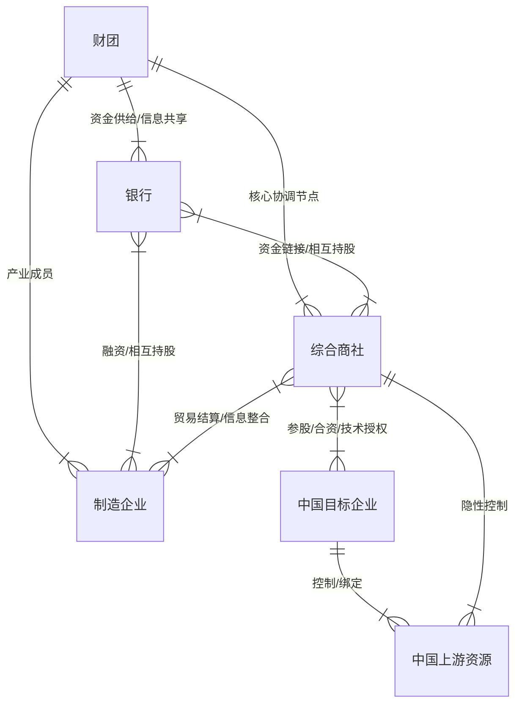
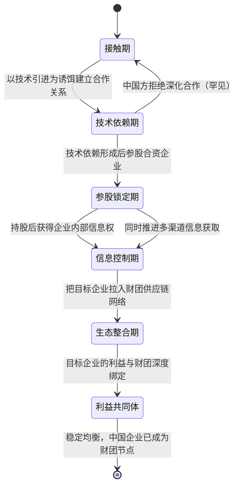
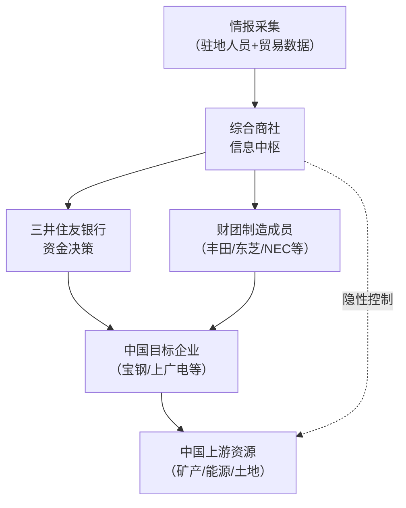
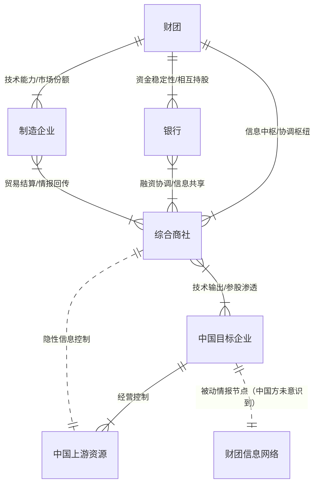

# 《三井帝国在行动》· 沈老师视角 · 260327

> 五步建模法。书是原料，人是工厂。理解 = 行为能力，不是语言能力。

---

## 第零步：ER提取（领域骨架）

拿到这本书，第一个问题不是"作者说了什么"，而是：**这里面有哪些核心实体，实体之间是什么关系，哪个是中心节点？**



看完这张图，有一件事立刻变清晰了：**综合商社是整个系统的中心节点**，不是银行，也不是丰田或东芝这类制造企业。银行负责资金稳定性，制造企业负责产品竞争力，但协调整个网络的信息流和资源分配的，是综合商社。

这个结构不是三角形，是**有向网络，综合商社是路由器**。

---

## 第一步：概念清单与自评

| 概念 | 初始等级 | 备注 |
|---|---|---|
| 综合商社 | 1级 | 知道是贸易公司，但说不清楚为什么它比普通贸易公司强在哪 |
| 财团（Keiretsu） | 1级 | 知道是日本大企业集团，说不清楚结构 |
| 相互持股 | 2级 | 能说出定义，但边界不清楚——持多少？目的是什么？ |
| 利益共同体 | 2级 | 这个词我用过，但放在财团语境下边界在哪里不确定 |
| 母子公司 vs 财团成员 | 2级 | 直觉上不一样，但说不清楚差异的本质 |
| 综合商社的"情报功能" | 0级 | 书里反复强调，完全没概念 |

**全部低于3级的进入第二步。**

---

## 第二步：实例裁判循环

### 概念1：综合商社（Sogo Shosha）

书的核心论点是：三井物产不是普通贸易公司，它是整个财团的神经中枢。但"神经中枢"这个词是比喻，我需要把它变成可以判断的概念。

**裁判循环一：**

我对这个概念的核心问题是：**综合商社和普通大型贸易公司（比如香港的利丰集团）的本质差异是什么？**

- **正例**：三井物产为宝钢引进日本钢铁技术，同时为三井系银行安排融资，同时参股宝钢合资公司，同时追踪中国钢铁行业的资源信息，把这些信息回传给东芝、新日铁等财团成员。这是综合商社。
- **边界例**：利丰集团给耐克采购面料、安排生产、协调物流，横跨多个国家。这是综合商社吗？→ **不是**。利丰只做贸易和供应链协调，没有银行功能、没有参股目标企业、没有把信息作为系统性工具回馈给某个利益网络。它是一个供应链协调商，不是一个生态协调枢纽。
- **反例伪装**：中粮集团——国家投资+粮食贸易+多行业参股+国际布局。这是中国版综合商社吗？→ **不是综合商社，是国有投资集团**。差异在于：中粮的整合逻辑是行政指令，不是网络内生的信息优势；它的成员企业是上下级关系，不是相互持股的横向网络；它没有综合商社的"情报中枢"功能。

**本轮结束后的边界感知：**

综合商社的本质不是"综合"（涉足多行业），而是**网络协调权**——它是分散的企业网络中，唯一拥有全局信息视野的节点。它的价值不在于自己做了多少交易，在于它让整个网络的协调成本接近于零。没有这个全局信息优势，就不是综合商社，只是多元化贸易公司。

**最终边界定义（自己的话）：**

> 综合商社 = 在一个持续性企业网络中，持有信息中枢地位、参与资本连接、并把全局信息转化为网络内所有成员行动协调工具的机构。缺少"持续性网络"或缺少"信息中枢地位"，都不是综合商社。

升级到：**3级 ✓**

---

### 概念2：相互持股（相互株式保有）

- **正例**：三井物产持有三井住友银行5%股权，三井住友银行持有三井物产5%股权。两家都不控制对方，但都是对方的稳定股东，会共同行动阻止外部敌意收购。→ 属于相互持股。
- **边界例**：A公司持有B公司20%，B公司持有A公司1%。→ 这是不对称持股，不是相互持股的典型形态，但部分满足条件——关键看是否有双向治理协调意图，而不只是单向参股。
- **反例伪装**：两家公司的养老金基金都持有对方的股票。→ **不是相互持股**。持股主体是基金而非公司本身，没有治理协调意图，只是资产配置。

**最终边界定义：**

> 相互持股 = 两个实体互相持有对方股权，目的不是财务回报，而是建立稳定的治理关联——互相成为对方的"锁定股东"，抵御外部收购，维持长期协作关系。

升级到：**3级 ✓**

---

### 概念3：综合商社的"情报功能"

这是这本书里我完全陌生的一个概念，书里说三井物产在中国有大量的驻点，系统性收集行业信息，比中国企业更早知道中国自己的行业动向。

我之前把"情报"理解为间谍行为，但这里指的是**合法的系统性信息网络**。

**裁判循环：**

- **正例**：三井物产在中国钢铁行业的代理贸易中，同时收集铁矿石价格、钢材需求、宝钢产能规划、下游汽车行业订单情况，把这些整合成行业全景图，传递给新日铁（帮助定价谈判）和丰田（帮助供应链规划）。→ 这是情报功能。
- **边界例**：麦肯锡在中国做咨询，做大量行业调研，也拥有多个行业的信息视野。→ **部分类似，但不相同**。麦肯锡的信息是为单次咨询项目服务的，不是持续性的、回馈到某个固定利益网络里的。信息的归属权在客户，不在麦肯锡网络。
- **反例伪装**：彭博终端——聚合金融信息，卖给所有人。→ **完全不同**。彭博是信息市场，卖给所有付费者；综合商社的情报功能是**信息武器，只服务于自己的网络**，不对外出售。

**最终边界定义：**

> 综合商社的情报功能 = 在参与正常商业活动的过程中，系统性地积累行业信息，并将这些信息定向传递给固定的利益网络成员，用于网络整体的行动协调。不是间谍，不是咨询，是**自用的实时行业神经网络**。

升级到：**3级 ✓**

---

## 第三步：结构可视化

### 三井进入中国的操作状态机



**关键发现**：这个状态机的每一步都是可逆的，但**每一步的退出成本都比进入成本高**——进入时中国方获得的是技术，退出时中国方要放弃的是整个供应链体系和资本关系。这是一个**路径依赖陷阱**，不是一个简单的商业合同。

### 综合商社的协调机制



画到这里发现了一个书里没有明说的东西：**中国企业以为自己是在和三井物产做生意，但实际上中国企业是在帮三井信息中枢采集中国本地的情报**。这是双向的，不是单向的。中国企业不只是被渗透的对象，同时也是财团情报网络的一个采集节点。

---

## 第四步：可执行结构输出

**财团体制的可执行模型：**

```
核心结构：
分散企业网络 + 中心协调枢纽 = 整体行动能力 > 单独企业能力之和

触发条件 → 结果：
当[信息不对称高 + 协调成本高]时 → 拥有信息中枢的网络能够在博弈中系统性击败单独行动的竞争者
当[目标企业已形成技术依赖]时 → 参股操作的阻力接近于零，因为对方需要继续获得技术
当[目标企业已进入供应链网络]时 → 退出成本已大于留下来的代价，路径依赖形成
当[财团成员之间存在相互持股]时 → 单个成员的退出会危及整个网络，因此网络稳定性远高于合同关系

使用边界：
这个模型在以下情况失效：
1. 目标市场有政治力量强行切断网络（比如中国政府的"安全审查"）
2. 网络内部某成员危机规模大到整个网络无法吸收（日本90年代不良贷款）
3. 技术范式切换让原来的技术依赖关系失效（燃油车转电动车，丰田通商模式需要重建）
```

---

## 第五步：接入已有体系

**同构关系：**

这个财团结构和我理解的**服务网格（Service Mesh）架构**是同构的。

- 综合商社 = Service Mesh控制面（掌握所有服务的流量信息，做路由和负载均衡）
- 制造企业 = 微服务节点（各自独立运行，但行为受控制面协调）
- 银行 = 基础设施层（不参与业务逻辑，但所有服务都依赖它）
- 相互持股 = 服务注册中心（每个服务都向注册中心登记，建立可发现性和依赖关系）

这个同构告诉我：**财团体制本质上是一个企业级的分布式系统**，综合商社不是管理层，是中间件。

这也解释了为什么中国国企搞不出真正的综合商社——中国国企的协调逻辑是行政命令（集中式架构），不是网络内生的信息优势（分布式架构）。两种架构的适应性完全不同：集中式在稳定环境里效率高，分布式在不确定环境里韧性强。

**互补关系：**

这本书填补了我认知体系里"企业组织层面的信息不对称竞争"这个空缺。我之前理解信息不对称主要是在市场层面（卖方比买方了解产品质量）。这本书告诉我信息不对称可以在产业组织层面被系统性武装化——一个掌握全局信息的组织，不需要比每个竞争对手都强，只需要能协调整个网络的行动。

**矛盾关系：**

书里的结论是"中国需要自己的综合商社"，但按我建立的模型，这个结论是有问题的：综合商社是网络内生的协调枢纽，它的权威来自网络成员的自愿依赖（因为它确实提供了更好的信息和协调）。中国如果用行政力量"建立"一个综合商社，这个机构的权威来源不对，行为逻辑也会不同。

这不是矛盾，是适用条件不同：**市场主导的网络 → 综合商社；政策主导的网络 → 国家投资平台**。两者都可以协调产业，但机制不同，适应性边界也不同。

**更新后的ER图：**



---

## 建模完成标志自检

- [x] 不看原文，只看图，能复原核心逻辑
- [x] 给一个新情境（比如：三井试图进入中国高铁行业），能用模型预测其操作步骤
- [x] 所有关键概念都达到3级（综合商社、相互持股、情报功能）
- [x] 新模型已接入已有认知体系（服务网格同构、信息不对称的产业层面理解）

---

*260327 · 核心认知产出：综合商社是分布式企业系统的控制面，不是贸易公司。中国企业进入财团供应链，同时也成为财团的情报节点。这两件事，是同一件事。*
