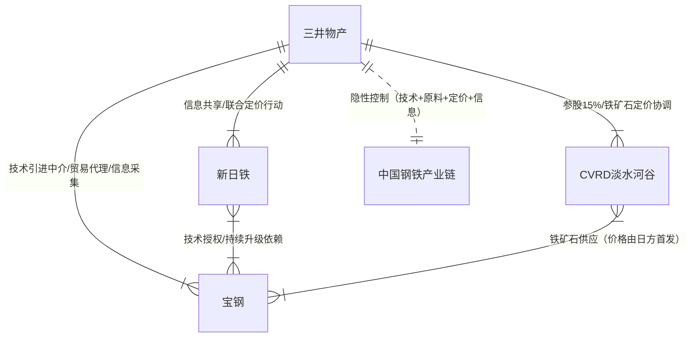
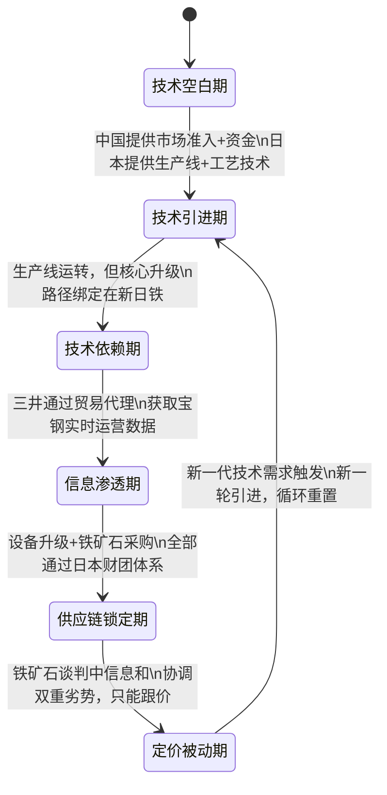
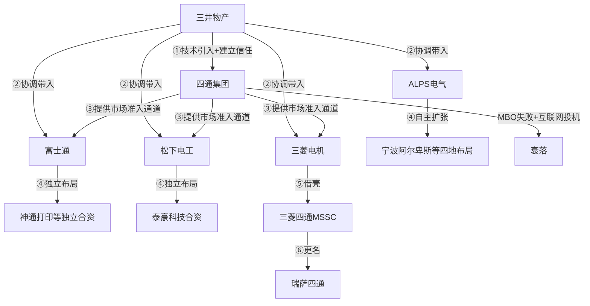
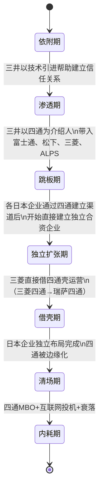
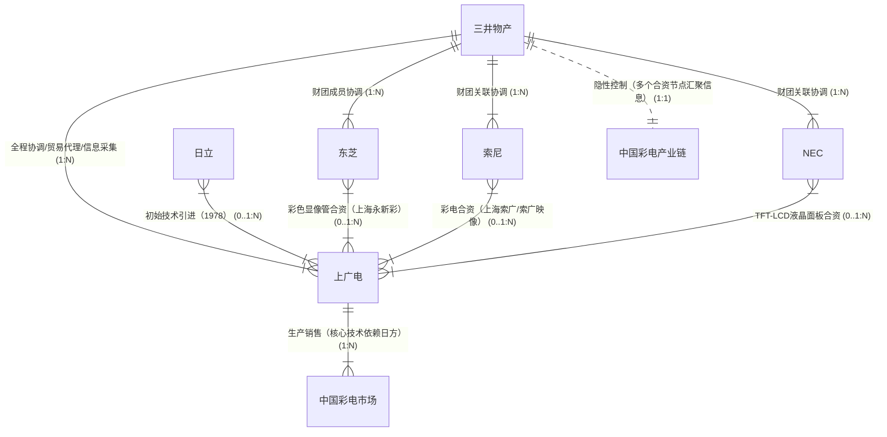
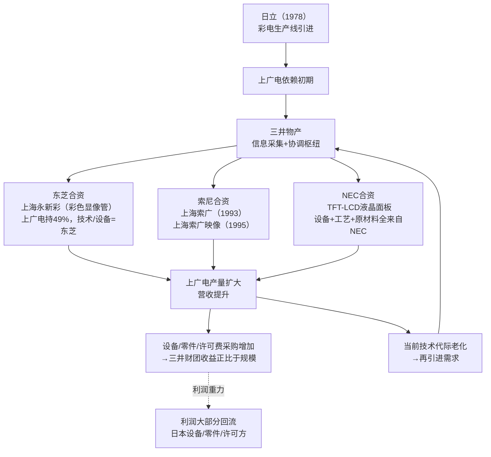

# 《三井帝国在行动》· 沈老师视角 · 前三章 · 260330

> 五步建模法。书是原料，人是工厂。理解 = 行为能力，不是语言能力。

---

## 第一章：钢铁是怎样炼成的

### 第零步：ER提取（领域骨架）



中心节点：三井物产。银行、制造企业是叶节点，三井是路由器。

---

### 第一步：概念清单与自评

| 概念 | 初始等级 | 备注 |
|---|---|---|
| 首发定价权（First-Mover Pricing） | 1级 | 知道有这回事，说不清楚机制 |
| 技术引进依赖陷阱 | 1级 | 知道，但说不清楚为什么会形成 |
| 财团横向协调（相互持股+信息共享） | 2级 | 上一轮已建模，这里看具体在钢铁行业的表现 |
| 贸易代理中的利益冲突结构 | 0级 | 三井同时持有供方股权+代表买方——这个结构没想清楚过 |

全部低于3级，进入第二步。

---

### 第二步：实例裁判循环

**概念1：首发定价权**

核心问题：这不是一个谁"更强"的问题，是一个谁先谈完、其他人只能跟的结构性问题。

- **正例**：每年铁矿石谈判，新日铁和三井支持的CVRD先谈出年度基准价，中国钢铁企业包括宝钢在内，以这个价格为基础购买。→ 属于首发定价权。
- **边界例**：宝钢2004年开始尝试自己直接和CVRD谈。它有谈判能力吗？→ 技术上有，但结构上不行——宝钢的生产技术、设备升级全来自新日铁体系，如果谈崩，新日铁随时可以"延迟"下一代技术支持。宝钢有谈判资格，没有谈判筹码。→ 这是边界例中的关键点：首发定价权的维持不是靠规定，是靠不对称的技术依赖。
- **反例伪装**：中国加入WTO后获得"最惠国待遇"，可以以平等条件参与铁矿石贸易。→ **不是**。最惠国待遇是贸易条件的平等，不是定价权的平等。你可以买到一样价格的东西，但这个价格不是你谈出来的。

**最终边界定义：**
> 首发定价权 = 在重复博弈的资源定价体系中，由特定参与方先完成谈判，其结果成为其他参与方只能接受的基准。关键是"重复性"（每年一次的博弈）和"基准强制性"（跟价机制，不跟就拿不到货）。

升级到：**3级 ✓**

---

**概念2：贸易代理中的双重利益结构**

核心问题：三井物产同时持有CVRD（铁矿石供方）的股权，同时作为宝钢（买方）的贸易代理。这在结构上是什么？

- **正例**：三井持有CVRD约15%股权，CVRD铁矿石价格越高，三井分红越多；同时三井作为宝钢的采购代理，帮宝钢"谈"铁矿石价格，赚取代理佣金。→ 这是一个经典的**双重利益冲突**：代理方的真实利益和委托方相反，价格越高，三井总收益越大。
- **边界例**：银行既向开发商贷款，又向购房者提供按揭贷款。这是双重利益吗？→ **不完全是**。银行两边都希望对方还款，利益方向有一定一致性。三井的情况是真正的对立：铁矿石价格越高，供方盈利越多（三井持股收益增加），买方成本越高（宝钢损失加剧）。
- **反例伪装**：房地产中介同时收买卖双方佣金。→ **部分类似，但不完整**。中介不持有卖方股权，没有持续的收益绑定关系；三井的持股是持续性的，不是单笔交易。

**最终边界定义：**
> 贸易代理中的双重利益结构 = 代理方同时持有供方的持续性权益，使得代理行为（为买方谈价）和自身利益（供方价格越高越好）系统性对立。这不是偶发的利益冲突，是结构性的内建矛盾。

升级到：**3级 ✓**

---

### 第三步：结构可视化



**关键发现：循环没有出口。** 每次新一轮技术引进，把依赖状态重置到起点。出口只有一个：在技术依赖期同时建立独立研发能力——但国有企业的政绩考核逻辑天然不支持这种长周期投资。

---

### 第四步：可执行结构输出

```
核心结构：
资源控制权 = 技术节奏控制 + 原料定价权 + 信息采集网络
三者缺一不可，但可以逐步建立——建立窗口是目标企业尚未意识到依赖形成之前。

触发条件 → 结果：
当[目标国缺技术且愿意以市场准入交换]时
→ 技术引进关系建立

当[技术引进建立且目标企业短期收益优先]时
→ 独立研发被推迟，技术依赖形成

当[技术依赖形成]时
→ 原料采购自然通过技术提供方的信息网络（不敢得罪核心供应商）

当[贸易代理关系建立]时
→ 代理方获得目标企业运营实时数据，定价谈判信息不对称建立

使用边界——以下情况此模型失效：
1. 目标企业同时多线引进不同来源技术（打破单一依赖）
2. 目标国政府强制要求技术能力转让（不只是产品引进）
3. 技术范式发生颠覆性切换（旧依赖链条清零）
```

---

### 第五步：接入已有体系

**同构关系：**
新日铁+三井对宝钢的控制，和软件行业的**平台锁定（Vendor Lock-in）**完全同构：

| 钢铁行业 | 软件行业 |
|---|---|
| 新日铁的技术支持依赖 | AWS的迁移成本 |
| 首发定价权 | 平台的计费标准（用户只能接受） |
| 三井的信息采集 | 平台的数据中台（所有用户数据归平台） |
| 每代技术引进 | SaaS的年度订阅续费 |

这个同构的推论价值：为什么"以市场换技术"在软件行业同样失效——引进AWS、Azure而不建立自主云，和引进新日铁技术而不建立自主炼钢能力，**是同一条路**。

**互补关系：**
填补了"信息不对称在实物商品市场中的应用"这个空缺。我之前的认知主要在金融市场，这章把同样的机制放在铁矿石年度定价里——表现形式是"首发定价权"而不是"证券内幕信息"，机制完全相同。

**矛盾关系：**
书的结论是"中国需要自己的综合商社"，但我的模型说：问题的根源是制度结构不对等（纵向行政协调 vs 横向网络协调），用行政力量"建立"一个综合商社，其协调权威来自行政授权，不来自信息优势，行为逻辑和三井完全不同。两者同名，是两种不同的制度物种。

---

## 第二章：踏上四通八达的跳板

### 第零步：ER提取（领域骨架）



**中心发现：** 四通是入口，不是合伙人。日本企业通过四通进入、站稳后绕开四通独立运营，四通的价值随日方网络成熟而归零。

---

### 第二步：实例裁判循环（关键新概念）

**概念：跳板陷阱的本质条件**

核心问题：为什么四通会成为跳板而不是真正的合伙人？

- **正例**：四通引入富士通，富士通通过四通建立了客户关系和分销渠道后，成立神通打印独立运营，四通持小股但不掌握运营权。→ 典型跳板陷阱。
- **边界例**：富士康（鸿海）为苹果代工，苹果越大，富士康越重要。→ **不是跳板陷阱**。富士康的价值不是"引路人"，是真正难以替代的制造能力（规模、供应链整合、全球工厂网络）。关键差异：富士康建立了苹果无法绕过的不可替代性；四通没有建立日本企业无法绕过的任何东西。
- **反例伪装**：中国早期的CDN服务商，帮助海外互联网企业进入中国。→ **部分类似**。但CDN服务商提供的是技术服务（网络加速），不只是关系中介——只要这个技术服务无可替代，CDN不会被跳板化。四通的价值是关系中介，不是技术服务，所以比CDN更容易被跳板化。

**最终边界定义：**
> 跳板陷阱 = 当一个企业的核心价值是"引路人"（帮助外部进入方建立本地关系），而不是"持续不可替代的能力"时，进入方在本地关系建立完成后，引路人价值归零，企业被边缘化。触发条件：自身价值可以被内化，且自身没有建立任何外部不可替代的能力壁垒。

升级到：**3级 ✓**

---

### 第三步：结构可视化



---

### 第四步：可执行结构输出

```
跳板陷阱的核心不对称：
进入方（日本企业）知道这是临时关系，从第一天就在建立独立出口
目标企业（四通）通常认为这是长期合作，在建立依赖而不是建立独立性

陷阱的时序逻辑：
阶段1：目标企业掌握引路人价值（市场准入+本地关系）
阶段2：进入方通过目标企业积累本地能力
阶段3：进入方本地能力成熟，目标企业价值归零
阶段4：进入方绕过或边缘化目标企业

防御条件（以下情况陷阱不成立）：
1. 目标企业掌握进入方无法内化的核心技术/资产（真正的技术壁垒）
2. 目标企业把合作产出转化为自有资产（专利、品牌能力、工程能力）
3. 目标企业提供的价值是持续在场的不可替代，而不是一次性的引路
```

---

### 第五步：接入已有体系

**同构关系：** 跳板陷阱 = **渠道被绕开（Disintermediation）**

| 四通的故事 | 传统分销渠道的故事 |
|---|---|
| 四通帮助日本企业进入中国 | 经销商帮助品牌商进入市场 |
| 日本企业建立直接客户关系 | 品牌商建立直接电商渠道 |
| 四通价值归零 | 经销商价值归零 |

四通的失败不是三井特别坏，是**任何渠道伙伴不建立自有核心竞争力的必然结局**，三井只是加速了这个过程。

**矛盾关系（书的解释 vs 我的模型）：**
白益民把四通衰落归因于"没有财团支持"，但我的模型指向不同的根因：四通每次合作都是在帮别人建立能力，而不是在建立自己的能力。有没有财团支持是次要问题；主要问题是，**四通的价值从来不是资产性的，是关系性的**，而关系可以被内化，资产不能。

---

## 第三章：种下一棵"摇钱树"

### 第零步：ER提取（领域骨架）



**关键观察：** 三井不直接和上广电合资，但每一个合资项目都有三井参与协调。三井是这张网的织网人，不是网里的一个节点。

---

### 第二步：实例裁判循环（新概念）

**概念："摇钱树"结构——利润重力中心不在树上**

核心问题：上广电在增长，为什么说它是"摇钱树"而不是真正的受益者？

- **正例**：上广电的营收在增长（彩电市场份额提升），但每次扩产都需要向东芝/NEC采购更多设备+零件+技术许可；上广电营收增长10亿，但其中大部分的利润流回了设备供应商和技术许可方（日本体系）。→ 属于摇钱树结构。树在长，果子流走了。
- **边界例**：比亚迪的电动车业务，宁德时代供应电池，比亚迪需要持续采购。比亚迪是宁德时代的摇钱树吗？→ **不完全是**。比亚迪同时在建立自己的电池研发能力（弗迪电池），正在逐步减少对宁德时代的依赖。摇钱树的关键条件是"目标企业**没有**建立脱离依赖的能力路径"。比亚迪在建立这条路径，上广电没有。
- **反例伪装**：麦当劳对供应商来说是"摇钱树"吗？→ **不是这个概念里的摇钱树**。麦当劳采购原材料，供应商赚利润，但麦当劳自己也在赚更多的利润（品牌、门店、特许经营体系）。摇钱树的特征是：树（目标企业）的利润被结构性地转移给摇树的人（综合商社+供应商体系），树自身的净利润率随规模扩大而下降，而不是上升。

**最终边界定义：**
> 摇钱树结构 = 当一个企业的规模扩张，系统性地增加了另一方的收益，而自身的净利润率随规模扩大而未能同步提升，甚至下降——原因是扩张依赖的所有关键投入（设备、技术、零件）都由具有定价权的外部方供应，外部方的定价能力随企业规模扩大而增强而不是减弱。

升级到：**3级 ✓**

---

### 第三步：结构可视化



---

### 第四步：可执行结构输出

```
"摇钱树"模型的四阶段：

阶段一（种树）：综合商社通过技术引进协调，帮助目标企业建立生产能力
阶段二（施肥）：协调引入合资伙伴，帮目标企业扩大市场规模
阶段三（摇树）：通过设备供应、零件采购、技术许可三路收益，
             从目标企业的每一次扩张中正比例提取利润
阶段四（循环）：目标技术代际老化→再引进→三井重新介入→树重新绑定

关键的利润不对称：
目标企业营收增加X → 设备/零件/许可费增加kX（k接近1）
目标企业利润 ≈ (1-k)X，且k随竞争加剧而趋近于1

使用边界（以下情况此模型失效）：
1. 目标企业在引进同时建立了独立的技术研发体系（三星DRAM的路径）
2. 技术范式跳跃式切换，旧依赖链条清零（OLED替代LCD窗口）
3. 目标国政府强制技术本地化率要求（汽车行业的部分案例）
```

---

### 第五步：接入已有体系

**同构关系：摇钱树 = SaaS订阅 + 客户成功**

| 三井对上广电 | SaaS对企业客户 |
|---|---|
| 帮助上广电建立生产能力 | 帮助客户导入使用 |
| 上广电规模越大，设备/许可费越多 | 客户规模越大，订阅费越高 |
| 技术依赖产生切换成本 | 数据迁移成本产生黏性 |
| 每次技术升级重绑依赖 | 每年续费合同重绑依赖 |

区别：SaaS是显性透明合同，摇钱树结构是隐性分散在多个合资关系和供应链节点中，不透明。

**三章的综合发现——书里没有说清楚的事：**

三章放在一起看，有一个白益民没有显性说出来的矛盾：三井物产在宝钢、四通、上广电三个完全不同行业里，遵循了几乎完全相同的操作步骤：技术引进中介→建立信任→引入财团成员→形成依赖→信息采集→控制加深。

这说明三井不是在"针对中国精心谋划"，而是在**用一套可重复的标准模板**处理所有市场机会。**主动者是中国企业**——是中国企业主动寻求技术引进，三井只需要按模板响应。书把三井写得很主动、很神秘，实际上三井只是个高效的标准化执行者，而不是高深莫测的战略家。这是这本书最大的叙述扭曲之一。

---

## 建模完成标志自检（前三章）

- [x] 不看原文，只看图，能复原三章核心逻辑
- [x] 给一个新情境（比如：三井试图进入中国新能源汽车供应链），能用模型预测其操作步骤
- [x] 所有关键概念都达到3级（首发定价权、双重利益结构、跳板陷阱、摇钱树结构）
- [x] 三章模型已接入已有认知体系（平台锁定、渠道被绕开、SaaS订阅同构）

---

*260330 · 三章核心认知产出：三井物产的操作是一套标准化模板，不是针对中国的特殊谋划。模板的核心是：先成为不可替代的信息中枢，然后让目标企业的每一次扩张都变成对这个中枢的更深依赖。主动走进这个模板的，往往是中国企业自己。*
