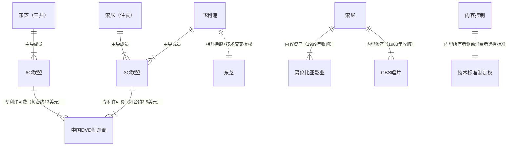
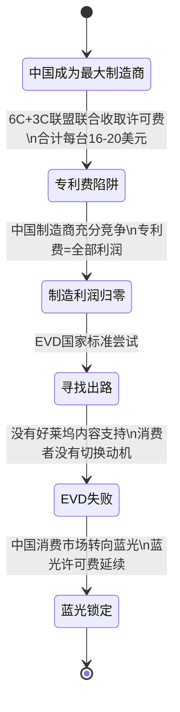
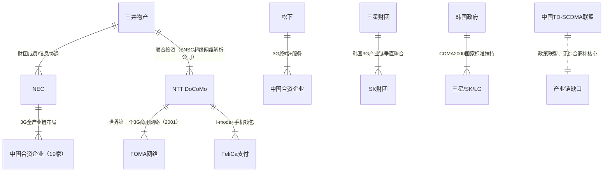
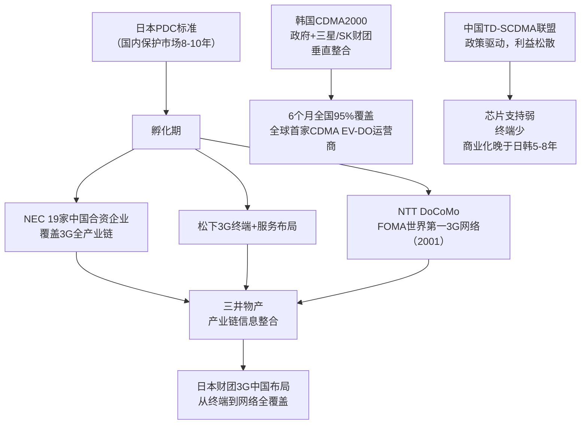
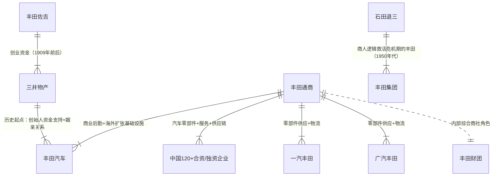
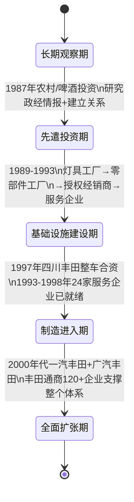

# 《三井帝国在行动》· 沈老师视角 · 第四至六章 · 260331

> 五步建模法。书是原料，人是工厂。理解 = 行为能力，不是语言能力。

---

## 第四章：隐藏的垄断与共谋

### 第零步：ER提取（领域骨架）



中心发现：6C和3C两个"竞争"联盟，背后的核心节点（东芝/飞利浦/索尼）通过交叉授权和相互持股形成隐性协同。中国DVD制造商面对的不是两个竞争者，是同一套利益网络的两个收费窗口。

---

### 第一步：概念清单与自评

| 概念 | 初始等级 | 备注 |
|---|---|---|
| 专利池（Patent Pool）的竞争壁垒功能 | 1级 | 知道专利池，没想过它同时作为竞争壁垒 |
| "标准战争"的双重性结构 | 0级 | 从没想过两个"竞争"标准背后是同一套利益网络 |
| 内容资产与技术标准的绑定机制 | 0级 | 索尼收购哥伦比亚的逻辑，看到了但没理解 |
| 垂直整合的隐性化（无控股的控制） | 1级 | 知道综合商社有这个特征，这章给了具体案例 |

全部低于3级，进入第二步。

---

### 第二步：实例裁判循环

**概念1："标准战争"的双重性结构**

核心问题：书里说索尼Betamax和JVC VHS的格式战，以及索尼蓝光和东芝HD-DVD的格式战，背后都有"左右手互搏"的成分。这是什么意思？

- **正例**：蓝光（BD）vs HD-DVD战争（2006-2008年）：索尼主导BD，东芝主导HD-DVD。表面是两家竞争，但三井物产在这两场战争中都持有相关企业股权——东芝是三井财团成员，索尼与三井在多个合资项目中有关联。最终东芝2008年宣布放弃HD-DVD。哪个标准赢，日本专利联盟都收到许可费。→ 这是双重性结构的完整表现。
- **边界例**：谷歌Chrome vs Mozilla Firefox的浏览器竞争。这是双重性结构吗？→ **不是**。两者背后没有同一套利益网络，这是真实的竞争。关键差异：真实竞争中一方的损失是另一方的增益；双重性结构中无论哪方胜，某个上层利益节点都获益。
- **反例伪装**：美国共和党vs民主党政治竞争。→ **部分相似**（都依赖大企业资金），但不完全相同。政治竞争中两党存在真实政策差异，不完全是协同表演。

**最终边界定义：**
> 标准战争的双重性结构 = 两个表面竞争的技术标准，都由同一个上层利益网络的成员主导，无论哪个标准最终胜出，该网络都能从标准化带来的专利许可费和生态锁定中获益。双重性不是"假竞争"，而是"无损竞争"——两方竞争的损失由外部制造商承担，不由日本财团内部承担。

升级到：**3级 ✓**

---

**概念2：内容资产与技术标准的绑定机制**

核心问题：索尼为什么在1988-1989年花大价钱收购CBS唱片和哥伦比亚影业？这和技术标准有什么关系？

- **正例**：2008年蓝光（BD）赢得标准战争，关键不是技术优劣，而是BD阵营拥有更多好莱坞内容支持（华纳最终选择BD）。索尼的哥伦比亚电影从一开始就支持BD，给消费者更强的购买BD播放机的动机。→ 内容是标准战争的终极武器。
- **边界例**：苹果iTunes Store（2003年）与iPod：苹果既卖设备也卖内容，通过DRM锁定苹果生态。→ **这是同一机制的更极端版本**——苹果自己既是"硬件方"又是"内容平台方"，不需要收购外部内容公司，直接建立了内容分发的掌控权。
- **反例伪装**：微软Office套件的锁定效应。→ **机制类似但不完全相同**。Office的锁定来自格式标准（.doc/.xlsx），不是内容资产。内容资产的特殊性在于：内容控制者可以驱动消费者向特定硬件平台迁移。

**最终边界定义：**
> 内容资产与技术标准绑定 = 技术标准制定者同时持有内容生产/分发资产，使内容偏好驱动消费者采购支持该标准的硬件——内容所有权成为标准竞争的非对称武器，可以替代技术优劣成为标准战争的决定因素。

升级到：**3级 ✓**

---

### 第三步：结构可视化



**关键发现：** 中国DVD制造商的困境不是"没有赢"，是"赢的方式是错的"——即使成为全球最大生产者，在没有专利积累和内容资产的条件下，制造规模越大，向专利持有方输送的利润绝对值越大。这是摇钱树结构在知识产权领域的翻版。

---

### 第四步：可执行结构输出

```
专利池 + 内容控制 = 技术标准永久锁定的双重保险

触发条件 → 结果：
当[某产品技术标准化需求出现]时
→ 拥有大量相关专利的行为者建立专利池，要求所有制造商缴费

当[专利池建立且制造商别无选择]时
→ 制造商净利润被专利费系统性侵蚀（与规模正相关）

当[标准战争出现]时
→ 持有内容资产的标准主导方有额外武器（内容偏好驱动消费者）
→ 没有内容支持的替代标准（EVD）必然在消费市场失败

使用边界——以下情况模型失效：
1. 替代标准获得足够内容支持（需要政治力量强制推动）
2. 技术范式颠覆式切换（流媒体的出现使物理光盘标准本身失效）
3. 开源替代方案打破专利池（Linux对微软的部分挑战路径）
```

---

### 第五步：接入已有体系

**同构关系：专利池 = 收费道路**

| DVD专利池 | 高速公路收费站 |
|---|---|
| 6C+3C建立专利壁垒 | 修路者获得收费权 |
| 中国制造商必须缴费才能生产 | 用路者必须缴费才能通行 |
| 即使中国制造了全球80%的DVD机 | 即使大量车辆通行 |
| 利润重心在专利持有者而非制造者 | 收益重心在路权持有者而非车辆 |

这个同构告诉我：**专利是永久性的通行税基础设施，建立专利积累的行为者是在建设收费道路，而不是在建造车辆。中国的问题是只建造了最多的车辆。**

**矛盾关系（书的结论 vs 模型）：**
书的结论是"中国需要建立综合商社来应对专利战"，但模型指向不同的根因：专利战的根因是中国在知识产权积累上的系统性投入不足，这是产业政策的取向问题，不是有没有综合商社的问题。有综合商社但没有专利积累，同样无法赢得标准战争。

---

## 第五章：大产业链上的棋局

### 第零步：ER提取（领域骨架）



**中心发现：** 日本路径（财团横向协调）和韩国路径（政府+垂直整合）各自用不同机制实现了相似的结果：产业链各环节同步就绪，商业化速度远超中国。

---

### 第二步：实例裁判循环（新概念）

**概念：垂直整合产业链 vs 政策驱动联盟**

核心问题：为什么韩国3G成功，中国3G相对被动？

- **正例（韩国路径）**：三星财团自己做芯片（三星半导体）、显示屏（三星电管）、手机终端（三星电子）、通信运营商（SK、KTF通过财团关联），全产业链垂直整合。2002年韩国CDMA2000 EV-DO成为首个商用3G运营商，仅用6个月建设全国覆盖95%的网络。→ 垂直整合产业链=每个环节都有对应的财团企业，协调成本为零。
- **边界例（日本路径）**：日本通过PDC保护2G国内市场，孵化了NEC、松下、东芝等3G能力，然后财团协调这些企业联合布局中国3G。财团协调≠垂直整合，但财团信息网络使横向协调成本接近垂直整合的效率。→ **不完全同构，但效果相近**。
- **反例伪装（中国路径）**：中国的TD-SCDMA联盟：大唐电信主导标准，华为、中兴参与设备，中国移动运营。→ **形态上类似联盟，但缺乏稳定组织关系**。联盟成员是政策要求而非利益驱动聚合，信息共享和利益协调机制不完整。每个环节的企业在联盟之外仍然在竞争，没有财团式的稳定机制把竞争切换为协作。

**最终边界定义：**
> 垂直整合产业链 = 产业链各环节由同一利益网络内的企业掌控，信息和决策协调在内部完成，外部竞争者无法渗透的产业组织形态。与"政策驱动联盟"的本质差异：前者的协调来自内生利益绑定，后者来自政策命令，前者在不确定环境中韧性更强，协调效率更高。

升级到：**3级 ✓**

---

### 第三步：结构可视化



---

### 第四步：可执行结构输出

```
产业链组织能力的量化差异：
韩国（高）：财团垂直整合 = 协调成本≈0 + 利益一致性=100%
日本（中）：财团横向协调 = 协调成本≈低 + 信息共享=完整
中国（低）：政策联盟 = 协调成本=高 + 信息共享=不完整

3G赛道的决定性因素：
不是哪个标准技术最好（WCDMA/CDMA2000/TD-SCDMA都有技术可行性）
而是哪个国家能最快把全产业链的资源协调起来，完成商业部署

这就是为什么：技术起点相近的三个国家，日韩商业化比中国快5-8年

使用边界：
1. 新技术范式的产业组织要求根本性改变时（4G/5G），既有产业链优势可能重置
2. 政治力量主动扶持某项标准时（中国TDD-LTE 4G），政策可以部分弥补组织劣势
3. 超大型企业内部实现垂直整合时（华为同时做基础设施+终端+芯片），
   单企业替代财团协调功能
```

---

### 第五步：接入已有体系

**三章到五章的概念升级：**

从前三章建立的"摇钱树/跳板/首发定价权"框架，第五章揭示了它们的组织条件：

| 前三章（企业层面） | 第五章（产业链层面） |
|---|---|
| 技术引进依赖 | 整个产业链被外资体系覆盖 |
| 首发定价权 | 标准制定权 |
| 三井作为协调节点 | 综合商社是产业链培育和组织者 |

第五章是第一章的产业级版本：不只是一个企业被嵌入财团网络，而是整个产业链被财团网络覆盖。协调节点从企业层面上升到了产业链层面。

**接入已有体系（软件工程视角）：**
| 3G产业链组织 | 微服务架构 |
|---|---|
| 财团协调各企业分工 | 服务网格协调各微服务 |
| 韩国垂直整合 | 单体架构（快但脆） |
| 日本横向协调 | 分布式+统一控制面 |
| 中国政策联盟 | 无控制面的微服务（各自为战） |

---

## 第六章：无敌的商人道

### 第零步：ER提取（领域骨架）



**中心发现：** 丰田通商是三井物产在丰田集团内部的"复制品"——丰田在27年准备之后才进入中国制造，但丰田通商的服务基础设施早于制造进入，是制造的先遣队。

---

### 第二步：实例裁判循环（新概念）

**概念：先遣商业基础设施（先于制造进入的服务网络）**

核心问题：为什么丰田通商在丰田汽车正式制造进入之前，就在中国建立了大量零部件和服务企业？

- **正例**：丰田通商1971年从香港开始，1987年在中国农村投资啤酒公司（研究政经情报），1989年建立上海灯具公司，1993年建立零部件工厂，1993-1998年建立24家汽车生产服务企业和4家贸易公司——**全部在丰田整车进入之前**。1997年才有四川丰田整车制造。→ 这是先遣基础设施的完整案例。
- **边界例**：麦当劳进入新市场：先做市场调研，再开直营店，再引入加盟商。→ **部分类似，但不完全相同**。麦当劳的先遣是调研，不是建立独立的供应链基础设施企业。丰田通商建立的是丰田制造到来之后可以直接使用的零部件和物流体系——先遣的价值是让"大部队"的成本控制和速度都大幅提升。
- **反例伪装**：华为在海外市场的布局：先建立研究院，再推产品，再谈运营商合同。→ **与先遣基础设施不同**。华为的先遣是研发能力，针对产品优化；丰田通商的先遣是商业关系网络，针对制造进入时的资源协调。两者路径不同。

**最终边界定义：**
> 先遣商业基础设施 = 在制造或核心业务进入之前，预先在目标市场建立服务、零部件、物流、政商关系网络——使得核心业务进入时可以直接使用这套基础设施，大幅降低进入成本和风险，且竞争对手无法快速复制这套时间积累型关系资产。时间差是护城河的来源，不是经营效率。

升级到：**3级 ✓**

---

### 第三步：结构可视化



**关键发现：** 丰田通商的先遣不是特别的战略谋划，是综合商社制度在任何重要市场的自然运作——综合商社的商业模式要求它先建立信息和关系网络，然后引入成员企业，这套模式在中国运作的结果就是"27年准备、27年领先"。

---

### 第四步：可执行结构输出

```
丰田通商模式的核心逻辑：

阶段1（情报期）：在无明确制造目标的情况下，建立信息网络和政商关系
→ 投资农业/啤酒等表面不相关的行业，实质是研究目标市场
→ 时间跨度：10-15年

阶段2（基础设施期）：按照未来制造进入的需求，预先建立服务和零部件体系
→ 每家企业规模小，单独看不值得投资
→ 整体看是制造进入后的完整支撑体系

阶段3（制造进入期）：整车制造进入时，直接使用已建立的基础设施
→ 成本控制能力远超竞争对手
→ 商业谈判筹码远超竞争对手（已有关系网络）

这个模型成立的前提条件：
1. 母公司（丰田汽车）的长期战略稳定性（不因短期收益压力放弃先遣投资）
2. 综合商社作为先遣主体（商社的多元化业务使情报投资以合法商业形式进行）
3. 目标市场足够大，使27年的准备成本值得

使用边界——以下情况模型失效：
1. 市场变化速度超过准备周期（数字化颠覆式速度）
2. 政治风险使长期布局无法落地（1989年政治风波曾中断丰田通商进程）
3. 进入者有足够强的品牌拉力可以绕过先遣基础设施直接进入（特斯拉模式）
```

---

### 第五步：接入已有体系

**六章共享的底层机制——综合商社商业逻辑的六种表现：**

```
综合商社的商业模式
= 先于制造建立信息网络（第一章：宝钢案例中的情报功能）
= 通过引介建立控制（第二章：四通案例中的跳板逻辑）
= 把制造企业的扩张转化为自身收益（第三章：上广电摇钱树）
= 通过专利池建立收费道路（第四章：DVD专利战）
= 把产业链各环节纳入协调网络（第五章：3G大产业链）
= 先遣基础设施先行（第六章：丰田通商）

本质相同：综合商社始终是信息中枢，不是生产者
```

**接入软件架构类比（全书总结）：**

| 综合商社功能 | 软件架构对应 |
|---|---|
| 情报采集（第一章） | 监控与可观测性 |
| 跳板利用（第二章） | API网关（入口代理） |
| 摇钱树（第三章） | SaaS订阅+使用量计费 |
| 专利池（第四章） | 协议授权+DRM |
| 产业链组织（第五章） | 服务网格控制面 |
| 先遣基础设施（第六章） | 基础设施即代码（提前配置） |

综合商社不是某种神秘的商业模式，是一套分布式系统的控制架构——在任何行业、任何时代，掌握了信息和关系节点的行为者都会自然运作出类似的结构。

---

## 建模完成标志自检（第四至六章）

- [x] 不看原文，只看图，能复原三章核心逻辑
- [x] 给一个新情境（三井试图进入中国新能源汽车供应链），能用第六章的丰田通商模型预测其操作步骤
- [x] 所有关键概念都达到3级（标准战争双重性、内容与标准绑定、先遣商业基础设施、垂直整合vs政策联盟）
- [x] 三章模型已接入已有认知体系（专利池=收费道路、先遣基础设施、综合商社=分布式控制架构）

---

*260331 · 第四至六章核心认知产出：专利是收费道路，内容是标准战争的非对称武器，产业链组织能力决定商业化速度，先遣基础设施将可能失败的进入转化为几乎必然成功的进入。六章共同揭示的底层真相：日本财团的商业逻辑始终是"先控制信息和关系，后控制制造"，而不是反过来——这是综合商社作为分布式控制架构的自然运作，不是什么高深莫测的战略谋划。*
