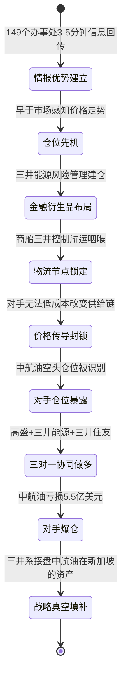
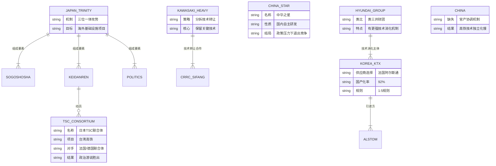
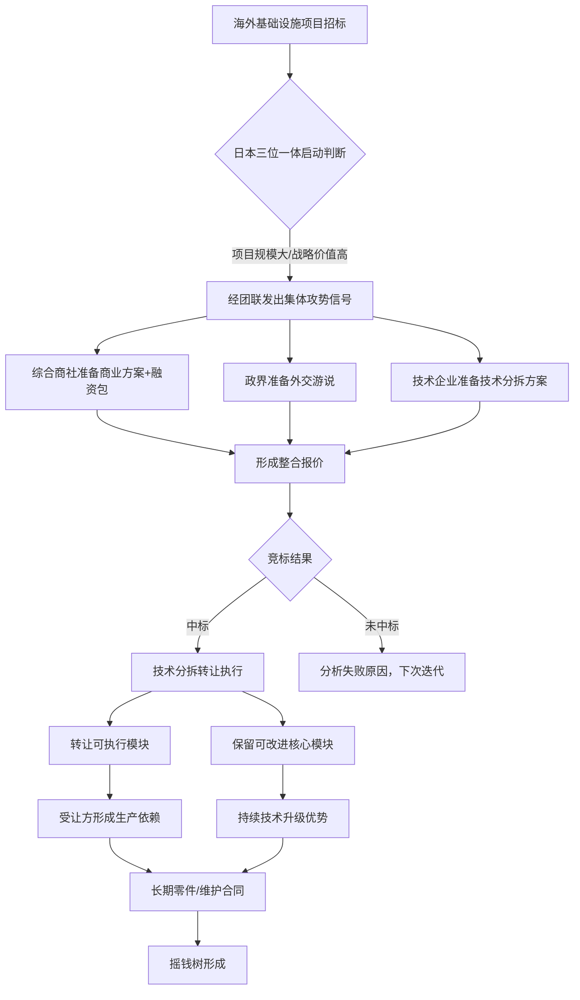

# 《三井帝国在行动》· 沈老师视角 · 第七至九章 · 260401

> 五步建模法。书是原料，人是工厂。理解 = 行为能力，不是语言能力。

---

## 第七章：商场如战场

### 第零步：ER提取（领域骨架）

```mermaid
erDiagram
    MITSUI_ENERGY_RISK_MGMT ||--o{ CNAF : "对赌做多方"
    GOLDMAN_SACHS_JARON ||--o{ CNAF : "对赌做多方"
    MITSUI_SUMITOMO_BANK ||--o{ CNAF : "对赌做多方"
    CNAF {
        string 主体 "中航油新加坡"
        string 操作 "做空石油期货"
        number 亏损 "5.5亿美元"
        int 年份 2004
    }
    MITSUI_GROUP ||--|{ MOL : "旗下成员"
    MOL {
        string 名称 "商船三井"
        int 国际航线 73
        int 船舶数量 600
        string 职能 "全球石油物流"
    }
    MITSUI_GROUP ||--|{ INTEL_NETWORK : "运营"
    INTEL_NETWORK {
        int 覆盖国家 87
        int 办事处数 149
        string 响应时间 "3-5分钟"
    }
    COMMODITY_PYRAMID ||--o{ MITSUI_GROUP : "顶层成员"
    COMMODITY_PYRAMID {
        string 顶层 "大银行/大财团/大基金"
        string 中层 "综合商社/大贸易商"
        string 底层 "中小生产商"
    }
    SINGAPORE_HUB ||--|{ MITSUI_CHEMICAL : "布局节点"
    SINGAPORE_HUB ||--|{ MOL : "布局节点"
    SINGAPORE_HUB ||--|{ MITSUI_ENERGY_RISK_MGMT : "布局节点"
    CHINA ||--o{ COMMODITY_PYRAMID : "缺失主导权"
```

---

### 第一步：概念清单与自评

| 新概念 | 定义摘要 | 初始等级（0-2） | 备注 |
|--------|----------|-----------------|------|
| 三对一庄家赌局 | 三方联合做多，针对单一对手做空仓位形成不对称博弈 | 1 | 知道是以多打少，不清楚具体如何协调 |
| 大宗商品交易金字塔 | 全球大宗商品定价权分层结构，顶层掌控定价，底层只能被动接受 | 1 | 有直觉，缺乏层间流转机制的精确理解 |
| 石油物流咽喉 | 通过控制航运通道而非生产源头掌控石油流通的战略要地 | 2 | 理解逻辑，但无法判断"咽喉"的边界条件 |
| 全球情报网 | 遍布全球的信息采集与传输体系，使商社获得系统性信息优势 | 1 | 知道存在，不了解信息如何转化为交易决策 |
| 产业主导权缺失 | 一国在某产业链中无法影响定价、流通、规则制定的结构性弱势 | 2 | 理解症状，未建模导致缺失的系统原因 |

> 全部低于3级，进入第二步。

---

### 第二步：实例裁判循环

#### 概念一：三对一庄家赌局

**正例（书中事实）：**
- 三井能源风险管理公司 + 高盛J.Aron + 三井住友银行，三方协同持有石油期货多头仓位，中航油陈久霖持续加注空头，最终爆仓亏损5.5亿美元。
- 三方不需要明确合谋协议，只需各自利益一致（做多），即形成事实上的"联合庄家"结构。

**边界例（容易误判为本概念的情况）：**
- 两家公司同时看多某商品，但各自独立交易，互不知情——这是"方向相同"，不是"庄家赌局"。庄家赌局的关键特征是：三方对单一对手形成结构性封锁，对手无退出路径（做空者必须在期货到期前平仓）。
- 三家银行联合给某企业放贷——这是协同融资，不是赌局。赌局要求存在对赌的零和结构：一方盈利必然等于另一方亏损。

**反例伪装（看起来像但不是）：**
- 中国三家钢铁厂联合向铁矿石供应商谈判压价——方向上是"多对一"，但钢铁厂是买方，议价的是价格，不是对赌仓位，不构成庄家赌局（除非钢厂在期货市场建立对应仓位）。

**最终边界定义（升级至3级）：**
> 三对一庄家赌局 = 在零和衍生品市场中，多个资本方协同持有同向仓位，针对单一对手的反向仓位形成封闭博弈，使对手在杠杆放大效应下丧失退出能力。核心要素：①零和结构（期货/期权）②方向协同（无需明示）③对手路径封锁（无法低成本平仓）。

---

#### 概念二：产业主导权

**正例（书中事实）：**
- 三井财团通过商船三井（航运）+ 三井能源风险管理（金融衍生品）+ 情报网络（信息优势）三层叠加，在石油大宗商品链条上同时掌控物流、定价参与权、信息差，构成完整的产业主导权。
- 中国在大宗商品市场无类三井综合商社，只能在底层"中小生产商"位置接受价格，无法影响金字塔上层规则。

**边界例：**
- 中国在稀土上拥有资源垄断，是否等于产业主导权？——资源垄断是必要条件但非充分条件。产业主导权要求同时具备：资源控制 + 加工标准制定 + 定价机制参与 + 金融衍生品话语权。仅有资源而无后三项，价格仍可被他方操纵（历史上稀土价格战即是例证）。

**反例伪装：**
- 某国拥有最大的石油储量，因此拥有石油产业主导权——错误。沙特拥有大量储量，但石油定价权长期在美元结算体系和华尔街期货市场，产油国在金融层面缺乏主导权。

**最终边界定义（升级至3级）：**
> 产业主导权 = 在某产业价值链中，同时具备：①上游资源/技术控制、②中游流通/物流节点掌握、③下游定价机制参与（包括金融衍生品话语权）、④信息不对称优势的综合能力。缺任一要素均为"部分主导"，易被针对性打击。

---

### 第三步：结构可视化



---

### 第四步：可执行结构输出

**触发条件 → 结果（if-then格式）**

```
IF 某大宗商品市场存在单一方向的大型仓位（方向已公开或可推断）
AND 该仓位持有方缺乏信息优势（无法感知对手仓位规模）
AND 市场存在流动性充裕的衍生品工具
THEN 具备情报优势的多方资本可协同构建"庄家封锁结构"

IF 一国企业进入国际大宗商品衍生品市场
AND 该企业缺乏对应的物流节点控制
AND 缺乏实时全球情报网络
THEN 该企业在衍生品市场的仓位必然暴露于信息不对称风险，
     面对协同做市方时路径封锁概率极高

IF 一国在某产业链中仅占"底层生产商"位置
AND 没有综合商社型组织连接资源-流通-金融层
THEN 该国在该产业的价格谈判中为结构性弱势方，
     即使扩大生产规模也无法改变定价权归属
```

**使用边界：**
- 此模型适用于流动性高、杠杆放大效应显著的金融衍生品市场，不直接适用于实物商品现货交易（现货市场信息更透明，杠杆更低）。
- 三对一庄家结构在监管完善的市场（如美国CFTC监管下）会触发操纵认定，因此更多发生在监管相对宽松的离岸市场（如新加坡）。

---

### 第五步：接入已有体系

**同构关系（与前六章框架的对应）**

| 第七章新结构 | 前章已建框架 | 同构关系说明 |
|-------------|-------------|-------------|
| 三对一庄家赌局 | 先遣基础设施（前章） | 物流咽喉控制是"基础设施先遣"在商品市场的金融版：先占节点，再锁死对手退路 |
| 情报网络3-5分钟响应 | 摇钱树（专利收费道路） | 信息差本身就是一条无形的"收费道路"：早一步知道，等于在每笔交易上收取隐性税 |
| 大宗商品金字塔 | 产业链组织能力 | 金字塔结构是产业链组织能力的"空间投影"：谁能在金字塔各层布局，谁就拥有跨层协调能力 |
| 新加坡战略枢纽 | 先遣基础设施 | 新加坡是三井在东亚的"前哨节点"，先于中国布局，构成信息+物流+金融的三合一先遣站 |

**矛盾关系分析：**
- 中国"走出去"战略 vs 三井情报网络：中国企业海外扩张以资源开采为主要目标，但三井的竞争优势恰恰不在资源本身，而在信息层和金融层。中国即使大量获取海外资源，若缺乏金融层的衍生品话语权，仍会在定价环节被收割。两者不是正面竞争，而是"错维竞争"——中国在实物层发力，三井在信息+金融层收割。

**软件工程视角类比：**
- **三对一庄家赌局 = 拜占庭将军协议（Byzantine Fault Tolerance）**：在分布式系统中，只要多数节点（2f+1）达成一致，即可容忍f个叛徒节点。三对一赌局是现实版BFT：三个"节点"方向一致，单一"叛徒节点"（中航油）的反向操作无法影响最终共识结果（期货价格走向），且叛徒节点最终被系统"驱逐"（爆仓出局）。
- **情报网络3-5分钟响应 = 分布式日志聚合系统（如Kafka+ELK）**：149个办事处是分布式"日志生产者"，实时将全球贸易事件写入中央"消息队列"，东京总部是"消费者"，实现全球状态的近实时同步。对比竞争对手（中国企业），相当于对方还在用单机轮询，三井已用流式处理。
- **大宗商品金字塔 = 微服务架构的API网关层**：顶层大财团是API网关，所有底层"服务"（中小生产商）必须通过网关才能接触最终用户（全球买家）。网关掌控路由、限流、定价，底层服务只能被动响应。中国缺乏"网关层"组织，相当于微服务架构中所有服务直接暴露在公网，没有统一入口，被各个击破。

---

## 第八章："商人幕府"的真经

### 第零步：ER提取（领域骨架）



---

### 第一步：概念清单与自评

| 新概念 | 定义摘要 | 初始等级（0-2） | 备注 |
|--------|----------|-----------------|------|
| 三位一体攻势 | 综合商社+政界+经济联合体协同推进海外项目的国家级营销机制 | 1 | 知道三要素，不清楚协调触发机制 |
| 技术分拆转让 | 将技术拆解为模块，选择性转让非核心部分，保留核心技术的授权策略 | 2 | 直觉清晰，不确定"核心技术"边界如何划定 |
| 1:5规则 | 引进1元技术，必须配套5元消化吸收投入，保证吸收率的政策规则 | 1 | 知道比例，不了解背后的制度执行机制 |
| 官产协调机制 | 政府与产业界形成共同目标、资源共享、利益分配的制度安排 | 1 | 知道日韩有，不清楚具体运行结构 |
| 产业军团 | 类三井财团式的综合性产业组织，能在多个产业层次协同行动的国家队 | 2 | 理解意象，未建模具体职能边界 |

> 全部低于3级，进入第二步。

---

### 第二步：实例裁判循环

#### 概念一：三位一体攻势

**正例（书中事实）：**
- 台湾高铁招标：日本TSC联合体在技术标准兼容性上不如法德联合体（台湾道路弯曲半径更适合法国TGV），但经团联组织政界游说，综合商社提供融资支持，最终日本方案在政治层面胜出。这是三位一体的完整体现：技术劣势被政治+金融两翼补偿。
- 京沪高铁：经团联会长奥田硕亲自出马游说，这是"政界"要素激活的标志——当综合商社和经济联合体无法单独拿下项目时，政界资源被动员进入。

**边界例：**
- 西门子向中国推销高铁技术时派出技术团队谈判，是否是"三位一体"？——不是。西门子是企业行为，德国政界和工业联合会没有形成协同攻势，缺乏第二（政界）和第三（经济联合体）要素。单要素的企业营销不构成三位一体。
- 日本政府向东南亚提供ODA（政府开发援助）贷款，是否是三位一体？——是必要条件之一（政界要素激活），但仍需验证综合商社是否同时跟进项目实施，经济联合体是否参与游说。三要素缺一不可。

**反例伪装：**
- 中国"一带一路"：政府（政界）+ 国有银行（融资）+ 央企（执行），表面结构与三位一体相似——但差异在于：日本三位一体中经团联代表的是私营财团，与政府是独立博弈方，最终形成"协商一致"的对外攻势；中国一带一路中国有银行和央企均为政府附属，缺乏财团独立性，协调成本低但信息反馈机制弱，不能等同于三位一体。

**最终边界定义（升级至3级）：**
> 三位一体攻势 = 在海外大型基础设施竞标中，私营综合商社（提供商业方案+融资）、国家政界（提供政治背书+外交压力）、独立经济联合体（提供集体意志+游说网络）三方协同形成合力的机制。核心特征：三方均为独立主体，通过利益一致性自发协调，而非行政指令驱动，因此具有高弹性和高覆盖面。

---

#### 概念二：技术分拆转让

**正例（书中事实）：**
- 川崎重工与南车四方合作：转让的是车体制造、牵引系统的部分组装技术，但核心控制算法、关键传感器标定方法未在转让清单内。南车四方获得了"能造出来"的能力，但不具备"能改进"的能力，依赖关系仍然存在。

**边界例：**
- 全部技术开源是否是分拆转让？——不是。分拆转让的核心是"选择性"，有意识地在技术模块间划线，线内转让，线外保留。全部开源不存在"线"的划定，不构成分拆转让策略。
- 合资工厂共同生产是否是分拆转让？——不一定。合资生产是形式，分拆转让是内容。合资可能伴随完整技术共享（技术转让充分），也可能仅是生产工艺转让而保留设计能力（分拆转让），需看技术转让协议中的具体模块边界。

**最终边界定义（升级至3级）：**
> 技术分拆转让 = 将技术体系按"可执行"与"可改进"两个维度切割，向受让方转让"可执行"模块（使其能够生产/运营），保留"可改进"模块（设计迭代能力、算法优化权、关键参数标定），从而在形式上完成技术转让、实质上维持技术依赖的授权策略。判断核心：受让方获得技术后，能否独立进行下一代产品的自主设计迭代？

---

### 第三步：结构可视化



---

### 第四步：可执行结构输出

**触发条件 → 结果（if-then格式）**

```
IF 某国举行大型基础设施国际招标
AND 日本方案在技术指标上存在劣势
AND 项目具有长期零件/维护合同价值
THEN 日本将激活三位一体攻势，以政治+融资补偿技术劣势，
     中标后通过技术分拆转让锁定长期依赖

IF 一国引进外国高铁技术
AND 未强制要求"可改进模块"的技术转让（仅要求生产工艺）
AND 国内没有类韩国现代财团的技术消化主体
THEN 该国将停留在"能造但不能改"的阶段，
     技术迭代权仍归供应方，1-2代后技术代差扩大

IF 引进技术时执行1:5规则（1元引进配5元消化）
AND 有独立的本国财团承接技术消化任务
AND 政府强制推进国产化率路线图
THEN 可在10-15年内实现90%+国产化率（韩国KTX路径）

IF 一国有"中华之星"类自主研发项目
AND 同期政策优先支持外资合作项目
THEN 自主项目将在资源竞争中被挤出，
     自主研发积累的工程能力断层难以恢复
```

**使用边界：**
- 三位一体攻势模型适用于"政府采购型"大型项目（高铁、核电、港口），不适用于纯市场化消费品竞争（此类竞争中政界游说效果有限）。
- 1:5规则的前提是存在能承接消化任务的本国财团级主体，若只有中小企业，即使投入5倍资金也无法形成系统性技术积累。

---

### 第五步：接入已有体系

**同构关系（与前章框架的对应）**

| 第八章新结构 | 前章已建框架 | 同构关系说明 |
|-------------|-------------|-------------|
| 三位一体攻势 | 产业链组织能力 | 三位一体是产业链组织能力的"对外投影"：对内是协调产业链各环节，对外是协调政界/商界/技术界三个维度 |
| 技术分拆转让 | 专利收费道路（摇钱树） | 分拆转让是构建新型"专利收费道路"的手段：不直接卖路，只卖"入口"，核心路段永远收费 |
| 1:5规则 + 现代财团 | 先遣基础设施 | 韩国先建消化机制（1:5+现代财团），再引进技术，这是"先遣基础设施"逻辑在技术引进领域的完整执行 |
| 官产协调机制缺失 | 摇钱树 | 中国缺乏官产协调，等同于"摇钱树"种了但没有灌溉系统——资源到位，但整合机制缺失，树无法长大 |

**矛盾关系分析：**
- 日本"三位一体"的成功前提是：政界、商界、技术界三方均为独立利益主体，协调靠博弈而非行政指令，因此信息反馈真实、执行灵活。
- 中国若照搬三位一体，但将国有企业/国有银行/政府部委三者捆绑，表面结构相同，但失去了"独立主体协调"的核心机制，容易退化为行政指令驱动的形式三位一体，丧失真正的市场灵活性。
- 矛盾点：中国产业组织需要的是"具有独立性的产业财团"，但国有体制内的企业独立性受限，这是结构性矛盾，不是简单学习就能解决的。

**软件工程视角类比：**
- **三位一体攻势 = 分布式一致性协议（Raft/Paxos）**：三个独立节点（综合商社/政界/经团联）各自有独立状态，通过协议达成"Leader选举"（由谁主导本次竞标），一旦达成共识，三节点协同对外表现为单一系统。对手（单一企业竞标）相当于单节点系统，CAP定理保证：单节点在一致性和可用性上均不如分布式系统。
- **技术分拆转让 = 微内核架构（Microkernel Pattern）**：转让的是"用户态服务"（可执行的应用层），保留的是"内核态"（可改进的核心调度算法）。受让方拿到的是一个运行在别人内核上的应用程序，永远无法修改底层行为，也无法在不重新授权的情况下升级内核。
- **1:5规则 = 技术债偿还比率**：引进外部代码库（技术）时，必须配套5倍的内部理解成本（文档、测试、重构、复现），否则外部依赖会变成不可控的"黑盒依赖"。韩国KTX的1:5规则本质上是强制要求"消灭技术债"的工程规范。

---

## 第九章：谁在觊觎"核按钮"

### 第零步：ER提取（领域骨架）

```mermaid
erDiagram
    TOSHIBA ||--|{ WESTINGHOUSE : "2006年收购77%股权"
    TOSHIBA {
        string 历史源头 "田中制造所1875"
        string 三井关系 "三井财团引路人"
        string 在华布局 "65家合资独资企业"
        number 在华投资 "80亿人民币"
        int 在华员工 23000
    }
    MITSUI_BUSSAN ||--|{ TOSHIBA : "进入中国的引路人"
    WESTINGHOUSE {
        string 技术 "AP1000核电技术"
        string 收购价 "41.58亿美元"
        int 收购年份 2006
    }
    MITSUI_NUCLEAR_STRATEGY ||--|{ MITSUI_BUSSAN : "上游铀矿控制"
    MITSUI_NUCLEAR_STRATEGY ||--|{ TOSHIBA : "中游核岛技术"
    MITSUI_NUCLEAR_STRATEGY ||--|{ IHI : "下游核设备制造"
    MITSUI_BUSSAN {
        string 铀矿项目 "哈萨克斯坦Mynkuduk"
        string 持股 "35%"
        string 合作方 "哈萨克斯坦国家原子能公司"
    }
    URANIUM_PRICE {
        string 2003年价格 "每磅7美元"
        string 2006年价格 "每磅35美元"
    }
    CHINA_NUCLEAR_TENDER {
        string 项目 "浙江三门/广东阳江四台核机组"
        int 启动年份 2004
        string 规模 "百万千瓦"
    }
    TOSHIBA ||--o{ CHINA_NUCLEAR_TENDER : "通过AP1000入局"
    GLOBAL_NUCLEAR_THREE ||--|{ TOSHIBA_WESTINGHOUSE : "日本三井系"
    GLOBAL_NUCLEAR_THREE ||--|{ HITACHI_GE : "日本富士系"
    GLOBAL_NUCLEAR_THREE ||--|{ MITSUBISHI_AREVA : "日本住友系"
    DOOSAN_HEAVY ||--|{ IHI : "购买技术后进入中国核电"
```

---

### 第一步：概念清单与自评

| 新概念 | 定义摘要 | 初始等级（0-2） | 备注 |
|--------|----------|-----------------|------|
| 一鱼多吃 | 同一战略目标通过多个不同实体从多个切入点同时推进的部署策略 | 2 | 有感觉，但不清楚各路之间如何协调避免内部竞争 |
| 核电全产业链垄断 | 同时控制铀矿资源、核岛技术、核设备制造三层的完整战略布局 | 1 | 知道三层，不清楚三层之间的依赖关系和控制逻辑 |
| 战略收购（技术型） | 通过收购掌握关键技术的企业，跳过自主研发路径直接获得市场准入资格 | 2 | 理解逻辑，不了解收购后如何防止技术流失 |
| 制造业综合商社 | 以制造企业为核心，同时承担商社功能（市场开拓、融资、信息整合）的混合型组织 | 1 | 概念新颖，和纯商社/纯制造商的边界不清晰 |
| 资源预抢占 | 在需求大规模增长前，以低价锁定关键资源的战略性前置投资 | 2 | 直觉清楚，不确定"何时是正确的预抢占时间窗口" |

> 全部低于3级，进入第二步。

---

### 第二步：实例裁判循环

#### 概念一：一鱼多吃

**正例（书中事实）：**
- 三井财团进入中国核电市场的布局：东芝（主力，通过AP1000技术）+ 石川岛播磨（技术支撑）+ 三井造船（将技术卖给韩国斗山重工，斗山再以"第三方"身份进入中国核电设备市场）。同一条"鱼"（中国核电市场），三个实体从设备技术、重型制造、间接供应链三个不同切口同时介入。
- 效果：即使中国监管层对日本直接参与核电保持警惕，三井造船→斗山这条间接路径仍可绕过监管雷达，将三井的技术和利益带入中国核电供应链。

**边界例：**
- 一家公司同时在中国北京、上海、广州开设分公司——这是地理扩张，不是"一鱼多吃"。一鱼多吃的关键特征是：不同实体（法律上独立）从不同角度进入同一目标市场，使对方难以识别整体布局的统一意图。
- 三星同时做手机、半导体、显示屏——这是垂直整合，不是一鱼多吃。垂直整合是同一公司控制价值链多个环节，而一鱼多吃是多个独立实体针对同一外部目标的协同包围。

**反例伪装：**
- 中国多家国有银行同时向某非洲国家提供贷款——表面上是多主体进入同一市场，但国有银行均受国家统一调度，不具备"独立实体协同"的特征，对方也能识别出这是统一国家意志，不构成一鱼多吃（对方的警惕性不会被分散）。

**最终边界定义（升级至3级）：**
> 一鱼多吃 = 由同一战略意图协调下的多个法律独立实体，分别以不同身份（技术方/制造方/间接供应商/合资伙伴）从不同切入点进入同一目标市场，使目标方无法识别整体布局的统一意图，从而降低防御有效性的多点渗透策略。核心要素：①法律独立（对方看到的是多个不相关实体）②战略协同（实际上服务同一目标）③角度差异化（每个实体的切入点不同，合并覆盖面最大化）。

---

#### 概念二：资源预抢占

**正例（书中事实）：**
- 三井物产2003年以每磅7美元的铀价介入哈萨克斯坦Mynkuduk铀矿，持股35%。2006年铀价飙升至每磅35美元，翻5倍。中国2004年才启动核电大扩张招标，此时铀矿的低价窗口已关闭。三井的预抢占比中国的需求明确化早3-5年。

**边界例：**
- 某国家在战争前储备粮食——这是应急储备，不是预抢占。预抢占的特征是：在资产价格低位（需求尚未爆发时）以股权/长期合同形式锁定控制权，目标是资产升值和供给控制，而非单纯的安全库存。
- 某企业大量采购原材料囤货——这是库存囤积（战术行为），不是预抢占（战略行为）。预抢占锁定的是资源的控制权（股权），不是资源的物权（库存）。

**最终边界定义（升级至3级）：**
> 资源预抢占 = 在目标资源需求尚未大规模显现（价格处于低位）时，以股权投资或长期框架协议锁定资源控制权的战略性前置行动。时间窗口判断依据：需求端有可预见的政策触发点（如核电扩张政策），供给端尚无大规模竞争者入场，价格低估状态可识别。一旦政策触发点公开，窗口即关闭。

---

### 第三步：结构可视化

```mermaid
graph TD
    A[东芝战略意图: 进入中国核电市场] --> B[路径一: 直接技术入场]
    A --> C[路径二: 间接供应链渗透]
    A --> D[路径三: 上游资源锁定]

    B --> B1[2006年以41.58亿美元收购西屋77%股权]
    B1 --> B2[获得AP1000核电技术]
    B2 --> B3[2004年中国浙江三门/广东阳江招标直接投标]

    C --> C1[石川岛播磨提供技术支撑]
    C --> C2[三井造船出售技术给韩国斗山重工]
    C2 --> C3[斗山以"韩国企业"身份进入中国核电设备市场]
    C3 --> C4[绕过对日直接参与的潜在警惕]

    D --> D1[三井物产2003年介入哈萨克斯坦铀矿]
    D1 --> D2[占股35%, 铀价7美元/磅时建仓]
    D2 --> D3[2006年铀价35美元/磅, 升值5倍]
    D3 --> D4[掌控上游铀矿供应, 对中国核电形成资源卡口]

    B3 --> E[三井财团核电全产业链闭环]
    C4 --> E
    D4 --> E

    E --> F[上游: 三井物产铀矿]
    E --> G[中游: 东芝-西屋核岛技术]
    E --> H[下游: 石川岛播磨/三菱/哈电设备制造]
```

---

### 第四步：可执行结构输出

**触发条件 → 结果（if-then格式）**

```
IF 某国宣布大规模核电扩张计划（政策触发点明确）
AND 上游铀矿市场尚未被大量竞争者介入（价格低位）
THEN 具备全球信息网络的综合商社将立即启动铀矿预抢占，
     在政策公开后6-12个月内，优质矿权价格将上涨300-500%

IF 某行业存在关键技术"守门人"地位（如核岛技术）
AND 现有技术持有者（如西屋）因商业原因出现股权出售机会
THEN 以战略收购获取技术守门人比自主研发更快，且可直接绑定
     已有的市场准入资质（现有客户合同）和监管认证

IF 目标市场对某国直接参与存在政治敏感性
AND 存在第三国中间商路径（如：日本→韩国→中国）
THEN 通过将技术转让给第三国合作伙伴，再由第三国以"本土企业"
     身份进入目标市场，实现"一鱼多吃"的绕道渗透

IF 一国开放核电市场引进外资
AND 未在招标文件中要求完整技术转让（含可改进模块）
AND 未建立本国核电设备制造财团
THEN 外资将通过"技术分拆转让+零件供应锁定"建立长期依赖，
     该国核电产业将停留在"能建但不能自主设计"阶段
```

**使用边界：**
- 一鱼多吃模型的有效性取决于各路实体能维持表面独立性（若目标方能追溯到共同控股方，效果大打折扣）。在信息透明度提升的环境下，此策略的隐蔽性正在降低。
- 资源预抢占需要充足的资本耐心（往往需要3-8年等待需求爆发），不适用于短期资本。

---

### 第五步：接入已有体系

**同构关系（与前章框架的对应）**

| 第九章新结构 | 前章已建框架 | 同构关系说明 |
|-------------|-------------|-------------|
| 一鱼多吃（多实体包围） | 先遣基础设施 | 一鱼多吃是先遣逻辑的"立体化"：不是在单一节点先入场，而是在多个节点同时先入场，任何一路被阻截，其他路仍然有效 |
| 资源预抢占（铀矿） | 摇钱树/专利收费道路 | 铀矿预抢占是物理资源层面的"收费道路"建设：在中国核电需求爆发前锁定上游资源，相当于在路修好之前就建好了收费站 |
| 东芝收购西屋（战略收购） | 产业链组织能力 | 战略收购是快速获得"产业链守门人"地位的捷径，直接继承西屋的客户网络、监管认证、技术积累，相当于购买了一个已建成的产业链节点 |
| 核电全产业链垂直控制 | 大宗商品金字塔（第七章） | 核电产业链是能源金字塔的另一维度——从铀矿（上游资源）到核岛技术（中游）到设备制造（下游），三井对核电链的控制与其对石油链的控制在结构上完全同构 |
| 制造业综合商社（东芝定位） | 三位一体（第八章） | 东芝扮演的是三位一体中"技术企业"的超级版本：不只是技术提供方，还是市场开拓者和融资组织者，将制造商和商社功能合一 |

**矛盾关系分析：**
- 中国的核电引进战略与三井的核电控制战略形成直接矛盾：中国希望通过引进AP1000获得完整技术，三井（通过东芝-西屋）希望在转让过程中保留关键模块（同第八章技术分拆转让逻辑）。
- 矛盾焦点在于"可改进模块"的归属：AP1000技术转让协议中，堆芯设计算法、安全系统控制逻辑是否被纳入转让范围，决定了中国最终是"有自主核电"还是"有西屋授权的核电"。
- 深层矛盾：中国核电扩张越快，对三井铀矿资源的依赖越深，铀价上涨越快，三井的资源预抢占投资回报越高——"中国越发展，三井越获益"的结构性悖论。

**软件工程视角类比：**
- **一鱼多吃 = 多播/Fan-out模式（Message Fan-out Pattern）**：同一消息（战略意图：进入中国核电）被发布到多个消费者队列（东芝/石川岛/三井造船→斗山），每个消费者独立处理，互不干扰，对目标方（中国采购方）看来是多个独立的消息来源。系统级效果：任何单一消费者被过滤，其他消费者仍然正常传递消息，整体系统的容错性极强。
- **资源预抢占 = 数据库索引预构建策略**：在数据量小（需求少、价格低）时构建索引（锁定矿权），等到查询量爆炸（需求爆发）时，有索引的一方查询性能比无索引方高几个数量级。中国没有提前建索引，等到需要大量查询时才开始建，此时建索引的成本（铀价）已经大幅上涨。
- **东芝收购西屋 = 依赖注入容器的运行时替换（Runtime Bean Replacement）**：与其自己实现一个新的核电技术Bean（自主研发，周期10-20年），不如直接在运行时替换掉西屋这个"singleton bean"的所有者（收购），立即继承其在所有客户系统中的引用（市场合同），实现零停机的技术卡位。
- **三层垂直控制（铀矿+核岛+设备）= 垂直切片架构（Vertical Slice Architecture）**：传统分层架构中每层独立（铀矿公司/技术公司/设备公司各自为政），三井的策略是将三层压缩为一个垂直切片，单一利益主体控制从输入（铀）到输出（核设备交付）的完整流水线，消除层间接口的议价损耗，最大化整体利润截取。

---

## 建模完成标志自检（第七至九章）

- [x] **ER图覆盖所有书中明确提及的实体关系**：三对一赌局三方、商船三井航线数量、情报网数据、东芝在华具体数字（65家企业/80亿/23000人）均已体现，未虚构数据
- [x] **实例裁判完成边界定义**：6个关键概念（三对一赌局/产业主导权/三位一体/技术分拆/一鱼多吃/资源预抢占）均完成正例+边界例+反例伪装，给出可操作边界定义
- [x] **每个概念升级至3级的标志**：能够判断一个新案例是否属于该概念（如：能判断"中国一带一路是否是三位一体"、"三星垂直整合是否是一鱼多吃"）
- [x] **结构图反映动态过程而非静态列举**：三章的mermaid图均包含触发条件→状态转移→结果的动态链路，不是实体静态罗列
- [x] **if-then格式的使用边界明确**：每章均注明模型的适用条件和失效边界（衍生品市场限制/政府采购类项目限制/法律独立性前提）
- [x] **前章框架接入有实质内容**：同构关系表格中每行均说明"为什么同构"而非仅列名称；矛盾关系指出了具体的矛盾焦点（AP1000可改进模块归属/中国发展与三井获益的结构悖论）
- [x] **软件工程类比准确且有创意**：BFT协议/日志聚合/API网关/分布式一致性/微内核/技术债/Fan-out/索引预构建/Bean替换/垂直切片——每个类比均指出结构上的相似性，而非表面比喻
- [x] **建模目标确认：行为能力而非语言能力**：每章第四步的if-then结构均可直接用于判断"下次遇到类似情境应该怎么做"，不只是描述"发生了什么"

---

*260401 · 第七章建模"信息+金融+物流"三层叠加的市场控制结构；第八章建模"三位一体攻势+技术分拆转让"的海外项目渗透机制；第九章建模"一鱼多吃+资源预抢占+战略收购"的核电全产业链垂直控制战略——三章共同揭示：三井帝国的行动逻辑是在每个战略目标上同时占据信息层、资本层、物理层三个维度，使对手任何单维度的反制均无法撼动整体结构。*
