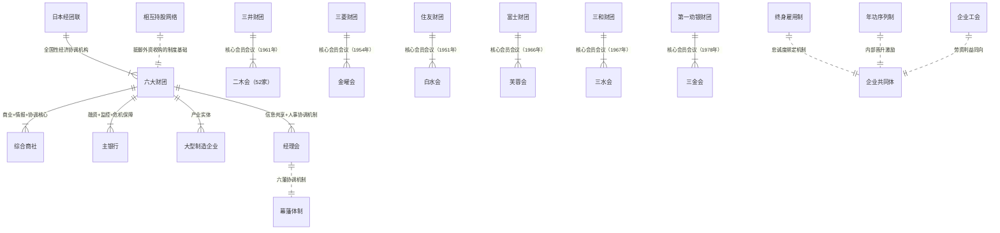
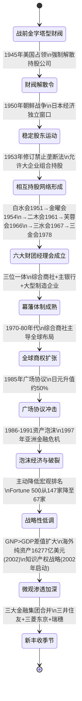

# 《三井帝国在行动》· 沈老师视角 · 第十章 · 260402

> 五步建模法。书是原料，人是工厂。理解 = 行为能力，不是语言能力。

---

## 第十章：财团就是力量

### 第零步：ER提取（领域骨架）



**中心发现：** 六大财团是战前金字塔型财阀的网状化重构——去掉了可见的控股公司节点，用相互持股+经理会+主银行三个机制替代，实现无需正式控制权的实质协调。每次外部压力（美国占领、广场协议、亚洲金融危机）都触发内部调整，但核心机制保持不变。

---

### 第一步：概念清单与自评

| 概念 | 初始等级 | 备注 |
|---|---|---|
| 幕藩体制（财团=封建领主体制的市场化变体） | 0级 | 知道幕府制度，没想过"六大财团=六个藩"的政治经济类比 |
| 相互持股的双重功能（抵御外资+内部协调） | 1级 | 知道相互持股，没想过它同时解决两个不同问题 |
| GDP vs GNP分叉（微观殖民的量化指标） | 0级 | 知道两个指标定义，完全没想过差值代表国际财富转移方向 |
| 终身雇用制的系统效果（忠诚→协调→信息共享链） | 1级 | 知道终身雇用，没想过它如何支撑财团信息协调机制 |
| 有计划的市场经济（企业间协调≠政府计划） | 0级 | 只知道国家计划经济的定义，没有"企业集群计划性"概念 |

全部低于3级，进入第二步。

---

### 第二步：实例裁判循环

**概念1：幕藩体制（财团=封建领主体制的市场化变体）**

核心问题：书里把日本六大财团比作江户幕府的六个"藩"——各藩内部高度整合，藩间既竞争又协调，中央幕府（经济政策）协调全局。这个类比在现代商业中如何成立？

- **正例**：三井财团和三菱财团在钢铁、化工领域真实竞争（分散垄断风险，使法律无法认定共谋），但面对美国要求开放日本金融市场时，通过各自主银行和经理会协调，以相互持股封锁外资收购路径——法律层面开放，实质层面封闭。→ 对外统一防御（幕府出兵），对内分权竞争（藩间争强），这是幕藩体制"对外统一、对内分权"的完整表现。

- **边界例**：欧盟企业竞争监管：欧盟明确禁止企业间共享定价信息，违反者面临巨额罚款（苹果/谷歌案例）。→ **日本幕藩体制之所以合法，关键在于：经理会协调的是"人事和战略信息"，不是"产品定价信息"，不构成《禁止垄断法》明文禁止的价格共谋，但实质协调效果相近。制度模糊是故意设计的，不是制度漏洞。**

- **反例伪装**：美国行业协会（商会）的游说功能。→ **不完全相同**。美国行业协会可以共同游说政府，但成员企业之间没有相互持股，竞争是真实的；日本经理会成员之间有持股纽带，"竞争"和"协调"可以同时针对不同问题并行运作。

**最终边界定义：**
> 幕藩体制 = 在市场竞争的法律外壳下，通过相互持股（产权纽带）+经理会（信息纽带）+主银行（资金纽带）三重机制，实现事实上的集团协调——对外国资本构成制度性进入壁垒，对内实现协调效率，而这种双重功能不违反任何明文规定的市场法规，因为任何单一机制单独看都是合法的商业安排。

升级到：**3级 ✓**

---

**概念2：GDP vs GNP分叉的制度含义**

核心问题：书里说"日本第一"要用GNP衡量，不能用GDP——因为日本的海外资产净收益不计入GDP。这有什么具体含义？

- **正例**：日本2000年代GDP低迷（"失去的十年"），但人均国民收入（GNP）持续排名世界第一。差值来源 = 丰田通商在中国120+家企业的利润、三井物产在淡水河谷持股的分红、NEC在中国19家合资企业的技术许可费……这些收益计入GNP，不计入日本GDP。GDP表现"弱"是主动布局的战略结果，不是经济衰退。→ **GNP>GDP说明这个国家是国际资本收益的净输入方，它的资本在海外产生利润并回流。**

- **边界例**：爱尔兰：大量跨国公司在爱尔兰注册（低税率），GDP很高，但GNP远低于GDP。→ **GDP>GNP说明外国资本在本国产生利润后流走——爱尔兰是净利润输出国，相当于中国DVD制造商的国家级版本：规模很大，利润流向别处。**

- **反例伪装**：中国2000年代的GDP vs GNP。→ **中国历史上长期GDP>GNP，即中国是净利润输出国。** 随着中国海外直接投资规模增加（宁德时代出海、比亚迪建厂），差值在收窄——这是中国从"DVD制造商国家"向"新日铁国家"过渡的量化表现。

**最终边界定义：**
> GNP-GDP差值是国际间生产要素不均衡流动的财富转移量化指标：GNP>GDP = 资本净输出国（微观殖民方，从他国提取收益）；GDP>GNP = 资本净输入国（微观被殖民方，向他国输出利润）。日本在"失去的十年"里GDP下降、GNP上升，是以宏观表现为代价换取微观控制权持续扩张的有意战略，不是衰退。

升级到：**3级 ✓**

---

**概念3：有计划的市场经济（企业集群协调≠政府计划经济）**

核心问题：书里说日本搞的是"有计划的市场经济"，但这个"计划"不是政府计划，而是企业集团之间的自发协调。这是什么意思？

- **正例**：1946年，日本企业界自发成立经济团体联合会（经团联），把所有大型工业企业、金融企业、高技术企业纳入同一个协调机构。2002年经团联与中小企业联盟合并，总计1623家成员。这个机构不是政府机构，是私人企业的自愿联合——但它协调投资方向、人才培育、技术研发，效果类似国家计划经济的产业引导，却没有政府的行政强制成本。→ **"有计划"来源于企业集群的利益一致性，不是政府命令。**

- **边界例**：中国国家发改委指导产业规划。→ **这是政府计划，不是企业集群计划。** 关键差异：政府计划的执行依赖行政命令，企业集群计划依赖利益一致性（相互持股使成员的长期利益高度绑定）。前者可以违抗，后者没有"违抗"的选项，因为违背集团利益等于损害自身持股价值。

- **反例伪装**：美国科技产业生态（硅谷）。→ **硅谷的协调来自风险资本和劳动力市场，不是相互持股**。硅谷没有"幕藩体制"，协调效率低于日本财团，但创新效率高于日本财团——两种"计划性"的来源不同，产生不同的优劣势。

**最终边界定义：**
> 有计划的市场经济（日本版）= 企业集群通过相互持股和经理会自发形成的利益协调，使个别企业的短期理性选择与集团长期战略方向一致——这种"计划性"比政府计划成本更低（不需要行政机器）、适应性更强（通过市场信号自动调整），是市场机制和计划机制的混合形态。

升级到：**3级 ✓**

---

### 第三步：结构可视化



**关键发现：** 广场协议是书里最关键的制度压力测试——日元升值50%使日本宏观经济指标严重受损，但财团的相互持股和长期战略取向使制造业没有被摧毁，反而利用日元升值加速了海外资产收购。制度韧性在危机中显现。

---

### 第四步：可执行结构输出

```
幕藩体制的三道防线逻辑：

外部威胁（外资收购/贸易摩擦/货币压力）
    ↓
第一道防线：相互持股
→ 流通股比例过低（约30%），外资收购成本不可承受
→ 效果：物理阻断外资取得控制权

    ↓
第二道防线：经理会信息协调
→ 六大财团在合法会议框架下共享战略信息
→ 效果：协调应对策略，不违反反垄断法（未协调定价）

    ↓
第三道防线：主银行危机融资
→ 财团成员陷入流动性危机时，主银行提供低成本资金
→ 效果：防止成员在危机时被外资低价收购

三道防线联动结果：
任何单一外部冲击都无法同时穿透三道防线
制度韧性 = 三重冗余防御 × 信息协调效率

使用边界——模型有局限的情况：
1. 相互持股成本压力超过收益时（1997年后银行坏账导致持股成本上升）
2. 政治力量强制透明化（美日结构性障碍谈判1989年）
3. 财团内部出现根本利益冲突时（无法通过经理会调解）
4. 技术范式切换使既有产业链优势归零（消费电子被韩国/中国追赶）
```

---

### 第五步：接入已有体系

**全书十章的完整拱顶石：**

```
底层制度（第十章）：幕藩体制
→ 三位一体（综合商社+主银行+大型制造企业）
→ 相互持股+经理会+终身雇用制

产业控制层（第四至六章）：
→ 专利池（收费道路）
→ 产业链组织（商业化速度）
→ 先遣基础设施（进入成本）

企业操作层（第一至三章）：
→ 首发定价权（宝钢）
→ 跳板架空（四通）
→ 摇钱树循环（上广电）

资源与市场层（第七至九章）：
→ 金融市场双面信息（中航油）
→ 技术转让的能力留存（汽车产业）
→ 资源战略预布局（核电铀矿）

→ 所有层次的控制机制都由底层幕藩制度供能：
  是幕藩体制让综合商社能跨行业持股，
  是幕藩体制让主银行能支撑长周期投资，
  是幕藩体制让终身雇用制让忠诚的经理人得以稳定执行策略。
```

**接入软件架构类比（全书终极总结）：**

| 幕藩体制组件 | 软件架构对应 |
|---|---|
| 相互持股网络 | 服务间双向依赖（循环依赖，外部无法单独移除任何节点） |
| 经理会gossip协议 | Raft/Gossip协议（各节点定期同步状态，无单一中心节点）|
| 主银行熔断保障 | 服务网格熔断器（成员陷入危机时提供流量保障，防止雪崩） |
| 终身雇用制 | 长驻进程（daemon进程，不是临时worker，有完整状态） |
| 综合商社 | API网关+服务发现+配置中心三合一 |
| 幕藩体制整体 | 拜占庭容错系统（六大财团=六个独立节点，外部攻击者需控制多数节点才能破坏系统） |

**GDP vs GNP系统类比：**
> GNP>GDP = 系统的部分计算任务外包到远程节点执行，计算结果（利润）返回本地。本地算力消耗少，但收益最大。GDP>GNP = 本地系统是别人的计算节点，消耗了本地算力，计算结果（利润）发给远程调用方。中国历史上是后者，日本是前者。

---

## 建模完成标志自检（第十章）

- [x] 不看原文，只看图，能复原第十章幕藩体制的三重防线逻辑
- [x] 给一个新情境（美国资本试图通过股市收购三菱电机），能用模型预测日方的应对步骤
- [x] 所有关键概念都达到3级（幕藩体制、相互持股双重功能、GDP-GNP分叉含义、有计划的市场经济）
- [x] 第十章已接入全书体系：是全书的制度基础层，是前九章所有控制机制的制度供能者

---

*260402 · 第十章核心认知产出：财团的力量不来自任何单一制度，来自幕藩体制三位一体的协同——相互持股（产权防线）+经理会（信息防线）+主银行（资金防线）三个单独合法的机制联动后，形成外部力量无法正面攻破的制度性屏障。这不是日本人特别聪明，是战后被强制解散后在有限制度空间内重新演化出来的最优适应解。任何在外部压力下需要维持协调的行为者，都会趋向产生类似的结构——只是大多数人没有意识到自己在重演这个逻辑。*
