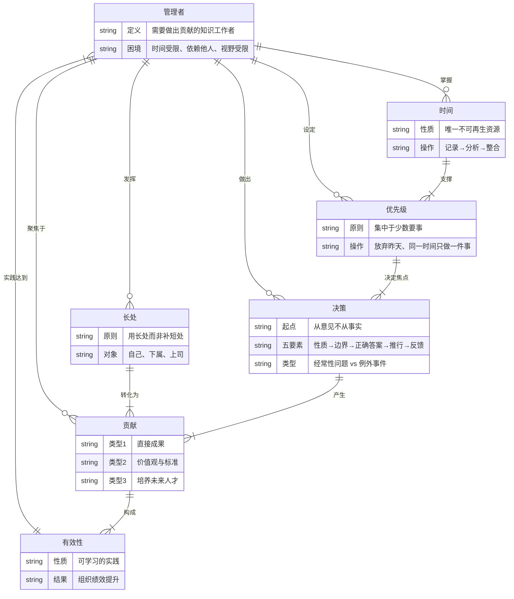
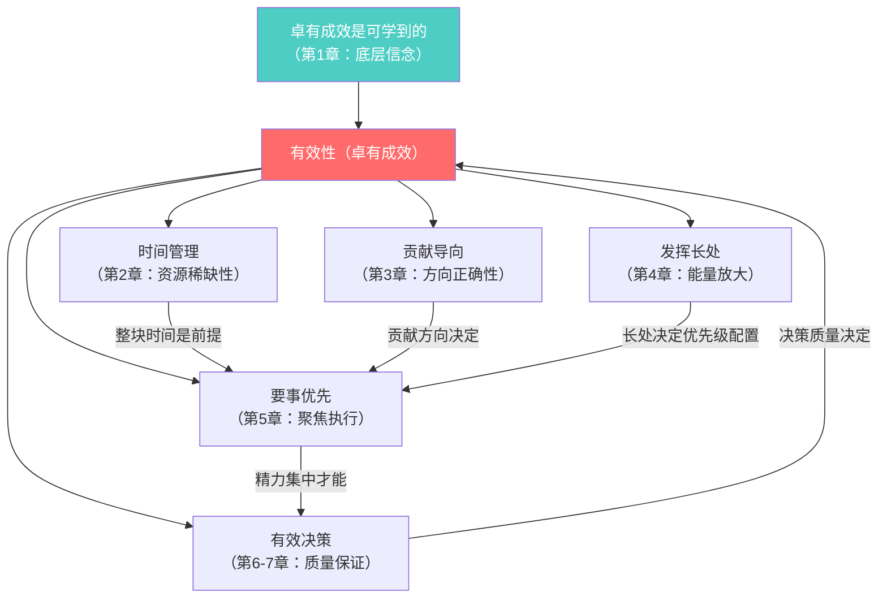

# 第零步：全书ER骨架——《卓有成效的管理者》

## 核心问题：这本书在描述什么结构？

不是"如何管理别人"，而是"知识工作者如何让自己的工作产生真实结果"。
德鲁克在描述一个**输入→转化→输出**的个人有效性系统，约束条件是组织现实。

---

## ER图：领域骨架



---

## 中心节点分析



---

## 全书逻辑链（线性版）

```
管理者面临四个现实困境
        ↓
需要主动掌握时间（否则时间被他人切碎）
        ↓
时间有了之后，问：我能贡献什么？（不是我能得到什么）
        ↓
贡献需要发挥长处（自己的 + 下属的 + 上司的）
        ↓
长处发挥需要集中精力于要事（放弃次要）
        ↓
集中精力做重大决策（从意见开始，建立反馈机制）
        ↓
以上五步的持续实践 = 卓有成效
```

---

## 实体关系总表

| 实体 | 核心属性 | 关键关系 |
|------|---------|---------|
| 管理者 | 知识工作者、需做贡献 | 是主体，掌控其余所有实体 |
| 时间 | 不可再生、可被主动整合 | 是所有行动的基础资源 |
| 贡献 | 三类：成果/标准/人才 | 是方向指针 |
| 长处 | 用而非补 | 是能量放大器 |
| 优先级 | 集中、放弃、聚焦 | 是资源分配机制 |
| 决策 | 从意见、要推行、要反馈 | 是输出质量保障 |
| 有效性 | 可学习的实践 | 是整个系统的目标状态 |

---

## 完成标志自检（60%直觉理解了没？）

- [ ] 你能说清楚为什么"管理者"不等于"管理他人的人"？
- [ ] 你能说清楚时间管理三步为什么必须按这个顺序？
- [ ] 贡献的三类你能不看书默写吗？能举新例子吗？
- [ ] "用长处而非补短处"的反例是什么样的？你遇到过吗？
- [ ] 决策的五要素，你能从第一要素推导出为什么需要第五要素？
- [ ] 整本书的逻辑链，你能用30秒口头复述吗？

**评分**：勾选4个以上 = 骨架已建立，可以开始填肉。
